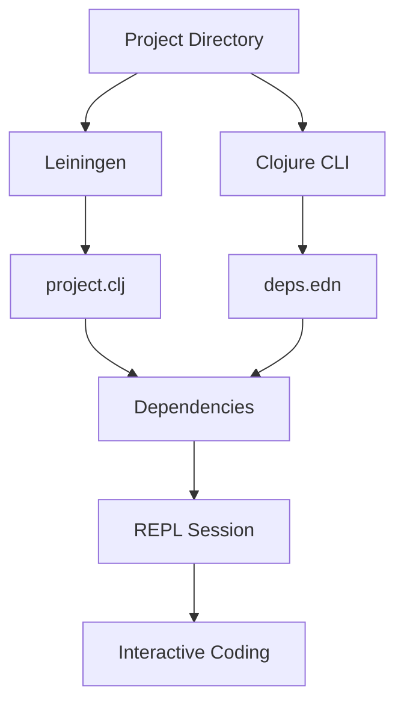

## 4.7 Integrating REPL with Build Tools

As experienced Java developers transitioning to Clojure, you may be familiar with the concept of build tools like Maven and Gradle. In the Clojure ecosystem, **Leiningen** and the **Clojure CLI** are the primary tools used to manage project dependencies, build configurations, and more. One of the unique features of Clojure is its interactive programming environment, the **REPL (Read-Eval-Print Loop)**, which can be seamlessly integrated with these build tools to enhance your development workflow.

### Understanding the REPL

The REPL is a powerful tool that allows you to interactively evaluate Clojure expressions, test functions, and explore libraries. It is akin to using a Java shell, but with the added benefit of being able to modify and test your code in real-time. This interactive environment is particularly beneficial for functional programming, where you can experiment with functions and data transformations on the fly.

### Using the REPL with Leiningen

**Leiningen** is a popular build tool for Clojure that simplifies project management and dependency handling. It provides a straightforward way to start a REPL session with all your project dependencies loaded.

#### Starting a REPL with Leiningen

To start a REPL session using Leiningen, navigate to your project directory and run:

```bash
lein repl
```

This command launches a REPL session with your project's classpath, allowing you to interact with your code and any dependencies specified in your `project.clj` file.

#### Example: Exploring a Leiningen Project

Let's create a simple Clojure project using Leiningen and explore it in the REPL.

1. **Create a New Project**: 

   ```bash
   lein new app my-clojure-app
   ```

   This command generates a new Clojure application with a basic project structure.

2. **Navigate to the Project Directory**:

   ```bash
   cd my-clojure-app
   ```

3. **Start the REPL**:

   ```bash
   lein repl
   ```

4. **Interact with Your Code**:

   Once the REPL is running, you can load your source files and test functions interactively. For example, if you have a function `greet` in `src/my_clojure_app/core.clj`, you can evaluate it directly in the REPL:

   ```clojure
   (use 'my-clojure-app.core)
   (greet "World")
   ```

   This approach allows you to test changes immediately without recompiling your entire project.

#### Advantages of Using Leiningen with REPL

- **Dependency Management**: Leiningen automatically handles dependencies specified in `project.clj`, ensuring that your REPL session has access to all necessary libraries.
- **Project Configuration**: You can configure various aspects of your project, such as JVM options and profiles, directly in `project.clj`.
- **Plugin Support**: Leiningen supports a wide range of plugins that can extend its functionality, including testing, packaging, and deployment.

### Starting a REPL with the Clojure CLI

The **Clojure CLI** is another tool for managing Clojure projects, offering a more lightweight and flexible approach compared to Leiningen. It uses a `deps.edn` file to specify dependencies and configurations.

#### Starting a REPL with the Clojure CLI

To start a REPL session using the Clojure CLI, navigate to your project directory and run:

```bash
clj
```

This command starts a REPL session with the dependencies specified in your `deps.edn` file.

#### Example: Exploring a Clojure CLI Project

Let's create a simple Clojure project using the Clojure CLI and explore it in the REPL.

1. **Create a New Project Directory**:

   ```bash
   mkdir my-clojure-cli-app
   cd my-clojure-cli-app
   ```

2. **Create a `deps.edn` File**:

   ```edn
   {:deps {org.clojure/clojure {:mvn/version "1.10.3"}}}
   ```

3. **Start the REPL**:

   ```bash
   clj
   ```

4. **Interact with Your Code**:

   Similar to Leiningen, you can load and test your code interactively. For example, if you have a function `greet` in `src/my_clojure_cli_app/core.clj`, you can evaluate it in the REPL:

   ```clojure
   (load-file "src/my_clojure_cli_app/core.clj")
   (greet "World")
   ```

#### Advantages of Using the Clojure CLI with REPL

- **Simplicity**: The Clojure CLI is straightforward and easy to use, with minimal configuration required.
- **Flexibility**: You can easily switch between different dependency configurations by specifying different `deps.edn` files.
- **Community Support**: The Clojure CLI is actively maintained and supported by the Clojure community, ensuring compatibility with the latest Clojure releases.

### Comparing Leiningen and Clojure CLI

Both Leiningen and the Clojure CLI offer robust support for integrating the REPL into your development workflow. Here are some key differences:

- **Configuration**: Leiningen uses `project.clj` for configuration, while the Clojure CLI uses `deps.edn`.
- **Complexity**: Leiningen is more feature-rich, with extensive plugin support, whereas the Clojure CLI is more lightweight and flexible.
- **Use Cases**: Leiningen is well-suited for larger projects with complex build requirements, while the Clojure CLI is ideal for smaller projects and quick prototyping.

### Integrating REPL with Build Tools: Best Practices

- **Keep Dependencies Updated**: Regularly update your dependencies in `project.clj` or `deps.edn` to ensure compatibility and security.
- **Use Profiles for Environment-Specific Configurations**: In Leiningen, use profiles to manage different configurations for development, testing, and production environments.
- **Leverage REPL for Testing and Debugging**: Use the REPL to test functions and debug issues interactively, reducing the need for extensive logging and recompilation.
- **Automate Common Tasks**: Use Leiningen plugins or Clojure CLI aliases to automate common tasks, such as running tests or building artifacts.

### Try It Yourself

Experiment with the following exercises to deepen your understanding of integrating the REPL with build tools:

1. **Modify a Function**: In your Leiningen or Clojure CLI project, modify a function and test it in the REPL. Observe how changes are reflected immediately.
2. **Add a Dependency**: Add a new dependency to your `project.clj` or `deps.edn` file and use it in the REPL.
3. **Create a Custom REPL Command**: In Leiningen, create a custom REPL command using a plugin or alias and test its functionality.

### Diagrams and Visual Aids

Below is a diagram illustrating the flow of data and dependencies in a Clojure project using Leiningen and the Clojure CLI.



**Diagram Caption**: This diagram shows how Leiningen and the Clojure CLI manage dependencies and configurations to start a REPL session for interactive coding.

### Further Reading

For more information on using the REPL with build tools, check out the following resources:

- [Official Clojure Documentation](https://clojure.org/guides/getting_started)
- [Leiningen Documentation](https://leiningen.org/)
- [Clojure CLI Guide](https://clojure.org/guides/deps_and_cli)

### Exercises and Practice Problems

1. **Create a New Project**: Use both Leiningen and the Clojure CLI to create a new project. Compare the project structures and configurations.
2. **Explore a Library**: Add a popular Clojure library (e.g., `clojure.string`) to your project and explore its functions in the REPL.
3. **Debug a Function**: Introduce a bug in a function and use the REPL to identify and fix the issue.

### Key Takeaways

- The REPL is a powerful tool for interactive development in Clojure, allowing you to test and debug code in real-time.
- Leiningen and the Clojure CLI provide robust support for integrating the REPL into your development workflow, each with its own strengths and use cases.
- Regularly updating dependencies and leveraging the REPL for testing and debugging can significantly enhance your productivity and code quality.

Now that we've explored how to integrate the REPL with build tools, let's apply these concepts to streamline your Clojure development workflow.

## Quiz: Mastering REPL Integration with Build Tools



### What is the primary purpose of the REPL in Clojure?

- [x] To interactively evaluate Clojure expressions and test functions
- [ ] To compile Clojure code into Java bytecode
- [ ] To manage project dependencies
- [ ] To deploy Clojure applications to production

> **Explanation:** The REPL (Read-Eval-Print Loop) is used for interactively evaluating Clojure expressions, testing functions, and exploring libraries.

### Which command starts a REPL session with Leiningen?

- [x] `lein repl`
- [ ] `lein run`
- [ ] `clj`
- [ ] `java -jar`

> **Explanation:** The `lein repl` command starts a REPL session with Leiningen, loading all project dependencies.

### What file does the Clojure CLI use to specify dependencies?

- [x] `deps.edn`
- [ ] `project.clj`
- [ ] `pom.xml`
- [ ] `build.gradle`

> **Explanation:** The Clojure CLI uses the `deps.edn` file to specify dependencies and configurations.

### Which tool is more feature-rich and supports extensive plugins?

- [x] Leiningen
- [ ] Clojure CLI
- [ ] Maven
- [ ] Gradle

> **Explanation:** Leiningen is more feature-rich and supports a wide range of plugins for various tasks.

### What is a key advantage of using the REPL for testing and debugging?

- [x] Immediate feedback and interaction
- [ ] Automated deployment
- [ ] Static code analysis
- [ ] Code compilation

> **Explanation:** The REPL provides immediate feedback and interaction, allowing developers to test and debug code in real-time.

### Which command starts a REPL session with the Clojure CLI?

- [x] `clj`
- [ ] `lein repl`
- [ ] `java -jar`
- [ ] `gradle run`

> **Explanation:** The `clj` command starts a REPL session with the Clojure CLI, loading dependencies from `deps.edn`.

### What is a common use case for profiles in Leiningen?

- [x] Managing environment-specific configurations
- [ ] Compiling Java code
- [ ] Deploying applications
- [ ] Generating documentation

> **Explanation:** Profiles in Leiningen are used to manage environment-specific configurations, such as development, testing, and production.

### Which file format does Leiningen use for project configuration?

- [x] `project.clj`
- [ ] `deps.edn`
- [ ] `pom.xml`
- [ ] `build.gradle`

> **Explanation:** Leiningen uses the `project.clj` file for project configuration, including dependencies and build settings.

### What is a benefit of using the Clojure CLI for smaller projects?

- [x] Lightweight and flexible configuration
- [ ] Extensive plugin support
- [ ] Automated testing
- [ ] Code compilation

> **Explanation:** The Clojure CLI is lightweight and flexible, making it ideal for smaller projects and quick prototyping.

### True or False: The REPL can be used to modify and test code in real-time.

- [x] True
- [ ] False

> **Explanation:** True. The REPL allows developers to modify and test code in real-time, providing immediate feedback and interaction.


