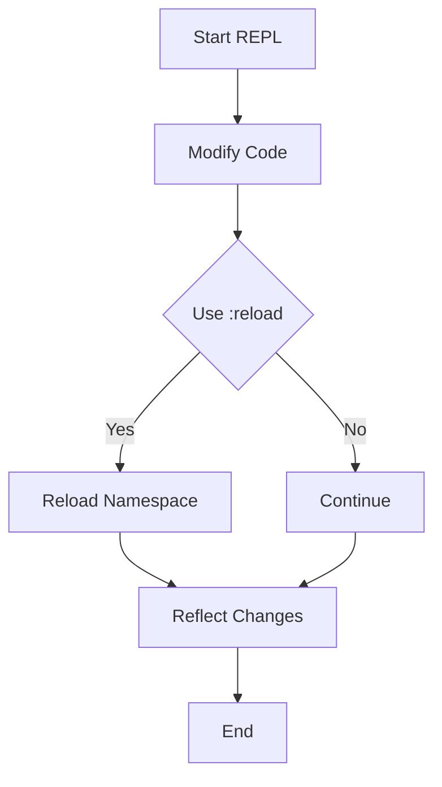

## 4.8 Hot Reloading Code

As experienced Java developers, you're likely familiar with the cycle of writing code, compiling, and running tests to see changes in action. This process can be time-consuming, especially in large projects. Clojure offers a more efficient approach through hot reloading, allowing you to reload changed code without restarting the REPL (Read-Eval-Print Loop). This capability significantly enhances development speed and productivity. In this section, we'll explore techniques for hot reloading in Clojure, focusing on using the `require` function with the `:reload` flag and incorporating tools like `ns-refresh`.

### Understanding Hot Reloading

Hot reloading refers to the ability to update code in a running application without restarting the entire process. This is particularly useful in interactive development environments like the Clojure REPL, where you can iteratively develop and test your code. By reloading only the changed parts of your code, you can maintain the state of your application and avoid the overhead of a full restart.

#### Benefits of Hot Reloading

- **Increased Productivity**: Quickly see the effects of code changes without restarting the application.
- **State Preservation**: Maintain the current state of your application, reducing the need to reinitialize data.
- **Faster Feedback Loop**: Immediate feedback on code changes helps in rapid prototyping and debugging.

### Using `require` with the `:reload` Flag

The `require` function in Clojure is used to load namespaces. By default, it loads a namespace only once, caching it for future use. However, when you modify a namespace, you need to reload it to see the changes. This is where the `:reload` flag comes into play.

#### Syntax and Usage

To reload a namespace, use the `require` function with the `:reload` flag:

```clojure
(require '[my-namespace.core :reload])
```

- **`:reload`**: Forces the namespace to be reloaded, recompiling the code.
- **`:reload-all`**: Reloads the specified namespace and all its dependencies.

#### Example: Reloading a Namespace

Let's consider a simple example where we have a namespace `my-namespace.core` with a function `greet`:

```clojure
(ns my-namespace.core)

(defn greet [name]
  (str "Hello, " name "!"))
```

Suppose you modify the `greet` function to include a more personalized message:

```clojure
(defn greet [name]
  (str "Welcome, " name "! How can I assist you today?"))
```

To see this change in the REPL, use the `:reload` flag:

```clojure
(require '[my-namespace.core :reload])
```

Now, calling `(greet "Alice")` will reflect the updated message.

#### Comparison with Java

In Java, reloading code typically involves recompiling and redeploying the application, which can be cumbersome. Clojure's hot reloading allows for a more seamless and efficient development process, reducing downtime and improving the feedback loop.

### Incorporating Tools Like `ns-refresh`

While the `:reload` flag is useful, it can become tedious to manually reload each namespace. Tools like `ns-refresh` automate this process, making hot reloading even more efficient.

#### What is `ns-refresh`?

`ns-refresh` is a utility provided by the `clojure.tools.namespace` library. It automatically tracks changes in your source files and reloads the affected namespaces. This tool is particularly useful in larger projects where multiple namespaces may be interdependent.

#### Setting Up `ns-refresh`

To use `ns-refresh`, you need to include the `clojure.tools.namespace` library in your project. Add the following dependency to your `project.clj` or `deps.edn` file:

```clojure
:dependencies [[org.clojure/tools.namespace "1.1.0"]]
```

#### Using `ns-refresh` in the REPL

Once set up, you can use `ns-refresh` in the REPL to reload changed namespaces:

```clojure
(require '[clojure.tools.namespace.repl :refer [refresh]])

(refresh)
```

- **`refresh`**: Reloads all changed namespaces, preserving the state of the REPL.

#### Example: Using `ns-refresh`

Consider a project with multiple namespaces. After making changes to one or more files, simply call `(refresh)` in the REPL. `ns-refresh` will detect the changes and reload the necessary namespaces.

#### Comparison with Java

In Java, achieving similar functionality often requires complex build tools and frameworks. Clojure's `ns-refresh` provides a lightweight and straightforward solution for hot reloading, enhancing the development workflow.

### Best Practices for Hot Reloading

- **Modular Code**: Write modular code with clear namespace boundaries to make reloading more efficient.
- **State Management**: Use Clojure's immutable data structures and state management primitives (atoms, refs, agents) to maintain application state across reloads.
- **Testing**: Regularly test your code to ensure that reloading does not introduce inconsistencies or errors.

### Try It Yourself

Experiment with hot reloading in your Clojure projects:

1. **Modify a Function**: Change a function in one of your namespaces and use `:reload` to see the effect.
2. **Automate with `ns-refresh`**: Set up `ns-refresh` and observe how it simplifies the reloading process.
3. **Explore State Management**: Use atoms or refs to manage state and see how it persists across reloads.

### Diagrams and Visuals

To better understand the flow of hot reloading, consider the following diagram illustrating the process:



**Diagram Description**: This flowchart shows the process of hot reloading in Clojure. After starting the REPL and modifying code, you can choose to use the `:reload` flag to reload the namespace and reflect changes.

### Further Reading

For more information on hot reloading and related tools, consider the following resources:

- [Official Clojure Documentation](https://clojure.org/reference/repl_and_main)
- [ClojureDocs](https://clojuredocs.org/)
- [clojure.tools.namespace GitHub Repository](https://github.com/clojure/tools.namespace)

### Exercises and Practice Problems

1. **Exercise 1**: Create a new Clojure project with multiple namespaces. Implement a simple application and practice using `:reload` and `ns-refresh` to update your code.

2. **Exercise 2**: Modify a function that manages state using an atom. Reload the namespace and verify that the state persists across changes.

3. **Exercise 3**: Explore the `clojure.tools.namespace` library and experiment with its other features, such as dependency tracking and namespace unloading.

### Key Takeaways

- **Hot reloading** in Clojure allows you to update code without restarting the REPL, enhancing productivity and maintaining application state.
- The `require` function with the `:reload` flag provides a straightforward way to reload individual namespaces.
- Tools like `ns-refresh` automate the reloading process, making it more efficient for larger projects.
- Clojure's approach to hot reloading offers significant advantages over traditional Java workflows, reducing downtime and improving the development experience.

Now that we've explored hot reloading in Clojure, let's apply these techniques to streamline your development workflow and enhance your productivity.

## Quiz: Mastering Hot Reloading in Clojure



### What is the primary benefit of hot reloading in Clojure?

- [x] It allows developers to see code changes without restarting the REPL.
- [ ] It automatically optimizes code for performance.
- [ ] It provides built-in error handling for runtime exceptions.
- [ ] It compiles code faster than Java.

> **Explanation:** Hot reloading allows developers to see the effects of code changes without restarting the REPL, enhancing productivity and maintaining application state.

### Which Clojure function is used with the `:reload` flag to reload a namespace?

- [x] `require`
- [ ] `load`
- [ ] `import`
- [ ] `use`

> **Explanation:** The `require` function is used with the `:reload` flag to reload a namespace in Clojure.

### What does the `:reload-all` flag do in Clojure?

- [x] It reloads the specified namespace and all its dependencies.
- [ ] It reloads only the specified namespace.
- [ ] It clears all loaded namespaces.
- [ ] It reloads the entire project.

> **Explanation:** The `:reload-all` flag reloads the specified namespace and all its dependencies, ensuring that all related code is updated.

### What is the purpose of the `ns-refresh` tool in Clojure?

- [x] To automatically reload changed namespaces.
- [ ] To optimize code for performance.
- [ ] To manage project dependencies.
- [ ] To compile Clojure code to Java bytecode.

> **Explanation:** The `ns-refresh` tool automatically reloads changed namespaces, simplifying the hot reloading process in Clojure.

### How do you set up `ns-refresh` in a Clojure project?

- [x] Add `clojure.tools.namespace` as a dependency.
- [ ] Install a separate plugin for your IDE.
- [ ] Configure a build script in Leiningen.
- [ ] Use a command-line tool to enable it.

> **Explanation:** To set up `ns-refresh`, you need to add `clojure.tools.namespace` as a dependency in your project configuration.

### What is a key advantage of using `ns-refresh` over manual reloading?

- [x] It automates the reloading process for multiple namespaces.
- [ ] It provides detailed error messages.
- [ ] It reduces memory usage.
- [ ] It compiles code faster.

> **Explanation:** `ns-refresh` automates the reloading process for multiple namespaces, making it more efficient than manual reloading.

### Which of the following is a best practice for hot reloading in Clojure?

- [x] Write modular code with clear namespace boundaries.
- [ ] Use global variables to manage state.
- [ ] Avoid using immutable data structures.
- [ ] Compile code before reloading.

> **Explanation:** Writing modular code with clear namespace boundaries makes reloading more efficient and manageable.

### What is the role of the `refresh` function in `ns-refresh`?

- [x] It reloads all changed namespaces.
- [ ] It clears the REPL history.
- [ ] It compiles the entire project.
- [ ] It optimizes code for performance.

> **Explanation:** The `refresh` function in `ns-refresh` reloads all changed namespaces, preserving the state of the REPL.

### True or False: Hot reloading in Clojure can maintain application state across reloads.

- [x] True
- [ ] False

> **Explanation:** Hot reloading in Clojure can maintain application state across reloads, reducing the need to reinitialize data.

### Which tool can be used to track changes in source files for hot reloading?

- [x] `clojure.tools.namespace`
- [ ] `leiningen`
- [ ] `maven`
- [ ] `gradle`

> **Explanation:** `clojure.tools.namespace` is used to track changes in source files and facilitate hot reloading in Clojure.


