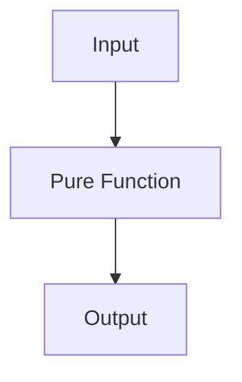

## 5.1.1 Definition of Pure Functions

In the realm of functional programming, **pure functions** are a cornerstone concept that distinguishes this paradigm from imperative programming. As experienced Java developers transitioning to Clojure, understanding pure functions is crucial for leveraging the full power of functional programming. Let's delve into what makes a function pure, how Clojure implements this concept, and how it contrasts with Java's approach.

### What is a Pure Function?

A **pure function** is a function where the return value is determined solely by its input values, without any observable side effects. This means that a pure function:

1. **Always produces the same output given the same input.**
2. **Does not modify any external state or variables.**

These properties make pure functions predictable and reliable, which are essential traits for building robust software systems.

### Characteristics of Pure Functions

- **Deterministic Output**: Given the same set of inputs, a pure function will always return the same result. This predictability simplifies debugging and testing.
- **No Side Effects**: Pure functions do not alter any state outside their scope. They do not modify global variables, perform I/O operations, or change mutable data structures.
- **Referential Transparency**: Pure functions can be replaced with their output value without changing the program's behavior. This property is known as referential transparency and is a hallmark of functional programming.

### Pure Functions in Clojure

Clojure, as a functional programming language, encourages the use of pure functions. Let's look at a simple example of a pure function in Clojure:

```clojure
;; A pure function that adds two numbers
(defn add [x y]
  (+ x y))

;; Usage
(add 2 3) ; => 5
(add 2 3) ; => 5, always the same result for the same inputs
```

In this example, the `add` function is pure because it consistently returns the sum of `x` and `y` without affecting any external state.

### Impure Functions in Java

To contrast, let's examine a typical impure function in Java:

```java
public class Counter {
    private int count = 0;

    // An impure function that modifies external state
    public int increment() {
        return ++count;
    }
}

// Usage
Counter counter = new Counter();
counter.increment(); // count is now 1
counter.increment(); // count is now 2
```

In this Java example, the `increment` method is impure because it modifies the `count` variable, which is an external state to the method. Each call to `increment` changes the state of the `Counter` object, leading to different outputs for the same method call.

### Benefits of Pure Functions

1. **Enhanced Testability**: Pure functions are easier to test because they do not rely on or alter external state. Unit tests can focus solely on input-output behavior.
2. **Simplified Debugging**: Since pure functions are deterministic, debugging is more straightforward. Developers can isolate issues by examining the function's inputs and outputs.
3. **Concurrency and Parallelism**: Pure functions can be executed in parallel without concerns about race conditions or shared state, making them ideal for concurrent programming.
4. **Modularity and Reusability**: Pure functions are self-contained, promoting modular design. They can be reused across different parts of a program without unintended side effects.

### Clojure's Approach to Pure Functions

Clojure's design inherently supports pure functions through its emphasis on immutability and first-class functions. Here are some key features:

- **Immutable Data Structures**: Clojure's core data structures (lists, vectors, maps, and sets) are immutable by default, ensuring that functions do not inadvertently modify data.
- **First-Class Functions**: Functions in Clojure are first-class citizens, meaning they can be passed as arguments, returned from other functions, and assigned to variables. This flexibility encourages the use of pure functions.

### Comparing Clojure and Java

#### Immutability

- **Clojure**: Immutability is a default behavior, which naturally leads to the creation of pure functions.
- **Java**: While Java supports immutability through final variables and immutable classes, it requires explicit effort from the developer to enforce it.

#### Function Composition

- **Clojure**: Function composition is straightforward, allowing developers to build complex operations from simple, pure functions.
- **Java**: Prior to Java 8, function composition was cumbersome. With the introduction of lambda expressions and the `Function` interface, Java has improved in this area, but it still lacks the elegance of Clojure's approach.

### Try It Yourself

Experiment with the following Clojure code to deepen your understanding of pure functions:

```clojure
;; Define a pure function that multiplies two numbers
(defn multiply [a b]
  (* a b))

;; Try modifying the function to subtract instead of multiply
(defn subtract [a b]
  (- a b))

;; Test the functions
(multiply 4 5) ; => 20
(subtract 10 3) ; => 7
```

### Diagrams and Visualizations

To better understand the flow of data in pure functions, consider the following diagram:



**Diagram Description**: This diagram illustrates the flow of data through a pure function, where the output is solely determined by the input, with no side effects.

### Exercises

1. **Identify Pure Functions**: Review a piece of Java code and identify which functions are pure and which are impure. Consider how you might refactor the impure functions to be pure.
2. **Refactor to Pure Functions**: Take a Java method that modifies external state and refactor it into a pure function in Clojure.
3. **Create a Clojure Function**: Write a Clojure function that calculates the factorial of a number using recursion. Ensure it is pure.

### Key Takeaways

- Pure functions are a fundamental concept in functional programming, offering predictability and reliability.
- Clojure's emphasis on immutability and first-class functions makes it an ideal language for writing pure functions.
- Understanding and utilizing pure functions can lead to more maintainable and robust software systems.

By embracing pure functions, we can write cleaner, more efficient code that is easier to test and debug. As you continue your journey into Clojure, consider how pure functions can transform your approach to problem-solving and software design.

### Further Reading

- [Official Clojure Documentation](https://clojure.org/reference/functions)
- [ClojureDocs](https://clojuredocs.org/)
- [Functional Programming Principles](https://www.functionalprogrammingprinciples.com/)

---

## Quiz: Understanding Pure Functions in Clojure



### What is a pure function?

- [x] A function that always produces the same output given the same input and has no side effects.
- [ ] A function that modifies external state.
- [ ] A function that performs I/O operations.
- [ ] A function that relies on global variables.

> **Explanation:** A pure function is defined by its deterministic output and lack of side effects, making it predictable and reliable.

### Which of the following is a characteristic of pure functions?

- [x] Referential transparency
- [ ] Mutable state
- [ ] Side effects
- [ ] Dependency on external variables

> **Explanation:** Pure functions exhibit referential transparency, meaning they can be replaced with their output value without affecting the program's behavior.

### How does Clojure support pure functions?

- [x] Through immutable data structures and first-class functions
- [ ] By allowing mutable state by default
- [ ] By encouraging the use of global variables
- [ ] By requiring explicit state management

> **Explanation:** Clojure's immutable data structures and first-class functions naturally support the creation of pure functions.

### What is the benefit of using pure functions in concurrent programming?

- [x] They can be executed in parallel without concerns about race conditions.
- [ ] They require complex synchronization mechanisms.
- [ ] They depend on shared mutable state.
- [ ] They are difficult to test.

> **Explanation:** Pure functions do not rely on shared state, making them ideal for parallel execution without race conditions.

### Which of the following is an example of an impure function in Java?

- [x] A method that modifies a class field
- [ ] A method that returns the sum of two parameters
- [ ] A method that calculates the square of a number
- [ ] A method that concatenates two strings

> **Explanation:** A method that modifies a class field changes external state, making it impure.

### What is referential transparency?

- [x] The property that allows a function to be replaced with its output value without changing the program's behavior.
- [ ] The ability to modify external state.
- [ ] The reliance on global variables.
- [ ] The use of side effects in function execution.

> **Explanation:** Referential transparency is a key property of pure functions, allowing them to be replaced with their output value.

### How can pure functions enhance testability?

- [x] By focusing solely on input-output behavior without external dependencies
- [ ] By requiring complex setup for external state
- [ ] By depending on mutable global variables
- [ ] By performing I/O operations

> **Explanation:** Pure functions are easier to test because they do not rely on or alter external state, focusing only on input-output behavior.

### What is a common challenge when transitioning from Java to Clojure regarding pure functions?

- [x] Adapting to immutability and avoiding side effects
- [ ] Managing mutable state effectively
- [ ] Using global variables for state management
- [ ] Performing I/O operations within functions

> **Explanation:** Transitioning to Clojure involves adapting to immutability and avoiding side effects, which are central to pure functions.

### Which of the following is a benefit of using pure functions?

- [x] Simplified debugging
- [ ] Increased reliance on mutable state
- [ ] Complex synchronization requirements
- [ ] Dependency on external variables

> **Explanation:** Pure functions simplify debugging due to their deterministic nature and lack of side effects.

### Pure functions can be replaced with their output value without changing the program's behavior.

- [x] True
- [ ] False

> **Explanation:** This statement is true and describes the property of referential transparency, a hallmark of pure functions.


