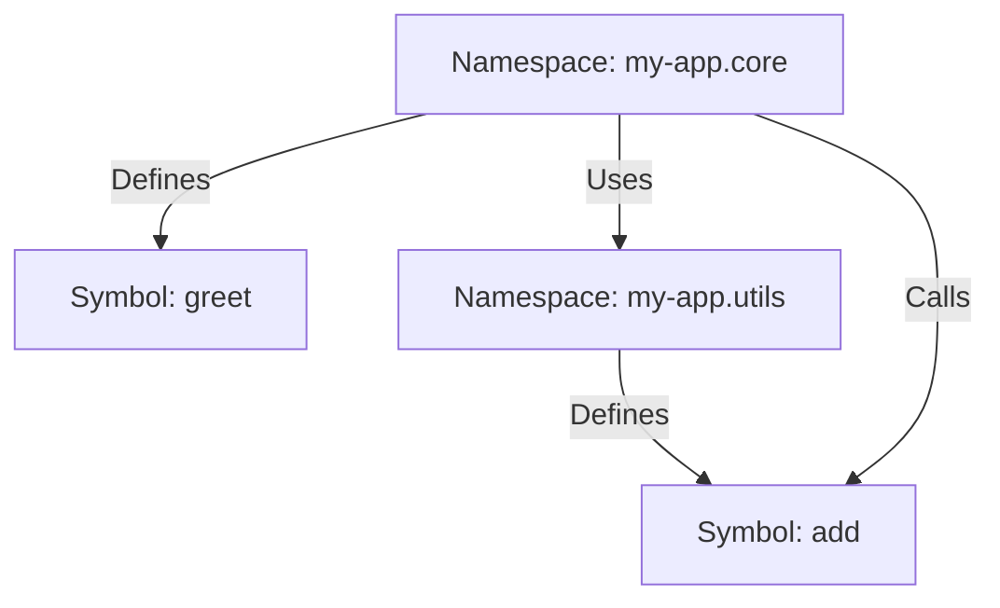

## 5.1.2 Symbols and Identifiers

In the realm of Clojure, symbols and identifiers play a pivotal role in defining and referencing variables, functions, and other entities. Understanding these concepts is crucial for any Java developer transitioning to Clojure, as they form the backbone of code readability and maintainability. This section delves into the intricacies of symbols and identifiers, elucidating their syntax, usage, and best practices.

### Understanding Symbols in Clojure

Symbols in Clojure are fundamental constructs used to name variables and functions. They are akin to identifiers in Java but come with unique characteristics and behaviors that align with Clojure's functional programming paradigm.

#### What is a Symbol?

A symbol in Clojure is a data type that represents a name. It is used to refer to variables, functions, and other entities within a program. Symbols are not bound to values by themselves; instead, they are used to look up values in a context, such as a namespace or a local scope.

```clojure
(def my-var 42)
```

In the example above, `my-var` is a symbol that refers to the value `42`.

#### Creating and Using Symbols

Symbols are typically created using the `def` or `defn` macros, which associate a symbol with a value or a function definition, respectively.

```clojure
(def pi 3.14159)
(defn square [x] (* x x))
```

Here, `pi` is a symbol bound to the value `3.14159`, and `square` is a symbol bound to a function that calculates the square of a number.

#### Evaluating Symbols

When a symbol is evaluated, Clojure looks up its value in the current context. If the symbol is bound to a value, that value is returned; otherwise, an error is thrown.

```clojure
user=> pi
3.14159
user=> (square 5)
25
```

### Naming Conventions and Valid Identifiers

Clojure, like Java, has specific conventions and rules for naming symbols and identifiers. Adhering to these conventions ensures code clarity and consistency.

#### Valid Characters for Identifiers

Clojure symbols can contain a wide range of characters, including letters, numbers, and special characters such as `*`, `+`, `!`, `-`, `_`, and `?`. However, they cannot start with a number, and certain characters like `/` and `.` have special meanings.

```clojure
(def my-var 100)
(def *special-var* 200)
(defn add-numbers [a b] (+ a b))
```

#### Naming Conventions

- **Variables and Functions**: Use lowercase letters and hyphens to separate words, e.g., `my-var`, `add-numbers`.
- **Predicates**: Functions that return a boolean value often end with a `?`, e.g., `even?`, `empty?`.
- **Special Variables**: Use `*` to denote special or global variables, e.g., `*special-var*`.

These conventions enhance readability and convey the purpose of symbols at a glance.

### The Role of Namespaces

Namespaces in Clojure are akin to packages in Java. They provide a way to organize code and manage symbol definitions, preventing naming conflicts and promoting modularity.

#### What is a Namespace?

A namespace is a context that holds a collection of symbol definitions. It allows you to group related functions and variables together, much like a Java package.

```clojure
(ns my-app.core)
(defn greet [] "Hello, World!")
```

In the example above, `my-app.core` is a namespace that contains the `greet` function.

#### Creating and Using Namespaces

Namespaces are created using the `ns` macro. Once a namespace is defined, you can refer to symbols within it using the namespace-qualified name.

```clojure
(ns my-app.utils)
(defn add [x y] (+ x y))

(ns my-app.core)
(require '[my-app.utils :as utils])
(utils/add 3 4)
```

Here, `my-app.utils` is a separate namespace, and its `add` function is accessed from `my-app.core` using the alias `utils`.

#### Namespace Aliases and Referring

To simplify code and avoid repetitive typing, you can create aliases for namespaces using the `:as` keyword. Additionally, the `:refer` keyword allows you to import specific symbols directly into the current namespace.

```clojure
(require '[clojure.string :as str])
(str/upper-case "hello")

(use '[clojure.set :only [union]])
(union #{1 2} #{2 3})
```

In this example, `clojure.string` is aliased as `str`, and the `union` function from `clojure.set` is directly referred.

### Best Practices and Common Pitfalls

#### Best Practices

- **Consistent Naming**: Follow naming conventions to enhance code readability.
- **Namespace Management**: Use namespaces to organize code logically and avoid symbol conflicts.
- **Symbol Clarity**: Choose descriptive names for symbols to convey their purpose clearly.

#### Common Pitfalls

- **Name Collisions**: Avoid using the same symbol name in different contexts without proper namespace qualification.
- **Misleading Names**: Ensure that symbol names accurately reflect their purpose and functionality.

### Practical Code Examples

To solidify your understanding, let's explore some practical code examples that demonstrate the use of symbols, identifiers, and namespaces in Clojure.

#### Example 1: Basic Symbol Usage

```clojure
(defn calculate-area [radius]
  (let [pi 3.14159]
    (* pi radius radius)))

(calculate-area 5)
```

In this example, `pi` is a local symbol defined within the `let` block, and `calculate-area` is a function symbol.

#### Example 2: Using Namespaces

```clojure
(ns math.operations)

(defn multiply [x y]
  (* x y))

(ns main.core
  (:require [math.operations :as ops]))

(ops/multiply 6 7)
```

This example demonstrates how to define a function in one namespace and use it in another with an alias.

### Diagrams and Visual Aids

To further illustrate the relationship between symbols, identifiers, and namespaces, consider the following diagram:



This diagram shows how the `my-app.core` namespace defines and uses symbols from itself and another namespace.

### Conclusion

Symbols and identifiers are foundational elements in Clojure, enabling developers to write clear and maintainable code. By understanding their syntax, naming conventions, and relationship with namespaces, Java developers can effectively leverage Clojure's capabilities to build robust applications.

As you continue your journey into Clojure, remember that mastering symbols and namespaces is key to unlocking the full potential of this powerful language.

## Quiz Time!



### What is a symbol in Clojure?

- [x] A data type that represents a name and is used to refer to variables and functions.
- [ ] A special character used to denote comments.
- [ ] A numeric value used in calculations.
- [ ] A keyword used for conditional logic.

> **Explanation:** A symbol in Clojure is a data type used to name variables and functions, allowing for reference and lookup within a context.

### Which of the following is a valid Clojure symbol?

- [x] my-var
- [ ] 1st-var
- [x] add-numbers
- [ ] var!

> **Explanation:** Clojure symbols can contain letters, numbers, and certain special characters but cannot start with a number.

### What is the purpose of a namespace in Clojure?

- [x] To organize code and manage symbol definitions, preventing naming conflicts.
- [ ] To execute code in parallel.
- [ ] To define data types and structures.
- [ ] To handle exceptions and errors.

> **Explanation:** Namespaces in Clojure are used to organize code and manage symbol definitions, similar to packages in Java.

### How do you create an alias for a namespace in Clojure?

- [x] Using the `:as` keyword in the `require` statement.
- [ ] Using the `alias` function.
- [ ] Using the `import` statement.
- [ ] Using the `def` macro.

> **Explanation:** The `:as` keyword in the `require` statement is used to create an alias for a namespace in Clojure.

### Which naming convention is commonly used for predicate functions in Clojure?

- [x] Ending with a `?`, e.g., `even?`
- [ ] Starting with a capital letter, e.g., `IsEven`
- [ ] Using underscores, e.g., `is_even`
- [ ] Using camelCase, e.g., `isEven`

> **Explanation:** Predicate functions in Clojure often end with a `?` to indicate they return a boolean value.

### What happens when a symbol is evaluated in Clojure?

- [x] Its value is looked up in the current context.
- [ ] It is converted to a string.
- [ ] It is ignored by the compiler.
- [ ] It is automatically incremented by one.

> **Explanation:** When a symbol is evaluated, Clojure looks up its value in the current context and returns it if found.

### Which of the following characters can be used in Clojure symbols?

- [x] Hyphen (-)
- [ ] Slash (/)
- [x] Asterisk (*)
- [ ] Backslash (\)

> **Explanation:** Clojure symbols can include hyphens and asterisks but not slashes or backslashes.

### How do you refer to a specific function from another namespace?

- [x] Using the `:refer` keyword in the `use` statement.
- [ ] Using the `import` statement.
- [ ] Using the `def` macro.
- [ ] Using the `alias` function.

> **Explanation:** The `:refer` keyword in the `use` statement allows you to import specific functions from another namespace.

### What is a common pitfall when using symbols in Clojure?

- [x] Name collisions due to unqualified symbols.
- [ ] Using too many special characters.
- [ ] Defining symbols with numeric values.
- [ ] Using symbols in comments.

> **Explanation:** A common pitfall is name collisions when symbols are not properly qualified with their namespaces.

### True or False: In Clojure, a symbol can start with a number.

- [ ] True
- [x] False

> **Explanation:** Symbols in Clojure cannot start with a number; they must begin with a letter or a special character.


