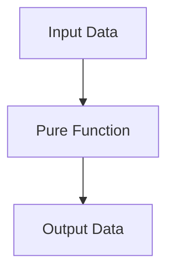
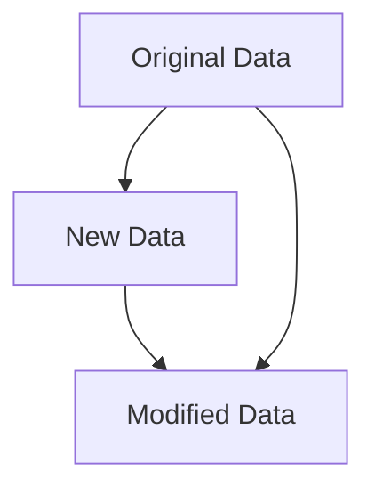

## 5.1.2 Benefits of Pure Functions

As experienced Java developers, you're likely familiar with the challenges of managing state and ensuring thread safety in concurrent applications. Transitioning to Clojure, a functional programming language, offers a paradigm shift that emphasizes the use of pure functions. In this section, we'll explore the numerous benefits of pure functions, including predictability, ease of testing, and parallelization. We'll also discuss how pure functions contribute to code clarity and maintainability, and how they eliminate issues related to shared mutable state.

### What Are Pure Functions?

Before diving into the benefits, let's briefly define what pure functions are. A pure function is a function where the output value is determined only by its input values, without observable side effects. This means that given the same inputs, a pure function will always produce the same output. Additionally, pure functions do not modify any state or data outside of their scope.

### Predictability and Determinism

One of the most significant advantages of pure functions is their predictability. Because pure functions always produce the same output for the same input, they are deterministic. This predictability makes reasoning about code behavior much simpler, as you don't have to consider external state changes or side effects.

#### Java vs. Clojure: Predictability

In Java, methods often rely on mutable state, which can lead to unpredictable behavior if the state is modified elsewhere in the program. Consider the following Java example:

```java
public class Counter {
    private int count = 0;

    public int increment() {
        return ++count;
    }
}
```

In this example, the `increment` method's output depends on the mutable `count` variable, making it non-deterministic. In contrast, a Clojure pure function would look like this:

```clojure
(defn increment [count]
  (+ count 1))
```

Here, the `increment` function is pure because it relies solely on its input and does not modify any external state.

### Ease of Testing

Pure functions are inherently easier to test than impure functions. Since they do not depend on or alter external state, you can test them in isolation with confidence that the tests will be reliable and repeatable.

#### Testing in Java vs. Clojure

In Java, testing methods that rely on mutable state often requires setting up and tearing down state before and after each test. This can lead to complex and brittle test setups. Consider the following Java test:

```java
@Test
public void testIncrement() {
    Counter counter = new Counter();
    assertEquals(1, counter.increment());
    assertEquals(2, counter.increment());
}
```

This test depends on the initial state of the `Counter` object, which can complicate testing if the state is not properly managed.

In Clojure, testing pure functions is straightforward:

```clojure
(deftest test-increment
  (is (= 1 (increment 0)))
  (is (= 2 (increment 1))))
```

These tests are simple and reliable because they do not depend on any external state.

### Parallelization and Concurrency

Pure functions are naturally suited for parallelization and concurrency. Since they do not modify shared state, they can be executed concurrently without the risk of race conditions or deadlocks.

#### Java vs. Clojure: Concurrency

In Java, managing concurrency often involves complex synchronization mechanisms to prevent race conditions. Consider the following Java example:

```java
public class SafeCounter {
    private int count = 0;

    public synchronized int increment() {
        return ++count;
    }
}
```

Here, the `synchronized` keyword is used to ensure thread safety, but it also introduces potential performance bottlenecks.

In Clojure, pure functions eliminate the need for synchronization:

```clojure
(defn increment [count]
  (+ count 1))
```

This function can be safely executed in parallel without any additional synchronization.

### Code Clarity and Maintainability

Pure functions contribute to code clarity and maintainability by promoting a clear separation between computation and side effects. This separation makes it easier to understand and reason about code, as each function's behavior is self-contained and predictable.

#### Java vs. Clojure: Code Clarity

In Java, methods often mix computation with side effects, leading to complex and difficult-to-maintain code. Consider the following Java example:

```java
public class Logger {
    private List<String> logs = new ArrayList<>();

    public void log(String message) {
        logs.add(message);
        System.out.println(message);
    }
}
```

In this example, the `log` method both modifies the `logs` list and prints to the console, mixing computation with side effects.

In Clojure, pure functions encourage a clear separation of concerns:

```clojure
(defn log-message [logs message]
  (conj logs message))
```

This function focuses solely on updating the logs, leaving side effects like printing to be handled elsewhere.

### Eliminating Shared Mutable State

Shared mutable state is a common source of bugs in concurrent applications. Pure functions eliminate this issue by avoiding state mutation altogether.

#### Java vs. Clojure: Shared State

In Java, managing shared state often requires complex synchronization mechanisms, which can be error-prone and difficult to maintain. Consider the following Java example:

```java
public class SharedCounter {
    private int count = 0;

    public synchronized int increment() {
        return ++count;
    }
}
```

In this example, the `synchronized` keyword is used to manage shared state, but it also introduces potential performance bottlenecks.

In Clojure, pure functions avoid shared state altogether:

```clojure
(defn increment [count]
  (+ count 1))
```

This function can be safely executed in parallel without any additional synchronization.

### Try It Yourself: Experimenting with Pure Functions

To deepen your understanding of pure functions, try modifying the following Clojure code examples:

1. **Modify the `increment` function** to decrement the count instead.
2. **Create a new pure function** that multiplies two numbers and test it using `deftest`.
3. **Experiment with parallel execution** by using Clojure's `pmap` function to apply a pure function to a collection of data.

### Diagrams and Visualizations

To further illustrate the benefits of pure functions, let's explore some visualizations.

#### Data Flow in Pure Functions

The following diagram illustrates the flow of data through a pure function:



*Diagram 1: Data flows from input to output through a pure function, with no side effects.*

#### Immutability and Persistent Data Structures

The following diagram illustrates how Clojure's persistent data structures work:



*Diagram 2: Clojure's persistent data structures allow for efficient data modification without altering the original data.*

### Further Reading

For more information on pure functions and functional programming in Clojure, consider exploring the following resources:

- [Official Clojure Documentation](https://clojure.org/reference/documentation)
- [ClojureDocs](https://clojuredocs.org/)
- [Functional Programming in Clojure](https://www.braveclojure.com/)

### Exercises and Practice Problems

To reinforce your understanding of pure functions, try the following exercises:

1. **Refactor a Java method** that relies on mutable state into a pure Clojure function.
2. **Write a Clojure function** that calculates the factorial of a number using recursion and test it for correctness.
3. **Implement a Clojure function** that filters a list of numbers, returning only the even numbers, and test it using `deftest`.

### Key Takeaways

- **Predictability**: Pure functions are deterministic, making them easier to reason about and debug.
- **Ease of Testing**: Pure functions can be tested in isolation, leading to simpler and more reliable tests.
- **Parallelization**: Pure functions are naturally suited for concurrent execution, eliminating the need for complex synchronization.
- **Code Clarity**: Pure functions promote a clear separation between computation and side effects, enhancing code maintainability.
- **Eliminating Shared State**: Pure functions avoid shared mutable state, reducing the risk of concurrency-related bugs.

Now that we've explored the benefits of pure functions, let's apply these concepts to manage state effectively in your applications.

---

## Quiz: Understanding the Benefits of Pure Functions



### What is a key characteristic of pure functions?

- [x] They always produce the same output for the same input.
- [ ] They modify external state.
- [ ] They rely on mutable variables.
- [ ] They have side effects.

> **Explanation:** Pure functions are deterministic, meaning they always produce the same output for the same input, without modifying external state or having side effects.

### Why are pure functions easier to test?

- [x] They do not depend on external state.
- [ ] They require complex setup.
- [ ] They modify shared variables.
- [ ] They have unpredictable outputs.

> **Explanation:** Pure functions do not depend on external state, making them easier to test in isolation with predictable outputs.

### How do pure functions contribute to parallelization?

- [x] They can be executed concurrently without synchronization.
- [ ] They require locks for thread safety.
- [ ] They modify shared state.
- [ ] They introduce race conditions.

> **Explanation:** Pure functions do not modify shared state, allowing them to be executed concurrently without the need for synchronization, thus avoiding race conditions.

### What is a benefit of using pure functions in terms of code clarity?

- [x] They separate computation from side effects.
- [ ] They mix computation with side effects.
- [ ] They rely on mutable state.
- [ ] They are difficult to understand.

> **Explanation:** Pure functions separate computation from side effects, enhancing code clarity and maintainability.

### How do pure functions eliminate issues related to shared mutable state?

- [x] They avoid state mutation altogether.
- [ ] They require complex synchronization.
- [ ] They introduce deadlocks.
- [ ] They modify shared variables.

> **Explanation:** Pure functions avoid state mutation altogether, eliminating issues related to shared mutable state and reducing concurrency-related bugs.

### What is a common challenge when testing impure functions in Java?

- [x] Managing mutable state.
- [ ] Predictable outputs.
- [ ] Simple test setups.
- [ ] Isolated testing.

> **Explanation:** Testing impure functions in Java often involves managing mutable state, which can complicate test setups and lead to unreliable tests.

### How do pure functions enhance maintainability?

- [x] By promoting a clear separation of concerns.
- [ ] By mixing computation with side effects.
- [ ] By relying on mutable state.
- [ ] By introducing complexity.

> **Explanation:** Pure functions promote a clear separation of concerns, making code easier to understand and maintain.

### What is a key difference between pure functions in Clojure and methods in Java?

- [x] Pure functions do not modify external state.
- [ ] Methods in Java are always pure.
- [ ] Pure functions rely on mutable variables.
- [ ] Methods in Java have no side effects.

> **Explanation:** Pure functions in Clojure do not modify external state, whereas methods in Java often rely on mutable variables and can have side effects.

### How do pure functions improve code readability?

- [x] By providing predictable behavior.
- [ ] By introducing side effects.
- [ ] By relying on external state.
- [ ] By modifying shared variables.

> **Explanation:** Pure functions provide predictable behavior, making code easier to read and understand.

### True or False: Pure functions can be executed in parallel without synchronization.

- [x] True
- [ ] False

> **Explanation:** True. Pure functions do not modify shared state, allowing them to be executed in parallel without synchronization.


