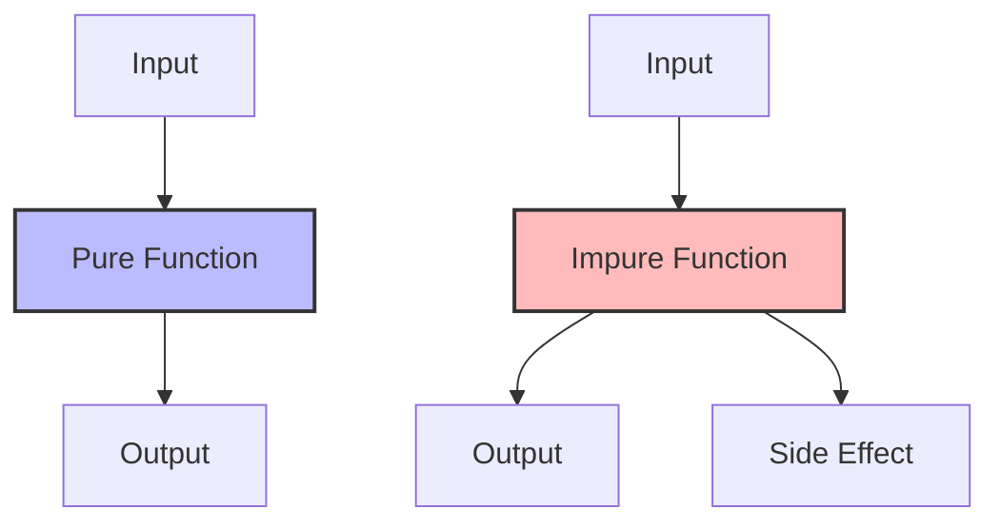

## 5.1.3 Identifying Pure and Impure Functions

In the realm of functional programming, understanding the distinction between pure and impure functions is crucial. This knowledge not only aids in writing more predictable and maintainable code but also leverages the full potential of Clojure's functional paradigm. In this section, we will explore how to identify pure and impure functions, using examples from both Clojure and Java to illustrate these concepts.

### What Are Pure Functions?

A **pure function** is a function where the output value is determined only by its input values, without observable side effects. This means that a pure function will always return the same result given the same arguments, and it does not modify any state outside its scope.

**Characteristics of Pure Functions:**

- **Deterministic:** Always produces the same output for the same input.
- **No Side Effects:** Does not alter any external state or interact with the outside world (e.g., no I/O operations, no modifying global variables).

#### Example of a Pure Function in Clojure

Let's look at a simple example of a pure function in Clojure:

```clojure
(defn add [x y]
  (+ x y))
```

- **Explanation:** The `add` function takes two arguments, `x` and `y`, and returns their sum. It does not modify any external state or perform any I/O operations, making it a pure function.

#### Example of a Pure Function in Java

In Java, a pure function might look like this:

```java
public int add(int x, int y) {
    return x + y;
}
```

- **Explanation:** Similar to the Clojure example, this Java method takes two integers and returns their sum, without altering any external state.

### What Are Impure Functions?

An **impure function** is a function that may produce different outputs for the same inputs or has side effects that affect the external state or interact with the outside world.

**Characteristics of Impure Functions:**

- **Non-deterministic:** May produce different results for the same input.
- **Side Effects:** Can modify external state, perform I/O operations, or rely on external state.

#### Example of an Impure Function in Clojure

Consider the following Clojure function:

```clojure
(def counter (atom 0))

(defn increment-counter []
  (swap! counter inc))
```

- **Explanation:** The `increment-counter` function modifies the external state by incrementing the value of the `counter` atom. This side effect makes it an impure function.

#### Example of an Impure Function in Java

Here's an example of an impure function in Java:

```java
public class Counter {
    private int count = 0;

    public void increment() {
        count++;
    }
}
```

- **Explanation:** The `increment` method modifies the `count` field of the `Counter` class, which is a side effect, making it impure.

### Identifying Pure and Impure Functions

To identify whether a function is pure or impure, consider the following guidelines:

1. **Check for Side Effects:** Does the function modify any external state, perform I/O operations, or rely on mutable data structures?
2. **Evaluate Determinism:** Does the function always return the same result for the same input?
3. **Analyze Dependencies:** Does the function depend on any external state that might change?

#### Clojure's Approach to Purity

Clojure encourages the use of pure functions by default. Its emphasis on immutability and first-class functions makes it easier to write pure functions. Let's explore some examples to solidify our understanding.

##### Pure Function Example in Clojure

```clojure
(defn square [n]
  (* n n))
```

- **Explanation:** The `square` function takes a number and returns its square. It is pure because it does not modify any external state or perform any side effects.

##### Impure Function Example in Clojure

```clojure
(defn print-square [n]
  (println (* n n)))
```

- **Explanation:** The `print-square` function performs a side effect by printing to the console, making it impure.

### Comparing Pure and Impure Functions in Java

Java, being an object-oriented language, often involves mutable state and side effects. However, with the introduction of functional programming features in Java 8, such as lambdas and streams, it is possible to write more functional-style code.

#### Pure Function Example in Java

```java
public int multiply(int a, int b) {
    return a * b;
}
```

- **Explanation:** This method is pure because it returns the product of `a` and `b` without altering any external state.

#### Impure Function Example in Java

```java
public void logMessage(String message) {
    System.out.println(message);
}
```

- **Explanation:** This method is impure because it performs a side effect by printing to the console.

### Visualizing Pure and Impure Functions

To better understand the flow of data and side effects in pure and impure functions, let's use a diagram to illustrate these concepts.



**Diagram Explanation:** 

- **Pure Function Flow:** The input flows through the pure function, producing an output without any side effects.
- **Impure Function Flow:** The input flows through the impure function, producing an output and causing a side effect.

### Try It Yourself

To deepen your understanding, try modifying the examples above:

- **Clojure:** Convert the `print-square` function into a pure function by removing the `println` statement.
- **Java:** Refactor the `logMessage` method to return the message instead of printing it.

### Exercises and Practice Problems

1. **Identify Purity:** Analyze the following Clojure function and determine if it is pure or impure:

   ```clojure
   (defn random-number []
     (rand-int 100))
   ```

   - **Hint:** Consider whether the function produces the same output for the same input.

2. **Refactor for Purity:** Refactor the following Java method to make it pure:

   ```java
   public void updateList(List<String> list, String item) {
       list.add(item);
   }
   ```

   - **Hint:** Think about how you can avoid modifying the input list.

3. **Create a Pure Function:** Write a pure function in Clojure that calculates the factorial of a number.

4. **Side Effect Analysis:** Identify the side effects in the following Clojure function:

   ```clojure
   (defn save-to-file [data filename]
     (spit filename data))
   ```

5. **Java vs. Clojure:** Compare the following Java and Clojure functions. Identify which are pure and which are impure:

   ```java
   public int add(int x, int y) {
       return x + y;
   }

   public void printSum(int x, int y) {
       System.out.println(x + y);
   }
   ```

   ```clojure
   (defn add [x y]
     (+ x y))

   (defn print-sum [x y]
     (println (+ x y)))
   ```

### Key Takeaways

- **Pure Functions:** Always produce the same output for the same input and have no side effects.
- **Impure Functions:** May produce different outputs for the same input and can have side effects.
- **Clojure's Functional Paradigm:** Encourages the use of pure functions, enhancing code reliability and maintainability.
- **Java's Functional Features:** Allow for writing more functional-style code, but care must be taken to avoid side effects.

By understanding and identifying pure and impure functions, you can write more predictable and maintainable code, leveraging the strengths of Clojure's functional programming paradigm.

### Further Reading

- [Official Clojure Documentation](https://clojure.org/reference/documentation)
- [ClojureDocs](https://clojuredocs.org/)
- [Functional Programming in Java](https://www.oreilly.com/library/view/functional-programming-in/9781449365516/)

## Quiz: Test Your Knowledge on Pure and Impure Functions



### Which of the following is a characteristic of a pure function?

- [x] It always produces the same output for the same input.
- [ ] It can modify global variables.
- [ ] It performs I/O operations.
- [ ] It relies on external state.

> **Explanation:** A pure function always produces the same output for the same input and does not have side effects.

### What makes a function impure?

- [x] It has side effects.
- [ ] It is deterministic.
- [ ] It does not modify external state.
- [ ] It always returns the same result for the same input.

> **Explanation:** An impure function has side effects, such as modifying external state or performing I/O operations.

### Which of the following Clojure functions is pure?

```clojure
(defn multiply [a b]
  (* a b))
```

- [x] The function is pure.
- [ ] The function is impure.
- [ ] The function modifies external state.
- [ ] The function performs I/O operations.

> **Explanation:** The `multiply` function is pure because it returns the product of `a` and `b` without side effects.

### How can you identify a pure function in Java?

- [x] It does not modify any external state.
- [ ] It performs logging.
- [ ] It updates a database.
- [ ] It reads from a file.

> **Explanation:** A pure function in Java does not modify external state and does not perform side effects like logging or file I/O.

### Which of the following is an example of a side effect?

- [x] Modifying a global variable.
- [x] Performing a network request.
- [ ] Returning a calculated value.
- [ ] Using local variables.

> **Explanation:** Modifying a global variable and performing a network request are side effects.

### What is a benefit of using pure functions?

- [x] Easier to test.
- [ ] More complex code.
- [ ] Requires more memory.
- [ ] Slower execution.

> **Explanation:** Pure functions are easier to test because they do not depend on external state and always produce the same output for the same input.

### Which of the following Java methods is impure?

```java
public void logMessage(String message) {
    System.out.println(message);
}
```

- [x] The method is impure.
- [ ] The method is pure.
- [ ] The method does not perform I/O.
- [ ] The method is deterministic.

> **Explanation:** The `logMessage` method is impure because it performs a side effect by printing to the console.

### How does Clojure encourage the use of pure functions?

- [x] By emphasizing immutability.
- [ ] By allowing mutable state.
- [ ] By requiring side effects.
- [ ] By discouraging function composition.

> **Explanation:** Clojure encourages the use of pure functions by emphasizing immutability and function composition.

### What is a common characteristic of impure functions?

- [x] They may produce different results for the same input.
- [ ] They are always deterministic.
- [ ] They never modify external state.
- [ ] They do not perform I/O operations.

> **Explanation:** Impure functions may produce different results for the same input due to side effects.

### True or False: A function that reads from a database is pure.

- [ ] True
- [x] False

> **Explanation:** A function that reads from a database is impure because it relies on external state and may produce different results for the same input.



By mastering the identification of pure and impure functions, you can enhance your Clojure programming skills and write more reliable, maintainable code. Now that we've explored these concepts, let's apply them to improve your code's predictability and maintainability.
