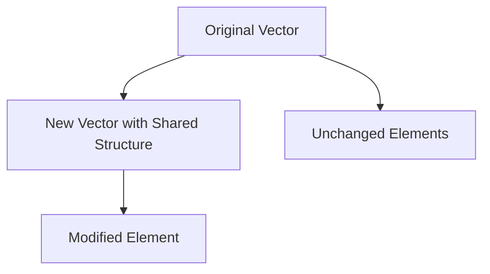

## 5.2.1 Importance of Immutability

Immutability is a fundamental concept in functional programming and a cornerstone of Clojure's design philosophy. For Java developers transitioning to Clojure, understanding the importance of immutability is crucial for mastering functional programming paradigms. In this section, we will explore why immutability is vital, how it prevents unintended side effects, enhances code readability, and improves concurrency by avoiding issues with shared mutable state.

### Understanding Immutability

Immutability refers to the inability to change an object after it has been created. In Clojure, data structures are immutable by default, meaning that any "modification" operation on a data structure returns a new data structure rather than altering the original. This concept might seem foreign to Java developers, who are accustomed to mutable objects and data structures.

#### Java vs. Clojure: A Comparison

In Java, objects are typically mutable, allowing their state to be changed after creation. Consider the following Java example:

```java
import java.util.ArrayList;
import java.util.List;

public class MutableExample {
    public static void main(String[] args) {
        List<String> names = new ArrayList<>();
        names.add("Alice");
        names.add("Bob");
        // Modify the list
        names.set(1, "Charlie");
        System.out.println(names); // Output: [Alice, Charlie]
    }
}
```

In this example, the `ArrayList` is mutable, and we can change its contents after creation. This mutability can lead to unintended side effects, especially in concurrent environments.

In contrast, Clojure's approach to immutability ensures that data structures cannot be altered. Here's a similar example in Clojure:

```clojure
(def names ["Alice" "Bob"])
;; "Modify" the vector by creating a new one
(def updated-names (assoc names 1 "Charlie"))
(println updated-names) ;; Output: ["Alice" "Charlie"]
```

In this Clojure example, the `assoc` function returns a new vector with the desired change, leaving the original vector unchanged.

### Benefits of Immutability

#### Preventing Unintended Side Effects

One of the primary benefits of immutability is the prevention of unintended side effects. In mutable systems, changes to an object can ripple through the system, leading to bugs that are difficult to trace. Immutability eliminates this problem by ensuring that data structures remain constant once created.

**Example:**

Consider a function that processes a list of transactions. In a mutable system, if a transaction is accidentally modified, it could lead to incorrect calculations. With immutability, each transaction remains unchanged, ensuring data integrity.

#### Enhanced Code Readability and Maintainability

Immutable data structures lead to more readable and maintainable code. When a function receives an immutable data structure, developers can be confident that the data will not change unexpectedly. This predictability simplifies reasoning about code behavior.

**Example:**

In a Clojure application, you might have a function that processes user data:

```clojure
(defn process-user [user]
  (let [updated-user (assoc user :status "active")]
    ;; Further processing
    updated-user))
```

The `process-user` function takes a user map and returns a new map with an updated status. The original user map remains unchanged, making the function's behavior easy to understand and predict.

#### Improved Concurrency

Immutability plays a crucial role in improving concurrency. In traditional Java applications, managing shared mutable state in a concurrent environment requires complex synchronization mechanisms, such as locks, which can lead to performance bottlenecks and deadlocks.

Clojure's immutable data structures eliminate these issues by ensuring that data cannot be changed by multiple threads simultaneously. This approach simplifies concurrent programming and enhances performance.

**Example:**

Consider a scenario where multiple threads update a shared counter. In Java, you might use synchronization to manage access:

```java
public class Counter {
    private int count = 0;

    public synchronized void increment() {
        count++;
    }

    public synchronized int getCount() {
        return count;
    }
}
```

In Clojure, you can achieve the same functionality without locks using an immutable data structure:

```clojure
(def counter (atom 0))

(defn increment-counter []
  (swap! counter inc))

(defn get-counter []
  @counter)
```

The `atom` in Clojure provides a way to manage state changes safely without the need for explicit synchronization.

### Immutability and Persistent Data Structures

Clojure's immutable data structures are implemented as persistent data structures, which means they efficiently share structure between versions. This sharing minimizes memory usage and enhances performance.

#### How Persistent Data Structures Work

When you modify an immutable data structure in Clojure, the new version shares as much structure as possible with the original. This sharing is achieved through a technique called *structural sharing*.



*Diagram: Structural sharing in persistent data structures.*

In the diagram above, the new vector shares most of its structure with the original vector, only creating new nodes for the modified elements. This approach ensures that operations on immutable data structures are efficient.

### Practical Applications of Immutability

#### Transforming Collections

Immutability is particularly useful when transforming collections. In Clojure, functions like `map`, `filter`, and `reduce` operate on immutable collections, returning new collections without altering the originals.

**Example:**

```clojure
(def numbers [1 2 3 4 5])
(def doubled (map #(* 2 %) numbers))
(println doubled) ;; Output: (2 4 6 8 10)
```

The `map` function returns a new collection with each element doubled, leaving the original `numbers` collection unchanged.

#### Managing Application State

In Clojure applications, managing state with immutable data structures simplifies reasoning about state changes. Libraries like `re-frame` leverage immutability to manage application state in a predictable manner.

**Example:**

In a ClojureScript application, you might use `re-frame` to manage UI state:

```clojure
(re-frame/reg-event-db
 :initialize-db
 (fn [_ _]
   {:user {:name "Alice" :status "inactive"}}))

(re-frame/reg-event-db
 :activate-user
 (fn [db _]
   (assoc-in db [:user :status] "active")))
```

The `:activate-user` event handler returns a new state with the updated user status, ensuring that state transitions are explicit and predictable.

### Try It Yourself

Experiment with the following Clojure code to deepen your understanding of immutability:

1. Modify the `process-user` function to add a new key-value pair to the user map.
2. Create a new vector by adding an element to the `doubled` vector using `conj`.
3. Implement a function that takes a list of numbers and returns a new list with each number incremented by one.

### Key Takeaways

- **Immutability** is a core principle of functional programming, preventing unintended side effects and enhancing code reliability.
- **Immutable data structures** in Clojure are efficient due to structural sharing, minimizing memory usage and improving performance.
- **Concurrency** is simplified with immutability, as shared mutable state issues are eliminated.
- **Code readability and maintainability** are improved, as functions operate predictably on immutable data.

### Further Reading

For more information on immutability and functional programming in Clojure, consider exploring the following resources:

- [Official Clojure Documentation on Data Structures](https://clojure.org/reference/data_structures)
- [ClojureDocs: Immutability](https://clojuredocs.org)
- [Functional Programming in Clojure](https://github.com/functional-programming-in-clojure)

Now that we've explored how immutable data structures work in Clojure, let's apply these concepts to manage state effectively in your applications.

## Quiz: Test Your Understanding of Immutability in Clojure



### What is immutability?

- [x] The inability to change an object after it has been created
- [ ] The ability to change an object at any time
- [ ] A feature that allows objects to be modified by multiple threads
- [ ] A mechanism to ensure data integrity by locking objects

> **Explanation:** Immutability refers to the inability to change an object after it has been created, ensuring data integrity and simplifying concurrency.

### How does Clojure handle data structure modifications?

- [x] By returning a new data structure with the desired changes
- [ ] By modifying the original data structure in place
- [ ] By using locks to manage changes
- [ ] By creating a copy of the data structure for each change

> **Explanation:** Clojure returns a new data structure with the desired changes, leaving the original unchanged, thanks to its immutable nature.

### What is a benefit of immutability in concurrent programming?

- [x] It eliminates issues with shared mutable state
- [ ] It requires complex synchronization mechanisms
- [ ] It increases the risk of data corruption
- [ ] It makes code harder to understand

> **Explanation:** Immutability eliminates issues with shared mutable state, simplifying concurrent programming by avoiding the need for synchronization.

### What is structural sharing?

- [x] A technique to efficiently share structure between versions of data structures
- [ ] A method to duplicate data structures for each modification
- [ ] A way to lock data structures during concurrent access
- [ ] A process to convert mutable data structures to immutable ones

> **Explanation:** Structural sharing is a technique to efficiently share structure between versions of data structures, minimizing memory usage.

### Which of the following is a Clojure function that operates on immutable collections?

- [x] `map`
- [ ] `set`
- [ ] `lock`
- [ ] `synchronize`

> **Explanation:** The `map` function operates on immutable collections, returning a new collection with the results of applying a function to each element.

### How does immutability enhance code readability?

- [x] By ensuring that data structures remain constant once created
- [ ] By allowing data structures to be modified at any time
- [ ] By requiring complex synchronization mechanisms
- [ ] By making code harder to understand

> **Explanation:** Immutability enhances code readability by ensuring that data structures remain constant once created, making code behavior predictable.

### What is a potential drawback of mutable data structures in Java?

- [x] They can lead to unintended side effects
- [ ] They simplify concurrent programming
- [ ] They enhance code readability
- [ ] They improve performance

> **Explanation:** Mutable data structures can lead to unintended side effects, especially in concurrent environments, making code harder to reason about.

### How does Clojure's `atom` help manage state changes?

- [x] By providing a way to manage state changes safely without explicit synchronization
- [ ] By locking data structures during state changes
- [ ] By duplicating data structures for each change
- [ ] By allowing multiple threads to modify state simultaneously

> **Explanation:** Clojure's `atom` provides a way to manage state changes safely without explicit synchronization, ensuring data integrity.

### What is a key advantage of using persistent data structures?

- [x] They efficiently share structure between versions, minimizing memory usage
- [ ] They require complex synchronization mechanisms
- [ ] They increase the risk of data corruption
- [ ] They make code harder to understand

> **Explanation:** Persistent data structures efficiently share structure between versions, minimizing memory usage and improving performance.

### True or False: Immutability is a core principle of functional programming.

- [x] True
- [ ] False

> **Explanation:** True. Immutability is a core principle of functional programming, preventing unintended side effects and enhancing code reliability.


