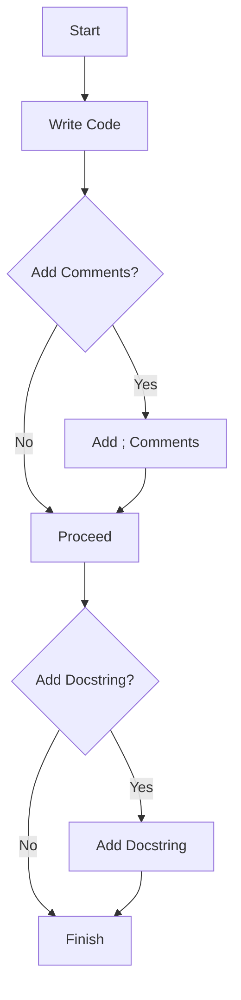

## 5.2.2 Comments and Documentation Strings

In the world of software development, writing code is just one part of the equation. Equally important is the ability to make that code understandable and maintainable for yourself and others. This is where comments and documentation strings come into play. In this section, we will delve into the nuances of adding comments in Clojure using the `;` character, the significance of code documentation, and how to effectively use docstrings within functions.

### The Role of Comments in Code

Comments are an essential tool for developers. They serve as a means to explain the "why" behind the code, offer insights into complex logic, and provide guidance for future maintenance. While code should ideally be self-explanatory, comments can bridge the gap between what the code does and the developer's intent.

#### Adding Comments in Clojure

In Clojure, comments are initiated with the semicolon (`;`). Everything following the `;` on that line is considered a comment and is ignored by the Clojure compiler. Here's a simple example:

```clojure
(defn add [a b]
  ; This function adds two numbers
  (+ a b))
```

In the above snippet, the comment `; This function adds two numbers` provides a brief explanation of the function's purpose.

##### Single-Line Comments

Single-line comments are the most common type of comments. They are used to annotate specific lines or sections of code. Here's how you can use them effectively:

```clojure
(defn factorial [n]
  ; Base case: factorial of 0 is 1
  (if (zero? n)
    1
    ; Recursive case: n * factorial of (n-1)
    (* n (factorial (dec n)))))
```

In this example, comments are used to clarify the base case and the recursive case of the factorial function.

##### Multi-Line Comments

While Clojure does not support multi-line comments in the traditional sense (like `/* ... */` in Java), you can achieve a similar effect by using multiple single-line comments:

```clojure
(defn complex-function [x]
  ; This function performs a complex operation
  ; involving multiple steps and calculations.
  ; It is important to understand each step
  ; to maintain or modify this function.
  (let [step1 (do-something x)
        step2 (do-another-thing step1)]
    (final-step step2)))
```

Here, consecutive single-line comments are used to provide a detailed explanation of the function's purpose and logic.

### The Importance of Code Documentation

Code documentation goes beyond comments. It includes comprehensive explanations of modules, functions, classes, and their interactions. Good documentation is crucial for several reasons:

1. **Maintainability:** Well-documented code is easier to maintain and update. Future developers (or even your future self) will appreciate the clarity and context provided by documentation.

2. **Collaboration:** In team environments, documentation serves as a shared understanding of the codebase, facilitating collaboration and reducing the learning curve for new team members.

3. **Knowledge Transfer:** Documentation acts as a repository of knowledge, preserving the insights and decisions made during development.

4. **Debugging and Testing:** Clear documentation can aid in debugging and testing by providing insights into expected behavior and edge cases.

### Docstrings in Clojure

Docstrings are a form of inline documentation that describe the purpose and usage of a function or macro. In Clojure, docstrings are written as the first string literal in a function definition and are accessible via the `doc` function.

#### Writing Docstrings

To add a docstring to a function, simply include a string literal immediately after the function's name and parameters:

```clojure
(defn greet
  "Greets a person with a given name."
  [name]
  (str "Hello, " name "!"))
```

In this example, `"Greets a person with a given name."` is the docstring for the `greet` function. It succinctly describes what the function does.

#### Accessing Docstrings

Clojure provides the `doc` function to access and display the docstring of a function or macro. This is particularly useful in the REPL (Read-Eval-Print Loop) environment for quick reference:

```clojure
(doc greet)
```

This command will output:

```
-------------------------
user/greet
([name])
  Greets a person with a given name.
```

The output includes the function's namespace, name, parameter list, and the docstring.

#### Best Practices for Writing Docstrings

1. **Be Concise:** Docstrings should be brief yet informative. Aim to describe the function's purpose and any important details in a few sentences.

2. **Use Complete Sentences:** While brevity is important, clarity should not be sacrificed. Use complete sentences to convey your message effectively.

3. **Include Parameter Descriptions:** If a function has multiple parameters, consider describing each one and its role in the function.

4. **Mention Return Values:** If applicable, describe what the function returns, especially if it's not immediately obvious.

5. **Highlight Side Effects:** If a function has side effects (e.g., modifying a global state), make sure to mention them in the docstring.

### Practical Examples and Code Snippets

Let's explore some practical examples to illustrate the use of comments and docstrings in Clojure.

#### Example 1: A Simple Calculator

Consider a simple calculator function that performs basic arithmetic operations:

```clojure
(defn calculate
  "Performs basic arithmetic operations: addition, subtraction, multiplication, and division.
  Takes two numbers and an operator as arguments."
  [a b operator]
  (case operator
    :add (+ a b)        ; Addition
    :subtract (- a b)   ; Subtraction
    :multiply (* a b)   ; Multiplication
    :divide (/ a b)     ; Division
    (throw (IllegalArgumentException. "Invalid operator"))))
```

In this example, the docstring provides an overview of the function's capabilities and its parameters. Inline comments are used to annotate each operation.

#### Example 2: Data Transformation Pipeline

Let's look at a more complex example involving a data transformation pipeline:

```clojure
(defn transform-data
  "Transforms a collection of data by applying a series of functions.
  Takes a collection and a sequence of functions as arguments."
  [data & fns]
  ; Apply each function in sequence to the data
  (reduce (fn [acc fn] (fn acc)) data fns))
```

Here, the docstring explains the function's purpose and its parameters. The inline comment clarifies the logic of applying functions in sequence.

### Diagrams and Visual Aids

To enhance understanding, let's include a simple flowchart to visualize the process of adding comments and docstrings in Clojure:



This flowchart outlines the decision-making process for incorporating comments and docstrings into your code.

### Common Pitfalls and Optimization Tips

#### Pitfalls

1. **Over-Commenting:** Avoid excessive commenting that states the obvious. Comments should add value, not clutter.

2. **Outdated Comments:** Ensure comments are updated alongside code changes to prevent misinformation.

3. **Ambiguous Docstrings:** Avoid vague or ambiguous docstrings. They should clearly convey the function's purpose and usage.

#### Optimization Tips

1. **Use Comments Sparingly:** Rely on clear and expressive code to minimize the need for comments. Use comments to explain complex logic or decisions.

2. **Regularly Review Documentation:** Periodically review and update comments and docstrings to ensure accuracy and relevance.

3. **Leverage Tools:** Use tools like linters and documentation generators to maintain consistency and quality in your documentation.

### Conclusion

Mastering the art of commenting and documenting code is a crucial skill for any developer. In Clojure, comments and docstrings play a vital role in enhancing code readability, maintainability, and collaboration. By following best practices and leveraging these tools effectively, you can create a codebase that is not only functional but also comprehensible and sustainable.

## Quiz Time!



### What character is used to start a comment in Clojure?

- [x] ;
- [ ] #
- [ ] //
- [ ] /*

> **Explanation:** In Clojure, the semicolon (`;`) is used to start a comment.

### How can you access a function's docstring in Clojure?

- [ ] By using the `info` function
- [x] By using the `doc` function
- [ ] By using the `describe` function
- [ ] By using the `help` function

> **Explanation:** The `doc` function is used to access and display a function's docstring in Clojure.

### What is the primary purpose of comments in code?

- [ ] To increase the file size
- [x] To explain the "why" behind the code
- [ ] To make the code run faster
- [ ] To confuse other developers

> **Explanation:** Comments are used to explain the "why" behind the code, providing context and insights into the developer's intent.

### Which of the following is a best practice for writing docstrings?

- [x] Be concise and informative
- [ ] Use incomplete sentences
- [ ] Avoid mentioning parameters
- [ ] Ignore return values

> **Explanation:** Docstrings should be concise and informative, using complete sentences and mentioning parameters and return values where applicable.

### What should you do if a function has side effects?

- [ ] Ignore them in the docstring
- [x] Highlight them in the docstring
- [ ] Write a separate comment
- [ ] Remove the function

> **Explanation:** If a function has side effects, they should be highlighted in the docstring to inform users of the function's behavior.

### What is a common pitfall when writing comments?

- [ ] Using too few comments
- [x] Over-commenting
- [ ] Writing in complete sentences
- [ ] Using diagrams

> **Explanation:** Over-commenting, or adding excessive comments that state the obvious, is a common pitfall that can clutter the code.

### How can you simulate multi-line comments in Clojure?

- [ ] By using `/* ... */`
- [ ] By using `#| ... |#`
- [x] By using multiple single-line comments
- [ ] By using `<!-- ... -->`

> **Explanation:** In Clojure, you can simulate multi-line comments by using multiple single-line comments with `;`.

### Why is code documentation important in team environments?

- [ ] It increases the file size
- [ ] It makes the code run slower
- [x] It facilitates collaboration and reduces the learning curve
- [ ] It confuses new team members

> **Explanation:** In team environments, documentation facilitates collaboration and reduces the learning curve for new team members.

### What is the role of the `case` expression in the example calculator function?

- [ ] To handle exceptions
- [x] To perform different operations based on the operator
- [ ] To define variables
- [ ] To loop through numbers

> **Explanation:** In the example calculator function, the `case` expression is used to perform different operations based on the operator provided.

### True or False: Comments should be updated alongside code changes.

- [x] True
- [ ] False

> **Explanation:** Comments should be updated alongside code changes to ensure they remain accurate and relevant.


