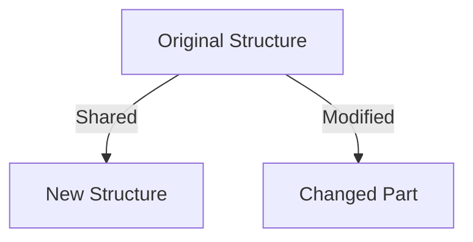

## 5.2.2 Immutable Data Structures in Clojure

As Java developers, we are accustomed to working with mutable data structures such as `ArrayList`, `HashMap`, and `HashSet`. These structures allow us to modify data in place, which can lead to issues in concurrent programming and make reasoning about code more complex. In contrast, Clojure embraces immutability, offering persistent data structures that ensure data integrity and simplify concurrency.

### Understanding Immutability

In Clojure, immutability means that once a data structure is created, it cannot be changed. Instead of modifying the original structure, operations on immutable data structures return new versions with the desired changes. This approach offers several advantages:

- **Thread Safety**: Immutable data structures are inherently thread-safe, as they cannot be altered by concurrent processes.
- **Simplified Reasoning**: With immutability, you can reason about your code more easily, as data does not change unexpectedly.
- **Functional Programming**: Immutability aligns with the principles of functional programming, where functions do not have side effects.

### Persistent Data Structures

Clojure's persistent data structures are designed to be efficient, even when creating new versions of data. They achieve this through structural sharing, where new data structures share parts of the old structure, minimizing memory usage and improving performance.

Let's explore Clojure's core immutable data structures: lists, vectors, maps, and sets.

#### Lists

Lists in Clojure are linked lists, optimized for sequential access. They are ideal for scenarios where you need to process elements in order.

```clojure
;; Creating a list
(def my-list '(1 2 3 4 5))

;; Adding an element to the front
(def new-list (cons 0 my-list)) ; => (0 1 2 3 4 5)

;; Removing the first element
(def rest-list (rest my-list)) ; => (2 3 4 5)
```

**Key Characteristics**:
- **Efficient** for adding/removing elements at the front.
- **Sequential access** makes them less suitable for random access.

#### Vectors

Vectors are indexed collections, similar to Java's `ArrayList`, but immutable. They provide efficient random access and are ideal for collections where you need to access elements by index.

```clojure
;; Creating a vector
(def my-vector [1 2 3 4 5])

;; Accessing an element by index
(nth my-vector 2) ; => 3

;; Adding an element
(def new-vector (conj my-vector 6)) ; => [1 2 3 4 5 6]

;; Updating an element
(def updated-vector (assoc my-vector 2 10)) ; => [1 2 10 4 5]
```

**Key Characteristics**:
- **Efficient** for random access and updates.
- **Ideal** for collections where order and index access are important.

#### Maps

Maps in Clojure are key-value pairs, similar to Java's `HashMap`. They are used to associate keys with values and provide efficient lookup.

```clojure
;; Creating a map
(def my-map {:a 1 :b 2 :c 3})

;; Accessing a value by key
(get my-map :b) ; => 2

;; Adding a new key-value pair
(def new-map (assoc my-map :d 4)) ; => {:a 1, :b 2, :c 3, :d 4}

;; Removing a key
(def smaller-map (dissoc my-map :a)) ; => {:b 2, :c 3}
```

**Key Characteristics**:
- **Efficient** for key-based access and updates.
- **Flexible** for representing structured data.

#### Sets

Sets are collections of unique elements, similar to Java's `HashSet`. They are used when you need to ensure that elements are distinct.

```clojure
;; Creating a set
(def my-set #{1 2 3 4 5})

;; Adding an element
(def new-set (conj my-set 6)) ; => #{1 2 3 4 5 6}

;; Removing an element
(def smaller-set (disj my-set 3)) ; => #{1 2 4 5}
```

**Key Characteristics**:
- **Efficient** for membership tests and ensuring uniqueness.
- **Ideal** for collections where order is not important.

### Structural Sharing and Performance

Clojure's persistent data structures use structural sharing to maintain efficiency. When you create a new version of a data structure, only the parts that change are copied, while the rest are shared with the original. This approach minimizes memory usage and improves performance.



*Diagram: Structural sharing in Clojure's persistent data structures.*

### Comparing with Java

In Java, mutable data structures like `ArrayList` and `HashMap` allow in-place modifications, which can lead to concurrency issues and make code harder to reason about. In contrast, Clojure's immutable data structures provide a safer and more predictable way to manage data.

**Java Example**:
```java
import java.util.ArrayList;
import java.util.List;

public class MutableExample {
    public static void main(String[] args) {
        List<Integer> list = new ArrayList<>();
        list.add(1);
        list.add(2);
        list.add(3);
        // Modifying the list
        list.set(1, 10);
        System.out.println(list); // [1, 10, 3]
    }
}
```

**Clojure Equivalent**:
```clojure
(def my-list [1 2 3])

;; Creating a new version with a modification
(def updated-list (assoc my-list 1 10)) ; => [1 10 3]
```

### Try It Yourself

Experiment with Clojure's immutable data structures by modifying the examples above. Try adding, removing, and updating elements in lists, vectors, maps, and sets. Observe how each operation returns a new collection while leaving the original unchanged.

### Exercises

1. Create a vector of numbers from 1 to 10. Use `assoc` to change the 5th element to 50. What does the original vector look like after this operation?
2. Define a map representing a person's details (name, age, city). Add a new key-value pair for the person's occupation. How does the map change?
3. Create a set of unique colors. Add a color that already exists in the set. What happens?

### Key Takeaways

- **Immutability** is a core principle in Clojure, ensuring data integrity and simplifying concurrency.
- **Persistent data structures** use structural sharing to efficiently create new versions of data.
- **Lists, vectors, maps, and sets** are Clojure's core immutable data structures, each optimized for different use cases.
- **Clojure's approach** to immutability contrasts with Java's mutable data structures, offering a safer and more predictable way to manage data.

Now that we've explored how immutable data structures work in Clojure, let's apply these concepts to manage state effectively in your applications. For further reading, check out the [Official Clojure Documentation](https://clojure.org/reference/data_structures) and [ClojureDocs](https://clojuredocs.org/).

## Quiz: Mastering Immutable Data Structures in Clojure



### What is a key advantage of immutable data structures in Clojure?

- [x] They are inherently thread-safe.
- [ ] They allow in-place modifications.
- [ ] They require more memory than mutable structures.
- [ ] They are slower than mutable structures.

> **Explanation:** Immutable data structures are inherently thread-safe because they cannot be altered by concurrent processes, eliminating race conditions.

### How do Clojure's persistent data structures maintain efficiency?

- [x] Through structural sharing.
- [ ] By copying the entire structure on each modification.
- [ ] By using mutable elements internally.
- [ ] By limiting the size of collections.

> **Explanation:** Clojure's persistent data structures use structural sharing, where new data structures share parts of the old structure, minimizing memory usage and improving performance.

### Which Clojure data structure is optimized for random access?

- [ ] List
- [x] Vector
- [ ] Map
- [ ] Set

> **Explanation:** Vectors in Clojure are indexed collections, providing efficient random access similar to Java's `ArrayList`.

### What happens when you add an existing element to a Clojure set?

- [ ] The set throws an error.
- [ ] The set duplicates the element.
- [x] The set remains unchanged.
- [ ] The set becomes mutable.

> **Explanation:** Sets in Clojure ensure uniqueness, so adding an existing element does not change the set.

### How does Clojure's `assoc` function work with vectors?

- [x] It creates a new vector with the specified element updated.
- [ ] It modifies the original vector in place.
- [ ] It removes the specified element.
- [ ] It adds a new element to the end.

> **Explanation:** The `assoc` function in Clojure creates a new vector with the specified element updated, leaving the original vector unchanged.

### What is the result of using `cons` on a Clojure list?

- [x] A new list with the element added to the front.
- [ ] A new list with the element added to the end.
- [ ] The original list is modified.
- [ ] The list becomes mutable.

> **Explanation:** The `cons` function in Clojure adds an element to the front of a list, creating a new list.

### Which Clojure data structure is similar to Java's `HashMap`?

- [ ] List
- [ ] Vector
- [x] Map
- [ ] Set

> **Explanation:** Maps in Clojure are key-value pairs, similar to Java's `HashMap`, used for associating keys with values.

### What is a characteristic of Clojure's lists?

- [x] They are optimized for sequential access.
- [ ] They provide efficient random access.
- [ ] They allow duplicate elements.
- [ ] They are mutable.

> **Explanation:** Lists in Clojure are linked lists optimized for sequential access, making them less suitable for random access.

### How does immutability simplify reasoning about code?

- [x] Data does not change unexpectedly.
- [ ] It allows for in-place modifications.
- [ ] It requires more complex logic.
- [ ] It makes code harder to read.

> **Explanation:** Immutability simplifies reasoning about code because data does not change unexpectedly, making it easier to understand and predict behavior.

### True or False: Clojure's immutable data structures are slower than Java's mutable structures.

- [ ] True
- [x] False

> **Explanation:** Clojure's immutable data structures are designed to be efficient through structural sharing, often providing comparable performance to Java's mutable structures.


