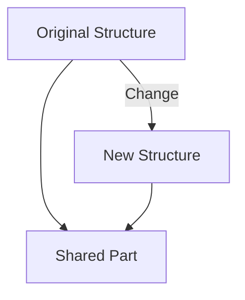
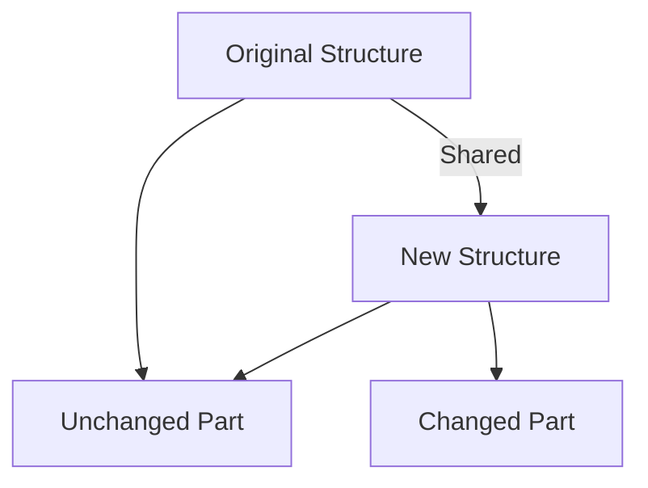

## 5.2.3 Structural Sharing and Performance

In this section, we delve into the concept of structural sharing in Clojure, a key feature that enables efficient memory usage and performance in immutable data structures. As Java developers, you may be accustomed to mutable data structures where changes are made in place. Clojure, however, embraces immutability, which requires a different approach to managing data efficiently. Let's explore how Clojure achieves this through structural sharing.

### Understanding Structural Sharing

**Structural sharing** is a technique used in Clojure's persistent data structures to minimize memory usage and improve performance when creating new versions of data structures. Instead of copying the entire data structure when a change is made, Clojure shares parts of the structure that remain unchanged.

#### The Concept of Persistent Data Structures

Persistent data structures are immutable data structures that preserve the previous version of themselves when modified. This is achieved through structural sharing, which allows for efficient updates without duplicating the entire structure.

**Diagram: Persistent Data Structure with Structural Sharing**



*Caption: This diagram illustrates how a new structure shares parts of the original structure, minimizing memory usage.*

### How Structural Sharing Works

When a data structure is updated, only the path to the changed element is copied. The rest of the structure remains shared between the old and new versions. This is particularly efficient for tree-like structures, such as lists and maps, where changes are localized.

#### Example: Updating a Vector

Consider a vector in Clojure. When you add an element, Clojure creates a new vector that shares most of its structure with the original vector.

```clojure
(def original-vector [1 2 3 4 5])

;; Adding an element to the vector
(def new-vector (conj original-vector 6))

;; original-vector remains unchanged
;; new-vector is [1 2 3 4 5 6]
```

**Java Comparison:**

In Java, adding an element to an `ArrayList` involves resizing and copying the entire array if the capacity is exceeded. This can be inefficient in terms of both time and space.

```java
import java.util.ArrayList;
import java.util.List;

List<Integer> originalList = new ArrayList<>(List.of(1, 2, 3, 4, 5));
originalList.add(6); // Modifies the original list
```

### Performance Benefits of Structural Sharing

Structural sharing provides several performance benefits:

1. **Reduced Memory Usage**: By sharing unchanged parts of data structures, Clojure minimizes memory overhead.
2. **Efficient Updates**: Only the modified parts of the structure are copied, leading to faster updates.
3. **Immutable by Default**: Immutability simplifies reasoning about code, as data structures do not change unexpectedly.

#### Performance Considerations

While structural sharing is efficient, it's important to understand the trade-offs. For example, accessing elements in a persistent vector may be slightly slower than in a Java array due to the additional indirection.

**Diagram: Memory Efficiency with Structural Sharing**



*Caption: Memory efficiency is achieved by sharing unchanged parts between structures.*

### Practical Implications for Java Developers

As Java developers, transitioning to Clojure's immutable data structures requires a shift in mindset. Here are some practical implications:

- **Avoid In-Place Modifications**: Embrace immutability by creating new versions of data structures rather than modifying them in place.
- **Leverage Persistent Data Structures**: Use Clojure's built-in persistent data structures to take advantage of structural sharing.
- **Optimize for Readability and Maintainability**: Immutability leads to more predictable and maintainable code.

### Try It Yourself: Experiment with Structural Sharing

To better understand structural sharing, try modifying the following code examples:

1. **Add Elements to a Vector**: Experiment with adding elements to a vector and observe how the original vector remains unchanged.
2. **Compare with Java**: Implement a similar operation in Java using `ArrayList` and compare the memory usage and performance.

### Exercises

1. **Implement a Persistent Stack**: Create a simple persistent stack using Clojure's list data structure. Implement push and pop operations that demonstrate structural sharing.
2. **Analyze Memory Usage**: Use a memory profiler to compare the memory usage of Clojure's persistent data structures with Java's mutable collections.

### Key Takeaways

- **Structural Sharing**: Clojure's use of structural sharing allows for efficient memory usage and performance in immutable data structures.
- **Immutability**: Embracing immutability simplifies code reasoning and enhances maintainability.
- **Performance Trade-offs**: While structural sharing is efficient, be aware of potential performance trade-offs compared to mutable structures.

### Further Reading

For more information on structural sharing and persistent data structures, check out the following resources:

- [Clojure Documentation on Persistent Data Structures](https://clojure.org/reference/data_structures)
- [ClojureDocs: Persistent Data Structures](https://clojuredocs.org/)
- [GitHub Repository: Clojure Source Code](https://github.com/clojure/clojure)

Now that we've explored how structural sharing optimizes memory and performance in Clojure, let's apply these concepts to manage state effectively in your applications.

## Quiz: Understanding Structural Sharing in Clojure



### What is structural sharing?

- [x] A technique to share unchanged parts of data structures between versions
- [ ] A method to copy entire data structures on updates
- [ ] A way to modify data structures in place
- [ ] A process to convert mutable structures to immutable ones

> **Explanation:** Structural sharing allows Clojure to share unchanged parts of data structures, minimizing memory usage and improving performance.

### How does Clojure handle updates to persistent data structures?

- [x] By copying only the path to the changed element
- [ ] By copying the entire data structure
- [ ] By modifying the original data structure in place
- [ ] By creating a completely new data structure without sharing

> **Explanation:** Clojure copies only the path to the changed element, sharing the rest of the structure to optimize memory usage.

### What is a benefit of structural sharing?

- [x] Reduced memory usage
- [ ] Increased memory usage
- [ ] Slower updates
- [ ] In-place modifications

> **Explanation:** Structural sharing reduces memory usage by sharing unchanged parts of data structures.

### How does structural sharing impact performance?

- [x] It improves performance by minimizing memory overhead
- [ ] It decreases performance due to increased memory usage
- [ ] It has no impact on performance
- [ ] It makes updates slower

> **Explanation:** Structural sharing improves performance by minimizing memory overhead and making updates efficient.

### What is a trade-off of using structural sharing?

- [x] Slightly slower access times due to additional indirection
- [ ] Increased memory usage
- [ ] In-place modifications
- [ ] No trade-offs

> **Explanation:** Access times may be slightly slower due to additional indirection, but the memory efficiency outweighs this trade-off.

### How does Clojure's approach to immutability differ from Java's?

- [x] Clojure uses persistent data structures with structural sharing
- [ ] Clojure modifies data structures in place
- [ ] Java uses structural sharing for immutability
- [ ] Java's data structures are immutable by default

> **Explanation:** Clojure uses persistent data structures with structural sharing, while Java typically uses mutable structures.

### What is a persistent data structure?

- [x] An immutable data structure that preserves previous versions
- [ ] A mutable data structure that changes in place
- [ ] A data structure that cannot be modified
- [ ] A structure that is always copied entirely on updates

> **Explanation:** Persistent data structures are immutable and preserve previous versions through structural sharing.

### What is a practical implication of structural sharing for Java developers?

- [x] Avoid in-place modifications and embrace immutability
- [ ] Modify data structures in place for efficiency
- [ ] Use mutable data structures for better performance
- [ ] Avoid using persistent data structures

> **Explanation:** Java developers should avoid in-place modifications and embrace immutability to leverage structural sharing.

### How can you experiment with structural sharing in Clojure?

- [x] By adding elements to a vector and observing the unchanged original
- [ ] By modifying data structures in place
- [ ] By copying entire data structures on updates
- [ ] By converting immutable structures to mutable ones

> **Explanation:** Experiment by adding elements to a vector and observing how the original remains unchanged due to structural sharing.

### True or False: Structural sharing allows for efficient memory usage in Clojure.

- [x] True
- [ ] False

> **Explanation:** True. Structural sharing allows Clojure to efficiently use memory by sharing unchanged parts of data structures.


