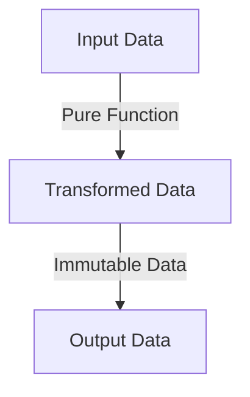

## 5.3.1 Simplified Reasoning

In the realm of software development, understanding and predicting code behavior is paramount. As experienced Java developers, you are familiar with the challenges posed by mutable state and side effects. Clojure, with its emphasis on pure functions and immutability, offers a paradigm shift that simplifies reasoning about code. In this section, we will explore how these concepts enhance code predictability and reduce complexity, making it easier to maintain and extend software systems.

### Understanding Pure Functions

**Pure functions** are the cornerstone of functional programming. A pure function is one that, given the same input, will always produce the same output and has no side effects. This characteristic makes them highly predictable and easy to reason about.

#### Characteristics of Pure Functions

1. **Deterministic Output**: The output of a pure function is determined solely by its input values. There are no hidden dependencies or state changes that can affect the result.

2. **No Side Effects**: Pure functions do not alter any external state. They do not modify variables, write to disk, or interact with external systems.

3. **Referential Transparency**: Pure functions can be replaced with their output value without changing the program's behavior. This property is known as referential transparency.

#### Example of a Pure Function in Clojure

Let's consider a simple example of a pure function in Clojure:

```clojure
(defn add [x y]
  (+ x y))
```

- **Deterministic Output**: Calling `(add 2 3)` will always return `5`.
- **No Side Effects**: The function does not modify any external state or perform any I/O operations.

#### Comparing with Java

In Java, achieving pure functions requires discipline, as the language itself does not enforce immutability or side-effect-free functions. Consider the following Java method:

```java
public int add(int x, int y) {
    return x + y;
}
```

While this method is pure, Java developers must be cautious to avoid introducing side effects, especially when dealing with mutable objects or shared state.

### The Role of Immutability

**Immutability** is another key concept that simplifies reasoning about code. In Clojure, data structures are immutable by default, meaning once created, they cannot be changed. This immutability ensures that data remains consistent and predictable throughout the program's execution.

#### Benefits of Immutability

1. **Thread Safety**: Immutable data structures are inherently thread-safe, as they cannot be modified by concurrent threads.

2. **Simplified Debugging**: With immutable data, developers can be confident that data will not change unexpectedly, reducing the complexity of debugging.

3. **Ease of Understanding**: Immutability eliminates the need to track changes to data over time, making it easier to understand the flow of data through a program.

#### Example of Immutability in Clojure

Consider the following Clojure code that demonstrates immutability:

```clojure
(def my-list [1 2 3])

(def new-list (conj my-list 4))

;; my-list remains unchanged
;; new-list is [1 2 3 4]
```

- **Immutable Data**: `my-list` remains unchanged after the `conj` operation.
- **New Data Structure**: `new-list` is a new data structure with the added element.

#### Comparing with Java

In Java, immutability can be achieved using final variables and immutable classes, such as those provided by the `java.util.Collections` framework. However, developers must explicitly design their classes to be immutable, which can be cumbersome.

```java
List<Integer> myList = Arrays.asList(1, 2, 3);
List<Integer> newList = new ArrayList<>(myList);
newList.add(4);

// myList remains unchanged
// newList is [1, 2, 3, 4]
```

### Simplified Reasoning with Pure Functions and Immutability

The combination of pure functions and immutability in Clojure leads to simplified reasoning about code. Let's explore how these concepts work together to enhance code predictability and maintainability.

#### Predictable Code Behavior

With pure functions and immutability, the behavior of code becomes predictable. Developers can confidently reason about the output of functions without worrying about hidden state changes or side effects.

**Example:**

Consider a function that calculates the total price of items in a shopping cart:

```clojure
(defn total-price [cart]
  (reduce + (map :price cart)))
```

- **Predictable Output**: The function's output depends solely on the input `cart`.
- **No Side Effects**: The function does not modify the `cart` or any external state.

#### Simplified Debugging and Testing

Pure functions and immutability make debugging and testing more straightforward. Since functions do not depend on external state, tests can focus on input-output relationships.

**Example:**

Testing the `total-price` function:

```clojure
(deftest test-total-price
  (is (= 30 (total-price [{:price 10} {:price 20}]))))
```

- **Focused Tests**: Tests can focus on verifying the function's output for given inputs.
- **No Mocking Required**: There is no need to mock external dependencies or state.

#### Enhanced Code Maintainability

Code that is easy to reason about is also easier to maintain. Developers can make changes with confidence, knowing that the impact of changes is localized and predictable.

**Example:**

Refactoring the `total-price` function to apply a discount:

```clojure
(defn total-price-with-discount [cart discount]
  (* (total-price cart) (- 1 discount)))
```

- **Localized Changes**: The refactoring affects only the `total-price-with-discount` function.
- **Predictable Behavior**: The behavior of `total-price` remains unchanged.

### Visualizing Data Flow and Immutability

To further illustrate the benefits of pure functions and immutability, let's visualize the flow of data through a Clojure program using a Mermaid.js diagram.



**Diagram Explanation:**

- **Input Data**: Represents the initial data passed to a pure function.
- **Transformed Data**: The result of applying the pure function to the input data.
- **Immutable Data**: The transformed data remains unchanged, ensuring consistency and predictability.

### Try It Yourself: Experimenting with Pure Functions and Immutability

To deepen your understanding of pure functions and immutability, try modifying the following Clojure code examples:

1. **Modify the `add` function** to perform subtraction instead. Observe how the function's behavior changes predictably based on its input.

2. **Experiment with the `total-price` function** by adding a tax calculation. Ensure that the function remains pure and does not modify the input `cart`.

3. **Create a new immutable data structure** using `conj`, `assoc`, or `dissoc`. Observe how the original data structure remains unchanged.

### Exercises and Practice Problems

1. **Exercise 1**: Write a pure function in Clojure that calculates the factorial of a number. Ensure that the function is deterministic and has no side effects.

2. **Exercise 2**: Refactor a Java method that modifies a global variable to use a pure function in Clojure. Compare the predictability and maintainability of the two approaches.

3. **Exercise 3**: Implement a Clojure function that takes a list of numbers and returns a new list with each number squared. Ensure that the original list remains unchanged.

### Key Takeaways

- **Pure Functions**: Functions that are deterministic and have no side effects, making them easy to reason about.
- **Immutability**: Data structures that cannot be changed, ensuring consistency and predictability.
- **Simplified Reasoning**: The combination of pure functions and immutability leads to predictable code behavior, simplified debugging, and enhanced maintainability.
- **Practical Application**: By applying these concepts, developers can create software that is easier to understand, test, and maintain.

Now that we've explored how pure functions and immutability simplify reasoning about code, let's apply these concepts to manage state effectively in your applications. By embracing these principles, you'll be well-equipped to tackle complex software challenges with confidence.

For further reading, consider exploring the [Official Clojure Documentation](https://clojure.org/reference/documentation) and [ClojureDocs](https://clojuredocs.org/), which provide in-depth insights into Clojure's functional programming paradigm.

---

## Quiz: Understanding Simplified Reasoning with Pure Functions and Immutability



### What is a key characteristic of pure functions?

- [x] They produce the same output for the same input.
- [ ] They modify external state.
- [ ] They depend on global variables.
- [ ] They perform I/O operations.

> **Explanation:** Pure functions are deterministic, meaning they produce the same output for the same input and do not modify external state.

### How does immutability contribute to thread safety?

- [x] Immutable data cannot be changed by concurrent threads.
- [ ] Immutable data requires locks for access.
- [ ] Immutable data is stored in a single thread.
- [ ] Immutable data is always read-only.

> **Explanation:** Immutability ensures that data cannot be changed, making it inherently thread-safe as concurrent threads cannot modify it.

### What is referential transparency?

- [x] The ability to replace a function call with its output value without changing program behavior.
- [ ] The ability to modify a function's input values.
- [ ] The ability to perform side effects within a function.
- [ ] The ability to use global variables within a function.

> **Explanation:** Referential transparency allows a function call to be replaced with its output value, ensuring consistent behavior.

### Why is debugging easier with pure functions?

- [x] They have no side effects, so tests focus on input-output relationships.
- [ ] They modify global variables, making state tracking easier.
- [ ] They perform I/O operations, simplifying error tracing.
- [ ] They depend on external state, reducing test complexity.

> **Explanation:** Pure functions have no side effects, allowing tests to focus solely on input-output relationships, simplifying debugging.

### What is a benefit of using immutable data structures?

- [x] They ensure data consistency and predictability.
- [ ] They allow for easy modification of data.
- [ ] They require complex locking mechanisms.
- [ ] They depend on external state changes.

> **Explanation:** Immutable data structures ensure consistency and predictability, as they cannot be modified once created.

### How can pure functions enhance code maintainability?

- [x] By localizing changes and ensuring predictable behavior.
- [ ] By allowing global state modifications.
- [ ] By performing side effects within functions.
- [ ] By depending on external systems.

> **Explanation:** Pure functions enhance maintainability by localizing changes and ensuring predictable behavior, reducing the risk of unintended side effects.

### What is a common challenge when using mutable data in Java?

- [x] Tracking changes to data over time.
- [ ] Ensuring data is read-only.
- [ ] Performing operations without side effects.
- [ ] Using immutable collections.

> **Explanation:** Mutable data requires tracking changes over time, which can complicate reasoning about code behavior.

### How does Clojure enforce immutability?

- [x] By making data structures immutable by default.
- [ ] By requiring explicit locks for data access.
- [ ] By allowing global variable modifications.
- [ ] By using mutable collections.

> **Explanation:** Clojure enforces immutability by making data structures immutable by default, ensuring consistent and predictable behavior.

### What is a practical application of pure functions?

- [x] Calculating the total price of items in a shopping cart.
- [ ] Modifying global variables.
- [ ] Performing I/O operations.
- [ ] Accessing external systems.

> **Explanation:** Pure functions are ideal for calculations like the total price of items, as they depend solely on input values and have no side effects.

### True or False: Immutability eliminates the need for complex locking mechanisms in concurrent programming.

- [x] True
- [ ] False

> **Explanation:** Immutability eliminates the need for complex locking mechanisms, as data cannot be changed by concurrent threads, ensuring thread safety.


