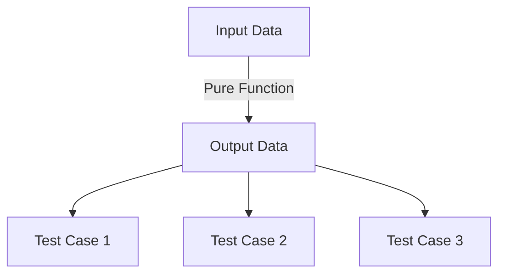

## 5.3.2 Enhanced Testability

As experienced Java developers, you're likely familiar with the challenges of testing code that relies heavily on mutable state and side effects. In contrast, Clojure's emphasis on pure functions and immutability offers a paradigm that inherently enhances testability. In this section, we'll explore how these concepts simplify the testing process, making unit tests more straightforward to write and maintain.

### Understanding Pure Functions

**Pure functions** are a cornerstone of functional programming. A function is considered pure if it meets two criteria:

1. **Deterministic**: Given the same input, a pure function will always produce the same output.
2. **No Side Effects**: Pure functions do not alter any state outside their scope or interact with the outside world (e.g., no I/O operations).

#### Benefits of Pure Functions in Testing

- **Predictability**: Since pure functions always produce the same output for the same input, they are inherently predictable, making it easier to write tests.
- **Isolation**: Pure functions do not depend on or modify external state, eliminating the need for complex setup or teardown procedures in tests.
- **Composability**: Pure functions can be composed together to form more complex operations, which can be tested independently and in combination.

### Immutability and Its Role in Testability

**Immutability** ensures that data structures cannot be modified after they are created. This characteristic is crucial for maintaining consistency and predictability in your code.

#### Advantages of Immutability in Testing

- **State Consistency**: With immutable data, you can be confident that the state remains consistent throughout the execution of your tests.
- **Simplified State Management**: Since data cannot change unexpectedly, you don't need to account for state changes in your tests.
- **Concurrency Safety**: Immutability eliminates race conditions, making concurrent code easier to test.

### Comparing Clojure and Java: Testing Paradigms

In Java, testing often involves dealing with mutable objects and side effects, which can complicate the testing process. Let's compare how testing differs between Java and Clojure:

#### Java Example: Testing with Mutable State

```java
public class Counter {
    private int count = 0;

    public void increment() {
        count++;
    }

    public int getCount() {
        return count;
    }
}

// Test Case
@Test
public void testIncrement() {
    Counter counter = new Counter();
    counter.increment();
    assertEquals(1, counter.getCount());
}
```

In this Java example, the `Counter` class maintains mutable state. Testing requires ensuring that the state is correctly initialized and modified.

#### Clojure Example: Testing with Immutability

```clojure
(defn increment [count]
  (inc count))

;; Test Case
(deftest test-increment
  (is (= 1 (increment 0))))
```

In Clojure, the `increment` function is pure and operates on immutable data. The test is straightforward, focusing solely on the function's input and output.

### Writing Effective Tests in Clojure

Clojure's `clojure.test` library provides a simple and effective way to write tests for your functions. Let's explore how to leverage this library to test pure functions and immutable data structures.

#### Basic Test Structure

```clojure
(ns myapp.core-test
  (:require [clojure.test :refer :all]
            [myapp.core :refer :all]))

(deftest my-function-test
  (testing "Description of the test"
    (is (= expected-value (my-function input)))))
```

- **`deftest`**: Defines a test case.
- **`testing`**: Provides a description for the test.
- **`is`**: Asserts that the expression evaluates to true.

#### Testing Higher-Order Functions

Higher-order functions, which take other functions as arguments or return them, are a powerful feature in Clojure. Testing these functions involves verifying their behavior with various input functions.

```clojure
(defn apply-twice [f x]
  (f (f x)))

(deftest test-apply-twice
  (testing "Applying a function twice"
    (is (= 4 (apply-twice inc 2)))
    (is (= 9 (apply-twice #(* % %) 3)))))
```

### Handling Side Effects in Tests

While pure functions are ideal for testing, real-world applications often involve side effects. Clojure provides mechanisms to manage and test side effects effectively.

#### Using `with-redefs` for Mocking

`with-redefs` allows you to temporarily redefine functions within a specific scope, making it useful for mocking side effects in tests.

```clojure
(defn fetch-data []
  ;; Simulate fetching data from an external source
  {:data "real data"})

(deftest test-fetch-data
  (with-redefs [fetch-data (fn [] {:data "mock data"})]
    (is (= {:data "mock data"} (fetch-data)))))
```

### Encouraging Best Practices in Testing

To maximize the benefits of Clojure's testability features, consider the following best practices:

- **Keep Functions Pure**: Strive to write pure functions wherever possible, isolating side effects to specific areas of your code.
- **Use Immutability**: Leverage immutable data structures to maintain consistency and predictability in your tests.
- **Write Comprehensive Tests**: Cover a wide range of inputs and edge cases to ensure your functions behave as expected.
- **Leverage Clojure's Testing Tools**: Utilize libraries like `clojure.test` and `test.check` for property-based testing to enhance your test coverage.

### Try It Yourself: Experimenting with Testability

Now that we've explored how pure functions and immutability enhance testability in Clojure, let's put these concepts into practice. Try modifying the following code examples to deepen your understanding:

1. **Create a Pure Function**: Write a pure function that calculates the factorial of a number and test it using `clojure.test`.
2. **Mock a Side Effect**: Use `with-redefs` to mock a function that performs I/O operations, such as reading from a file or making an HTTP request.
3. **Test a Higher-Order Function**: Implement a higher-order function that applies a given function to each element in a collection and test it with different input functions.

### Visualizing Testability in Clojure

To further illustrate the concepts of pure functions and immutability, let's use a diagram to visualize the flow of data through a pure function and how it enhances testability.



**Diagram Description**: This flowchart represents how input data is processed by a pure function to produce output data, which is then used in multiple test cases. The predictability of pure functions ensures consistent results across tests.

### Further Reading and Resources

To deepen your understanding of Clojure's testability features, consider exploring the following resources:

- [Official Clojure Documentation](https://clojure.org/reference/documentation)
- [ClojureDocs](https://clojuredocs.org/)
- [Clojure Testing with clojure.test](https://clojure.github.io/clojure/clojure.test-api.html)
- [Property-Based Testing with test.check](https://github.com/clojure/test.check)

### Exercises and Practice Problems

1. **Exercise 1**: Write a pure function that reverses a string and test it with various inputs.
2. **Exercise 2**: Implement a function that filters even numbers from a list and test it using `clojure.test`.
3. **Exercise 3**: Create a higher-order function that applies a transformation to each element in a vector and test it with different transformations.

### Key Takeaways

- **Pure Functions**: Enhance testability by being deterministic and free of side effects.
- **Immutability**: Ensures state consistency and simplifies testing by eliminating unexpected changes.
- **Clojure's Testing Tools**: Provide powerful mechanisms for writing and maintaining tests.
- **Best Practices**: Encourage writing pure functions, using immutability, and leveraging Clojure's testing libraries for effective test coverage.

By embracing these principles, you'll find that testing in Clojure becomes a more straightforward and rewarding process, allowing you to focus on delivering high-quality, reliable code.

## Quiz: Test Your Understanding of Enhanced Testability in Clojure



### What is a key characteristic of pure functions?

- [x] They always produce the same output for the same input.
- [ ] They can modify global state.
- [ ] They rely on external data sources.
- [ ] They perform I/O operations.

> **Explanation:** Pure functions are deterministic, meaning they always produce the same output for the same input, without side effects.

### Why is immutability beneficial for testing?

- [x] It ensures state consistency.
- [ ] It allows for dynamic state changes.
- [ ] It requires complex setup.
- [ ] It complicates concurrency.

> **Explanation:** Immutability ensures that data structures remain consistent, simplifying the testing process by eliminating unexpected state changes.

### How does Clojure's `with-redefs` help in testing?

- [x] It allows temporary redefinition of functions for mocking.
- [ ] It permanently changes function definitions.
- [ ] It is used for performance optimization.
- [ ] It enhances concurrency.

> **Explanation:** `with-redefs` is used to temporarily redefine functions within a specific scope, making it useful for mocking in tests.

### What is the primary advantage of testing pure functions?

- [x] They are predictable and easy to test.
- [ ] They require complex setup.
- [ ] They depend on external state.
- [ ] They are difficult to compose.

> **Explanation:** Pure functions are predictable and easy to test because they do not depend on external state or have side effects.

### Which Clojure library is commonly used for unit testing?

- [x] clojure.test
- [ ] test.check
- [ ] core.async
- [ ] clojure.java.jdbc

> **Explanation:** `clojure.test` is the standard library for unit testing in Clojure.

### What is a higher-order function?

- [x] A function that takes other functions as arguments or returns them.
- [ ] A function that modifies global state.
- [ ] A function that performs I/O operations.
- [ ] A function that is only used for testing.

> **Explanation:** Higher-order functions take other functions as arguments or return them, allowing for greater flexibility and composability.

### How does immutability affect concurrency?

- [x] It eliminates race conditions.
- [ ] It complicates state management.
- [ ] It requires locks for safety.
- [ ] It increases the risk of deadlocks.

> **Explanation:** Immutability eliminates race conditions by ensuring that data cannot be changed unexpectedly, simplifying concurrency.

### What is the role of `deftest` in Clojure?

- [x] It defines a test case.
- [ ] It runs all tests.
- [ ] It mocks external dependencies.
- [ ] It measures performance.

> **Explanation:** `deftest` is used to define a test case in Clojure's `clojure.test` library.

### How can you mock a function in Clojure tests?

- [x] Using `with-redefs`
- [ ] Using `deftest`
- [ ] Using `core.async`
- [ ] Using `clojure.java.jdbc`

> **Explanation:** `with-redefs` allows you to temporarily redefine functions for mocking in tests.

### True or False: Pure functions can have side effects.

- [ ] True
- [x] False

> **Explanation:** Pure functions cannot have side effects; they are deterministic and do not alter external state.


