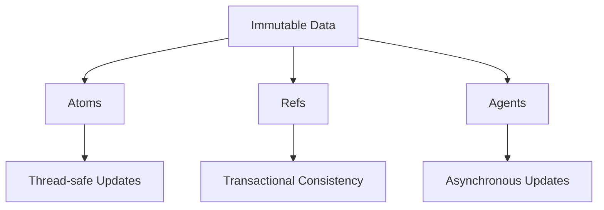

## 5.3.3 Improved Concurrency

In the realm of software development, concurrency is a critical aspect that allows applications to perform multiple tasks simultaneously. However, managing concurrency can be challenging, especially when dealing with shared mutable state, which often leads to race conditions and synchronization issues. In this section, we will explore how Clojure's emphasis on immutability and functional programming paradigms simplifies concurrent programming, making it easier to write thread-safe code. We will draw parallels with Java's concurrency model to highlight the advantages of Clojure's approach.

### Understanding Concurrency Challenges

Concurrency involves multiple computations happening at the same time, which can lead to complex interactions between threads. In traditional object-oriented programming languages like Java, concurrency is often managed using locks and synchronization mechanisms to control access to shared mutable state. This approach can be error-prone and difficult to reason about.

#### Race Conditions and Synchronization Issues

A **race condition** occurs when the behavior of a software system depends on the relative timing of events, such as the order in which threads execute. This can lead to unpredictable results and bugs that are difficult to reproduce and fix.

**Synchronization issues** arise when multiple threads attempt to access shared resources simultaneously, leading to inconsistent data states. Java developers often use `synchronized` blocks, locks, and other concurrency utilities to manage these issues, but these solutions can introduce complexity and performance bottlenecks.

### Clojure's Approach to Concurrency

Clojure addresses these challenges by embracing immutability and functional programming principles. In Clojure, data structures are immutable by default, meaning they cannot be modified after creation. This immutability eliminates the need for locks and synchronization when accessing shared data, as there is no risk of concurrent modifications.

#### Immutability and Thread Safety

Immutability is a cornerstone of Clojure's design, providing several benefits for concurrent programming:

- **No Shared Mutable State**: Since data structures are immutable, there is no need to worry about one thread modifying data that another thread is reading. This eliminates a major source of concurrency bugs.
- **Simplified Reasoning**: With immutable data, you can reason about your program's behavior without considering the complex interactions between threads.
- **Safe Sharing**: Immutable data can be freely shared between threads without the risk of data corruption.

Let's look at a simple example to illustrate these concepts:

```clojure
;; Define an immutable vector
(def my-vector [1 2 3 4 5])

;; Function to add an element to the vector
(defn add-element [vec element]
  (conj vec element))

;; Add an element to the vector
(def new-vector (add-element my-vector 6))

;; Print the original and new vectors
(println "Original vector:" my-vector)  ; Output: [1 2 3 4 5]
(println "New vector:" new-vector)      ; Output: [1 2 3 4 5 6]
```

In this example, `my-vector` remains unchanged after adding an element, demonstrating how immutability ensures thread safety.

### Concurrency Primitives in Clojure

Clojure provides several concurrency primitives that leverage immutability to simplify concurrent programming:

#### Atoms

**Atoms** are used for managing shared, synchronous, and independent state. They provide a way to manage state changes safely without locks.

```clojure
;; Create an atom with an initial value
(def my-atom (atom 0))

;; Function to increment the atom's value
(defn increment-atom []
  (swap! my-atom inc))

;; Increment the atom in multiple threads
(dotimes [_ 10]
  (future (increment-atom)))

;; Print the atom's value
(println "Atom value:" @my-atom)
```

In this example, `swap!` is used to update the atom's value atomically, ensuring thread safety.

#### Refs and Software Transactional Memory (STM)

**Refs** are used for coordinated, synchronous updates to shared state. They leverage Software Transactional Memory (STM) to ensure consistency.

```clojure
;; Create refs for bank accounts
(def account-a (ref 100))
(def account-b (ref 200))

;; Function to transfer money between accounts
(defn transfer [from to amount]
  (dosync
    (alter from - amount)
    (alter to + amount)))

;; Transfer money in a transaction
(transfer account-a account-b 50)

;; Print account balances
(println "Account A:" @account-a)  ; Output: 50
(println "Account B:" @account-b)  ; Output: 250
```

The `dosync` block ensures that the operations on refs are atomic and consistent.

#### Agents

**Agents** are used for managing asynchronous state changes. They allow you to perform updates in the background without blocking the main thread.

```clojure
;; Create an agent with an initial value
(def my-agent (agent 0))

;; Function to increment the agent's value
(defn increment-agent [value]
  (send my-agent + value))

;; Increment the agent asynchronously
(increment-agent 5)

;; Print the agent's value
(println "Agent value:" @my-agent)
```

Agents provide a simple way to handle asynchronous updates without explicit locking.

### Comparing Clojure and Java Concurrency

Let's compare Clojure's concurrency model with Java's traditional approach:

| Feature               | Java                                      | Clojure                                   |
|-----------------------|-------------------------------------------|-------------------------------------------|
| **State Management**  | Shared mutable state                      | Immutable data structures                 |
| **Concurrency Control** | Locks, synchronized blocks               | Atoms, refs, agents                       |
| **Thread Safety**     | Requires explicit synchronization         | Thread-safe by default                    |
| **Complexity**        | High due to manual synchronization        | Low due to immutability                   |

#### Java Example: Synchronized Counter

```java
public class Counter {
    private int count = 0;

    public synchronized void increment() {
        count++;
    }

    public synchronized int getCount() {
        return count;
    }
}
```

In this Java example, synchronization is required to ensure thread safety, adding complexity to the code.

### Try It Yourself

Experiment with the following Clojure code to understand concurrency primitives better:

1. Modify the `increment-atom` function to decrement the atom's value instead.
2. Create a new ref and perform multiple transactions to simulate a simple banking system.
3. Use agents to perform asynchronous updates on a collection of data.

### Visualizing Concurrency Models

Below is a diagram illustrating the flow of data through Clojure's concurrency primitives:



**Diagram Caption**: This diagram shows how Clojure's concurrency primitives (atoms, refs, agents) interact with immutable data to provide thread-safe, consistent, and asynchronous updates.

### Further Reading

For more information on Clojure's concurrency model, consider exploring the following resources:

- [Official Clojure Documentation](https://clojure.org/reference/concurrency)
- [ClojureDocs - Concurrency](https://clojuredocs.org/quickref#concurrency)
- [GitHub - Clojure Concurrency Examples](https://github.com/clojure-examples/concurrency)

### Exercises

1. **Implement a Thread-safe Counter**: Use Clojure's atoms to implement a thread-safe counter that can be incremented and decremented by multiple threads.
2. **Simulate a Banking System**: Create a simple banking system using refs to manage account balances and perform transactions.
3. **Asynchronous Data Processing**: Use agents to process a collection of data asynchronously, ensuring that updates do not block the main thread.

### Key Takeaways

- Clojure's immutability simplifies concurrent programming by eliminating shared mutable state.
- Concurrency primitives like atoms, refs, and agents provide thread-safe, consistent, and asynchronous state management.
- Clojure's approach reduces complexity and improves code readability compared to traditional Java concurrency models.

Now that we've explored how immutability and concurrency primitives work in Clojure, let's apply these concepts to manage state effectively in your applications.

## Quiz: Test Your Understanding of Improved Concurrency in Clojure



### Which Clojure primitive is used for managing synchronous, independent state changes?

- [x] Atoms
- [ ] Refs
- [ ] Agents
- [ ] Vars

> **Explanation:** Atoms are used for managing synchronous, independent state changes in Clojure.

### What is the primary advantage of immutability in concurrent programming?

- [x] Eliminates the need for locks and synchronization
- [ ] Increases memory usage
- [ ] Requires more complex code
- [ ] Slows down execution

> **Explanation:** Immutability eliminates the need for locks and synchronization, simplifying concurrent programming.

### How does Clojure ensure consistency when using refs?

- [ ] By using locks
- [x] Through Software Transactional Memory (STM)
- [ ] By using agents
- [ ] By using synchronized blocks

> **Explanation:** Clojure uses Software Transactional Memory (STM) to ensure consistency when using refs.

### Which Clojure primitive is best suited for asynchronous state changes?

- [ ] Atoms
- [ ] Refs
- [x] Agents
- [ ] Vars

> **Explanation:** Agents are best suited for managing asynchronous state changes in Clojure.

### What is a race condition?

- [x] A situation where the behavior of a system depends on the timing of events
- [ ] A method of optimizing code execution
- [ ] A type of data structure
- [ ] A concurrency primitive in Clojure

> **Explanation:** A race condition occurs when the behavior of a system depends on the timing of events, leading to unpredictable results.

### How do you update the value of an atom in Clojure?

- [x] Using the `swap!` function
- [ ] Using the `alter` function
- [ ] Using the `send` function
- [ ] Using the `reset!` function

> **Explanation:** The `swap!` function is used to update the value of an atom in Clojure.

### What is the purpose of the `dosync` block in Clojure?

- [ ] To manage asynchronous updates
- [x] To ensure atomic transactions with refs
- [ ] To create immutable data structures
- [ ] To define functions

> **Explanation:** The `dosync` block is used to ensure atomic transactions when working with refs in Clojure.

### Which concurrency primitive would you use for coordinated state changes?

- [ ] Atoms
- [x] Refs
- [ ] Agents
- [ ] Vars

> **Explanation:** Refs are used for coordinated state changes in Clojure, leveraging STM for consistency.

### What is the main benefit of using agents in Clojure?

- [ ] They provide synchronous updates
- [x] They allow for asynchronous updates without blocking
- [ ] They require explicit locking
- [ ] They are used for transactional consistency

> **Explanation:** Agents allow for asynchronous updates without blocking the main thread, making them ideal for background processing.

### True or False: Immutability in Clojure increases the risk of race conditions.

- [ ] True
- [x] False

> **Explanation:** False. Immutability in Clojure reduces the risk of race conditions by eliminating shared mutable state.


