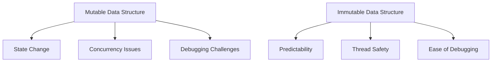

## 5.4.1 Mutable Data Structures in Java

In this section, we delve into the world of mutable data structures in Java, a concept that is deeply ingrained in the language's design. Understanding these structures is crucial for Java developers transitioning to Clojure, where immutability is a core principle. We'll explore the characteristics of mutable data structures, the challenges they present, especially in concurrent programming, and how Clojure's immutable approach offers solutions.

### Introduction to Mutable Data Structures

Java, as an object-oriented language, provides a variety of data structures that are mutable by default. This means that once a data structure is created, its contents can be changed. Common examples include `ArrayList`, `HashMap`, and `HashSet`. These structures allow developers to modify data in place, which can be convenient but also introduces potential pitfalls.

### Characteristics of Mutable Data Structures

Mutable data structures in Java have several defining characteristics:

1. **In-Place Modification**: Elements within the structure can be added, removed, or altered without creating a new instance of the structure.
2. **State Changes**: The state of the data structure can change over time, which can lead to unexpected behavior if not managed carefully.
3. **Concurrency Challenges**: In a multi-threaded environment, mutable data structures can lead to race conditions and require synchronization mechanisms to ensure thread safety.

Let's examine these characteristics through code examples.

### Code Example: Mutable `ArrayList`

```java
import java.util.ArrayList;

public class MutableArrayListExample {
    public static void main(String[] args) {
        ArrayList<String> list = new ArrayList<>();
        list.add("Java");
        list.add("Clojure");
        
        // Modifying the list
        list.set(1, "Scala");
        list.remove("Java");
        
        // Printing the modified list
        System.out.println(list); // Output: [Scala]
    }
}
```

**Explanation**: In this example, we create an `ArrayList` and modify its contents. The `set` method changes an existing element, and `remove` deletes an element. These operations alter the list's state in place.

### Potential Problems with Mutable Data Structures

While mutable data structures offer flexibility, they also come with significant drawbacks:

- **Unexpected State Changes**: Since the state can change at any time, it can be difficult to track changes, leading to bugs.
- **Difficulty in Debugging**: Debugging issues related to state changes can be challenging, as the source of the change might not be immediately apparent.
- **Concurrency Issues**: In concurrent applications, mutable data structures require careful synchronization to prevent race conditions.

### Concurrency Challenges

Consider a scenario where multiple threads access and modify a shared `ArrayList`. Without proper synchronization, this can lead to inconsistent states.

```java
import java.util.ArrayList;
import java.util.Collections;
import java.util.List;

public class ConcurrentModificationExample {
    public static void main(String[] args) {
        List<String> list = Collections.synchronizedList(new ArrayList<>());
        
        // Multiple threads modifying the list
        Thread t1 = new Thread(() -> {
            for (int i = 0; i < 1000; i++) {
                list.add("Thread1");
            }
        });

        Thread t2 = new Thread(() -> {
            for (int i = 0; i < 1000; i++) {
                list.add("Thread2");
            }
        });

        t1.start();
        t2.start();

        // Wait for threads to finish
        try {
            t1.join();
            t2.join();
        } catch (InterruptedException e) {
            e.printStackTrace();
        }

        // Print the size of the list
        System.out.println("List size: " + list.size());
    }
}
```

**Explanation**: This example uses `Collections.synchronizedList` to make the `ArrayList` thread-safe. However, synchronization can lead to performance bottlenecks and complexity in code management.

### Clojure's Immutable Approach

Clojure, in contrast to Java, emphasizes immutability. This means that once a data structure is created, it cannot be changed. Instead, operations on data structures return new structures, preserving the original.

### Code Example: Immutable Data Structures in Clojure

```clojure
(def my-list ["Java" "Clojure"])

;; Creating a new list with modifications
(def new-list (conj (vec (rest my-list)) "Scala"))

;; Printing the original and new list
(println "Original list:" my-list)  ;; Output: ["Java" "Clojure"]
(println "New list:" new-list)      ;; Output: ["Clojure" "Scala"]
```

**Explanation**: In this Clojure example, we use `conj` to add an element to a vector, creating a new vector. The original list remains unchanged, demonstrating immutability.

### Advantages of Immutability

Immutability offers several advantages over mutable data structures:

- **Predictability**: Since data structures do not change, the code is more predictable and easier to reason about.
- **Thread Safety**: Immutable data structures are inherently thread-safe, eliminating the need for synchronization.
- **Ease of Debugging**: With immutable structures, the state is consistent, making debugging simpler.

### Visualizing Mutable vs. Immutable Data Structures

Below is a diagram illustrating the difference between mutable and immutable data structures.



**Diagram Explanation**: This diagram highlights the challenges associated with mutable data structures and the benefits of immutability.

### Try It Yourself

Experiment with the Java and Clojure examples provided. Try modifying the Java example to add synchronization and see how it affects performance. In the Clojure example, explore adding more elements to the list and observe how immutability is maintained.

### Further Reading

For more on Java's concurrency mechanisms, refer to the [Java Concurrency Documentation](https://docs.oracle.com/javase/tutorial/essential/concurrency/). To dive deeper into Clojure's immutable data structures, visit the [Official Clojure Documentation](https://clojure.org/reference/data_structures).

### Exercises

1. Modify the Java `ArrayList` example to handle concurrent modifications without using `Collections.synchronizedList`. What challenges do you encounter?
2. Implement a Clojure function that performs a series of transformations on a list. Ensure that the original list remains unchanged.
3. Compare the performance of a synchronized `ArrayList` in Java with an immutable list in Clojure in a multi-threaded environment.

### Key Takeaways

- **Mutable data structures in Java** allow for in-place modifications but can lead to challenges in concurrency and debugging.
- **Clojure's immutable approach** offers predictability, thread safety, and ease of debugging.
- Understanding the differences between mutable and immutable data structures is crucial for Java developers transitioning to Clojure.

Now that we've explored how mutable data structures work in Java, let's apply these concepts to manage state effectively in your applications.

## Quiz: Understanding Mutable Data Structures in Java



### What is a characteristic of mutable data structures in Java?

- [x] They allow in-place modification of data.
- [ ] They are inherently thread-safe.
- [ ] They cannot change once created.
- [ ] They are always synchronized.

> **Explanation:** Mutable data structures in Java allow in-place modification, meaning their contents can be changed after creation.

### What is a potential problem with mutable data structures in concurrent environments?

- [x] Race conditions
- [ ] Enhanced performance
- [ ] Simplified debugging
- [ ] Guaranteed thread safety

> **Explanation:** Mutable data structures can lead to race conditions in concurrent environments, requiring careful synchronization.

### How does Clojure handle data structure modifications?

- [x] By creating new data structures
- [ ] By modifying data in place
- [ ] By using synchronized blocks
- [ ] By locking data structures

> **Explanation:** Clojure creates new data structures when modifications are made, preserving immutability.

### What advantage does immutability provide in Clojure?

- [x] Thread safety
- [ ] Increased complexity
- [ ] In-place modification
- [ ] Race conditions

> **Explanation:** Immutability provides thread safety, as data structures cannot be changed, eliminating race conditions.

### Which Java class is an example of a mutable data structure?

- [x] ArrayList
- [ ] String
- [ ] Integer
- [ ] BigDecimal

> **Explanation:** `ArrayList` is a mutable data structure in Java, allowing elements to be added, removed, or changed.

### What is a benefit of using immutable data structures?

- [x] Predictability
- [ ] Increased debugging difficulty
- [ ] Inherent complexity
- [ ] Need for synchronization

> **Explanation:** Immutable data structures offer predictability, as their state does not change over time.

### How can Java developers ensure thread safety with mutable data structures?

- [x] By using synchronization
- [ ] By avoiding concurrency
- [ ] By using immutability
- [ ] By ignoring race conditions

> **Explanation:** Synchronization is necessary to ensure thread safety when using mutable data structures in Java.

### What is a common use case for mutable data structures?

- [x] Situations requiring frequent updates
- [ ] Immutable data processing
- [ ] Thread-safe operations
- [ ] Predictable state management

> **Explanation:** Mutable data structures are often used in situations requiring frequent updates to data.

### How does Clojure's approach to data structures differ from Java's?

- [x] Clojure uses immutable data structures by default.
- [ ] Clojure allows in-place modifications.
- [ ] Clojure requires synchronization for thread safety.
- [ ] Clojure does not support concurrency.

> **Explanation:** Clojure uses immutable data structures by default, contrasting with Java's mutable approach.

### True or False: Immutable data structures in Clojure eliminate the need for synchronization.

- [x] True
- [ ] False

> **Explanation:** True. Immutable data structures in Clojure are inherently thread-safe, eliminating the need for synchronization.


