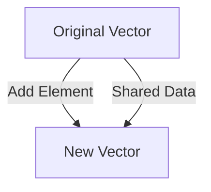

## 5.4.2 Immutable Data Structures in Clojure

As experienced Java developers, you're familiar with mutable data structures like `ArrayList`, `HashMap`, and `HashSet`. These structures allow in-place modification, which can lead to complex state management, especially in concurrent applications. Clojure, a functional programming language, takes a different approach by emphasizing immutability. In this section, we'll explore how Clojure's immutable data structures work, their advantages, and how they contrast with Java's mutable collections.

### Understanding Immutability

**Immutability** means that once a data structure is created, it cannot be changed. Instead of modifying existing data, operations on immutable structures return new data structures. This concept is central to functional programming and offers several benefits:

- **Thread Safety**: Immutable data structures are inherently thread-safe, eliminating the need for synchronization.
- **Predictability**: Functions that operate on immutable data are easier to reason about since they don't have side effects.
- **Ease of Testing**: Without side effects, testing becomes more straightforward, as functions consistently produce the same output for the same input.

### Clojure's Persistent Data Structures

Clojure provides a rich set of **persistent data structures** that are immutable. These include lists, vectors, maps, and sets. The term "persistent" refers to the ability to efficiently create new versions of a data structure while sharing most of the underlying data with the original version. This is achieved through a technique called **structural sharing**.

#### Lists

Clojure lists are linked lists optimized for sequential access. They are ideal for scenarios where you frequently add or remove elements from the front.

```clojure
(def my-list '(1 2 3 4 5)) ; Define a list
(def new-list (cons 0 my-list)) ; Add an element to the front

(println my-list) ; Output: (1 2 3 4 5)
(println new-list) ; Output: (0 1 2 3 4 5)
```

**Try It Yourself**: Modify the code to add an element to the end of the list. What changes are necessary?

#### Vectors

Vectors are similar to Java's `ArrayList` but immutable. They provide efficient random access and are optimized for adding elements to the end.

```clojure
(def my-vector [1 2 3 4 5]) ; Define a vector
(def new-vector (conj my-vector 6)) ; Add an element to the end

(println my-vector) ; Output: [1 2 3 4 5]
(println new-vector) ; Output: [1 2 3 4 5 6]
```

**Try It Yourself**: Experiment with accessing elements by index. How does it compare to Java's `ArrayList`?

#### Maps

Maps in Clojure are akin to Java's `HashMap`, but immutable. They are used to store key-value pairs.

```clojure
(def my-map {:a 1 :b 2 :c 3}) ; Define a map
(def new-map (assoc my-map :d 4)) ; Add a new key-value pair

(println my-map) ; Output: {:a 1, :b 2, :c 3}
(println new-map) ; Output: {:a 1, :b 2, :c 3, :d 4}
```

**Try It Yourself**: Remove a key from the map using `dissoc`. How does this operation differ from Java's `HashMap`?

#### Sets

Sets in Clojure are collections of unique elements, similar to Java's `HashSet`.

```clojure
(def my-set #{1 2 3 4 5}) ; Define a set
(def new-set (conj my-set 6)) ; Add an element

(println my-set) ; Output: #{1 2 3 4 5}
(println new-set) ; Output: #{1 2 3 4 5 6}
```

**Try It Yourself**: Attempt to add a duplicate element to the set. What happens?

### Structural Sharing and Performance

Clojure's persistent data structures achieve immutability through **structural sharing**. This means that new versions of a data structure share most of their data with the original, minimizing memory usage and improving performance.



*Diagram: Structural sharing between the original and new vector.*

In the diagram above, adding an element to a vector creates a new vector that shares most of its structure with the original. This approach allows Clojure to maintain immutability without significant performance penalties.

### Comparing with Java's Mutable Structures

Let's compare how Java and Clojure handle data manipulation:

**Java Example**: Modifying an `ArrayList`

```java
import java.util.ArrayList;
import java.util.List;

public class MutableExample {
    public static void main(String[] args) {
        List<Integer> list = new ArrayList<>();
        list.add(1);
        list.add(2);
        list.add(3);

        list.set(1, 4); // Modify the second element

        System.out.println(list); // Output: [1, 4, 3]
    }
}
```

**Clojure Example**: Creating a new vector

```clojure
(def my-vector [1 2 3])
(def updated-vector (assoc my-vector 1 4)) ; Create a new vector with the second element changed

(println my-vector) ; Output: [1 2 3]
(println updated-vector) ; Output: [1 4 3]
```

In Java, modifying an `ArrayList` changes the original list, which can lead to unintended side effects if the list is shared across different parts of a program. In contrast, Clojure's approach ensures that the original data remains unchanged, promoting safer and more predictable code.

### Advantages of Immutable Data Structures

1. **Concurrency**: Immutable data structures eliminate the need for locks, simplifying concurrent programming.
2. **Simplicity**: Functions that operate on immutable data are easier to understand and debug.
3. **Reliability**: With no side effects, functions are more reliable and easier to test.

### Practical Applications

Immutable data structures are particularly useful in scenarios involving concurrency, such as web servers or real-time data processing systems. By eliminating shared mutable state, Clojure simplifies the development of robust, concurrent applications.

**Exercise**: Refactor a Java program that uses mutable collections to use Clojure's immutable data structures. Observe how the code changes and the benefits it brings.

### Key Takeaways

- Clojure's immutable data structures provide a robust foundation for functional programming.
- Structural sharing allows efficient data manipulation without sacrificing performance.
- Immutability enhances code safety, especially in concurrent environments.

Now that we've explored how immutable data structures work in Clojure, let's apply these concepts to manage state effectively in your applications. By embracing immutability, you can write safer, more reliable, and easier-to-maintain code.

For further reading, consider exploring the [Official Clojure Documentation](https://clojure.org/reference/data_structures) and [ClojureDocs](https://clojuredocs.org/).

## Quiz: Test Your Understanding of Immutable Data Structures in Clojure



### What is a key benefit of immutable data structures in Clojure?

- [x] They are inherently thread-safe.
- [ ] They allow in-place modification.
- [ ] They require complex locking mechanisms.
- [ ] They are slower than mutable structures.

> **Explanation:** Immutable data structures are inherently thread-safe because they cannot be modified, eliminating the need for locks.

### How does Clojure achieve immutability in its data structures?

- [x] Through structural sharing.
- [ ] By copying data every time.
- [ ] By using locks.
- [ ] By avoiding data manipulation.

> **Explanation:** Clojure uses structural sharing to efficiently create new data structures without copying all data, maintaining immutability.

### Which Clojure data structure is optimized for sequential access?

- [x] List
- [ ] Vector
- [ ] Map
- [ ] Set

> **Explanation:** Clojure lists are linked lists optimized for sequential access, making them ideal for operations at the front.

### What happens when you add an element to a Clojure vector?

- [x] A new vector is created.
- [ ] The original vector is modified.
- [ ] An error is thrown.
- [ ] The element is ignored.

> **Explanation:** Adding an element to a Clojure vector creates a new vector, leaving the original unchanged.

### How does Clojure's `assoc` function work with maps?

- [x] It creates a new map with the updated key-value pair.
- [ ] It modifies the original map.
- [ ] It deletes the specified key.
- [ ] It throws an exception if the key exists.

> **Explanation:** The `assoc` function creates a new map with the updated key-value pair, maintaining immutability.

### What is the result of adding a duplicate element to a Clojure set?

- [x] The set remains unchanged.
- [ ] The duplicate is added.
- [ ] An error is thrown.
- [ ] The set is cleared.

> **Explanation:** Clojure sets do not allow duplicates, so adding a duplicate element leaves the set unchanged.

### Which Java collection is most similar to Clojure's vector?

- [x] ArrayList
- [ ] LinkedList
- [ ] HashMap
- [ ] HashSet

> **Explanation:** Clojure's vector is most similar to Java's `ArrayList`, providing efficient random access and end additions.

### What is a disadvantage of mutable data structures in Java?

- [x] They can lead to unintended side effects.
- [ ] They are inherently thread-safe.
- [ ] They simplify concurrent programming.
- [ ] They are easier to test.

> **Explanation:** Mutable data structures can lead to unintended side effects, especially when shared across different parts of a program.

### How does immutability enhance code reliability?

- [x] By eliminating side effects.
- [ ] By allowing in-place modifications.
- [ ] By requiring complex synchronization.
- [ ] By making code harder to understand.

> **Explanation:** Immutability enhances code reliability by eliminating side effects, making functions more predictable and easier to test.

### True or False: Clojure's immutable data structures require more memory than Java's mutable structures.

- [ ] True
- [x] False

> **Explanation:** Clojure's immutable data structures use structural sharing to minimize memory usage, often requiring less memory than copying mutable structures.


