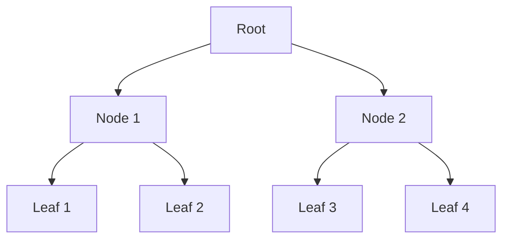

## 5.4.3 Performance Considerations

As Java developers, we are accustomed to mutable data structures, where performance is often a primary concern. Transitioning to Clojure, a language that emphasizes immutability, may raise questions about performance implications. In this section, we will address these concerns by exploring how Clojure's immutable data structures are designed to be efficient, leveraging concepts like structural sharing and cache optimization. We'll also compare these with Java's mutable structures to highlight the differences and potential advantages.

### Understanding Immutable Data Structures

Immutable data structures are those that cannot be altered once created. Any modification results in a new data structure. This might seem inefficient at first glance, but Clojure employs **structural sharing** to mitigate the overhead.

#### Structural Sharing

Structural sharing is a technique where new data structures share parts of the old structures rather than copying them entirely. This reduces memory usage and improves performance by avoiding unnecessary duplication.

**Example:**

Consider a simple list modification:

```clojure
(def original-list [1 2 3 4 5])
(def modified-list (conj original-list 6))

;; original-list remains unchanged
;; modified-list is [1 2 3 4 5 6]
```

In this example, `modified-list` shares the structure of `original-list` up to the point of modification. Only the new element `6` is added, and the rest of the list is shared.

#### Performance Benefits of Structural Sharing

- **Memory Efficiency**: By sharing structure, memory usage is minimized, as only the differences between versions are stored.
- **Time Complexity**: Operations like adding or removing elements can be performed in constant or logarithmic time, depending on the data structure.
- **Cache Utilization**: Shared structures can lead to better cache performance, as frequently accessed data remains in cache longer.

### Comparing with Java's Mutable Structures

Java's mutable data structures, such as `ArrayList` or `HashMap`, allow in-place modifications, which can be efficient for certain operations but come with trade-offs.

#### Defensive Copying in Java

In Java, to ensure data integrity, especially in concurrent environments, developers often resort to **defensive copying**. This involves creating copies of data to prevent unintended modifications, which can be costly in terms of performance.

**Example:**

```java
import java.util.ArrayList;
import java.util.List;

public class DefensiveCopying {
    public static void main(String[] args) {
        List<Integer> originalList = new ArrayList<>(List.of(1, 2, 3, 4, 5));
        List<Integer> copiedList = new ArrayList<>(originalList); // Defensive copy

        copiedList.add(6);

        // originalList remains unchanged
        // copiedList is [1, 2, 3, 4, 5, 6]
    }
}
```

In this Java example, `copiedList` is a complete copy of `originalList`, which can be inefficient for large datasets.

### Cache Utilization and Performance

Immutable data structures can lead to better cache utilization. Since they are often smaller due to structural sharing, they fit better in cache lines, reducing cache misses and improving access times.

#### Cache-Friendly Algorithms

Clojure's persistent data structures are designed to be cache-friendly. For instance, the **persistent vector** uses a tree structure that allows for efficient access and updates.

**Diagram: Persistent Vector Structure**



*Caption: A persistent vector uses a tree structure to efficiently manage elements, allowing for quick access and updates.*

### Performance Considerations in Practice

Let's explore some practical scenarios where Clojure's immutable data structures can outperform traditional mutable structures.

#### Scenario 1: Concurrent Access

In a multi-threaded environment, immutable data structures shine because they eliminate the need for locks, reducing contention and improving throughput.

**Example:**

```clojure
(def shared-data (atom [1 2 3 4 5]))

(future (swap! shared-data conj 6))
(future (swap! shared-data conj 7))

;; No locks needed, as each operation works on a new version of the data
```

In Java, managing concurrent access often requires complex synchronization mechanisms, which can degrade performance.

#### Scenario 2: Functional Transformations

Functional programming encourages transformations over collections. Immutable data structures facilitate this by allowing transformations without side effects.

**Example:**

```clojure
(def numbers [1 2 3 4 5])
(def squared-numbers (map #(* % %) numbers))

;; numbers remains unchanged
;; squared-numbers is (1 4 9 16 25)
```

In Java, similar transformations might involve creating new collections or using streams, which can introduce overhead.

### Try It Yourself

To better understand these concepts, try modifying the Clojure examples to see how structural sharing impacts performance. For instance, experiment with larger datasets or concurrent modifications to observe the behavior.

### Exercises

1. **Implement a Persistent Stack**: Create a stack data structure in Clojure using immutable principles. Compare its performance with a Java `Stack`.
2. **Concurrent Modifications**: Simulate concurrent modifications on a shared data structure in both Clojure and Java. Measure the performance differences.
3. **Cache Utilization**: Analyze the cache performance of a Clojure persistent vector versus a Java `ArrayList` using a profiling tool.

### Key Takeaways

- **Structural Sharing**: Clojure's immutable data structures use structural sharing to minimize memory usage and improve performance.
- **Cache Optimization**: Better cache utilization can lead to significant performance gains in Clojure.
- **Concurrency**: Immutable structures simplify concurrent programming by eliminating the need for locks.
- **Functional Transformations**: Clojure's approach to data transformations can be more efficient than Java's, especially in a functional context.

By understanding these performance considerations, we can leverage Clojure's strengths to build efficient, scalable applications. Now that we've explored how immutable data structures work in Clojure, let's apply these concepts to manage state effectively in your applications.

For further reading, consider exploring the [Official Clojure Documentation](https://clojure.org/reference/data_structures) and [ClojureDocs](https://clojuredocs.org/).

---

## Quiz: Understanding Performance in Immutable Data Structures



### What is structural sharing in Clojure?

- [x] A technique where new data structures share parts of the old structures.
- [ ] A method of copying entire data structures to ensure immutability.
- [ ] A way to lock data structures to prevent concurrent modifications.
- [ ] A process of converting mutable structures to immutable ones.

> **Explanation:** Structural sharing allows new data structures to share parts of the old structures, reducing memory usage and improving performance.

### How does structural sharing improve performance?

- [x] By reducing memory usage and avoiding unnecessary duplication.
- [ ] By copying data structures entirely for each modification.
- [ ] By locking data structures to prevent concurrent access.
- [ ] By converting data structures to a mutable form.

> **Explanation:** Structural sharing reduces memory usage by sharing unchanged parts of data structures, avoiding duplication.

### What is a benefit of immutable data structures in concurrent programming?

- [x] They eliminate the need for locks, reducing contention.
- [ ] They require complex synchronization mechanisms.
- [ ] They allow for in-place modifications.
- [ ] They increase the need for defensive copying.

> **Explanation:** Immutable data structures eliminate the need for locks, as they cannot be modified, reducing contention in concurrent environments.

### How do immutable data structures affect cache utilization?

- [x] They often fit better in cache lines, reducing cache misses.
- [ ] They increase cache misses due to larger memory usage.
- [ ] They require additional cache management techniques.
- [ ] They have no impact on cache utilization.

> **Explanation:** Immutable data structures, due to structural sharing, often fit better in cache lines, reducing cache misses.

### What is a common performance issue with Java's mutable structures?

- [x] The need for defensive copying.
- [ ] The inability to modify data in place.
- [ ] The lack of structural sharing.
- [ ] The requirement for complex algorithms.

> **Explanation:** Java's mutable structures often require defensive copying to ensure data integrity, which can be costly.

### How does Clojure's persistent vector structure improve performance?

- [x] By using a tree structure for efficient access and updates.
- [ ] By copying the entire vector for each modification.
- [ ] By allowing in-place modifications.
- [ ] By using a flat array structure.

> **Explanation:** Clojure's persistent vector uses a tree structure, allowing for efficient access and updates through structural sharing.

### What is a key advantage of functional transformations in Clojure?

- [x] They allow transformations without side effects.
- [ ] They require creating new collections for each transformation.
- [ ] They increase the need for synchronization.
- [ ] They complicate data processing.

> **Explanation:** Functional transformations in Clojure allow for transformations without side effects, leveraging immutability.

### Why might immutable data structures lead to better cache performance?

- [x] They are often smaller due to structural sharing.
- [ ] They require more memory, leading to cache thrashing.
- [ ] They need additional cache management.
- [ ] They have no impact on cache performance.

> **Explanation:** Immutable data structures are often smaller due to structural sharing, leading to better cache performance.

### What is a challenge when using immutable data structures in Java?

- [x] The need for defensive copying.
- [ ] The inability to use them in concurrent environments.
- [ ] The requirement for complex algorithms.
- [ ] The lack of support for immutability.

> **Explanation:** In Java, using immutable data structures often involves defensive copying to prevent unintended modifications.

### True or False: Immutable data structures in Clojure always perform worse than mutable structures in Java.

- [ ] True
- [x] False

> **Explanation:** Immutable data structures in Clojure can perform better than mutable structures in Java due to structural sharing, better cache utilization, and simplified concurrency.


