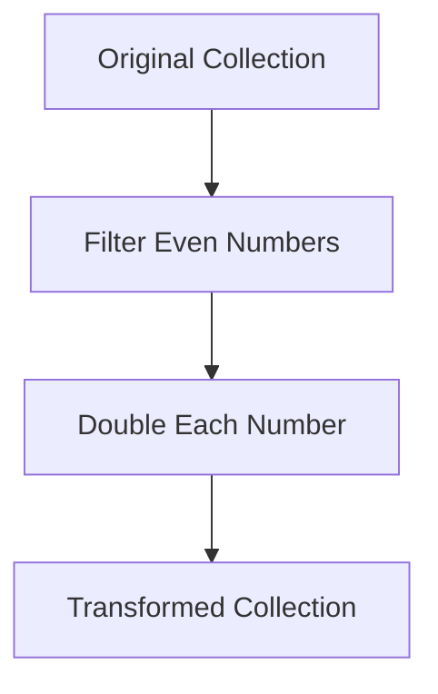

## 5.5.1 Transforming Collections

In this section, we delve into the powerful world of transforming collections in Clojure, a language that embraces immutability and functional programming. As experienced Java developers, you are familiar with manipulating collections using loops and iterators. Clojure offers a more expressive and concise approach through higher-order functions like `map`, `filter`, and `reduce`. These functions allow us to transform data without altering the original collections, promoting immutability and thread safety.

### Understanding Immutable Collections

Before we dive into transforming collections, it's crucial to understand the concept of immutability. In Clojure, collections are immutable by default, meaning once a collection is created, it cannot be changed. Instead, operations on collections return new collections, leaving the original unchanged. This immutability is a cornerstone of Clojure's design, enabling safer concurrent programming and easier reasoning about code.

#### Benefits of Immutability

- **Thread Safety**: Immutable collections can be shared across threads without synchronization, reducing the risk of concurrency issues.
- **Predictability**: Functions that operate on immutable data are easier to reason about since they don't have side effects.
- **Ease of Testing**: Pure functions that transform immutable data are straightforward to test, as they always produce the same output for a given input.

### Transforming Collections with `map`

The `map` function is a fundamental tool in Clojure for transforming collections. It applies a given function to each element of a collection, returning a new collection of the results.

#### Example: Doubling Numbers

Let's start with a simple example: doubling each number in a list.

```clojure
(def numbers [1 2 3 4 5])

(def doubled-numbers (map #(* 2 %) numbers))

(println doubled-numbers) ; Output: (2 4 6 8 10)
```

**Explanation**: The `map` function takes a function and a collection as arguments. Here, `#(* 2 %)` is an anonymous function that doubles its input, and `numbers` is the collection being transformed.

#### Java Comparison

In Java, you might achieve a similar result using a loop or streams:

```java
List<Integer> numbers = Arrays.asList(1, 2, 3, 4, 5);
List<Integer> doubledNumbers = numbers.stream()
                                      .map(n -> n * 2)
                                      .collect(Collectors.toList());
System.out.println(doubledNumbers); // Output: [2, 4, 6, 8, 10]
```

**Comparison**: Both Clojure and Java streams offer a declarative approach to transforming collections. However, Clojure's syntax is more concise and leverages the power of first-class functions.

### Filtering Collections with `filter`

The `filter` function is used to select elements from a collection that satisfy a given predicate function.

#### Example: Filtering Even Numbers

Let's filter out even numbers from a list.

```clojure
(def numbers [1 2 3 4 5 6])

(def even-numbers (filter even? numbers))

(println even-numbers) ; Output: (2 4 6)
```

**Explanation**: The `filter` function takes a predicate and a collection. The predicate `even?` checks if a number is even, and `filter` returns a new collection of numbers that satisfy this predicate.

#### Java Comparison

In Java, filtering can be done using streams:

```java
List<Integer> numbers = Arrays.asList(1, 2, 3, 4, 5, 6);
List<Integer> evenNumbers = numbers.stream()
                                   .filter(n -> n % 2 == 0)
                                   .collect(Collectors.toList());
System.out.println(evenNumbers); // Output: [2, 4, 6]
```

**Comparison**: Both Clojure and Java provide a functional approach to filtering, but Clojure's use of predicates and concise syntax makes it more straightforward.

### Reducing Collections with `reduce`

The `reduce` function is a powerful tool for aggregating values in a collection. It applies a function cumulatively to the elements of a collection, reducing it to a single value.

#### Example: Summing Numbers

Let's sum all numbers in a list.

```clojure
(def numbers [1 2 3 4 5])

(def sum (reduce + numbers))

(println sum) ; Output: 15
```

**Explanation**: The `reduce` function takes a function and a collection. Here, `+` is the function that adds two numbers, and `reduce` applies it cumulatively to the elements of `numbers`.

#### Java Comparison

In Java, you might use a loop or streams to achieve the same:

```java
List<Integer> numbers = Arrays.asList(1, 2, 3, 4, 5);
int sum = numbers.stream()
                 .reduce(0, Integer::sum);
System.out.println(sum); // Output: 15
```

**Comparison**: Clojure's `reduce` is similar to Java's `reduce` in streams, but Clojure's syntax is more concise and leverages the power of functional programming.

### Combining Transformations

Clojure's functional approach allows us to easily combine transformations, creating powerful data pipelines.

#### Example: Filtering and Doubling

Let's filter even numbers and then double them.

```clojure
(def numbers [1 2 3 4 5 6])

(def transformed (->> numbers
                      (filter even?)
                      (map #(* 2 %))))

(println transformed) ; Output: (4 8 12)
```

**Explanation**: The `->>` macro threads the collection through a series of transformations, making the code more readable and expressive.

#### Java Comparison

In Java, combining transformations can be done using streams:

```java
List<Integer> numbers = Arrays.asList(1, 2, 3, 4, 5, 6);
List<Integer> transformed = numbers.stream()
                                   .filter(n -> n % 2 == 0)
                                   .map(n -> n * 2)
                                   .collect(Collectors.toList());
System.out.println(transformed); // Output: [4, 8, 12]
```

**Comparison**: Both languages support chaining transformations, but Clojure's threading macros provide a more readable and concise syntax.

### Visualizing Data Flow

To better understand how data flows through these transformations, let's visualize the process using a diagram.



**Diagram Explanation**: This flowchart illustrates the transformation process, starting with the original collection, filtering even numbers, doubling each number, and resulting in the transformed collection.

### Try It Yourself

To deepen your understanding, try modifying the examples:

- Change the predicate in the `filter` function to select odd numbers.
- Use `reduce` to find the product of numbers in a collection.
- Combine `map` and `reduce` to calculate the sum of squares.

### Exercises

1. **Exercise 1**: Write a Clojure function that takes a list of strings and returns a list of their lengths.
2. **Exercise 2**: Use `filter` and `map` to transform a list of numbers by removing those less than 5 and then squaring the remaining numbers.
3. **Exercise 3**: Implement a function that uses `reduce` to find the maximum number in a collection.

### Key Takeaways

- **Immutability**: Clojure's immutable collections promote safer and more predictable code.
- **Higher-Order Functions**: Functions like `map`, `filter`, and `reduce` enable expressive and concise data transformations.
- **Functional Composition**: Clojure's threading macros and first-class functions allow for powerful and readable data pipelines.

By mastering these concepts, you can harness the full power of Clojure's functional programming paradigm to transform collections efficiently and effectively.

### Further Reading

For more information on Clojure's collection transformations, check out the [Official Clojure Documentation](https://clojure.org/reference/sequences) and [ClojureDocs](https://clojuredocs.org/).

---

## Quiz: Mastering Collection Transformations in Clojure



### What is the primary benefit of using immutable collections in Clojure?

- [x] Thread safety and predictability
- [ ] Faster performance
- [ ] Easier syntax
- [ ] Larger memory footprint

> **Explanation:** Immutable collections ensure thread safety and predictability by preventing changes to data, which is crucial in concurrent programming.

### Which Clojure function is used to apply a transformation to each element of a collection?

- [x] map
- [ ] filter
- [ ] reduce
- [ ] apply

> **Explanation:** The `map` function applies a given transformation to each element of a collection, returning a new collection of the results.

### How does the `filter` function in Clojure operate on collections?

- [x] It selects elements that satisfy a predicate.
- [ ] It transforms each element.
- [ ] It aggregates elements into a single value.
- [ ] It sorts the elements.

> **Explanation:** The `filter` function selects elements from a collection that satisfy a given predicate, returning a new collection of those elements.

### What does the `reduce` function do in Clojure?

- [x] Aggregates elements into a single value
- [ ] Transforms each element
- [ ] Filters elements based on a predicate
- [ ] Sorts the elements

> **Explanation:** The `reduce` function applies a function cumulatively to the elements of a collection, reducing it to a single value.

### Which macro is used in Clojure to thread a collection through multiple transformations?

- [x] ->>
- [ ] ->
- [ ] let
- [ ] def

> **Explanation:** The `->>` macro is used to thread a collection through a series of transformations, enhancing code readability.

### In Java, which feature is similar to Clojure's `map` function?

- [x] Streams API
- [ ] For loop
- [ ] While loop
- [ ] Switch statement

> **Explanation:** Java's Streams API provides a similar declarative approach to transforming collections as Clojure's `map` function.

### What is a key advantage of using higher-order functions in Clojure?

- [x] They enable expressive and concise data transformations.
- [ ] They increase code verbosity.
- [ ] They require more memory.
- [ ] They are slower than loops.

> **Explanation:** Higher-order functions like `map`, `filter`, and `reduce` allow for expressive and concise data transformations, reducing code verbosity.

### How does Clojure's `reduce` function differ from Java's `reduce` in streams?

- [x] Clojure's syntax is more concise and leverages functional programming.
- [ ] Java's `reduce` is more concise.
- [ ] Clojure's `reduce` is slower.
- [ ] Java's `reduce` is more functional.

> **Explanation:** Clojure's `reduce` function is more concise and leverages the power of functional programming, making it easier to use.

### What is the result of using the `filter` function with the predicate `odd?` on the collection `[1 2 3 4 5]`?

- [x] (1 3 5)
- [ ] (2 4)
- [ ] (1 2 3 4 5)
- [ ] ()

> **Explanation:** The `filter` function with the predicate `odd?` selects the odd numbers from the collection, resulting in `(1 3 5)`.

### True or False: In Clojure, transforming a collection with `map` alters the original collection.

- [ ] True
- [x] False

> **Explanation:** In Clojure, transforming a collection with `map` does not alter the original collection; it returns a new collection with the transformed elements.


