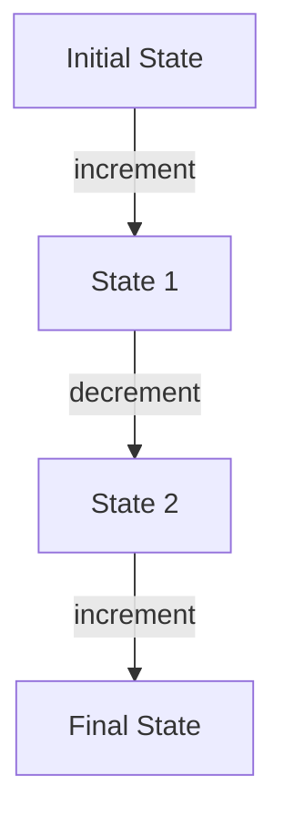

## 5.5.2 Immutability in Application State

In the realm of functional programming, immutability is a cornerstone concept that offers numerous benefits, particularly when managing application state. As experienced Java developers, you're likely accustomed to mutable state management, where objects can be modified in place. However, Clojure's approach to state management is fundamentally different, emphasizing immutability and the use of pure functions to handle state transitions. This section will guide you through the principles of managing application state immutably in Clojure, highlighting the advantages and providing practical examples to illustrate these concepts.

### Understanding Immutability in Clojure

Immutability in Clojure means that once a data structure is created, it cannot be changed. Instead of modifying existing data, you create new data structures that represent the updated state. This approach eliminates many common programming errors associated with mutable state, such as race conditions and unintended side effects.

#### Key Benefits of Immutability

1. **Predictability**: Immutable data structures ensure that data remains consistent throughout the application, making it easier to reason about the code.
2. **Concurrency**: Immutability simplifies concurrent programming by eliminating the need for locks and synchronization mechanisms.
3. **Debugging**: Immutable states are easier to debug because they do not change unexpectedly.

### Representing State Transitions with Pure Functions

In Clojure, state transitions are represented as transformations from one immutable state to another using pure functions. A pure function is one that, given the same input, will always produce the same output without causing any side effects.

#### Example: A Simple Counter

Let's start with a simple example of managing a counter's state immutably.

```clojure
(defn increment [state]
  ;; Pure function to increment the counter
  (update state :count inc))

(defn decrement [state]
  ;; Pure function to decrement the counter
  (update state :count dec))

;; Initial state
(def initial-state {:count 0})

;; Transitioning state
(def new-state (increment initial-state))
;; new-state is {:count 1}
```

In this example, `increment` and `decrement` are pure functions that take the current state and return a new state with the count incremented or decremented. The original state remains unchanged.

### Managing Complex Application State

In real-world applications, state management can become complex, involving multiple entities and interactions. Clojure provides several constructs to manage such complexity while maintaining immutability.

#### Using Maps for State Representation

Maps are a versatile data structure in Clojure, ideal for representing complex state. They allow you to group related data together and access it efficiently.

```clojure
(defn update-user [state user-id new-data]
  ;; Pure function to update user data
  (assoc-in state [:users user-id] new-data))

(def app-state
  {:users {1 {:name "Alice" :age 30}
           2 {:name "Bob" :age 25}}})

(def updated-state (update-user app-state 1 {:name "Alice" :age 31}))
;; updated-state is {:users {1 {:name "Alice" :age 31} 2 {:name "Bob" :age 25}}}
```

Here, `update-user` is a pure function that updates a user's data in the application state map. The `assoc-in` function is used to create a new map with the updated user data.

### Immutability in Java vs. Clojure

In Java, immutability is often achieved by creating immutable classes, where fields are final and set only through constructors. While this approach works, it can be cumbersome and verbose compared to Clojure's built-in support for immutability.

#### Java Example: Immutable Class

```java
public final class User {
    private final String name;
    private final int age;

    public User(String name, int age) {
        this.name = name;
        this.age = age;
    }

    public User withAge(int newAge) {
        return new User(this.name, newAge);
    }

    // Getters omitted for brevity
}
```

In this Java example, the `User` class is immutable, and any modification requires creating a new instance. Clojure's approach is more concise and flexible, allowing for easy manipulation of nested data structures.

### Immutability and Concurrency

One of the most significant advantages of immutability is its impact on concurrency. In Java, managing concurrent access to mutable state often involves complex synchronization mechanisms. In contrast, Clojure's immutable data structures eliminate the need for such mechanisms, as there is no risk of data being modified by multiple threads simultaneously.

#### Clojure's Concurrency Primitives

Clojure provides several concurrency primitives, such as atoms, refs, and agents, to manage state changes in a concurrent environment.

- **Atoms**: Used for managing independent, synchronous state changes.
- **Refs**: Used for coordinated, synchronous state changes with Software Transactional Memory (STM).
- **Agents**: Used for asynchronous state changes.

#### Example: Using Atoms for State Management

Atoms are a simple way to manage shared state in Clojure. They provide a mechanism for synchronous, independent state updates.

```clojure
(def counter (atom 0))

(defn increment-counter []
  ;; Atomically increment the counter
  (swap! counter inc))

(increment-counter)
;; counter is now 1
```

In this example, `swap!` is used to atomically update the value of the atom. This ensures that state changes are thread-safe without requiring explicit locks.

### Visualizing State Transitions

To better understand how state transitions work in Clojure, let's visualize the flow of data through a series of transformations.



**Diagram Caption**: This flowchart illustrates a sequence of state transitions in a Clojure application, where each transition is represented by a pure function.

### Try It Yourself: Experiment with State Transitions

To deepen your understanding, try modifying the code examples to add new state transitions or manage additional state properties. For instance, you could extend the counter example to include a reset function that sets the counter back to zero.

### Exercises

1. **Exercise 1**: Implement a simple bank account system where you can deposit and withdraw money, ensuring that all state changes are handled immutably.
2. **Exercise 2**: Create a to-do list application where tasks can be added, removed, or marked as complete, using immutable data structures to manage the list's state.

### Key Takeaways

- **Immutability** is a fundamental concept in Clojure, providing predictability, ease of debugging, and simplifying concurrency.
- **Pure functions** are used to represent state transitions, ensuring that state changes are predictable and side-effect-free.
- **Clojure's immutable data structures** offer a more concise and flexible approach to state management compared to Java's immutable classes.
- **Concurrency primitives** like atoms, refs, and agents enable safe state management in concurrent environments without the need for locks.

By embracing immutability and pure functions, you can build robust, maintainable applications that are easier to reason about and debug. Now that we've explored how immutable data structures work in Clojure, let's apply these concepts to manage state effectively in your applications.

For further reading, consider exploring the [Official Clojure Documentation](https://clojure.org/reference) and [ClojureDocs](https://clojuredocs.org/) for more in-depth information on Clojure's immutable data structures and concurrency primitives.

## Quiz: Test Your Knowledge on Immutability in Application State



### What is a key benefit of using immutable data structures in Clojure?

- [x] Predictability
- [ ] Increased memory usage
- [ ] Complexity
- [ ] Slower performance

> **Explanation:** Immutable data structures ensure that data remains consistent, making the code more predictable and easier to reason about.


### How are state transitions represented in Clojure?

- [x] Using pure functions
- [ ] Using mutable objects
- [ ] Through direct modification
- [ ] By using global variables

> **Explanation:** State transitions in Clojure are represented using pure functions that transform one state to another without side effects.


### Which Clojure construct is used for managing independent, synchronous state changes?

- [x] Atoms
- [ ] Refs
- [ ] Agents
- [ ] Vars

> **Explanation:** Atoms are used for managing independent, synchronous state changes in Clojure.


### What is the primary advantage of immutability in concurrent programming?

- [x] Eliminates the need for locks
- [ ] Increases complexity
- [ ] Requires more memory
- [ ] Slows down execution

> **Explanation:** Immutability eliminates the need for locks and synchronization mechanisms, simplifying concurrent programming.


### Which function is used to update the value of an atom in Clojure?

- [x] swap!
- [ ] assoc
- [ ] update
- [ ] reset

> **Explanation:** The `swap!` function is used to atomically update the value of an atom in Clojure.


### How does Clojure's approach to immutability compare to Java's?

- [x] More concise and flexible
- [ ] More verbose
- [ ] Less efficient
- [ ] More complex

> **Explanation:** Clojure's built-in support for immutability is more concise and flexible compared to Java's approach of creating immutable classes.


### What is a pure function?

- [x] A function that always produces the same output for the same input
- [ ] A function that modifies global state
- [ ] A function that depends on external variables
- [ ] A function that has side effects

> **Explanation:** A pure function always produces the same output for the same input and does not cause side effects.


### Which Clojure primitive is used for asynchronous state changes?

- [x] Agents
- [ ] Atoms
- [ ] Refs
- [ ] Vars

> **Explanation:** Agents are used for managing asynchronous state changes in Clojure.


### What does the `assoc-in` function do in Clojure?

- [x] Updates a nested value in a map
- [ ] Creates a new atom
- [ ] Modifies a global variable
- [ ] Deletes a key from a map

> **Explanation:** The `assoc-in` function is used to update a nested value in a map in Clojure.


### Immutability simplifies debugging because:

- [x] State does not change unexpectedly
- [ ] It increases code complexity
- [ ] It requires more memory
- [ ] It slows down execution

> **Explanation:** Immutability simplifies debugging because state does not change unexpectedly, making it easier to trace and fix issues.


