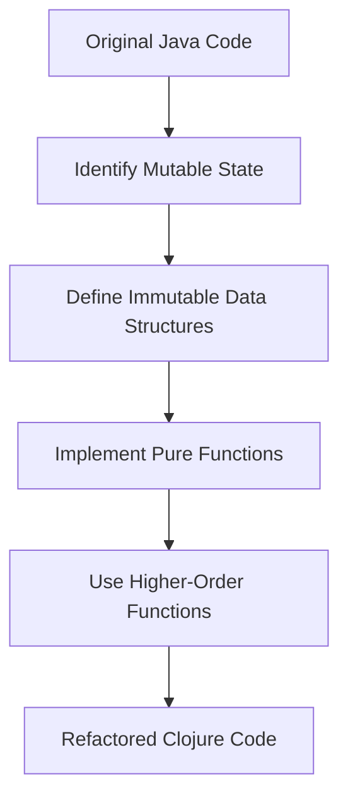

## 5.5.3 Refactoring Imperative Code

As experienced Java developers, you're likely familiar with the imperative programming paradigm, which emphasizes explicit sequences of commands to manipulate program state. In contrast, Clojure, a functional programming language, encourages immutability and pure functions, leading to more predictable and maintainable code. In this section, we'll explore how to refactor imperative Java code into functional, immutable Clojure code, highlighting the benefits of this transformation.

### Understanding the Imperative Approach

Imperative programming is characterized by the use of statements that change a program's state. Consider the following Java code snippet that calculates the sum of even numbers in a list:

```java
import java.util.Arrays;
import java.util.List;

public class SumEvenNumbers {
    public static void main(String[] args) {
        List<Integer> numbers = Arrays.asList(1, 2, 3, 4, 5, 6);
        int sum = 0;
        for (int number : numbers) {
            if (number % 2 == 0) {
                sum += number;
            }
        }
        System.out.println("Sum of even numbers: " + sum);
    }
}
```

In this example, the code uses a mutable variable `sum` to accumulate the result, and a loop to iterate over the list, checking each number for evenness.

### Transitioning to Functional Programming

Functional programming, as embraced by Clojure, focuses on using expressions rather than statements, and emphasizes immutability and pure functions. Let's refactor the above Java code into Clojure:

```clojure
(def numbers [1 2 3 4 5 6])

(defn sum-even-numbers [nums]
  (reduce + (filter even? nums)))

(println "Sum of even numbers:" (sum-even-numbers numbers))
```

**Key Differences:**

1. **Immutability**: The list `numbers` is immutable, meaning it cannot be changed after its creation.
2. **Higher-Order Functions**: We use `filter` to select even numbers and `reduce` to sum them, both of which are higher-order functions that operate on collections.
3. **No Explicit Loops**: Instead of a loop, we use function composition to achieve the same result.

### Benefits of Refactoring to Clojure

- **Enhanced Clarity**: The Clojure version is more concise and declarative, making it easier to understand at a glance.
- **Improved Maintainability**: With immutability and pure functions, the code is less prone to bugs related to state changes.
- **Concurrency**: Immutable data structures simplify concurrent programming, as there's no need to manage locks or synchronization.

### Detailed Refactoring Example: A Java Class to Clojure Functions

Let's consider a more complex example involving a Java class that manages a collection of tasks. We'll refactor it into Clojure, demonstrating the transformation from an object-oriented to a functional style.

#### Java Code: Task Manager

```java
import java.util.ArrayList;
import java.util.List;

public class TaskManager {
    private List<String> tasks;

    public TaskManager() {
        this.tasks = new ArrayList<>();
    }

    public void addTask(String task) {
        tasks.add(task);
    }

    public void removeTask(String task) {
        tasks.remove(task);
    }

    public List<String> getTasks() {
        return new ArrayList<>(tasks);
    }
}
```

This Java class uses mutable state to manage tasks, with methods to add, remove, and retrieve tasks.

#### Clojure Code: Task Manager

```clojure
(defn add-task [tasks task]
  (conj tasks task))

(defn remove-task [tasks task]
  (remove #(= % task) tasks))

(defn get-tasks [tasks]
  tasks)

;; Example usage
(def tasks (atom []))

(swap! tasks add-task "Write documentation")
(swap! tasks add-task "Review pull requests")
(swap! tasks remove-task "Write documentation")

(println "Current tasks:" @tasks)
```

**Key Transformations:**

1. **Immutable Data Structures**: We use a vector to represent tasks, and functions to manipulate it.
2. **Atoms for State Management**: An `atom` is used to manage state changes in a thread-safe manner.
3. **Function-Based API**: Instead of methods, we define functions that operate on data.

### Try It Yourself

Experiment with the Clojure code by adding more tasks or implementing additional functions, such as `update-task`. Consider how you might handle tasks with additional attributes, like priority or due date.

### Diagram: Data Flow in Functional Refactoring



*Diagram Caption*: This flowchart illustrates the process of refactoring imperative Java code into functional Clojure code, emphasizing the transition from mutable state to immutable data structures and pure functions.

### Comparing Java and Clojure: A Summary

| Aspect                  | Java (Imperative)                      | Clojure (Functional)                  |
|-------------------------|----------------------------------------|---------------------------------------|
| **State Management**    | Mutable variables                      | Immutable data structures             |
| **Control Structures**  | Loops and conditionals                 | Higher-order functions and recursion  |
| **Concurrency**         | Locks and synchronization              | Atoms, refs, and agents               |
| **Code Clarity**        | Verbose and stateful                   | Concise and declarative               |

### Exercises: Refactor More Java Code

1. **Refactor a Java Sorting Algorithm**: Take a Java implementation of a sorting algorithm and refactor it into Clojure using functional programming principles.
2. **Convert a Java Banking Application**: Refactor a simple Java banking application that manages accounts and transactions into Clojure, focusing on immutability and pure functions.

### Key Takeaways

- **Immutability and Pure Functions**: These are core principles in Clojure that lead to more predictable and maintainable code.
- **Higher-Order Functions**: Embrace these to simplify operations on collections and reduce boilerplate code.
- **Concurrency Simplified**: Clojure's immutable data structures and concurrency primitives make concurrent programming more straightforward.

By refactoring imperative Java code into functional Clojure code, we not only improve code quality but also gain the benefits of functional programming, such as easier reasoning about code and enhanced concurrency support. Now that we've explored how to refactor imperative code, let's apply these concepts to manage state effectively in your applications.

For further reading, consider exploring the [Official Clojure Documentation](https://clojure.org/reference/documentation) and [ClojureDocs](https://clojuredocs.org/).

---

## Quiz: Mastering Refactoring from Java to Clojure



### What is a key benefit of refactoring Java code to Clojure?

- [x] Enhanced code clarity and maintainability
- [ ] Increased use of mutable state
- [ ] More complex concurrency management
- [ ] Greater reliance on loops and conditionals

> **Explanation:** Refactoring to Clojure enhances code clarity and maintainability by using immutable data structures and pure functions.

### Which Clojure feature simplifies concurrent programming compared to Java?

- [x] Immutable data structures
- [ ] Mutable variables
- [ ] Explicit loops
- [ ] Synchronized blocks

> **Explanation:** Immutable data structures in Clojure simplify concurrent programming by eliminating the need for locks and synchronization.

### In Clojure, what replaces Java's loops for iterating over collections?

- [x] Higher-order functions
- [ ] Mutable variables
- [ ] Synchronized blocks
- [ ] Explicit recursion

> **Explanation:** Higher-order functions like `map`, `filter`, and `reduce` replace loops for iterating over collections in Clojure.

### What is the purpose of using `atom` in Clojure?

- [x] To manage state changes in a thread-safe manner
- [ ] To create mutable variables
- [ ] To replace loops
- [ ] To define classes

> **Explanation:** An `atom` in Clojure is used to manage state changes in a thread-safe manner, providing a way to handle mutable state safely.

### How does Clojure handle state management differently from Java?

- [x] By using immutable data structures
- [ ] By using synchronized blocks
- [ ] By relying on mutable variables
- [ ] By using explicit loops

> **Explanation:** Clojure handles state management using immutable data structures, which contrasts with Java's reliance on mutable variables.

### What is a higher-order function in Clojure?

- [x] A function that takes other functions as arguments or returns a function
- [ ] A function that uses loops
- [ ] A function that modifies global state
- [ ] A function that is only used for concurrency

> **Explanation:** A higher-order function in Clojure is one that takes other functions as arguments or returns a function, enabling powerful abstractions.

### Which Clojure function is used to filter elements in a collection?

- [x] `filter`
- [ ] `map`
- [ ] `reduce`
- [ ] `conj`

> **Explanation:** The `filter` function in Clojure is used to select elements from a collection based on a predicate.

### What is the role of `reduce` in Clojure?

- [x] To accumulate a result from a collection
- [ ] To iterate over a collection
- [ ] To create mutable variables
- [ ] To manage state changes

> **Explanation:** `reduce` is used in Clojure to accumulate a result from a collection, applying a function to combine elements.

### How does Clojure improve code clarity compared to Java?

- [x] By using concise and declarative syntax
- [ ] By using more verbose syntax
- [ ] By relying on mutable state
- [ ] By using synchronized blocks

> **Explanation:** Clojure improves code clarity with concise and declarative syntax, reducing boilerplate and enhancing readability.

### True or False: Clojure's immutability makes it harder to manage state.

- [ ] True
- [x] False

> **Explanation:** False. Clojure's immutability simplifies state management by eliminating side effects and making code more predictable.


