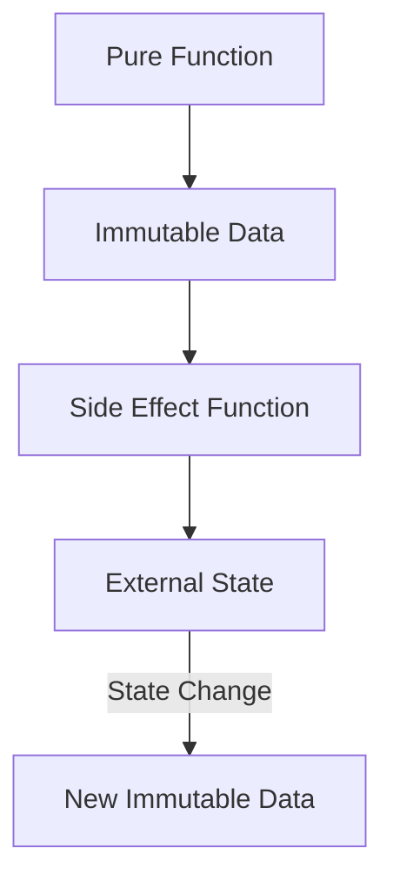

## 5.6.1 Understanding Side Effects

In the realm of programming, **side effects** are a fundamental concept that can significantly impact the behavior and reliability of your code. As experienced Java developers transitioning to Clojure, understanding side effects and how to manage them is crucial for mastering functional programming and leveraging Clojure's strengths.

### What Are Side Effects?

A **side effect** occurs when a function modifies some state outside its local environment or interacts with the outside world. This can include:

- Modifying a global variable.
- Changing the state of an object.
- Performing I/O operations, such as reading from or writing to a file or database.
- Interacting with external systems, like sending an HTTP request.

In contrast, a **pure function** is one that, given the same input, will always produce the same output and does not cause any observable side effects.

#### Why Are Side Effects Significant?

Side effects are significant because they can introduce unpredictability into your code. They make functions harder to test, reason about, and parallelize. In a multi-threaded environment, side effects can lead to race conditions and other concurrency issues.

**Java Example:**

```java
public class Counter {
    private int count = 0;

    public void increment() {
        count++; // Side effect: modifying the state of the object
    }

    public int getCount() {
        return count;
    }
}
```

In the Java example above, the `increment` method has a side effect because it modifies the `count` variable, which is part of the object's state.

**Clojure Example:**

```clojure
(defn increment [count]
  (inc count)) ; Pure function: returns a new value without modifying any state
```

In Clojure, the `increment` function is pure because it returns a new value without altering any external state.

### The Importance of Managing Side Effects

Managing side effects is crucial for writing reliable, maintainable, and testable code. In functional programming, we strive to minimize side effects and isolate them from the core logic of our applications.

#### Benefits of Reducing Side Effects

1. **Predictability**: Pure functions are predictable and easier to understand.
2. **Testability**: Functions without side effects are easier to test because they don't depend on or alter external state.
3. **Concurrency**: Pure functions can be executed in parallel without concerns about shared state.
4. **Modularity**: Code with minimal side effects is more modular and reusable.

### Side Effects in Clojure vs. Java

Clojure, as a functional language, encourages the use of pure functions and immutable data structures. This contrasts with Java, where mutable state and side effects are more common.

**Java Side Effects Example:**

```java
public class Logger {
    public void log(String message) {
        System.out.println(message); // Side effect: I/O operation
    }
}
```

**Clojure Side Effects Example:**

```clojure
(defn log [message]
  (println message)) ; Side effect: I/O operation
```

Both examples perform a side effect by printing a message to the console. However, in Clojure, side effects are often isolated to specific parts of the codebase, making the rest of the code pure and easier to manage.

### Isolating Side Effects in Clojure

In Clojure, we can isolate side effects using various techniques and constructs, such as:

- **Higher-order functions**: Encapsulate side effects within specific functions.
- **Monads**: Use monadic structures to handle side effects in a controlled manner.
- **Concurrency primitives**: Leverage Clojure's concurrency primitives like atoms, refs, and agents to manage state changes safely.

#### Example: Using Atoms to Manage State

Atoms in Clojure provide a way to manage shared, mutable state safely. They allow you to perform atomic updates, ensuring consistency in a concurrent environment.

```clojure
(def counter (atom 0))

(defn increment-counter []
  (swap! counter inc)) ; Atomically increments the counter

(increment-counter)
(println @counter) ; Prints the updated counter value
```

In this example, the `increment-counter` function uses `swap!` to atomically update the `counter` atom, ensuring thread safety.

### Visualizing Side Effects and State Management

To better understand how side effects and state management work in Clojure, let's visualize the flow of data and state changes using a diagram.



**Diagram Explanation**: This diagram illustrates the flow of data in a Clojure application. Pure functions operate on immutable data, while side effect functions interact with external state, resulting in new immutable data.

### Try It Yourself: Experimenting with Side Effects

To deepen your understanding of side effects, try modifying the following Clojure code examples:

1. **Modify the `increment-counter` function** to log each increment operation using `println`.
2. **Create a pure function** that takes a list of numbers and returns a new list with each number incremented, without using side effects.
3. **Experiment with atoms** by creating a shared state and updating it concurrently from multiple threads.

### Further Reading

For more information on managing side effects and functional programming in Clojure, consider exploring the following resources:

- [Official Clojure Documentation](https://clojure.org/reference/documentation)
- [ClojureDocs](https://clojuredocs.org/)
- [Functional Programming in Clojure](https://www.braveclojure.com/)

### Exercises

1. **Identify Side Effects**: Review a piece of Java code and identify all the side effects present. Rewrite the code in Clojure, minimizing side effects.
2. **Concurrency with Atoms**: Implement a simple counter using atoms in Clojure and test it in a multi-threaded environment.
3. **Pure vs. Impure Functions**: Write a Clojure function that performs a side effect and refactor it to be pure.

### Key Takeaways

- **Side effects** occur when a function modifies external state or interacts with the outside world.
- **Pure functions** are predictable, testable, and easier to reason about.
- **Clojure** encourages minimizing side effects through immutability and functional programming constructs.
- **Managing side effects** effectively leads to more reliable and maintainable code.

Now that we've explored how to understand and manage side effects in Clojure, let's apply these concepts to create robust and efficient applications.

## Quiz: Understanding Side Effects in Clojure



### What is a side effect in programming?

- [x] A function modifying external state or interacting with the outside world
- [ ] A function returning a value
- [ ] A function with no parameters
- [ ] A function that only uses local variables

> **Explanation:** A side effect occurs when a function modifies some state outside its local environment or interacts with the outside world.

### Why are side effects significant in programming?

- [x] They introduce unpredictability and make testing harder
- [ ] They make code faster
- [ ] They simplify code
- [ ] They are always beneficial

> **Explanation:** Side effects can introduce unpredictability, making functions harder to test and reason about.

### How does Clojure encourage managing side effects?

- [x] By using immutable data structures and pure functions
- [ ] By allowing global variables
- [ ] By encouraging mutable state
- [ ] By using only object-oriented programming

> **Explanation:** Clojure encourages the use of immutable data structures and pure functions to minimize side effects.

### What is a pure function?

- [x] A function that always produces the same output for the same input without side effects
- [ ] A function that modifies global state
- [ ] A function that performs I/O operations
- [ ] A function that uses random numbers

> **Explanation:** A pure function always produces the same output for the same input and does not cause any observable side effects.

### Which Clojure construct is used to manage shared, mutable state safely?

- [x] Atoms
- [ ] Global variables
- [ ] Mutable objects
- [ ] Static fields

> **Explanation:** Atoms in Clojure provide a way to manage shared, mutable state safely.

### What is the benefit of using pure functions?

- [x] They are predictable and easier to test
- [ ] They are faster
- [ ] They use more memory
- [ ] They require more code

> **Explanation:** Pure functions are predictable and easier to test because they don't depend on or alter external state.

### How can side effects be isolated in Clojure?

- [x] By using higher-order functions and concurrency primitives
- [ ] By using global variables
- [ ] By using mutable objects
- [ ] By using only loops

> **Explanation:** Side effects can be isolated using higher-order functions and concurrency primitives like atoms, refs, and agents.

### What is the role of atoms in Clojure?

- [x] To manage shared, mutable state safely
- [ ] To create global variables
- [ ] To perform I/O operations
- [ ] To define classes

> **Explanation:** Atoms in Clojure are used to manage shared, mutable state safely.

### Which of the following is a side effect?

- [x] Printing to the console
- [ ] Returning a value
- [ ] Using local variables
- [ ] Performing a calculation

> **Explanation:** Printing to the console is a side effect because it interacts with the outside world.

### True or False: Pure functions can be executed in parallel without concerns about shared state.

- [x] True
- [ ] False

> **Explanation:** Pure functions can be executed in parallel without concerns about shared state because they do not modify external state.


