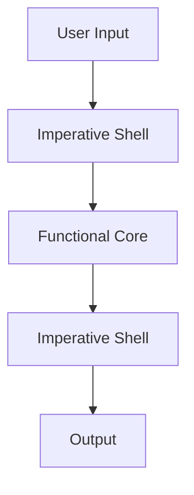
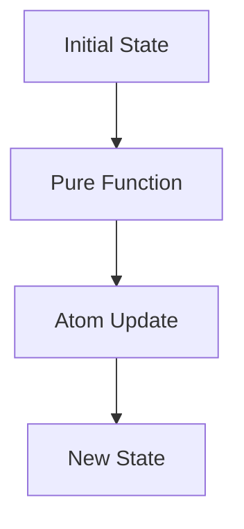

## 5.6.2 Isolating Side Effects

In the realm of functional programming, one of the key principles is to minimize and isolate side effects. This practice enhances code readability, maintainability, and testability. For Java developers transitioning to Clojure, understanding how to isolate side effects is crucial for leveraging the full power of functional programming. In this section, we will explore strategies to achieve this, drawing parallels with Java where applicable.

### Understanding Side Effects

**Side effects** occur when a function interacts with the outside world or modifies some state outside its local environment. Common examples include:

- Modifying a global variable.
- Writing to a file or database.
- Sending data over a network.
- Printing to the console.

In contrast, **pure functions** are deterministic and have no side effects. They always produce the same output given the same input and do not alter any state.

### Why Isolate Side Effects?

Isolating side effects is beneficial because it:

- **Enhances Testability**: Pure functions are easier to test since they do not depend on external state.
- **Improves Predictability**: Code becomes more predictable and easier to reason about.
- **Facilitates Concurrency**: Pure functions can be executed in parallel without concerns about shared state.

### Strategies for Isolating Side Effects

#### 1. **Functional Core, Imperative Shell**

This strategy involves structuring your application such that the core logic is pure and functional, while side effects are handled at the boundaries. This separation ensures that the majority of your codebase remains pure and easy to test.

**Diagram: Functional Core, Imperative Shell**



*Caption: The diagram illustrates the flow of data through a system with a functional core and an imperative shell.*

**Example in Clojure:**

```clojure
;; Pure function: calculates the sum of a list
(defn calculate-sum [numbers]
  (reduce + numbers))

;; Imperative shell: handles input/output
(defn process-input []
  (let [input (read-line) ;; Side effect: reading input
        numbers (map #(Integer/parseInt %) (clojure.string/split input #"\s+"))]
    (println "The sum is:" (calculate-sum numbers)))) ;; Side effect: printing output
```

**Comparison with Java:**

In Java, you might handle input/output directly within the logic, often mixing side effects with core logic. In Clojure, we aim to keep these concerns separate.

#### 2. **Use of Higher-Order Functions**

Higher-order functions can help isolate side effects by encapsulating them within specific functions that are passed around.

**Example in Clojure:**

```clojure
;; Higher-order function that accepts a function to perform side effects
(defn process-data [data side-effect-fn]
  (let [result (map inc data)] ;; Pure transformation
    (side-effect-fn result)))  ;; Side effect encapsulated

;; Usage
(process-data [1 2 3] #(println "Processed data:" %)) ;; Side effect: printing
```

**Try It Yourself:**

Modify the `process-data` function to write the result to a file instead of printing it. Consider how this change affects the separation of concerns.

#### 3. **Leveraging Clojure's Concurrency Primitives**

Clojure provides concurrency primitives like **atoms**, **refs**, and **agents** that help manage state changes in a controlled manner, isolating side effects.

**Example with Atoms:**

```clojure
(def counter (atom 0))

;; Pure function to increment
(defn increment [n]
  (inc n))

;; Side effect: updating the atom
(defn update-counter []
  (swap! counter increment))
```

**Diagram: Atom State Management**



*Caption: The diagram shows how an atom's state is updated using a pure function.*

**Comparison with Java:**

In Java, managing shared state often involves synchronization mechanisms like locks, which can be error-prone. Clojure's approach simplifies this by providing atomic state updates.

#### 4. **Utilizing Monads for Side Effect Management**

While not native to Clojure, monads can be used to manage side effects in a functional way, similar to how they are used in languages like Haskell.

**Example with a Maybe Monad:**

```clojure
(defn safe-divide [num denom]
  (if (zero? denom)
    nil
    (/ num denom)))

;; Using a monad-like approach to handle division
(defn divide-and-handle [num denom handler]
  (let [result (safe-divide num denom)]
    (if result
      result
      (handler "Division by zero")))) ;; Side effect: handling error
```

**Challenge:**

Implement a logging mechanism using a monad-like structure to handle logging as a side effect.

### Best Practices for Isolating Side Effects

- **Keep Functions Pure**: Strive to write functions that do not perform side effects.
- **Encapsulate Side Effects**: Use specific functions or modules to handle side effects, keeping them separate from core logic.
- **Test Pure Functions**: Focus on testing the pure parts of your codebase extensively.
- **Document Side Effects**: Clearly document where and why side effects occur in your code.

### Exercises

1. **Refactor a Java Method**: Take a Java method that mixes logic and side effects, and refactor it into a Clojure function with a functional core and imperative shell.
2. **Implement a Pure Function**: Write a pure function in Clojure that processes a list of numbers and returns a new list with each number squared.
3. **Concurrency Challenge**: Use Clojure's atoms to manage a shared counter in a multithreaded application, ensuring that updates are atomic and isolated.

### Key Takeaways

- Isolating side effects is crucial for maintaining the purity and testability of your code.
- Clojure's functional programming paradigm, along with its concurrency primitives, provides powerful tools for managing side effects.
- By structuring your code with a functional core and imperative shell, you can achieve a clean separation of concerns.

For further reading on functional programming and side effects, consider exploring the [Official Clojure Documentation](https://clojure.org/reference/documentation) and [ClojureDocs](https://clojuredocs.org/).

Now that we've explored how to isolate side effects in Clojure, let's apply these concepts to manage state effectively in your applications.

## Quiz: Mastering Side Effects in Clojure



### What is a side effect in functional programming?

- [x] An interaction with the outside world or a modification of external state
- [ ] A function that returns a value
- [ ] A function that takes no arguments
- [ ] A function that is called within another function

> **Explanation:** A side effect occurs when a function interacts with the outside world or modifies some state outside its local environment.

### Why is it important to isolate side effects in functional programming?

- [x] To enhance testability and maintainability
- [ ] To increase the number of side effects
- [ ] To make code less predictable
- [ ] To ensure functions have no return values

> **Explanation:** Isolating side effects enhances testability and maintainability by keeping the core logic pure and predictable.

### Which Clojure construct is used to manage state changes atomically?

- [x] Atom
- [ ] List
- [ ] Vector
- [ ] Map

> **Explanation:** Atoms in Clojure are used to manage state changes atomically, ensuring consistency and isolation of side effects.

### What is the purpose of a functional core and imperative shell?

- [x] To separate pure logic from side effects
- [ ] To combine logic and side effects
- [ ] To increase the complexity of code
- [ ] To make code less readable

> **Explanation:** A functional core and imperative shell separate pure logic from side effects, enhancing code clarity and maintainability.

### How can higher-order functions help in isolating side effects?

- [x] By encapsulating side effects within specific functions
- [ ] By increasing the number of side effects
- [ ] By making functions impure
- [ ] By reducing the number of function arguments

> **Explanation:** Higher-order functions can encapsulate side effects within specific functions, helping to isolate them from pure logic.

### What is a pure function?

- [x] A function that always produces the same output for the same input and has no side effects
- [ ] A function that modifies global variables
- [ ] A function that writes to a database
- [ ] A function that reads user input

> **Explanation:** A pure function always produces the same output for the same input and has no side effects, making it predictable and testable.

### Which of the following is a side effect?

- [x] Writing to a file
- [ ] Calculating the sum of a list
- [ ] Returning a value from a function
- [ ] Passing a function as an argument

> **Explanation:** Writing to a file is a side effect because it interacts with the outside world, altering external state.

### What is the benefit of using monads for side effect management?

- [x] They provide a functional way to handle side effects
- [ ] They increase the number of side effects
- [ ] They make code less readable
- [ ] They reduce the number of functions

> **Explanation:** Monads provide a functional way to handle side effects, allowing for controlled and predictable side effect management.

### How do Clojure's concurrency primitives help in isolating side effects?

- [x] By providing atomic state updates
- [ ] By increasing the complexity of concurrency
- [ ] By making state updates non-atomic
- [ ] By reducing the number of concurrency options

> **Explanation:** Clojure's concurrency primitives, like atoms, provide atomic state updates, helping to isolate side effects and ensure consistency.

### True or False: In Clojure, side effects should be performed at the core of the system.

- [ ] True
- [x] False

> **Explanation:** In Clojure, side effects should be performed at the edges of the system, with the core logic remaining pure.


