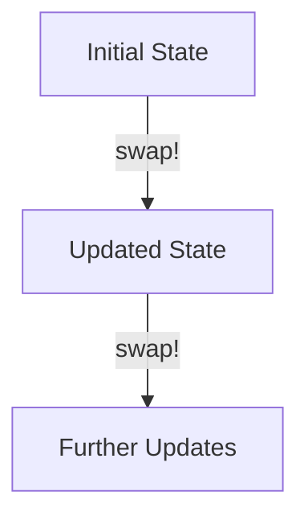
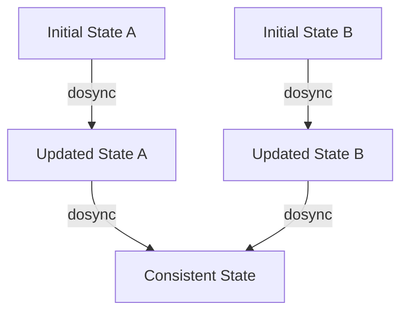

## 5.6.3 Managing State Changes

In the realm of functional programming, managing state changes can be a challenging task, especially when transitioning from an imperative language like Java to a functional one like Clojure. In this section, we'll delve into how Clojure handles state changes using constructs such as **atoms** and **refs**, which allow for controlled stateful operations while adhering to functional principles.

### Understanding State in Functional Programming

In functional programming, the concept of state is often minimized or managed in a way that avoids side effects. This is in stark contrast to imperative programming, where state changes are a fundamental aspect of the paradigm. In Java, for example, mutable objects and variables are common, and state changes are often managed through methods that alter the state of an object.

**Clojure**, on the other hand, emphasizes immutability and pure functions. However, real-world applications often require some form of state management. Clojure provides several constructs to handle state changes in a controlled manner, ensuring that the functional integrity of the program is maintained.

### Atoms: Managing Independent State

**Atoms** in Clojure are used for managing independent, synchronous state changes. They provide a way to manage state that can be changed atomically, ensuring that updates are consistent and thread-safe.

#### Creating and Using Atoms

An atom can be created using the `atom` function, and its state can be accessed using the `deref` function or the `@` reader macro. Here's a simple example:

```clojure
(def my-atom (atom 0)) ; Create an atom with an initial value of 0

(println @my-atom) ; Access the value of the atom
```

To update the state of an atom, we use the `swap!` function, which applies a function to the current state and updates it with the result:

```clojure
(swap! my-atom inc) ; Increment the value of the atom
(println @my-atom) ; Output: 1
```

The `swap!` function ensures that the update is atomic, meaning that no other thread can see an intermediate state.

#### Practical Scenarios for Atoms

Atoms are ideal for managing state that is independent and does not require coordination with other state changes. They are often used for counters, flags, or any state that can be updated independently.

### Refs and Software Transactional Memory (STM)

For more complex state management that requires coordination between multiple state changes, Clojure provides **refs** and **Software Transactional Memory (STM)**. Refs allow for coordinated, synchronous updates to multiple pieces of state.

#### Creating and Using Refs

Refs are created using the `ref` function, and their state is accessed using `deref` or `@`. Here's an example:

```clojure
(def my-ref (ref 0)) ; Create a ref with an initial value of 0

(println @my-ref) ; Access the value of the ref
```

To update the state of a ref, we use the `dosync` block along with the `ref-set` or `alter` functions. The `dosync` block ensures that all updates within it are atomic and consistent:

```clojure
(dosync
  (ref-set my-ref 10)) ; Set the value of the ref to 10

(println @my-ref) ; Output: 10
```

#### Coordinated State Changes with Refs

Refs are particularly useful when you need to ensure consistency across multiple state changes. For example, consider a simple banking system where you need to transfer money between accounts. Using refs, you can ensure that the debit and credit operations are coordinated:

```clojure
(def account-a (ref 100))
(def account-b (ref 200))

(defn transfer [from to amount]
  (dosync
    (alter from - amount)
    (alter to + amount)))

(transfer account-a account-b 50)

(println @account-a) ; Output: 50
(println @account-b) ; Output: 250
```

In this example, the `transfer` function ensures that both accounts are updated atomically, preventing any inconsistencies.

### Comparing Atoms and Refs

Atoms and refs serve different purposes and are suitable for different scenarios. Here's a comparison:

- **Atoms**: Best for independent state changes that do not require coordination. They are simpler and faster for single-state updates.
- **Refs**: Ideal for coordinated state changes across multiple variables. They provide consistency and atomicity for complex state management.

### Java vs. Clojure: State Management

In Java, state management often involves mutable objects and synchronized methods or blocks to ensure thread safety. Here's a simple Java example of managing a counter:

```java
public class Counter {
    private int count = 0;

    public synchronized void increment() {
        count++;
    }

    public synchronized int getCount() {
        return count;
    }
}
```

In contrast, Clojure's approach with atoms and refs provides a more declarative and functional way to manage state, reducing the risk of concurrency issues and making the code easier to reason about.

### Diagrams: Visualizing State Management

Let's visualize how atoms and refs manage state changes in Clojure using diagrams.

#### Atom State Management



*Diagram 1: The flow of state updates in an atom. Each update is atomic and independent.*

#### Ref State Management



*Diagram 2: Coordinated state changes with refs using STM. All updates within a `dosync` block are atomic and consistent.*

### Try It Yourself: Experimenting with Atoms and Refs

Now that we've explored how atoms and refs work, let's try some modifications:

1. **Experiment with Atoms**: Create an atom to manage a simple counter. Try using different functions with `swap!` to update the state.

2. **Explore Refs**: Implement a simple inventory system using refs. Ensure that adding and removing items are coordinated transactions.

3. **Challenge**: Combine atoms and refs in a single application. Consider scenarios where independent and coordinated state changes are needed.

### Exercises: Reinforcing Concepts

1. **Exercise 1**: Implement a simple to-do list application using atoms. Each to-do item should be an atom, and the list should be a collection of atoms.

2. **Exercise 2**: Create a banking application using refs. Implement functions to deposit, withdraw, and transfer money between accounts.

3. **Exercise 3**: Refactor a Java class that manages a shared resource using synchronized methods into a Clojure application using atoms or refs.

### Key Takeaways

- **Atoms** are ideal for managing independent state changes, providing atomic updates without the need for coordination.
- **Refs** and **STM** are used for coordinated state changes, ensuring consistency across multiple updates.
- Clojure's approach to state management emphasizes immutability and functional principles, reducing the complexity of concurrent programming.
- By understanding and leveraging Clojure's state management constructs, you can build robust, concurrent applications with ease.

### Further Reading

- [Clojure Official Documentation on Atoms](https://clojure.org/reference/atoms)
- [Clojure Official Documentation on Refs and STM](https://clojure.org/reference/refs)
- [ClojureDocs: Atoms](https://clojuredocs.org/clojure.core/atom)
- [ClojureDocs: Refs](https://clojuredocs.org/clojure.core/ref)

Now that we've explored how immutable data structures work in Clojure, let's apply these concepts to manage state effectively in your applications.

## Quiz: Mastering State Management in Clojure



### What is the primary purpose of atoms in Clojure?

- [x] Managing independent state changes
- [ ] Coordinating multiple state changes
- [ ] Handling asynchronous tasks
- [ ] Managing side effects

> **Explanation:** Atoms are used for managing independent, synchronous state changes in Clojure.

### How do you update the state of an atom in Clojure?

- [x] Using the `swap!` function
- [ ] Using the `ref-set` function
- [ ] Using the `alter` function
- [ ] Using the `dosync` block

> **Explanation:** The `swap!` function is used to update the state of an atom in Clojure.

### What is the role of the `dosync` block in Clojure?

- [x] Ensuring atomic and consistent updates to refs
- [ ] Updating the state of an atom
- [ ] Handling asynchronous operations
- [ ] Managing side effects

> **Explanation:** The `dosync` block is used to ensure atomic and consistent updates to refs in Clojure.

### Which Clojure construct is best suited for coordinated state changes?

- [x] Refs
- [ ] Atoms
- [ ] Agents
- [ ] Vars

> **Explanation:** Refs are best suited for coordinated state changes in Clojure.

### How do you access the current state of a ref in Clojure?

- [x] Using the `deref` function or `@` reader macro
- [ ] Using the `swap!` function
- [ ] Using the `ref-set` function
- [ ] Using the `alter` function

> **Explanation:** The current state of a ref can be accessed using the `deref` function or `@` reader macro in Clojure.

### What is the main difference between atoms and refs in Clojure?

- [x] Atoms are for independent state changes, refs are for coordinated changes
- [ ] Atoms are for asynchronous tasks, refs are for synchronous tasks
- [ ] Atoms are for managing side effects, refs are for managing state
- [ ] Atoms are for handling errors, refs are for handling exceptions

> **Explanation:** Atoms are used for independent state changes, while refs are used for coordinated state changes in Clojure.

### Which function is used to set the value of a ref in Clojure?

- [x] `ref-set`
- [ ] `swap!`
- [ ] `alter`
- [ ] `dosync`

> **Explanation:** The `ref-set` function is used to set the value of a ref in Clojure.

### What ensures that updates within a `dosync` block are atomic?

- [x] Software Transactional Memory (STM)
- [ ] The `swap!` function
- [ ] The `ref-set` function
- [ ] The `alter` function

> **Explanation:** Software Transactional Memory (STM) ensures that updates within a `dosync` block are atomic in Clojure.

### Which of the following is a benefit of using Clojure's state management constructs?

- [x] Reduced complexity of concurrent programming
- [ ] Increased complexity of state management
- [ ] More mutable state
- [ ] Less functional programming

> **Explanation:** Clojure's state management constructs reduce the complexity of concurrent programming by emphasizing immutability and functional principles.

### True or False: Atoms and refs in Clojure are both used for managing state changes.

- [x] True
- [ ] False

> **Explanation:** Both atoms and refs in Clojure are used for managing state changes, but they serve different purposes.


