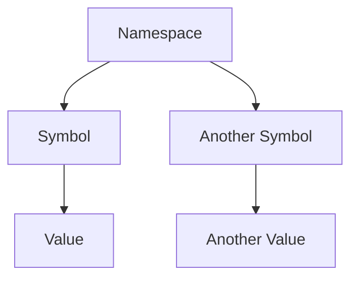

## 5.7.1 Using `def` for Definitions

In this section, we'll delve into the `def` keyword in Clojure, a fundamental building block for defining symbols and binding them to values. As experienced Java developers, you are familiar with the concept of variables and constants. In Clojure, `def` serves a similar purpose but with a functional twist. Let's explore how `def` works, its role in creating immutable bindings, and how it contrasts with Java's variable declarations.

### Understanding `def` in Clojure

The `def` keyword in Clojure is used to bind a value to a symbol within a namespace. This is akin to declaring a variable in Java, but with a key difference: Clojure's bindings are immutable by default. Once a value is bound to a symbol using `def`, it cannot be changed. This immutability is a cornerstone of functional programming, promoting safer and more predictable code.

#### Syntax of `def`

The basic syntax of `def` is straightforward:

```clojure
(def symbol value)
```

- **symbol**: The name of the symbol to which the value will be bound.
- **value**: The value to be associated with the symbol.

Here's a simple example:

```clojure
(def pi 3.14159)
```

In this example, `pi` is a symbol bound to the value `3.14159`. This binding is immutable, meaning `pi` will always represent `3.14159` unless explicitly redefined.

### Comparing `def` with Java's Variable Declarations

In Java, variables can be mutable or immutable (using the `final` keyword). Here's a comparison to illustrate the differences:

**Java Example:**

```java
final double PI = 3.14159;
```

In Java, `PI` is a constant, and its value cannot be changed. This is similar to how `def` works in Clojure, where the binding is immutable by default.

**Clojure Example:**

```clojure
(def pi 3.14159)
```

In Clojure, `pi` is bound to `3.14159`, and this binding is immutable. Unlike Java, there's no need for a `final` keyword to enforce immutability.

### The Role of `def` in Functional Programming

In functional programming, immutability is crucial for ensuring that functions produce consistent outputs for the same inputs, without side effects. By using `def`, we create bindings that cannot be altered, leading to more reliable and maintainable code.

#### Benefits of Immutability

1. **Predictability**: Immutable data structures ensure that functions behave consistently, making it easier to reason about code.
2. **Concurrency**: Immutability eliminates issues related to shared mutable state, simplifying concurrent programming.
3. **Refactoring**: Code that relies on immutable data is easier to refactor, as there are no hidden dependencies or side effects.

### Using `def` for Constants and Configuration

In Clojure, `def` is often used to define constants and configuration values that remain unchanged throughout the program's execution. This is similar to using `final` variables in Java.

**Example: Defining Constants**

```clojure
(def max-connections 100)
(def api-url "https://api.example.com")
```

In this example, `max-connections` and `api-url` are constants that can be used throughout the application.

### Namespaces and `def`

Clojure organizes code into namespaces, which are similar to packages in Java. Each namespace can have its own set of symbols defined using `def`. This organization helps manage large codebases by preventing symbol collisions and promoting modularity.

#### Creating a Namespace

To create a namespace and define symbols within it, use the `ns` macro:

```clojure
(ns myapp.config)

(def max-connections 100)
(def api-url "https://api.example.com")
```

In this example, `max-connections` and `api-url` are defined within the `myapp.config` namespace.

### Practical Examples of `def`

Let's explore some practical examples to illustrate how `def` is used in real-world scenarios.

#### Example 1: Defining Configuration Values

```clojure
(ns myapp.config)

(def db-host "localhost")
(def db-port 5432)
(def db-name "mydatabase")
```

In this example, we define configuration values for a database connection. These values can be used throughout the application to establish a connection to the database.

#### Example 2: Using `def` for Constants

```clojure
(ns myapp.constants)

(def pi 3.14159)
(def golden-ratio 1.61803)
```

Here, we define mathematical constants that can be used in calculations across the application.

### Try It Yourself

To deepen your understanding, try modifying the examples above. For instance, change the value of `pi` and observe how it affects calculations in your program. Remember, you'll need to redefine the symbol using `def` to change its value.

### Visualizing `def` with Diagrams

To better understand how `def` works, let's visualize the process using a diagram.



**Diagram Description**: This diagram illustrates how symbols are bound to values within a namespace using `def`. Each symbol is associated with a specific value, creating an immutable binding.

### Exercises

1. **Exercise 1**: Define a namespace `myapp.settings` and use `def` to bind the following values: `app-name` to `"MyApp"`, `version` to `"1.0.0"`, and `debug-mode` to `true`.

2. **Exercise 2**: Create a new namespace `myapp.math` and define the constants `e` (Euler's number) and `phi` (the golden ratio). Use these constants in a simple calculation.

### Summary and Key Takeaways

- The `def` keyword in Clojure is used to bind values to symbols, creating immutable bindings.
- Immutability is a core principle of functional programming, promoting predictability and simplifying concurrency.
- `def` is commonly used for defining constants and configuration values.
- Namespaces in Clojure help organize code and manage symbol definitions.
- By understanding and using `def`, you can write more reliable and maintainable Clojure code.

### Further Reading

For more information on `def` and related concepts, check out the following resources:

- [Official Clojure Documentation on `def`](https://clojure.org/reference/special_forms#def)
- [ClojureDocs: `def`](https://clojuredocs.org/clojure.core/def)

Now that we've explored how to use `def` for definitions in Clojure, let's continue our journey by examining how to define functions using `defn` in the next section.

## SEO optimized quiz title



### What is the primary purpose of the `def` keyword in Clojure?

- [x] To bind a value to a symbol in the namespace
- [ ] To define a function
- [ ] To create a mutable variable
- [ ] To import a library

> **Explanation:** The `def` keyword is used to bind a value to a symbol, creating an immutable binding within a namespace.


### How does `def` in Clojure compare to Java's `final` keyword?

- [x] Both create immutable bindings
- [ ] Both allow for mutable state
- [ ] `def` is mutable, while `final` is immutable
- [ ] `def` is used for functions, while `final` is for variables

> **Explanation:** Both `def` in Clojure and `final` in Java create immutable bindings, ensuring the value cannot be changed.


### What happens if you try to change the value of a symbol defined with `def`?

- [ ] The value changes successfully
- [x] An error occurs, as the binding is immutable
- [ ] The program crashes
- [ ] The change is ignored

> **Explanation:** In Clojure, bindings created with `def` are immutable, so attempting to change the value will result in an error.


### In which scenario is `def` most appropriately used?

- [x] Defining constants and configuration values
- [ ] Creating mutable variables
- [ ] Defining functions
- [ ] Importing libraries

> **Explanation:** `def` is best used for defining constants and configuration values that do not change throughout the program.


### What is a key benefit of immutability in functional programming?

- [x] Predictability and consistency in code behavior
- [ ] Increased complexity in code
- [ ] Difficulty in managing state
- [ ] Slower performance

> **Explanation:** Immutability ensures that code behavior is predictable and consistent, which is a key benefit in functional programming.


### How do namespaces in Clojure relate to Java packages?

- [x] Both organize code and manage symbol definitions
- [ ] Namespaces are for functions, while packages are for classes
- [ ] Namespaces are mutable, while packages are immutable
- [ ] Namespaces are unique to Clojure and have no Java equivalent

> **Explanation:** Namespaces in Clojure and packages in Java both serve to organize code and manage symbol or class definitions.


### What is the syntax for defining a symbol with `def` in Clojure?

- [x] `(def symbol value)`
- [ ] `(def value symbol)`
- [ ] `(symbol def value)`
- [ ] `(value def symbol)`

> **Explanation:** The correct syntax for defining a symbol with `def` in Clojure is `(def symbol value)`.


### Which of the following is a correct use of `def` in Clojure?

- [x] `(def pi 3.14159)`
- [ ] `(def 3.14159 pi)`
- [ ] `(defn pi 3.14159)`
- [ ] `(let [pi 3.14159])`

> **Explanation:** The correct use of `def` is `(def pi 3.14159)`, binding the value `3.14159` to the symbol `pi`.


### What is the result of redefining a symbol with `def`?

- [x] The symbol is bound to the new value
- [ ] An error occurs
- [ ] The original value remains unchanged
- [ ] The program crashes

> **Explanation:** Redefining a symbol with `def` binds it to the new value, replacing the previous binding.


### True or False: `def` can be used to define functions in Clojure.

- [ ] True
- [x] False

> **Explanation:** False. `def` is used for binding values to symbols, not for defining functions. Functions are defined using `defn`.


