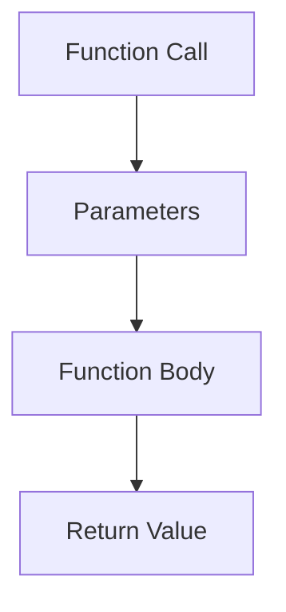

## 5.7.2 Defining Functions with `defn`

As experienced Java developers, you're familiar with defining methods using the `public`, `private`, or `protected` keywords, followed by a return type, method name, and parameters. In Clojure, defining functions is streamlined and more flexible, thanks to the `defn` macro. This section will guide you through the process of defining functions in Clojure using `defn`, highlighting its advantages and unique features compared to Java.

### Understanding `defn`

In Clojure, `defn` is a macro that combines `def` and `fn` to define a named function. It simplifies function definition by allowing you to specify the function name, parameters, and body in a concise manner. Here's a breakdown of how `defn` works:

- **`def`**: Used to define a named entity in the global namespace.
- **`fn`**: Used to create an anonymous function.

By combining these, `defn` allows you to define a named function with optional documentation and metadata.

### Basic Function Definition

Let's start with a simple example of defining a function in Clojure using `defn`:

```clojure
(defn greet
  "A simple function to greet a user."
  [name]
  (str "Hello, " name "!"))
```

- **Function Name**: `greet`
- **Docstring**: `"A simple function to greet a user."` - This is an optional string that documents what the function does.
- **Parameters**: `[name]` - A vector of parameters the function takes.
- **Body**: `(str "Hello, " name "!")` - The expression that forms the body of the function.

#### Comparison with Java

In Java, a similar function would look like this:

```java
public String greet(String name) {
    return "Hello, " + name + "!";
}
```

**Key Differences**:
- **Syntax**: Clojure uses a more concise syntax without explicit return types.
- **Immutability**: Clojure functions are inherently immutable, promoting safer concurrent programming.
- **Docstrings**: Clojure allows inline documentation directly within the function definition.

### Adding Metadata

Clojure functions can include metadata, which is additional information about the function. Metadata can be used for various purposes, such as optimization hints or documentation.

```clojure
(defn ^:private calculate-sum
  "Calculates the sum of two numbers."
  [a b]
  (+ a b))
```

- **Metadata**: `^:private` indicates that this function is private to the namespace, similar to Java's `private` keyword.

### Function Arity

Clojure functions can have multiple arities, meaning they can accept different numbers of arguments. This is similar to method overloading in Java.

```clojure
(defn describe
  "Describes a person with optional age."
  ([name]
   (str "Name: " name))
  ([name age]
   (str "Name: " name ", Age: " age)))
```

- **Multiple Arity**: The `describe` function can be called with one or two arguments.

#### Java Equivalent

In Java, you would achieve this with method overloading:

```java
public String describe(String name) {
    return "Name: " + name;
}

public String describe(String name, int age) {
    return "Name: " + name + ", Age: " + age;
}
```

### Variadic Functions

Clojure supports variadic functions, which can accept a variable number of arguments. This is akin to using varargs in Java.

```clojure
(defn sum-all
  "Sums all given numbers."
  [& numbers]
  (reduce + numbers))
```

- **Variadic Parameter**: `& numbers` collects all additional arguments into a sequence.

#### Java Equivalent

In Java, you would use varargs:

```java
public int sumAll(int... numbers) {
    return Arrays.stream(numbers).sum();
}
```

### Higher-Order Functions

Clojure functions can accept other functions as arguments or return them as results, making them higher-order functions. This is a powerful feature of functional programming.

```clojure
(defn apply-twice
  "Applies a function twice to a value."
  [f x]
  (f (f x)))
```

- **Function as Argument**: `f` is a function passed to `apply-twice`.

#### Java Equivalent

In Java, you would use functional interfaces:

```java
public <T> T applyTwice(Function<T, T> f, T x) {
    return f.apply(f.apply(x));
}
```

### Try It Yourself

Experiment with the following variations:

1. Modify the `greet` function to include a time of day (e.g., "Good morning, John!").
2. Add a new arity to the `describe` function that includes a location.
3. Create a variadic function that calculates the product of all numbers.

### Visualizing Function Definition

Below is a diagram illustrating the flow of data through a Clojure function defined with `defn`:



**Diagram Explanation**: This flowchart shows how a function call passes parameters to the function body, which processes them and returns a value.

### Best Practices for Defining Functions

- **Use Docstrings**: Always document your functions with clear and concise docstrings.
- **Leverage Metadata**: Use metadata to convey additional information about your functions.
- **Prefer Immutability**: Embrace Clojure's immutable data structures for safer and more predictable code.
- **Utilize Higher-Order Functions**: Take advantage of Clojure's ability to pass functions as arguments for more flexible and reusable code.

### Exercises

1. **Define a Function**: Create a function `multiply` that multiplies two numbers and includes a docstring.
2. **Multiple Arity**: Extend the `multiply` function to handle three numbers.
3. **Variadic Function**: Write a function `average` that calculates the average of a variable number of arguments.
4. **Higher-Order Function**: Implement a function `compose` that takes two functions and returns their composition.

### Key Takeaways

- **`defn` Simplifies Function Definition**: It combines `def` and `fn` for concise and powerful function definitions.
- **Docstrings and Metadata**: Enhance your functions with documentation and metadata for better maintainability.
- **Arity and Variadic Capabilities**: Clojure functions can handle multiple arities and variadic arguments, offering flexibility.
- **Higher-Order Functions**: Embrace the power of functional programming by using functions as first-class citizens.

By mastering `defn`, you can write expressive and efficient Clojure code that leverages the full power of functional programming. Now that we've explored how to define functions in Clojure, let's apply these concepts to build robust and maintainable applications.

## Quiz: Mastering Function Definitions with `defn` in Clojure



### What is the primary purpose of the `defn` macro in Clojure?

- [x] To define a named function with optional documentation and metadata
- [ ] To create an anonymous function
- [ ] To declare a variable
- [ ] To import a namespace

> **Explanation:** The `defn` macro is used to define a named function, combining `def` and `fn`, with optional docstrings and metadata.


### How does Clojure handle multiple arities in functions?

- [x] By allowing different parameter lists within the same function definition
- [ ] By using separate functions with different names
- [ ] By using a special keyword
- [ ] By defining functions in different namespaces

> **Explanation:** Clojure allows functions to have multiple arities by defining different parameter lists within the same function definition.


### What is the equivalent of Clojure's variadic functions in Java?

- [ ] Anonymous classes
- [x] Varargs
- [ ] Generics
- [ ] Interfaces

> **Explanation:** Java's varargs feature allows methods to accept a variable number of arguments, similar to Clojure's variadic functions.


### Which of the following is a higher-order function in Clojure?

- [x] A function that takes another function as an argument
- [ ] A function that returns a string
- [ ] A function that modifies a global variable
- [ ] A function that prints to the console

> **Explanation:** A higher-order function is one that takes another function as an argument or returns a function as a result.


### What is the purpose of a docstring in a Clojure function?

- [x] To document the function's purpose and usage
- [ ] To execute code at runtime
- [ ] To declare a variable
- [ ] To import a library

> **Explanation:** A docstring provides documentation for a function, explaining its purpose and usage.


### How can metadata be used in Clojure functions?

- [x] To provide additional information like privacy or optimization hints
- [ ] To execute code at runtime
- [ ] To declare a variable
- [ ] To import a library

> **Explanation:** Metadata in Clojure functions can provide additional information, such as privacy or optimization hints.


### What is the benefit of using higher-order functions in Clojure?

- [x] They allow for more flexible and reusable code
- [ ] They increase the complexity of the code
- [ ] They make the code run faster
- [ ] They reduce the need for documentation

> **Explanation:** Higher-order functions allow for more flexible and reusable code by enabling functions to be passed as arguments or returned as results.


### Which keyword is used to define a private function in Clojure?

- [x] ^:private
- [ ] public
- [ ] protected
- [ ] static

> **Explanation:** The `^:private` metadata is used to define a private function in Clojure.


### What is the main advantage of using `defn` over `def` and `fn` separately?

- [x] It simplifies the syntax for defining named functions
- [ ] It allows for dynamic typing
- [ ] It improves performance
- [ ] It enables parallel processing

> **Explanation:** `defn` simplifies the syntax for defining named functions by combining `def` and `fn` into a single macro.


### True or False: Clojure functions defined with `defn` are mutable by default.

- [ ] True
- [x] False

> **Explanation:** Clojure functions defined with `defn` are immutable by default, promoting safer and more predictable code.


