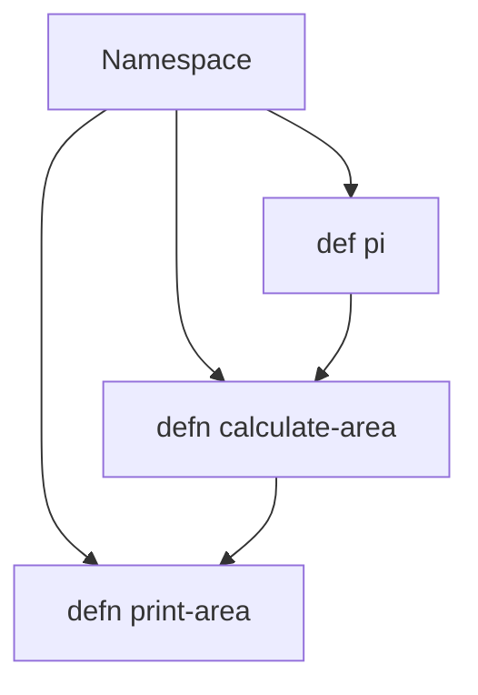

## 5.7.3 Scope and Immutability

In this section, we delve into the concepts of scope and immutability in Clojure, focusing on the `def` and `defn` keywords. As experienced Java developers, you are familiar with variable scope and mutability, but Clojure's approach offers a unique perspective that can enhance your programming practices. Let's explore how Clojure's immutable data structures and namespace-wide scope can lead to more robust and maintainable code.

### Understanding Scope in Clojure

In Clojure, the scope of a definition made with `def` or `defn` is namespace-wide. This means that once a symbol is defined in a namespace, it can be accessed from anywhere within that namespace. This is similar to Java's static fields, which are accessible throughout the class. However, Clojure's namespaces provide a more flexible and modular way to organize code.

#### Namespace-Wide Scope

When you define a symbol using `def`, it becomes part of the current namespace. This is akin to declaring a static variable in Java, but with the added benefit of Clojure's dynamic and flexible namespace system.

```clojure
(ns my-namespace)

(def my-var 42)

(defn my-function []
  (println "The value of my-var is:" my-var))
```

In the example above, `my-var` is accessible throughout the `my-namespace` namespace. This allows for easy sharing of data and functions within a module, promoting modular design.

#### Comparing with Java

In Java, variables can have different scopes: local, instance, or static. Local variables are confined to the method they are declared in, instance variables are tied to an object, and static variables are shared across all instances of a class.

```java
public class MyClass {
    private static int myVar = 42;

    public static void myMethod() {
        System.out.println("The value of myVar is: " + myVar);
    }
}
```

In this Java example, `myVar` is a static variable, accessible throughout the class. Clojure's approach with namespaces is more akin to Java's static variables but offers greater flexibility in organizing code across different files and modules.

### Immutability in Clojure

Immutability is a cornerstone of Clojure's design, providing numerous benefits such as thread safety and ease of reasoning about code. When you define a value with `def`, it is immutable by default. This means that once a value is assigned, it cannot be changed.

#### Immutable Definitions

In Clojure, once you define a value with `def`, it remains constant throughout the program's execution. This is a significant departure from Java, where variables can be reassigned unless explicitly declared as `final`.

```clojure
(def my-immutable-var 100)

;; Attempting to reassign will not change the original value
(def my-immutable-var 200) ;; This creates a new binding, not a reassignment
```

In the above example, `my-immutable-var` is defined with a value of `100`. Attempting to redefine it with `200` does not change the original value but creates a new binding in the current namespace.

#### Benefits of Immutability

- **Thread Safety**: Immutable data structures are inherently thread-safe, eliminating the need for synchronization.
- **Predictability**: Functions that operate on immutable data are easier to reason about, as they do not have side effects.
- **Ease of Debugging**: With immutable data, you can be confident that values do not change unexpectedly, simplifying debugging.

### The `def` Keyword

The `def` keyword is used to define global variables within a namespace. These variables are immutable, meaning their values cannot be changed once set.

```clojure
(def pi 3.14159)

(defn calculate-area [radius]
  (* pi radius radius))
```

In this example, `pi` is defined as a global variable within the namespace, and its value is used in the `calculate-area` function. The immutability of `pi` ensures that its value remains constant throughout the program.

### The `defn` Keyword

The `defn` keyword is used to define functions in Clojure. Functions are first-class citizens in Clojure, meaning they can be passed as arguments, returned from other functions, and stored in data structures.

```clojure
(defn greet [name]
  (str "Hello, " name "!"))

(greet "Alice") ;; => "Hello, Alice!"
```

In this example, `greet` is a function that takes a name as an argument and returns a greeting string. The function itself is immutable, meaning its definition cannot be changed once set.

### Scope and Immutability in Practice

Let's consider a practical example to illustrate the concepts of scope and immutability in Clojure. We'll define a simple program that calculates the area of a circle and demonstrates how immutability ensures consistent results.

```clojure
(ns geometry)

(def pi 3.14159)

(defn calculate-area [radius]
  (* pi radius radius))

(defn print-area [radius]
  (println "The area of the circle is:" (calculate-area radius)))

(print-area 5) ;; => The area of the circle is: 78.53975
```

In this example, `pi` is defined as an immutable value within the `geometry` namespace. The `calculate-area` function uses `pi` to compute the area of a circle, and `print-area` prints the result. The immutability of `pi` ensures that the area calculation is consistent and reliable.

### Try It Yourself

To deepen your understanding of scope and immutability in Clojure, try modifying the code examples above. Experiment with defining new variables and functions, and observe how immutability affects their behavior.

- **Challenge**: Define a new function that calculates the circumference of a circle using the immutable `pi` value. Ensure that your function is pure and does not modify any external state.

### Visualizing Scope and Immutability

To better understand the flow of data and the impact of immutability, let's visualize these concepts using a diagram.



**Diagram Description**: This diagram illustrates the flow of data within a namespace. The `pi` value is defined globally and used by the `calculate-area` function, which is then called by the `print-area` function. The arrows indicate the flow of data and dependencies between definitions.

### Key Takeaways

- **Namespace-Wide Scope**: Definitions made with `def` and `defn` are accessible throughout the namespace, promoting modular design.
- **Immutability**: Values defined with `def` are immutable, ensuring consistency and thread safety.
- **Comparison with Java**: Clojure's approach to scope and immutability offers greater flexibility and reliability compared to Java's variable scoping and mutability.
- **Practical Application**: Use immutability to create predictable and maintainable code, especially in concurrent environments.

### Further Reading

For more information on Clojure's approach to scope and immutability, consider exploring the following resources:

- [Official Clojure Documentation](https://clojure.org/reference)
- [ClojureDocs](https://clojuredocs.org/)
- [Functional Programming in Clojure](https://www.braveclojure.com/)

### Exercises

1. **Exercise**: Define a new namespace and create a function that calculates the volume of a sphere using an immutable `pi` value. Ensure that your function is pure and does not modify any external state.

2. **Exercise**: Compare the behavior of mutable and immutable variables in Java and Clojure by writing equivalent programs in both languages. Observe how immutability affects program behavior and reliability.

3. **Exercise**: Create a Clojure program that uses multiple namespaces to organize code. Define shared constants and functions, and explore how namespace-wide scope facilitates code organization.

## Quiz: Test Your Understanding of Scope and Immutability in Clojure



### What is the scope of a definition made with `def` in Clojure?

- [x] Namespace-wide
- [ ] Local to the function
- [ ] Global across all namespaces
- [ ] Limited to the file

> **Explanation:** In Clojure, a definition made with `def` is namespace-wide, meaning it is accessible throughout the namespace where it is defined.

### How does immutability benefit concurrent programming?

- [x] It ensures thread safety
- [ ] It allows for mutable state
- [ ] It complicates debugging
- [ ] It requires synchronization

> **Explanation:** Immutability ensures thread safety by preventing data from being changed unexpectedly, eliminating the need for synchronization.

### What happens when you redefine a value with `def` in Clojure?

- [x] A new binding is created
- [ ] The original value is changed
- [ ] An error is thrown
- [ ] The program crashes

> **Explanation:** Redefining a value with `def` in Clojure creates a new binding in the current namespace, leaving the original value unchanged.

### How does Clojure's namespace system compare to Java's static variables?

- [x] It offers greater flexibility
- [ ] It is more restrictive
- [ ] It is identical in functionality
- [ ] It does not support modular design

> **Explanation:** Clojure's namespace system offers greater flexibility and supports modular design, unlike Java's static variables which are confined to a single class.

### Which of the following is a benefit of using immutable data structures?

- [x] Enhanced predictability
- [ ] Increased complexity
- [x] Simplified debugging
- [ ] Reduced performance

> **Explanation:** Immutable data structures enhance predictability and simplify debugging by ensuring that values do not change unexpectedly.

### What is the primary purpose of the `defn` keyword in Clojure?

- [x] To define functions
- [ ] To define variables
- [ ] To create mutable state
- [ ] To import namespaces

> **Explanation:** The `defn` keyword in Clojure is used to define functions, which are first-class citizens in the language.

### How does immutability affect the behavior of functions in Clojure?

- [x] It ensures functions are pure
- [ ] It allows functions to modify state
- [x] It prevents side effects
- [ ] It complicates function definitions

> **Explanation:** Immutability ensures that functions in Clojure are pure and free from side effects, leading to more predictable behavior.

### What is a key difference between Clojure's `def` and Java's variable declaration?

- [x] Clojure's `def` creates immutable bindings
- [ ] Java's variables are always immutable
- [ ] Clojure's `def` supports mutable state
- [ ] Java's variables are namespace-wide

> **Explanation:** Clojure's `def` creates immutable bindings, whereas Java's variables can be mutable unless declared as `final`.

### How does Clojure's approach to scope and immutability improve code maintainability?

- [x] By promoting modular design
- [ ] By allowing mutable state
- [ ] By complicating code organization
- [ ] By restricting code reuse

> **Explanation:** Clojure's approach to scope and immutability promotes modular design and code maintainability by ensuring consistent and predictable behavior.

### True or False: In Clojure, once a value is defined with `def`, it can be changed.

- [ ] True
- [x] False

> **Explanation:** False. In Clojure, once a value is defined with `def`, it is immutable and cannot be changed.


