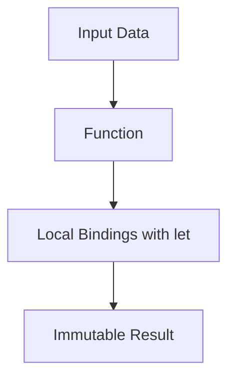

## 5.8.1 Avoiding Reassignment

In this section, we delve into the concept of avoiding reassignment in Clojure, a fundamental aspect of its functional programming paradigm. As experienced Java developers, you're accustomed to mutable variables and reassignment. However, Clojure encourages a different approach—one that emphasizes immutability and functional purity. Let's explore how Clojure's approach to variable assignment can lead to more robust and maintainable code.

### Understanding Immutability in Clojure

In Clojure, immutability is a core principle. When you define a variable using `def`, it is not meant to be reassigned. This contrasts sharply with Java, where variables are often mutable and can be reassigned freely. Immutability in Clojure means that once a value is assigned to a variable, it cannot be changed. This approach has several advantages:

- **Predictability**: Code becomes more predictable as values do not change unexpectedly.
- **Concurrency**: Immutability simplifies concurrent programming by eliminating race conditions.
- **Maintainability**: Code is easier to understand and maintain when data flow is clear and unchanging.

### The Role of `def` in Clojure

In Clojure, the `def` keyword is used to define a global variable. However, unlike Java's `final` keyword, which prevents reassignment, Clojure's `def` is inherently immutable. Here's a simple example:

```clojure
(def pi 3.14159) ; Define a constant value for pi

; Attempting to reassign pi will not work as expected
(def pi 3.14) ; This creates a new binding, not a reassignment
```

**Key Point**: In Clojure, using `def` again with the same name creates a new binding rather than modifying the existing one.

### Embracing Local Bindings with `let`

For values that need to change within a function's scope, Clojure provides the `let` construct. `let` allows you to create local bindings that are limited to the scope of the block, promoting immutability while enabling flexibility within functions.

```clojure
(defn calculate-area [radius]
  (let [pi 3.14159
        area (* pi radius radius)]
    area))

(calculate-area 5) ; => 78.53975
```

In this example, `pi` and `area` are local bindings within the `let` block, ensuring that their values are confined to the function's scope.

### Comparing with Java: Mutable vs. Immutable

In Java, variables are typically mutable unless explicitly declared as `final`. This can lead to side effects and bugs, especially in concurrent applications. Consider the following Java example:

```java
public class Circle {
    private double radius;

    public Circle(double radius) {
        this.radius = radius;
    }

    public double calculateArea() {
        final double pi = 3.14159;
        return pi * radius * radius;
    }
}
```

In this Java example, the `radius` field is mutable, allowing its value to change after the object is created. In contrast, Clojure's approach encourages using immutable data structures and local bindings to achieve the same functionality without side effects.

### Advantages of Avoiding Reassignment

Avoiding reassignment in Clojure offers several benefits:

- **Enhanced Readability**: Code is easier to read and understand when variables are not reassigned.
- **Simplified Debugging**: Immutable values reduce the complexity of tracking changes and debugging.
- **Improved Concurrency**: Immutability eliminates the need for locks and synchronization, making concurrent programming more straightforward.

### Practical Examples and Exercises

Let's explore some practical examples to reinforce these concepts. We'll start with a simple exercise to refactor imperative Java code into idiomatic Clojure.

**Exercise 1: Refactoring Java Code**

Consider the following Java code that calculates the sum of an array:

```java
public int sumArray(int[] numbers) {
    int sum = 0;
    for (int number : numbers) {
        sum += number;
    }
    return sum;
}
```

**Task**: Refactor this code into Clojure, avoiding reassignment.

**Solution**:

```clojure
(defn sum-array [numbers]
  (reduce + numbers))

(sum-array [1 2 3 4 5]) ; => 15
```

In this Clojure example, we use the `reduce` function to accumulate the sum of the array elements, eliminating the need for mutable state.

### Try It Yourself

Experiment with the following Clojure code by modifying the `calculate-area` function to accept different shapes and calculate their areas. Consider using `let` for local bindings and avoid reassignment.

```clojure
(defn calculate-area [shape dimensions]
  (let [pi 3.14159]
    (case shape
      :circle (* pi (first dimensions) (first dimensions))
      :square (* (first dimensions) (first dimensions))
      :rectangle (* (first dimensions) (second dimensions))
      :unknown)))

(calculate-area :circle [5]) ; => 78.53975
(calculate-area :square [4]) ; => 16
(calculate-area :rectangle [4 5]) ; => 20
```

### Visualizing Immutability

To better understand how immutability works in Clojure, let's visualize the flow of data through a function using a Mermaid.js diagram.



**Diagram Description**: This flowchart illustrates how input data is processed through a function in Clojure, with local bindings created using `let`, resulting in an immutable output.

### Further Reading

For more information on Clojure's approach to immutability and functional programming, consider exploring the following resources:

- [Official Clojure Documentation](https://clojure.org/reference/documentation)
- [ClojureDocs](https://clojuredocs.org/)
- [Functional Programming in Clojure](https://www.braveclojure.com/)

### Key Takeaways

- Clojure's immutability and avoidance of reassignment lead to more predictable and maintainable code.
- Use `let` for local bindings within functions to manage values that change within a scope.
- Embrace functional programming principles to simplify concurrency and enhance code readability.

### Exercises and Practice Problems

1. **Exercise 2**: Refactor a Java method that modifies a list of integers by doubling each value into Clojure, using immutable data structures.
2. **Exercise 3**: Implement a Clojure function that calculates the factorial of a number using recursion and `let` for local bindings.
3. **Exercise 4**: Create a Clojure function that filters even numbers from a list without using reassignment.

### Encouragement

Now that we've explored how avoiding reassignment and embracing immutability can enhance your Clojure code, let's apply these concepts to manage state effectively in your applications. By leveraging Clojure's functional programming paradigm, you'll write more robust, maintainable, and concurrent code.

## Quiz: Mastering Immutability and Avoiding Reassignment in Clojure



### What is the primary benefit of avoiding reassignment in Clojure?

- [x] Enhanced code predictability and maintainability
- [ ] Increased performance through mutable state
- [ ] Simplified syntax for variable declaration
- [ ] Reduced memory usage

> **Explanation:** Avoiding reassignment in Clojure enhances code predictability and maintainability by ensuring that values do not change unexpectedly.

### How does Clojure's `def` keyword differ from Java's `final` keyword?

- [x] `def` creates an immutable binding, while `final` prevents reassignment
- [ ] `def` allows reassignment, while `final` creates immutable bindings
- [ ] Both `def` and `final` create mutable variables
- [ ] `def` is used for functions, while `final` is used for variables

> **Explanation:** Clojure's `def` creates an immutable binding, whereas Java's `final` keyword prevents reassignment but does not inherently create immutability.

### Which Clojure construct is used for creating local bindings within a function's scope?

- [x] `let`
- [ ] `def`
- [ ] `var`
- [ ] `fn`

> **Explanation:** The `let` construct in Clojure is used to create local bindings within a function's scope.

### What is the result of using `def` with the same variable name in Clojure?

- [x] It creates a new binding
- [ ] It reassigns the existing variable
- [ ] It throws an error
- [ ] It creates a mutable variable

> **Explanation:** Using `def` with the same variable name in Clojure creates a new binding rather than reassigning the existing one.

### How does immutability in Clojure simplify concurrent programming?

- [x] By eliminating race conditions
- [ ] By allowing shared mutable state
- [ ] By using locks and synchronization
- [ ] By reducing the number of threads

> **Explanation:** Immutability in Clojure simplifies concurrent programming by eliminating race conditions, as values do not change unexpectedly.

### What is the purpose of the `reduce` function in Clojure?

- [x] To accumulate values in a collection
- [ ] To filter elements from a collection
- [ ] To map a function over a collection
- [ ] To sort elements in a collection

> **Explanation:** The `reduce` function in Clojure is used to accumulate values in a collection, such as summing elements.

### Which of the following is a benefit of using immutable data structures?

- [x] Simplified debugging
- [ ] Increased memory usage
- [ ] Easier variable reassignment
- [ ] Faster execution time

> **Explanation:** Immutable data structures simplify debugging by ensuring that values do not change unexpectedly, making it easier to track data flow.

### What is the advantage of using `let` over `def` for local bindings?

- [x] `let` creates bindings limited to a function's scope
- [ ] `let` allows reassignment of variables
- [ ] `let` creates global variables
- [ ] `let` is faster than `def`

> **Explanation:** The `let` construct creates bindings limited to a function's scope, promoting immutability and encapsulation.

### How can you refactor imperative Java code to idiomatic Clojure?

- [x] By using immutable data structures and higher-order functions
- [ ] By using mutable variables and loops
- [ ] By relying on object-oriented design patterns
- [ ] By using Java's `final` keyword

> **Explanation:** Refactoring imperative Java code to idiomatic Clojure involves using immutable data structures and higher-order functions to embrace functional programming principles.

### True or False: In Clojure, once a value is assigned to a variable using `def`, it can be changed.

- [ ] True
- [x] False

> **Explanation:** False. In Clojure, once a value is assigned to a variable using `def`, it cannot be changed, as `def` creates an immutable binding.


