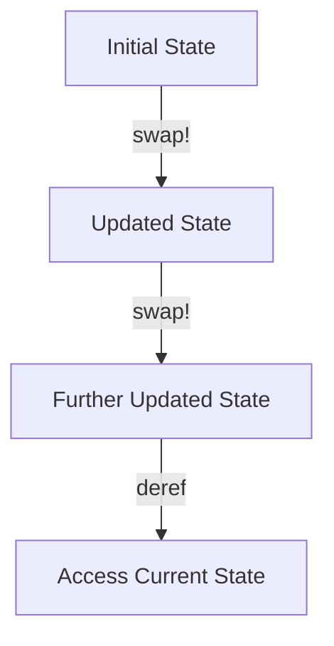

## 5.8.3 Managing State with Atoms

In the world of functional programming, immutability is a cornerstone principle that offers numerous benefits, such as simplified reasoning, enhanced testability, and improved concurrency. However, there are scenarios where managing mutable state becomes necessary, even in a predominantly immutable environment. Clojure provides a robust solution for such cases through **atoms**. In this section, we will explore how atoms work, how they compare to Java's state management techniques, and how you can effectively use them in your Clojure applications.

### Understanding Atoms

Atoms in Clojure are a concurrency primitive designed to manage shared, mutable state. They provide a way to safely update state in a concurrent environment without the complexities of locks or synchronization mechanisms found in Java. Atoms ensure that state changes are atomic, consistent, and isolated, making them a powerful tool for managing state in a functional programming context.

#### Key Characteristics of Atoms

- **Atomic Updates**: Atoms ensure that updates to the state are atomic, meaning that they are completed as a single, indivisible operation.
- **Consistency**: Atoms maintain consistency by applying updates in a coordinated manner, ensuring that the state remains valid.
- **Isolation**: Changes to the state are isolated, preventing interference from other concurrent operations.

### Atoms vs. Java's State Management

In Java, managing mutable state often involves using synchronized blocks or locks to ensure thread safety. This approach can lead to complex and error-prone code, especially in highly concurrent applications. In contrast, Clojure's atoms provide a simpler and more elegant solution for managing state changes.

#### Java Example: Synchronized Blocks

```java
import java.util.concurrent.atomic.AtomicInteger;

public class Counter {
    private AtomicInteger count = new AtomicInteger(0);

    public synchronized void increment() {
        count.incrementAndGet();
    }

    public synchronized int getCount() {
        return count.get();
    }
}
```

In this Java example, we use `AtomicInteger` to manage a counter's state. The `synchronized` keyword ensures that the `increment` and `getCount` methods are thread-safe. However, this approach can become cumbersome as the complexity of the application grows.

#### Clojure Example: Using Atoms

```clojure
(def counter (atom 0))

(defn increment-counter []
  (swap! counter inc))

(defn get-counter []
  @counter)
```

In Clojure, we use an atom to manage the counter's state. The `swap!` function applies a function to the current state of the atom, ensuring atomic updates. The `@` symbol is used to dereference the atom and retrieve its current value.

### Creating and Using Atoms

Creating an atom in Clojure is straightforward. You use the `atom` function to create an atom with an initial value. Once created, you can use various functions to update and access the atom's state.

#### Creating an Atom

```clojure
(def my-atom (atom 42))
```

In this example, we create an atom named `my-atom` with an initial value of `42`.

#### Updating an Atom

To update the state of an atom, you can use the `swap!` or `reset!` functions. The `swap!` function applies a given function to the current state, while `reset!` sets the state to a new value directly.

```clojure
(swap! my-atom inc) ; Increment the value by 1
(reset! my-atom 100) ; Set the value to 100
```

#### Accessing the Atom's Value

To access the current value of an atom, you can use the `deref` function or the `@` reader macro.

```clojure
(println @my-atom) ; Prints the current value of my-atom
```

### Practical Scenarios for Atoms

Atoms are particularly useful in scenarios where you need to manage shared state across multiple threads or processes. Let's explore some practical use cases for atoms in Clojure applications.

#### Example: Managing a Shared Counter

Consider a scenario where multiple threads need to update a shared counter. Using atoms, we can ensure that updates are atomic and consistent.

```clojure
(def shared-counter (atom 0))

(defn increment-shared-counter []
  (swap! shared-counter inc))

(dotimes [_ 100]
  (future (increment-shared-counter)))

(println "Final counter value:" @shared-counter)
```

In this example, we create a shared counter using an atom and increment it concurrently using multiple threads. The final value of the counter is printed, demonstrating the atomicity of updates.

#### Example: Managing Application Configuration

Atoms can also be used to manage application configuration settings that may change at runtime.

```clojure
(def config (atom {:db-host "localhost" :db-port 5432}))

(defn update-config [new-config]
  (swap! config merge new-config))

(update-config {:db-port 5433})
(println "Updated config:" @config)
```

In this example, we use an atom to store configuration settings and update them using the `swap!` function. The `merge` function is used to combine the current configuration with new settings.

### Diagrams and Visualizations

To better understand how atoms work, let's visualize the flow of data and state changes using a diagram.



**Diagram Description**: This diagram illustrates the flow of state changes in an atom. The initial state is updated using the `swap!` function, resulting in an updated state. Further updates are applied, and the current state is accessed using dereferencing.

### Best Practices for Using Atoms

When using atoms in your Clojure applications, consider the following best practices to ensure efficient and effective state management:

- **Minimize State Changes**: Limit the frequency of state changes to reduce contention and improve performance.
- **Use Pure Functions**: Ensure that the functions applied to atoms are pure, meaning they do not produce side effects.
- **Avoid Complex State**: Keep the state managed by atoms simple and focused to avoid unnecessary complexity.
- **Leverage Immutability**: Use immutable data structures within atoms to maintain consistency and reliability.

### Try It Yourself

To deepen your understanding of atoms, try modifying the examples provided:

1. **Experiment with Different Data Types**: Create atoms with different data types, such as strings or vectors, and explore how state changes are applied.
2. **Implement a Simple Cache**: Use an atom to implement a simple cache that stores key-value pairs and supports retrieval and updates.
3. **Simulate Concurrent Updates**: Create a scenario where multiple threads update a shared atom and observe how atomicity is maintained.

### Exercises and Practice Problems

1. **Exercise 1**: Create an atom to manage a list of tasks. Implement functions to add, remove, and list tasks.
2. **Exercise 2**: Use an atom to manage a configuration map. Implement a function to update configuration settings and ensure that changes are logged.
3. **Exercise 3**: Implement a simple banking application using atoms to manage account balances. Ensure that deposits and withdrawals are atomic and consistent.

### Key Takeaways

- Atoms provide a safe and efficient way to manage mutable state in Clojure, ensuring atomicity, consistency, and isolation.
- Compared to Java's state management techniques, atoms offer a simpler and more elegant solution for handling concurrency.
- By following best practices and leveraging the power of atoms, you can effectively manage state changes in your Clojure applications.

### Further Reading

For more information on atoms and state management in Clojure, consider exploring the following resources:

- [Official Clojure Documentation on Atoms](https://clojure.org/reference/atoms)
- [ClojureDocs: Atoms](https://clojuredocs.org/clojure.core/atom)
- [Clojure Programming by Chas Emerick, Brian Carper, and Christophe Grand](https://www.oreilly.com/library/view/clojure-programming/9781449310387/)

Now that we've explored how atoms work in Clojure, let's apply these concepts to manage state effectively in your applications. By understanding and utilizing atoms, you can harness the power of functional programming to build robust and concurrent systems.

## Quiz: Mastering State Management with Atoms in Clojure



### What is the primary purpose of atoms in Clojure?

- [x] To manage shared, mutable state safely in a concurrent environment
- [ ] To perform mathematical calculations
- [ ] To handle file I/O operations
- [ ] To manage network connections

> **Explanation:** Atoms are designed to manage shared, mutable state safely in a concurrent environment, ensuring atomic updates and consistency.

### How do you create an atom in Clojure?

- [x] Using the `atom` function
- [ ] Using the `def` keyword
- [ ] Using the `let` binding
- [ ] Using the `fn` function

> **Explanation:** Atoms are created using the `atom` function, which initializes an atom with a given value.

### Which function is used to update the state of an atom?

- [x] `swap!`
- [ ] `reset!`
- [ ] `deref`
- [ ] `assoc`

> **Explanation:** The `swap!` function is used to update the state of an atom by applying a function to its current value.

### How do you access the current value of an atom?

- [x] Using the `@` reader macro
- [ ] Using the `swap!` function
- [ ] Using the `reset!` function
- [ ] Using the `assoc` function

> **Explanation:** The `@` reader macro is used to dereference an atom and access its current value.

### What is the benefit of using atoms over Java's synchronized blocks?

- [x] Simpler and more elegant state management
- [ ] Faster execution speed
- [ ] Better memory management
- [ ] Easier file handling

> **Explanation:** Atoms provide a simpler and more elegant solution for managing state changes compared to Java's synchronized blocks.

### Which of the following is a best practice when using atoms?

- [x] Use pure functions for state updates
- [ ] Use complex data structures
- [ ] Change state frequently
- [ ] Avoid using immutable data structures

> **Explanation:** Using pure functions for state updates ensures that the functions do not produce side effects, maintaining consistency and reliability.

### What does the `reset!` function do?

- [x] Sets the state of an atom to a new value directly
- [ ] Applies a function to the current state of an atom
- [ ] Dereferences an atom
- [ ] Merges two atoms

> **Explanation:** The `reset!` function sets the state of an atom to a new value directly, without applying a function.

### Which of the following scenarios is suitable for using atoms?

- [x] Managing application configuration settings
- [ ] Performing complex mathematical operations
- [ ] Handling file uploads
- [ ] Managing network sockets

> **Explanation:** Atoms are suitable for managing application configuration settings that may change at runtime.

### What is the role of the `swap!` function in atom state management?

- [x] It applies a function to the current state of an atom, ensuring atomic updates
- [ ] It sets the state of an atom to a new value directly
- [ ] It retrieves the current value of an atom
- [ ] It merges two atoms

> **Explanation:** The `swap!` function applies a function to the current state of an atom, ensuring atomic updates and consistency.

### True or False: Atoms in Clojure can be used to manage complex state changes involving multiple threads.

- [x] True
- [ ] False

> **Explanation:** True. Atoms in Clojure are designed to manage complex state changes involving multiple threads, ensuring atomicity and consistency.


