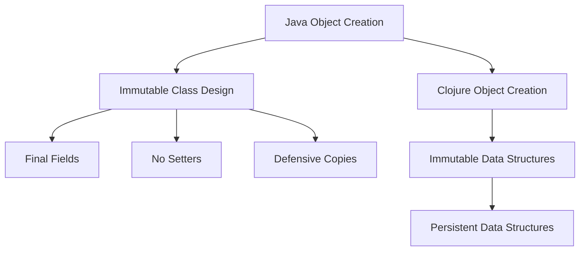

## 5.9.1 Immutability in Java

Immutability is a cornerstone of functional programming, offering benefits such as thread safety, simplicity in reasoning about code, and ease of testing. In Java, achieving immutability requires a deliberate design approach, often involving immutable classes, final fields, and the absence of setters. This section explores how immutability is implemented in Java, the challenges it presents, and how it compares to Clojure's more straightforward approach to immutability.

### Understanding Immutability in Java

In Java, immutability is typically achieved by creating classes whose instances cannot be modified after they are created. This is done by:

1. **Declaring all fields as `final`**: This ensures that the fields can only be assigned once.
2. **Providing no setters**: This prevents modification of fields after object construction.
3. **Using private fields**: This restricts access to the fields, ensuring they cannot be altered directly.
4. **Returning copies of mutable objects**: If a class contains mutable objects, methods should return copies rather than the objects themselves.

#### Example: Immutable Class in Java

Let's consider a simple example of an immutable class in Java:

```java
public final class ImmutablePoint {
    private final int x;
    private final int y;

    public ImmutablePoint(int x, int y) {
        this.x = x;
        this.y = y;
    }

    public int getX() {
        return x;
    }

    public int getY() {
        return y;
    }

    // No setters provided
}
```

**Explanation:**

- The class is declared as `final` to prevent subclassing, which could introduce mutability.
- Fields `x` and `y` are `final`, ensuring they are assigned only once.
- No setters are provided, maintaining immutability after construction.

### Limitations and Verbosity of Java's Immutability

While Java allows for the creation of immutable objects, the process can be verbose and error-prone. Developers must manually ensure that all fields are final, provide no setters, and handle mutable objects carefully. This can lead to boilerplate code and increased complexity, especially in larger classes.

#### Handling Mutable Objects

If a class contains mutable objects, additional steps are necessary to maintain immutability:

```java
import java.util.Date;

public final class ImmutableEvent {
    private final String name;
    private final Date date;

    public ImmutableEvent(String name, Date date) {
        this.name = name;
        this.date = new Date(date.getTime()); // Defensive copy
    }

    public String getName() {
        return name;
    }

    public Date getDate() {
        return new Date(date.getTime()); // Return a copy
    }
}
```

**Explanation:**

- A defensive copy of the `Date` object is created in the constructor and getter to prevent external modification.

### Comparing Java and Clojure's Approach to Immutability

Clojure, being a functional language, embraces immutability by default. All data structures in Clojure are immutable, and the language provides persistent data structures that efficiently share structure between versions.

#### Clojure Example

```clojure
(def point {:x 1 :y 2})

;; Accessing values
(:x point) ; => 1

;; "Modifying" the map returns a new map
(def new-point (assoc point :x 3))
```

**Explanation:**

- Clojure's `assoc` function returns a new map with the updated value, leaving the original map unchanged.
- This approach eliminates the need for defensive copying and complex class design.

### Advantages of Immutability

1. **Thread Safety**: Immutable objects can be shared freely between threads without synchronization.
2. **Simplified Reasoning**: With no state changes, reasoning about code becomes easier.
3. **Ease of Testing**: Immutable objects are predictable and easier to test.

### Challenges in Java

- **Boilerplate Code**: Creating immutable classes in Java often involves repetitive code.
- **Mutable Objects**: Handling mutable objects requires careful design to avoid accidental changes.
- **Performance Overheads**: Creating copies of objects can introduce performance overheads.

### Try It Yourself

Experiment with the Java and Clojure examples provided. Try modifying the Java class to include a mutable list and implement immutability. In Clojure, explore how persistent data structures work by creating and modifying nested maps.

### Diagrams and Visuals

Below is a diagram illustrating the flow of data in immutable Java and Clojure objects:



**Diagram Description**: This flowchart compares the steps involved in creating immutable objects in Java and Clojure. Java requires careful class design, while Clojure provides built-in immutable data structures.

### Further Reading

- [Official Clojure Documentation](https://clojure.org/reference/data_structures)
- [Java Language Specification](https://docs.oracle.com/javase/specs/jls/se17/html/index.html)
- [ClojureDocs](https://clojuredocs.org/)

### Exercises

1. **Java Exercise**: Create an immutable class representing a `Book` with fields for title, author, and publication date. Ensure all fields are immutable.
2. **Clojure Exercise**: Use Clojure's `assoc` and `dissoc` functions to modify a map representing a book's details.

### Key Takeaways

- Immutability in Java requires careful design and can lead to verbose code.
- Clojure provides immutability by default, simplifying code and reducing errors.
- Understanding the differences between Java and Clojure's approach to immutability can help you write more robust and maintainable code.

### Conclusion

Immutability is a powerful concept that enhances code reliability and maintainability. While Java provides mechanisms to achieve immutability, it requires careful design and can be verbose. In contrast, Clojure's default immutability simplifies code and reduces the risk of errors. By understanding and applying these concepts, you can improve your code's robustness and maintainability.

## Quiz: Understanding Immutability in Java and Clojure



### What is a key characteristic of an immutable class in Java?

- [x] All fields are declared as `final`.
- [ ] All fields are declared as `public`.
- [ ] The class must be abstract.
- [ ] The class must implement an interface.

> **Explanation:** Immutable classes in Java typically have all fields declared as `final` to ensure they are assigned only once.

### How does Clojure handle immutability by default?

- [x] All data structures are immutable.
- [ ] All data structures are mutable.
- [ ] Immutability is optional and must be explicitly declared.
- [ ] Immutability is achieved through interfaces.

> **Explanation:** Clojure's data structures are immutable by default, simplifying code and reducing errors.

### What is a common challenge when implementing immutability in Java?

- [x] Handling mutable objects requires careful design.
- [ ] Java does not support immutability.
- [ ] Immutability leads to increased memory usage.
- [ ] Immutability is not compatible with Java's concurrency model.

> **Explanation:** Handling mutable objects in Java requires defensive copying and careful design to maintain immutability.

### Which of the following is NOT a benefit of immutability?

- [ ] Thread safety
- [ ] Simplified reasoning
- [ ] Ease of testing
- [x] Increased complexity

> **Explanation:** Immutability simplifies reasoning and testing, and enhances thread safety, but does not increase complexity.

### What is the purpose of defensive copying in Java's immutable classes?

- [x] To prevent external modification of mutable objects.
- [ ] To increase performance.
- [ ] To reduce memory usage.
- [ ] To simplify code.

> **Explanation:** Defensive copying ensures that mutable objects cannot be modified externally, maintaining immutability.

### In Clojure, what does the `assoc` function do?

- [x] Returns a new map with an updated key-value pair.
- [ ] Modifies the original map in place.
- [ ] Deletes a key-value pair from a map.
- [ ] Combines two maps into one.

> **Explanation:** The `assoc` function in Clojure returns a new map with the specified key-value pair updated, leaving the original map unchanged.

### How can immutability improve concurrency in Java?

- [x] Immutable objects can be shared between threads without synchronization.
- [ ] Immutable objects require complex locking mechanisms.
- [ ] Immutability reduces the need for multithreading.
- [ ] Immutability is unrelated to concurrency.

> **Explanation:** Immutable objects are inherently thread-safe, allowing them to be shared between threads without the need for synchronization.

### What is a persistent data structure in Clojure?

- [x] A data structure that efficiently shares structure between versions.
- [ ] A data structure that cannot be modified.
- [ ] A data structure that is stored on disk.
- [ ] A data structure that is automatically serialized.

> **Explanation:** Persistent data structures in Clojure efficiently share structure between versions, allowing for immutability with minimal overhead.

### Which of the following is a limitation of Java's approach to immutability?

- [x] Verbose and error-prone code.
- [ ] Lack of support for immutable objects.
- [ ] Immutability is enforced by the compiler.
- [ ] Immutability is incompatible with Java's type system.

> **Explanation:** Java's approach to immutability can be verbose and error-prone, requiring careful design and implementation.

### True or False: In Clojure, immutability must be explicitly declared for each data structure.

- [ ] True
- [x] False

> **Explanation:** In Clojure, immutability is the default behavior for all data structures, so it does not need to be explicitly declared.


