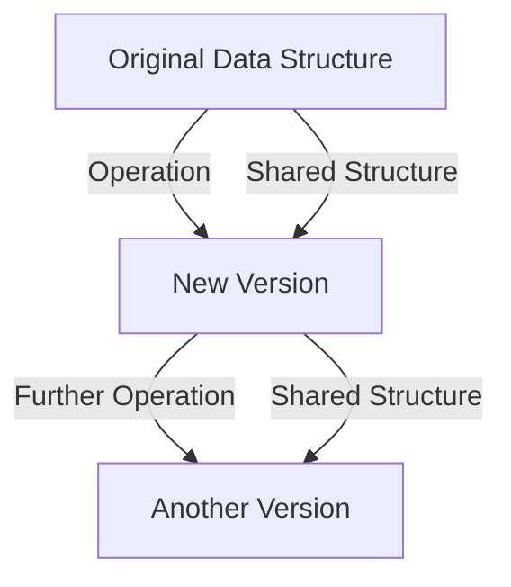

## 5.9.2 Immutability by Default in Clojure

As experienced Java developers, we are accustomed to mutable data structures and the complexities they introduce, especially when dealing with concurrency and state management. Clojure, a functional programming language that runs on the Java Virtual Machine (JVM), offers a refreshing approach by making immutability the default. This paradigm shift not only simplifies the development process but also enhances the reliability and maintainability of code. In this section, we will explore how Clojure's immutable data structures work, compare them with Java's mutable counterparts, and provide practical examples to illustrate their benefits.

### Understanding Immutability in Clojure

In Clojure, all core data structures—such as lists, vectors, maps, and sets—are immutable by default. This means that once a data structure is created, it cannot be changed. Instead of modifying the original data structure, operations on immutable data structures return new versions with the desired changes. This approach eliminates many common programming errors related to shared mutable state and makes reasoning about code behavior easier.

#### Immutable Data Structures in Clojure

Let's take a closer look at some of Clojure's immutable data structures:

- **Lists**: Ordered collections of elements, optimized for sequential access.
- **Vectors**: Indexed collections, providing efficient random access.
- **Maps**: Collections of key-value pairs, allowing fast lookups.
- **Sets**: Collections of unique elements, supporting efficient membership tests.

Each of these data structures is designed to be persistent, meaning they share structure with previous versions to minimize memory usage and improve performance.

#### Code Example: Immutable Data Structures

Here's a simple example demonstrating the immutability of Clojure's data structures:

```clojure
;; Define an immutable vector
(def my-vector [1 2 3 4])

;; Attempt to "modify" the vector by adding an element
(def new-vector (conj my-vector 5))

;; Print the original and new vectors
(println "Original Vector:" my-vector)  ; Output: Original Vector: [1 2 3 4]
(println "New Vector:" new-vector)      ; Output: New Vector: [1 2 3 4 5]
```

In this example, `my-vector` remains unchanged after the `conj` operation, which creates a new vector `new-vector` with the additional element.

### Comparing Immutability in Java and Clojure

Java, being an object-oriented language, traditionally relies on mutable data structures. While Java 8 introduced features like `Optional`, `Stream`, and `CompletableFuture` that encourage a more functional style, immutability is not enforced by default. Developers must explicitly design their classes to be immutable, often using techniques such as private final fields and defensive copying.

#### Java Example: Immutable Class

Here's an example of how you might implement an immutable class in Java:

```java
public final class ImmutablePoint {
    private final int x;
    private final int y;

    public ImmutablePoint(int x, int y) {
        this.x = x;
        this.y = y;
    }

    public int getX() {
        return x;
    }

    public int getY() {
        return y;
    }

    public ImmutablePoint move(int dx, int dy) {
        return new ImmutablePoint(x + dx, y + dy);
    }
}
```

In this Java example, the `ImmutablePoint` class is immutable because its fields are final and private, and it provides no setters. The `move` method returns a new instance rather than modifying the existing one.

### Benefits of Immutability in Clojure

Clojure's default immutability offers several advantages:

1. **Simplified Concurrency**: With immutable data structures, there is no need for locks or synchronization, as data cannot be changed by concurrent threads.
2. **Predictable Code**: Immutability ensures that data remains consistent throughout its lifecycle, making it easier to reason about program behavior.
3. **Enhanced Reusability**: Functions that operate on immutable data can be reused without concern for unintended side effects.
4. **Improved Debugging**: Immutable data structures simplify debugging by eliminating issues related to unexpected state changes.

#### Diagram: Immutability and Persistent Data Structures

Below is a diagram illustrating how persistent data structures work in Clojure. Each new version of a data structure shares parts of the original, minimizing memory usage.



*Diagram: Persistent data structures in Clojure share structure with previous versions, optimizing memory usage.*

### Practical Examples and Exercises

Let's explore some practical examples to reinforce our understanding of immutability in Clojure.

#### Example 1: Transforming Collections

Consider a scenario where we need to transform a collection of numbers by doubling each value:

```clojure
(def numbers [1 2 3 4 5])

;; Use map to create a new collection with doubled values
(def doubled-numbers (map #(* 2 %) numbers))

(println "Original Numbers:" numbers)         ; Output: Original Numbers: [1 2 3 4 5]
(println "Doubled Numbers:" doubled-numbers)  ; Output: Doubled Numbers: (2 4 6 8 10)
```

In this example, the `map` function returns a new collection with the transformed values, leaving the original collection unchanged.

#### Example 2: Immutability in Application State

Suppose we are managing the state of a simple counter in an application:

```clojure
(def counter 0)

;; Function to increment the counter
(defn increment-counter [current-counter]
  (inc current-counter))

;; Update the counter
(def new-counter (increment-counter counter))

(println "Original Counter:" counter)  ; Output: Original Counter: 0
(println "New Counter:" new-counter)   ; Output: New Counter: 1
```

Here, the `increment-counter` function returns a new value without altering the original `counter`.

### Try It Yourself

To deepen your understanding, try modifying the examples above:

- **Example 1**: Change the transformation function to triple the numbers instead of doubling them.
- **Example 2**: Create a function that decrements the counter and test it with the existing `counter`.

### Exercises

1. **Exercise 1**: Write a function that takes a map of student names and scores, and returns a new map with scores increased by 10%.
2. **Exercise 2**: Implement a function that reverses a vector without using any mutable operations.

### Key Takeaways

- **Immutability by Default**: Clojure's data structures are immutable by default, simplifying concurrency and state management.
- **Persistent Data Structures**: Clojure's data structures share structure with previous versions, optimizing memory usage.
- **Simplified Concurrency**: Immutability eliminates the need for locks and synchronization in concurrent programs.
- **Enhanced Code Predictability**: Immutable data ensures consistent state, making code easier to reason about.

### Further Reading

For more information on Clojure's immutable data structures, consider exploring the following resources:

- [Official Clojure Documentation](https://clojure.org/reference/data_structures)
- [ClojureDocs](https://clojuredocs.org/)
- [Functional Programming in Clojure](https://www.braveclojure.com/)

Now that we've explored how immutable data structures work in Clojure, let's apply these concepts to manage state effectively in your applications.

## Quiz: Understanding Immutability in Clojure



### Which of the following is a key feature of Clojure's data structures?

- [x] Immutability
- [ ] Mutability
- [ ] Dynamic typing
- [ ] Object orientation

> **Explanation:** Clojure's data structures are immutable by default, which is a fundamental feature of the language.

### What happens when you perform an operation on an immutable data structure in Clojure?

- [x] A new version of the data structure is created
- [ ] The original data structure is modified
- [ ] The operation is ignored
- [ ] An error is thrown

> **Explanation:** Operations on immutable data structures in Clojure return new versions with the desired changes, leaving the original unchanged.

### How do persistent data structures in Clojure optimize memory usage?

- [x] By sharing structure with previous versions
- [ ] By copying the entire data structure
- [ ] By using mutable fields
- [ ] By compressing data

> **Explanation:** Persistent data structures in Clojure share structure with previous versions to minimize memory usage.

### What is a benefit of using immutable data structures in concurrent programming?

- [x] No need for locks or synchronization
- [ ] Faster execution
- [ ] Easier to write
- [ ] More flexible

> **Explanation:** Immutability eliminates the need for locks or synchronization, simplifying concurrent programming.

### Which Clojure function is used to transform collections?

- [x] map
- [ ] filter
- [ ] reduce
- [ ] conj

> **Explanation:** The `map` function is used to apply a transformation to each element in a collection, returning a new collection.

### In Java, how can you ensure a class is immutable?

- [x] Use private final fields and no setters
- [ ] Use public fields
- [ ] Use mutable fields
- [ ] Use synchronized methods

> **Explanation:** In Java, immutability is achieved by using private final fields and providing no setters, ensuring fields cannot be changed after construction.

### What is a common challenge when working with mutable data structures?

- [x] Managing shared state
- [ ] Faster execution
- [ ] Easier debugging
- [ ] More flexible design

> **Explanation:** Mutable data structures can lead to challenges in managing shared state, especially in concurrent environments.

### Which of the following is NOT a Clojure data structure?

- [x] ArrayList
- [ ] List
- [ ] Vector
- [ ] Map

> **Explanation:** `ArrayList` is a Java data structure, not a Clojure data structure. Clojure uses immutable lists, vectors, and maps.

### How does Clojure's immutability enhance code predictability?

- [x] By ensuring consistent state
- [ ] By allowing dynamic typing
- [ ] By supporting object orientation
- [ ] By enabling mutable fields

> **Explanation:** Immutability ensures that data remains consistent throughout its lifecycle, enhancing code predictability.

### True or False: Clojure's immutability requires explicit design by the developer.

- [x] False
- [ ] True

> **Explanation:** In Clojure, immutability is the default behavior for data structures, not requiring explicit design by the developer.


