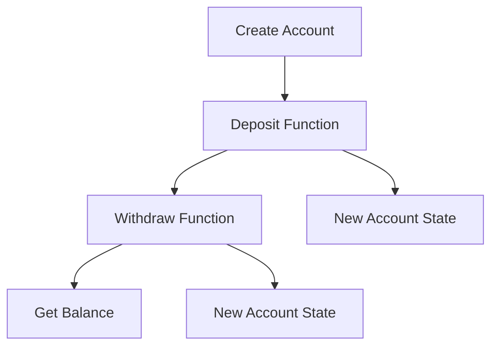

## 5.9.3 Case Study: Refactoring Java Code

In this section, we will delve into a detailed case study that demonstrates how to refactor a Java class with mutable state into an immutable Clojure representation. This exercise will not only illustrate the practical steps involved in such a transformation but also highlight the design changes and benefits achieved through immutability and functional programming.

### Understanding the Java Code

Let's begin by examining a typical Java class that manages a bank account. This class uses mutable state to track the balance, which is a common pattern in object-oriented programming.

```java
public class BankAccount {
    private double balance;

    public BankAccount(double initialBalance) {
        this.balance = initialBalance;
    }

    public void deposit(double amount) {
        if (amount > 0) {
            balance += amount;
        }
    }

    public void withdraw(double amount) {
        if (amount > 0 && amount <= balance) {
            balance -= amount;
        }
    }

    public double getBalance() {
        return balance;
    }
}
```

**Key Characteristics:**
- **Mutable State**: The `balance` field is mutable, allowing its value to change over time.
- **Encapsulation**: Methods like `deposit` and `withdraw` encapsulate the logic for modifying the balance.
- **Imperative Style**: The code uses imperative constructs to manage state changes.

### Challenges with Mutable State

Mutable state can lead to several issues, especially in concurrent environments:
- **Race Conditions**: Multiple threads accessing and modifying the balance can lead to inconsistent states.
- **Complexity**: Managing state changes requires careful synchronization, increasing code complexity.
- **Testing Difficulties**: Testing mutable state often involves setting up specific scenarios, which can be error-prone.

### Refactoring to Clojure

Now, let's refactor this Java class into an immutable Clojure representation. We'll leverage Clojure's strengths in immutability and functional programming to create a more robust solution.

#### Step 1: Define the Data Structure

In Clojure, we represent data using immutable data structures. We'll use a map to represent the bank account, with the balance as a key-value pair.

```clojure
(defn create-account [initial-balance]
  {:balance initial-balance})
```

**Explanation:**
- **Immutable Map**: The account is represented as an immutable map, ensuring that the balance cannot be changed directly.

#### Step 2: Implement Functional Operations

We'll define functions to perform operations on the account, returning new account states instead of modifying the existing one.

```clojure
(defn deposit [account amount]
  (if (> amount 0)
    (update account :balance + amount)
    account))

(defn withdraw [account amount]
  (if (and (> amount 0) (<= amount (:balance account)))
    (update account :balance - amount)
    account))
```

**Explanation:**
- **Pure Functions**: Both `deposit` and `withdraw` are pure functions that return a new account map with the updated balance.
- **No Side Effects**: These functions do not modify the input account, adhering to functional programming principles.

#### Step 3: Accessing the Balance

To retrieve the balance, we simply access the value associated with the `:balance` key.

```clojure
(defn get-balance [account]
  (:balance account))
```

### Benefits of the Refactored Clojure Code

Refactoring the Java code to Clojure provides several advantages:

- **Immutability**: The account's state is immutable, eliminating issues related to concurrent modifications.
- **Simplicity**: The code is simpler and easier to reason about, as it avoids mutable state and side effects.
- **Concurrency**: Immutability naturally supports concurrent operations, as there is no risk of race conditions.
- **Testability**: Pure functions are easier to test, as they depend only on their inputs and produce predictable outputs.

### Comparing Java and Clojure Code

Let's compare the Java and Clojure implementations side by side to highlight the differences:

| Aspect                | Java Implementation                           | Clojure Implementation                      |
|-----------------------|-----------------------------------------------|---------------------------------------------|
| **State Management**  | Mutable field (`balance`)                     | Immutable map (`{:balance initial-balance}`)|
| **Operations**        | Methods with side effects                     | Pure functions returning new states         |
| **Concurrency**       | Requires synchronization                      | Naturally safe due to immutability          |
| **Code Complexity**   | Higher due to state management                | Lower with functional style                 |
| **Testing**           | Requires setup for mutable state              | Simplified with pure functions              |

### Visualizing the Transformation

Below is a diagram illustrating the flow of data through the Clojure functions, emphasizing the immutability and functional transformations.



**Diagram Description**: This flowchart represents the sequence of operations on a bank account in Clojure, highlighting the creation of new account states through functional transformations.

### Try It Yourself

To deepen your understanding, try modifying the Clojure code to add new features, such as:
- Implementing a `transfer` function to move funds between accounts.
- Adding validation to prevent negative balances.
- Extending the account map with additional fields, like account holder information.

### Exercises

1. **Refactor a Java Class**: Choose a Java class with mutable state and refactor it into Clojure, focusing on immutability and pure functions.
2. **Concurrency Experiment**: Implement a concurrent scenario in Java and Clojure, comparing the complexity and safety of each approach.
3. **Testing Challenge**: Write unit tests for both the Java and Clojure implementations, observing the differences in test setup and execution.

### Key Takeaways

- **Immutability**: Embracing immutability in Clojure leads to safer, more predictable code.
- **Functional Programming**: Pure functions simplify reasoning and testing, reducing complexity.
- **Concurrency**: Clojure's immutable data structures naturally support concurrent operations without additional synchronization.

By refactoring Java code to Clojure, we not only improve the design but also leverage the strengths of functional programming to create more robust and maintainable software. Now that we've explored how immutable data structures work in Clojure, let's apply these concepts to manage state effectively in your applications.

For further reading, explore the [Official Clojure Documentation](https://clojure.org/reference/documentation) and [ClojureDocs](https://clojuredocs.org/).

## Quiz: Mastering Immutability and Functional Refactoring



### What is a key benefit of using immutable data structures in Clojure?

- [x] They eliminate issues related to concurrent modifications.
- [ ] They allow direct modification of state.
- [ ] They require complex synchronization mechanisms.
- [ ] They increase code complexity.

> **Explanation:** Immutable data structures in Clojure eliminate issues related to concurrent modifications by ensuring that data cannot be changed once created, thus avoiding race conditions.

### How does Clojure handle state changes in functional programming?

- [x] By returning new states through pure functions.
- [ ] By modifying existing states directly.
- [ ] By using synchronized methods.
- [ ] By employing complex locking mechanisms.

> **Explanation:** Clojure handles state changes by returning new states through pure functions, which do not modify the original state, adhering to functional programming principles.

### What is the primary advantage of using pure functions in Clojure?

- [x] They produce predictable outputs based on inputs.
- [ ] They allow side effects.
- [ ] They require mutable state.
- [ ] They increase code complexity.

> **Explanation:** Pure functions in Clojure produce predictable outputs based solely on their inputs, making them easier to test and reason about.

### In the refactored Clojure code, how is the bank account represented?

- [x] As an immutable map.
- [ ] As a mutable object.
- [ ] As a synchronized class.
- [ ] As a thread-safe collection.

> **Explanation:** In the refactored Clojure code, the bank account is represented as an immutable map, ensuring that its state cannot be changed directly.

### What is a common challenge with mutable state in Java?

- [x] Race conditions in concurrent environments.
- [ ] Simplified state management.
- [ ] Predictable behavior.
- [ ] Easy testing.

> **Explanation:** Mutable state in Java can lead to race conditions in concurrent environments, as multiple threads may access and modify the state simultaneously.

### How does Clojure's approach to concurrency differ from Java's?

- [x] Clojure uses immutability to naturally support concurrency.
- [ ] Clojure requires explicit synchronization for concurrency.
- [ ] Clojure uses locks and monitors for concurrency.
- [ ] Clojure does not support concurrency.

> **Explanation:** Clojure uses immutability to naturally support concurrency, eliminating the need for explicit synchronization and reducing the risk of race conditions.

### What is the role of the `update` function in Clojure?

- [x] It updates a value in an immutable map, returning a new map.
- [ ] It modifies a value in a mutable map.
- [ ] It locks a map for updates.
- [ ] It synchronizes access to a map.

> **Explanation:** The `update` function in Clojure updates a value in an immutable map and returns a new map with the updated value, adhering to immutability principles.

### Why are pure functions easier to test?

- [x] They depend only on their inputs and produce predictable outputs.
- [ ] They allow side effects.
- [ ] They require complex setup.
- [ ] They modify global state.

> **Explanation:** Pure functions are easier to test because they depend only on their inputs and produce predictable outputs, making them independent of external state.

### What is a key difference between Java and Clojure in handling state?

- [x] Java uses mutable state, while Clojure uses immutable state.
- [ ] Java uses immutable state, while Clojure uses mutable state.
- [ ] Both use mutable state.
- [ ] Both use immutable state.

> **Explanation:** Java typically uses mutable state, while Clojure uses immutable state, which leads to different approaches in handling state changes.

### True or False: Immutability in Clojure requires complex synchronization mechanisms.

- [ ] True
- [x] False

> **Explanation:** False. Immutability in Clojure does not require complex synchronization mechanisms because immutable data structures cannot be changed, eliminating the need for synchronization.


