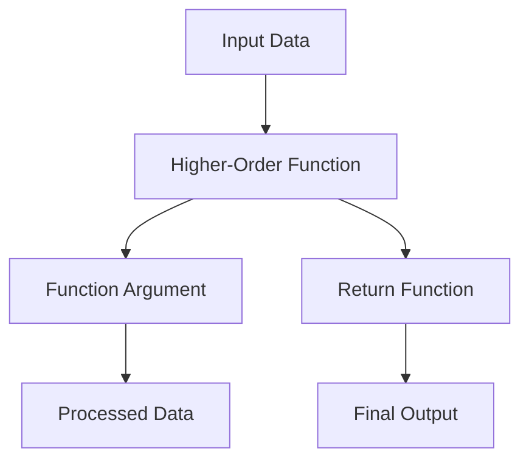

## 6.1.1 Definition and Significance

In the realm of functional programming, **functions as first-class citizens** is a pivotal concept that distinguishes languages like Clojure from traditional imperative languages such as Java. This principle allows functions to be treated like any other data type, enabling them to be assigned to variables, passed as arguments, and returned from other functions. Understanding this concept is crucial for Java developers transitioning to Clojure, as it underpins many of the language's powerful features and idioms.

### What Does "First-Class Citizen" Mean?

In programming, when we say that functions are first-class citizens, we mean that they can be manipulated just like any other data type. This includes:

- **Assigning functions to variables**: Just as you can assign a number or a string to a variable, you can assign a function to a variable.
- **Passing functions as arguments**: Functions can be passed as arguments to other functions, allowing for flexible and reusable code.
- **Returning functions from other functions**: Functions can be the return value of other functions, enabling the creation of higher-order functions.

This capability is foundational to functional programming, allowing for more abstract and concise code. It facilitates the creation of higher-order functions, which are functions that operate on other functions, either by taking them as arguments or by returning them.

### Functions as First-Class Citizens in Clojure

In Clojure, functions are first-class citizens, which means they can be used in all the ways described above. This is a significant departure from Java, where functions are not first-class citizens and must be encapsulated within objects or interfaces.

#### Assigning Functions to Variables

In Clojure, you can assign a function to a variable using the `def` keyword. Here's a simple example:

```clojure
(def add-one (fn [x] (+ x 1)))

;; Usage
(add-one 5) ; => 6
```

In this example, we define a function `add-one` that takes a single argument `x` and returns `x + 1`. We then assign this function to the variable `add-one`, which can be used just like any other variable.

#### Passing Functions as Arguments

One of the most powerful aspects of first-class functions is the ability to pass them as arguments to other functions. This allows for the creation of highly flexible and reusable code. Here's an example:

```clojure
(defn apply-function [f x]
  (f x))

;; Usage
(apply-function add-one 5) ; => 6
```

In this example, `apply-function` is a higher-order function that takes a function `f` and a value `x` as arguments and applies `f` to `x`. We can pass `add-one` to `apply-function`, demonstrating how functions can be passed as arguments.

#### Returning Functions from Functions

Clojure also allows functions to return other functions. This is a powerful feature that enables the creation of function factories or generators. Here's an example:

```clojure
(defn make-adder [n]
  (fn [x] (+ x n)))

;; Usage
(def add-five (make-adder 5))
(add-five 10) ; => 15
```

In this example, `make-adder` is a function that takes a number `n` and returns a new function that adds `n` to its argument. We can use `make-adder` to create a new function `add-five` that adds 5 to its argument.

### Comparing with Java

In Java, functions are not first-class citizens. Instead, Java relies on objects and interfaces to achieve similar functionality. For example, before Java 8, you would use anonymous classes to pass behavior as arguments. With Java 8 and later, lambda expressions and functional interfaces provide a more concise way to achieve similar results, but they still lack the full flexibility of first-class functions.

#### Java Example: Anonymous Classes

```java
import java.util.function.Function;

Function<Integer, Integer> addOne = new Function<Integer, Integer>() {
    @Override
    public Integer apply(Integer x) {
        return x + 1;
    }
};

// Usage
addOne.apply(5); // => 6
```

In this Java example, we use an anonymous class to create a function that adds one to its argument. This approach is verbose and lacks the elegance of Clojure's first-class functions.

#### Java Example: Lambda Expressions

```java
Function<Integer, Integer> addOne = x -> x + 1;

// Usage
addOne.apply(5); // => 6
```

With Java 8, lambda expressions provide a more concise way to define functions, but they are still not first-class citizens. They cannot be returned from methods or assigned to variables in the same way as Clojure functions.

### The Significance of First-Class Functions

The ability to treat functions as first-class citizens is a cornerstone of functional programming and has several significant benefits:

- **Abstraction and Reusability**: Functions can be abstracted and reused in different contexts, reducing code duplication and improving maintainability.
- **Composability**: Functions can be composed to create more complex behavior from simple building blocks, leading to more modular and understandable code.
- **Flexibility**: Code can be more flexible and adaptable, as functions can be passed around and manipulated at runtime.

### Visualizing Function Flow

To better understand how functions as first-class citizens enable powerful abstractions, let's visualize the flow of data through higher-order functions using a diagram.



**Diagram Explanation**: This diagram illustrates how input data flows through a higher-order function, which takes a function as an argument and returns another function. The processed data is then transformed by the returned function to produce the final output.

### Try It Yourself

To deepen your understanding of first-class functions in Clojure, try modifying the examples above:

- Create a function that multiplies its argument by a given number and assign it to a variable.
- Write a higher-order function that takes two functions as arguments and returns a new function that applies both functions to its input.
- Experiment with returning different types of functions from a function factory.

### Key Takeaways

- **Functions as First-Class Citizens**: In Clojure, functions can be assigned to variables, passed as arguments, and returned from other functions, enabling powerful abstractions and flexibility.
- **Higher-Order Functions**: These functions operate on other functions, allowing for more abstract and reusable code.
- **Comparison with Java**: While Java has made strides with lambda expressions, it still lacks the full flexibility of first-class functions found in Clojure.
- **Benefits**: First-class functions enhance abstraction, reusability, composability, and flexibility in code.

By embracing the concept of functions as first-class citizens, you can unlock the full potential of functional programming in Clojure, leading to more elegant and maintainable code.

### Further Reading

For more information on functions as first-class citizens and higher-order functions, consider exploring the following resources:

- [Official Clojure Documentation](https://clojure.org/reference/functions)
- [ClojureDocs: Functions](https://clojuredocs.org/clojure.core/fn)
- [Functional Programming in Clojure](https://www.braveclojure.com/functional-programming/)

Now that we've explored the definition and significance of functions as first-class citizens in Clojure, let's delve into how these concepts enable the creation of higher-order functions in the next section.

## Quiz Time!



### What does it mean for functions to be first-class citizens in Clojure?

- [x] Functions can be assigned to variables, passed as arguments, and returned from other functions.
- [ ] Functions can only be used within the scope they are defined.
- [ ] Functions cannot be passed as arguments.
- [ ] Functions must be encapsulated within objects.

> **Explanation:** In Clojure, functions are first-class citizens, meaning they can be treated like any other value. They can be assigned to variables, passed as arguments, and returned from other functions.

### How does Clojure's treatment of functions differ from Java's?

- [x] Clojure treats functions as first-class citizens, while Java does not.
- [ ] Java allows functions to be returned from methods, while Clojure does not.
- [ ] Clojure requires functions to be encapsulated within objects, unlike Java.
- [ ] Java treats functions as first-class citizens, while Clojure does not.

> **Explanation:** Clojure treats functions as first-class citizens, allowing them to be assigned to variables, passed as arguments, and returned from other functions. Java, on the other hand, does not treat functions as first-class citizens.

### What is a higher-order function?

- [x] A function that takes other functions as arguments or returns a function.
- [ ] A function that can only be used within a specific scope.
- [ ] A function that cannot be passed as an argument.
- [ ] A function that must be encapsulated within an object.

> **Explanation:** A higher-order function is a function that operates on other functions, either by taking them as arguments or by returning them.

### Which of the following is a benefit of first-class functions?

- [x] Enhanced abstraction and reusability.
- [ ] Reduced code flexibility.
- [ ] Increased code duplication.
- [ ] Limited composability.

> **Explanation:** First-class functions enhance abstraction and reusability, allowing for more modular and understandable code.

### How can functions be used in Clojure?

- [x] Assigned to variables.
- [x] Passed as arguments.
- [x] Returned from other functions.
- [ ] Only used within the scope they are defined.

> **Explanation:** In Clojure, functions can be assigned to variables, passed as arguments, and returned from other functions, providing flexibility and power in code design.

### What is the purpose of the `def` keyword in Clojure?

- [x] To assign a function to a variable.
- [ ] To define a class.
- [ ] To create an object.
- [ ] To encapsulate a function within an object.

> **Explanation:** The `def` keyword in Clojure is used to assign a function to a variable, allowing it to be used like any other value.

### What is a function factory in Clojure?

- [x] A function that returns other functions.
- [ ] A function that can only be used within a specific scope.
- [ ] A function that cannot be passed as an argument.
- [ ] A function that must be encapsulated within an object.

> **Explanation:** A function factory in Clojure is a function that returns other functions, enabling the creation of customizable and reusable code.

### How do lambda expressions in Java compare to Clojure's first-class functions?

- [x] Lambda expressions provide a more concise way to define functions but lack the full flexibility of first-class functions.
- [ ] Lambda expressions allow functions to be returned from methods, unlike Clojure.
- [ ] Lambda expressions require functions to be encapsulated within objects.
- [ ] Lambda expressions treat functions as first-class citizens, unlike Clojure.

> **Explanation:** Lambda expressions in Java provide a more concise way to define functions but do not offer the full flexibility of first-class functions, which can be assigned to variables, passed as arguments, and returned from other functions in Clojure.

### What is the significance of higher-order functions in functional programming?

- [x] They allow for more abstract and reusable code.
- [ ] They limit code flexibility.
- [ ] They increase code duplication.
- [ ] They reduce composability.

> **Explanation:** Higher-order functions allow for more abstract and reusable code, enabling the creation of complex behavior from simple building blocks.

### True or False: In Clojure, functions can be treated like any other data type.

- [x] True
- [ ] False

> **Explanation:** True. In Clojure, functions are first-class citizens, meaning they can be treated like any other data type, such as numbers or strings.


