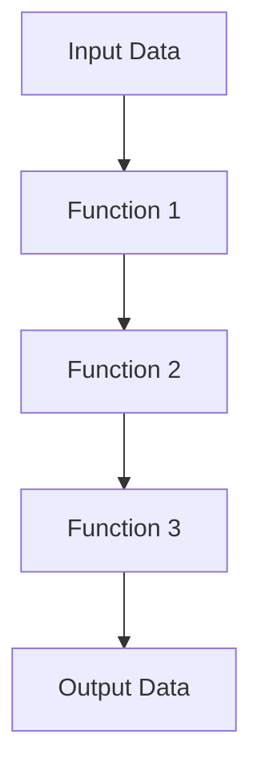

## 6.1.2 Benefits of First-Class Functions

In the realm of functional programming, **first-class functions** are a cornerstone concept that significantly enhances the flexibility and expressiveness of a language. In Clojure, functions are first-class citizens, meaning they can be passed as arguments, returned from other functions, and assigned to variables. This capability opens up a myriad of possibilities for writing more abstract, reusable, and maintainable code. In this section, we will explore the benefits of first-class functions in Clojure, drawing parallels with Java to help you transition smoothly.

### Understanding First-Class Functions

Before diving into the benefits, let's clarify what it means for functions to be first-class citizens. In programming languages like Clojure, first-class functions can be:

- **Passed as arguments** to other functions.
- **Returned as values** from other functions.
- **Assigned to variables** or stored in data structures.

This flexibility allows developers to treat functions as data, enabling higher-order programming and the creation of powerful abstractions.

### Increased Code Reuse

One of the most significant advantages of first-class functions is the ability to **reuse code** effectively. By abstracting common patterns into functions, you can apply these functions across different parts of your application without duplicating code.

#### Example: Reusable Sorting Function

Consider a scenario where you need to sort different collections based on various criteria. In Java, you might write separate methods for each sorting criterion. However, in Clojure, you can create a single sorting function that accepts a comparator function as an argument:

```clojure
(defn sort-with [comparator coll]
  (sort comparator coll))

;; Using the sort-with function with different comparators
(defn compare-by-length [a b]
  (< (count a) (count b)))

(defn compare-alphabetically [a b]
  (compare a b))

;; Sort by length
(sort-with compare-by-length ["apple" "banana" "kiwi"])
;; => ("kiwi" "apple" "banana")

;; Sort alphabetically
(sort-with compare-alphabetically ["apple" "banana" "kiwi"])
;; => ("apple" "banana" "kiwi")
```

In this example, `sort-with` is a reusable function that can sort collections based on any provided comparator, demonstrating how first-class functions promote code reuse.

### More Abstract and Flexible Code Design

First-class functions enable more abstract and flexible code design by allowing you to separate concerns and encapsulate behavior. This separation makes your codebase easier to understand, test, and maintain.

#### Example: Abstracting Control Structures

Let's say you want to execute a block of code multiple times with different parameters. In Java, you might use loops or conditional statements. In Clojure, you can abstract this behavior using higher-order functions:

```clojure
(defn repeat-action [n action]
  (dotimes [_ n]
    (action)))

;; Define an action
(defn print-hello []
  (println "Hello, World!"))

;; Repeat the action 3 times
(repeat-action 3 print-hello)
;; Output:
;; Hello, World!
;; Hello, World!
;; Hello, World!
```

Here, `repeat-action` abstracts the repetition logic, allowing you to pass any action to be executed multiple times. This abstraction leads to more flexible and reusable code.

### Building Powerful Abstractions

First-class functions empower developers to build powerful abstractions that simplify complex logic and enhance code readability. By encapsulating behavior in functions, you can create higher-level constructs that are easy to use and understand.

#### Example: Creating a Pipeline

Imagine you have a series of transformations to apply to data. In Java, you might chain method calls or use nested loops. In Clojure, you can create a pipeline of functions to process the data:

```clojure
(defn pipeline [fns value]
  (reduce (fn [acc fn] (fn acc)) value fns))

;; Define transformations
(defn increment [x] (+ x 1))
(defn double [x] (* x 2))

;; Create a pipeline
(def transformations [increment double])

;; Apply the pipeline to a value
(pipeline transformations 3)
;; => 8
```

The `pipeline` function takes a sequence of functions and a value, applying each function in sequence. This abstraction makes it easy to compose and apply complex transformations.

### Comparing with Java

In Java, functions are not first-class citizens. Instead, you often rely on interfaces, anonymous classes, or lambda expressions (introduced in Java 8) to achieve similar behavior. While Java's lambda expressions provide some functional capabilities, they lack the full flexibility and expressiveness of Clojure's first-class functions.

#### Java Example: Comparator with Lambda

```java
import java.util.Arrays;
import java.util.Comparator;

public class SortExample {
    public static void main(String[] args) {
        String[] fruits = {"apple", "banana", "kiwi"};

        // Sort by length using a lambda expression
        Arrays.sort(fruits, (a, b) -> Integer.compare(a.length(), b.length()));
        System.out.println(Arrays.toString(fruits)); // [kiwi, apple, banana]

        // Sort alphabetically
        Arrays.sort(fruits, Comparator.naturalOrder());
        System.out.println(Arrays.toString(fruits)); // [apple, banana, kiwi]
    }
}
```

While Java's lambda expressions allow for concise code, they are limited compared to Clojure's ability to pass, return, and manipulate functions as data.

### Encouraging Best Practices

Leveraging first-class functions encourages best practices in software development, such as:

- **Modularity**: Breaking down complex logic into smaller, reusable functions.
- **Separation of Concerns**: Encapsulating behavior in functions to isolate different parts of the application.
- **Testability**: Writing pure functions that are easy to test in isolation.

### Try It Yourself

To deepen your understanding of first-class functions, try modifying the examples above:

- Create a new comparator function for sorting based on the last character of a string.
- Modify the `repeat-action` function to accept a delay between actions.
- Extend the `pipeline` function to handle error cases gracefully.

### Diagrams and Visualizations

To visualize the flow of data through higher-order functions, consider the following diagram:



**Diagram Description**: This flowchart illustrates how data is transformed through a series of functions in a pipeline, showcasing the power of first-class functions in creating flexible data processing pipelines.

### Further Reading

For more information on first-class functions and functional programming in Clojure, check out these resources:

- [Official Clojure Documentation](https://clojure.org/reference/functions)
- [ClojureDocs](https://clojuredocs.org/)
- [Functional Programming in Clojure](https://www.braveclojure.com/)

### Exercises and Practice Problems

1. **Exercise 1**: Write a function `apply-twice` that takes a function and a value, applying the function to the value twice.
2. **Exercise 2**: Create a higher-order function `conditional-execute` that takes a predicate, a function, and a value, executing the function only if the predicate returns true.
3. **Exercise 3**: Implement a function `compose` that takes two functions and returns their composition.

### Key Takeaways

- First-class functions in Clojure enhance code reuse, flexibility, and abstraction.
- They enable more modular, testable, and maintainable code.
- Clojure's first-class functions offer greater expressiveness compared to Java's lambda expressions.
- By leveraging first-class functions, you can create powerful abstractions and simplify complex logic.

Now that we've explored the benefits of first-class functions, let's continue our journey into the world of higher-order functions and see how they can transform your approach to programming in Clojure.

## Quiz: Mastering First-Class Functions in Clojure



### What is a first-class function?

- [x] A function that can be passed as an argument, returned from a function, and assigned to a variable.
- [ ] A function that is always executed first in a program.
- [ ] A function that is defined at the top of a file.
- [ ] A function that cannot be modified.

> **Explanation:** First-class functions can be passed as arguments, returned from other functions, and assigned to variables, allowing them to be treated as data.

### How do first-class functions enhance code reuse?

- [x] By allowing functions to be passed as arguments, enabling the creation of reusable higher-order functions.
- [ ] By making functions immutable.
- [ ] By requiring less memory.
- [ ] By automatically optimizing code.

> **Explanation:** First-class functions enable the creation of higher-order functions, which can be reused across different parts of an application.

### What is a higher-order function?

- [x] A function that takes one or more functions as arguments or returns a function as a result.
- [ ] A function that is defined in a higher scope.
- [ ] A function that executes at a higher priority.
- [ ] A function that is more complex than others.

> **Explanation:** Higher-order functions take other functions as arguments or return functions, allowing for more abstract and flexible code design.

### How does Clojure's approach to first-class functions differ from Java's?

- [x] Clojure treats functions as data, allowing them to be passed, returned, and manipulated freely.
- [ ] Java allows functions to be passed as arguments without any restrictions.
- [ ] Clojure does not support first-class functions.
- [ ] Java's lambda expressions offer the same capabilities as Clojure's first-class functions.

> **Explanation:** Clojure treats functions as first-class citizens, offering greater flexibility and expressiveness compared to Java's lambda expressions.

### What is the purpose of the `pipeline` function in the example?

- [x] To apply a series of transformations to a value using a sequence of functions.
- [ ] To sort a collection of data.
- [ ] To execute a function multiple times.
- [ ] To create a new data structure.

> **Explanation:** The `pipeline` function applies a series of transformations to a value using a sequence of functions, demonstrating the power of first-class functions.

### Which of the following is a benefit of first-class functions?

- [x] Increased code reuse and modularity.
- [ ] Reduced execution time.
- [ ] Automatic error handling.
- [ ] Built-in security features.

> **Explanation:** First-class functions increase code reuse and modularity by allowing functions to be passed and returned, enabling more abstract and flexible code design.

### How can first-class functions improve testability?

- [x] By allowing functions to be isolated and tested independently.
- [ ] By reducing the number of lines of code.
- [ ] By automatically generating test cases.
- [ ] By eliminating the need for tests.

> **Explanation:** First-class functions improve testability by allowing functions to be isolated and tested independently, making it easier to verify their behavior.

### What is the role of a comparator function in the sorting example?

- [x] To define the criteria for sorting elements in a collection.
- [ ] To execute a function multiple times.
- [ ] To create a new data structure.
- [ ] To handle errors during sorting.

> **Explanation:** A comparator function defines the criteria for sorting elements in a collection, allowing for flexible sorting behavior.

### What is the main advantage of using higher-order functions?

- [x] They enable more abstract and flexible code design by allowing functions to be passed and returned.
- [ ] They automatically optimize code for performance.
- [ ] They reduce the need for documentation.
- [ ] They eliminate the need for error handling.

> **Explanation:** Higher-order functions enable more abstract and flexible code design by allowing functions to be passed and returned, facilitating powerful abstractions.

### True or False: First-class functions are unique to Clojure and not found in other programming languages.

- [ ] True
- [x] False

> **Explanation:** First-class functions are not unique to Clojure; they are a feature of many functional programming languages, allowing functions to be treated as data.


