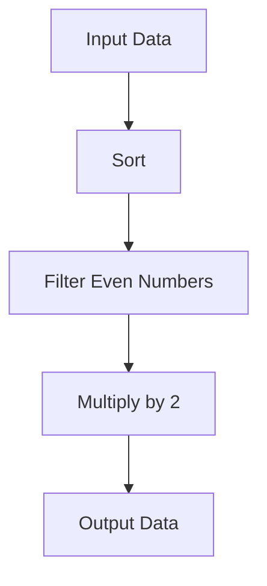

## 6.10.1 Writing Readable Functional Code

As experienced Java developers transitioning to Clojure, embracing functional programming principles can significantly enhance the readability and maintainability of your code. In this section, we will explore best practices for writing clear and readable functional code, focusing on higher-order functions. We'll draw parallels between Java and Clojure, providing code examples and practical tips to help you write idiomatic Clojure code.

### Understanding Higher-Order Functions

Higher-order functions are a cornerstone of functional programming. They are functions that can take other functions as arguments or return them as results. This concept might be familiar to you if you've worked with Java 8's lambda expressions and functional interfaces. In Clojure, higher-order functions are more seamlessly integrated into the language, allowing for more expressive and concise code.

#### Java vs. Clojure: Higher-Order Functions

In Java, higher-order functions are often implemented using functional interfaces like `Function`, `Predicate`, or `Consumer`. Here's a simple example of a higher-order function in Java:

```java
import java.util.function.Function;

public class HigherOrderExample {
    public static void main(String[] args) {
        Function<Integer, Integer> square = x -> x * x;
        System.out.println(applyFunction(square, 5)); // Output: 25
    }

    public static int applyFunction(Function<Integer, Integer> func, int value) {
        return func.apply(value);
    }
}
```

In Clojure, higher-order functions are more straightforward due to the language's support for first-class functions:

```clojure
(defn apply-function [f value]
  (f value))

(defn square [x]
  (* x x))

(println (apply-function square 5)) ; Output: 25
```

As you can see, Clojure's syntax is more concise, and functions are treated as first-class citizens, making higher-order functions a natural part of the language.

### Best Practices for Writing Readable Functional Code

Writing readable functional code involves several key practices that enhance clarity and maintainability. Let's explore these practices in detail.

#### 1. Use Descriptive Function Names

Descriptive function names are crucial for code readability. They provide context and make it easier for others (and your future self) to understand the purpose of a function. In Clojure, function names should be verbs or verb phrases that clearly indicate the function's action.

**Example:**

```clojure
(defn calculate-total-price [items]
  (reduce + (map :price items)))
```

In this example, `calculate-total-price` clearly describes what the function does, making the code more understandable.

#### 2. Avoid Overly Complex Inline Functions

While Clojure allows for concise inline functions using anonymous functions (lambdas), it's important to avoid making them too complex. Complex inline functions can hinder readability and make the code difficult to maintain.

**Example of a complex inline function:**

```clojure
(map (fn [x] (if (> x 10) (* x 2) (/ x 2))) [5 15 25])
```

**Refactored for readability:**

```clojure
(defn process-number [x]
  (if (> x 10)
    (* x 2)
    (/ x 2)))

(map process-number [5 15 25])
```

By extracting the logic into a named function, `process-number`, we improve readability and make the code easier to test and maintain.

#### 3. Leverage Clojure's Built-in Functions

Clojure provides a rich set of built-in functions for common operations. Leveraging these functions can reduce the need for custom implementations and improve code readability.

**Example:**

Instead of writing a custom function to filter even numbers:

```clojure
(defn filter-even [numbers]
  (filter #(even? %) numbers))
```

Use Clojure's built-in `filter` and `even?` functions:

```clojure
(filter even? [1 2 3 4 5 6])
```

This approach not only simplifies the code but also makes it more idiomatic.

#### 4. Use Threading Macros for Data Transformation

Threading macros, such as `->` and `->>`, are powerful tools for improving code readability by clearly expressing data transformations. They allow you to write code that flows from one operation to the next, similar to method chaining in Java.

**Example without threading macros:**

```clojure
(defn process-data [data]
  (map #(* % 2) (filter even? (sort data))))
```

**Example with threading macros:**

```clojure
(defn process-data [data]
  (->> data
       sort
       (filter even?)
       (map #(* % 2))))
```

The threading macro version is easier to read and understand, as it visually represents the sequence of operations.

#### 5. Embrace Immutability

Immutability is a fundamental concept in functional programming. In Clojure, data structures are immutable by default, which simplifies reasoning about code and reduces the risk of side effects.

**Example:**

Instead of modifying a list in place:

```java
List<Integer> numbers = new ArrayList<>(Arrays.asList(1, 2, 3));
numbers.set(0, 10);
```

Use Clojure's immutable data structures:

```clojure
(def numbers [1 2 3])
(def updated-numbers (assoc numbers 0 10))
```

By embracing immutability, we create code that is easier to reason about and less prone to bugs.

### Try It Yourself: Experiment with Readable Functional Code

To reinforce these concepts, try modifying the following Clojure code to improve its readability:

```clojure
(defn process-list [lst]
  (map (fn [x] (if (odd? x) (* x 3) (/ x 2))) (filter #(> % 5) lst)))

(println (process-list [1 2 3 6 7 8 9]))
```

**Suggestions:**

1. Extract the inline function into a named function.
2. Use threading macros to improve readability.
3. Add descriptive comments to explain each step.

### Diagrams and Visual Aids

To further illustrate the flow of data through higher-order functions and threading macros, let's use a diagram:



**Diagram Description:** This flowchart represents a data transformation pipeline using higher-order functions and threading macros. The input data is sorted, filtered for even numbers, and then each number is multiplied by 2 to produce the output data.

### Exercises and Practice Problems

1. **Exercise 1:** Refactor the following code to use descriptive function names and threading macros:

   ```clojure
   (defn transform-data [data]
     (map (fn [x] (* x 2)) (filter #(> x 10) (sort data))))
   ```

2. **Exercise 2:** Write a Clojure function that takes a list of numbers and returns a list of their squares, using higher-order functions and threading macros.

3. **Exercise 3:** Compare the following Java and Clojure code snippets. Identify the differences in readability and expressiveness:

   **Java:**

   ```java
   List<Integer> numbers = Arrays.asList(1, 2, 3, 4, 5);
   List<Integer> squares = numbers.stream()
                                  .map(x -> x * x)
                                  .collect(Collectors.toList());
   ```

   **Clojure:**

   ```clojure
   (def numbers [1 2 3 4 5])
   (def squares (map #(* % %) numbers))
   ```

### Key Takeaways

- **Descriptive Naming:** Use clear and descriptive function names to enhance code readability.
- **Avoid Complexity:** Extract complex logic from inline functions into named functions.
- **Leverage Built-ins:** Utilize Clojure's built-in functions for common operations.
- **Threading Macros:** Use threading macros to express data transformations clearly.
- **Embrace Immutability:** Write code that leverages Clojure's immutable data structures.

By following these best practices, you'll write functional code in Clojure that is not only readable but also maintainable and efficient. As you continue your journey into functional programming, remember that clarity and simplicity are key to writing great code.

### Further Reading

For more information on Clojure and functional programming, consider exploring the following resources:

- [Official Clojure Documentation](https://clojure.org/reference/documentation)
- [ClojureDocs](https://clojuredocs.org/)
- [Functional Programming in Clojure](https://www.braveclojure.com/)

---

## Quiz: Test Your Knowledge on Writing Readable Functional Code



### What is a higher-order function in Clojure?

- [x] A function that takes other functions as arguments or returns them as results
- [ ] A function that only performs arithmetic operations
- [ ] A function that modifies global variables
- [ ] A function that is always recursive

> **Explanation:** Higher-order functions are a key feature of functional programming, allowing functions to accept other functions as parameters or return them as results.

### Why is it important to use descriptive function names in Clojure?

- [x] To enhance code readability and maintainability
- [ ] To make the code run faster
- [ ] To reduce memory usage
- [ ] To ensure compatibility with Java

> **Explanation:** Descriptive function names provide context and make it easier to understand the purpose of a function, improving readability and maintainability.

### What is the benefit of using threading macros in Clojure?

- [x] They improve code readability by clearly expressing data transformations
- [ ] They increase the execution speed of the code
- [ ] They allow for dynamic typing
- [ ] They enable direct manipulation of Java objects

> **Explanation:** Threading macros like `->` and `->>` help in writing code that flows naturally, making data transformations clear and readable.

### How does Clojure's immutability benefit code maintainability?

- [x] It simplifies reasoning about code and reduces the risk of side effects
- [ ] It allows for faster execution of loops
- [ ] It enables direct memory access
- [ ] It supports dynamic method dispatch

> **Explanation:** Immutability ensures that data structures cannot be modified, which simplifies reasoning about code and reduces the risk of unintended side effects.

### Which of the following is a best practice for writing readable functional code in Clojure?

- [x] Use descriptive function names
- [ ] Use complex inline functions
- [x] Leverage built-in functions
- [ ] Modify global state

> **Explanation:** Descriptive function names and leveraging built-in functions are best practices that enhance code readability and maintainability.

### What is the purpose of extracting complex logic from inline functions into named functions?

- [x] To improve readability and make the code easier to test and maintain
- [ ] To increase the execution speed of the code
- [ ] To reduce the number of lines of code
- [ ] To ensure compatibility with older versions of Clojure

> **Explanation:** Extracting complex logic into named functions improves readability and makes the code easier to test and maintain.

### How can you leverage Clojure's built-in functions to improve code readability?

- [x] By using them for common operations instead of writing custom implementations
- [ ] By avoiding their use in favor of custom implementations
- [ ] By using them only for arithmetic operations
- [ ] By using them to modify global variables

> **Explanation:** Leveraging Clojure's built-in functions for common operations reduces the need for custom implementations and improves code readability.

### What is the advantage of using immutable data structures in Clojure?

- [x] They simplify reasoning about code and reduce the risk of side effects
- [ ] They allow for faster execution of loops
- [ ] They enable direct memory access
- [ ] They support dynamic method dispatch

> **Explanation:** Immutable data structures cannot be modified, which simplifies reasoning about code and reduces the risk of unintended side effects.

### True or False: Threading macros in Clojure are used to modify global variables.

- [ ] True
- [x] False

> **Explanation:** Threading macros are used to express data transformations clearly, not to modify global variables.

### True or False: In Clojure, higher-order functions can only take other functions as arguments, not return them.

- [ ] True
- [x] False

> **Explanation:** Higher-order functions in Clojure can both take other functions as arguments and return them as results.


