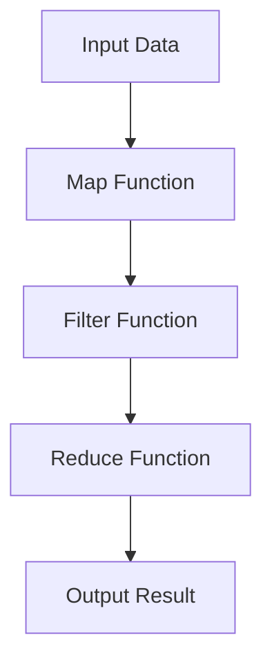

## 6.10.2 Avoiding Common Pitfalls

As experienced Java developers transitioning to Clojure, understanding and mastering higher-order functions is crucial. However, this journey is not without its challenges. In this section, we will explore common pitfalls that developers encounter when working with higher-order functions in Clojure, and how to avoid them. By drawing parallels with Java, we will highlight the differences and similarities that can help you navigate these challenges effectively.

### Excessive Nesting of Functions

One of the most common pitfalls in functional programming is excessive nesting of functions. While Clojure encourages a functional style, deeply nested functions can lead to code that is difficult to read and maintain.

#### Understanding the Problem

In Clojure, it's easy to nest functions within each other, especially when using higher-order functions like `map`, `filter`, and `reduce`. However, excessive nesting can obscure the logic of your code, making it hard to follow.

**Example of Excessive Nesting:**

```clojure
;; A deeply nested function example
(defn process-data [data]
  (map (fn [x]
         (filter (fn [y]
                   (reduce (fn [acc z]
                             (if (> z 10)
                               (conj acc z)
                               acc))
                           []
                           y))
                 x))
       data))
```

In this example, the logic is buried under multiple layers of anonymous functions, making it difficult to understand at a glance.

#### Solutions and Best Practices

1. **Use Named Functions**: Break down complex logic into smaller, named functions. This not only improves readability but also makes your code easier to test and debug.

   **Refactored Example:**

   ```clojure
   ;; Breaking down the logic into named functions
   (defn filter-large-numbers [numbers]
     (reduce (fn [acc z]
               (if (> z 10)
                 (conj acc z)
                 acc))
             []
             numbers))

   (defn process-inner [x]
     (filter filter-large-numbers x))

   (defn process-data [data]
     (map process-inner data))
   ```

2. **Leverage Threading Macros**: Clojure's threading macros (`->` and `->>`) can help flatten nested function calls, improving readability.

   **Example Using Threading Macros:**

   ```clojure
   ;; Using threading macros to improve readability
   (defn process-data [data]
     (->> data
          (map (fn [x]
                 (->> x
                      (filter filter-large-numbers))))))
   ```

3. **Limit Function Scope**: Keep functions focused on a single task. This aligns with the single responsibility principle, making your code modular and easier to maintain.

### Overuse of Anonymous Functions

Anonymous functions (lambdas) are a powerful feature in Clojure, allowing you to define functions on the fly. However, overusing them can lead to code that is hard to read and maintain.

#### Understanding the Problem

Anonymous functions are often used for short, simple operations. However, when they become complex, they can obscure the intent of your code.

**Example of Overusing Anonymous Functions:**

```clojure
;; Overusing anonymous functions
(defn transform-data [data]
  (map #(reduce + (filter #(> % 10) %)) data))
```

In this example, the use of anonymous functions makes it difficult to understand what the code is doing without careful inspection.

#### Solutions and Best Practices

1. **Use Named Functions for Complex Logic**: If an anonymous function becomes complex, consider extracting it into a named function.

   **Refactored Example:**

   ```clojure
   ;; Using named functions for clarity
   (defn sum-large-numbers [numbers]
     (reduce + (filter #(> % 10) numbers)))

   (defn transform-data [data]
     (map sum-large-numbers data))
   ```

2. **Keep Anonymous Functions Simple**: Use anonymous functions for simple operations that are easily understood at a glance.

3. **Document Complex Anonymous Functions**: If you must use a complex anonymous function, add comments to explain its purpose and logic.

### Performance Impacts Due to Unnecessary Function Calls

Higher-order functions can introduce performance overhead if not used judiciously. Unnecessary function calls can slow down your application, especially in performance-critical sections.

#### Understanding the Problem

Each function call in Clojure involves some overhead. When using higher-order functions, it's easy to introduce unnecessary calls that can degrade performance.

**Example of Unnecessary Function Calls:**

```clojure
;; Unnecessary function calls
(defn process-data [data]
  (map (fn [x]
         (reduce + (map inc (filter #(> % 10) x))))
       data))
```

In this example, the `map inc` call is unnecessary if the goal is only to sum numbers greater than 10.

#### Solutions and Best Practices

1. **Avoid Redundant Operations**: Review your code to eliminate redundant operations that do not contribute to the final result.

   **Refactored Example:**

   ```clojure
   ;; Removing unnecessary function calls
   (defn process-data [data]
     (map (fn [x]
            (reduce + (filter #(> % 10) x)))
          data))
   ```

2. **Profile and Benchmark**: Use profiling tools to identify performance bottlenecks in your code. This can help you focus optimization efforts where they are most needed.

3. **Consider Laziness**: Clojure's lazy sequences can help defer computation until it's needed, potentially improving performance. However, be mindful of memory usage with large datasets.

   **Example Using Lazy Sequences:**

   ```clojure
   ;; Using lazy sequences
   (defn process-data [data]
     (map (fn [x]
            (reduce + (filter #(> % 10) x)))
          (lazy-seq data)))
   ```

### Comparing with Java

In Java, similar pitfalls can occur, such as excessive use of nested loops or anonymous inner classes. However, Java's verbosity often makes these issues more apparent. In Clojure, the concise syntax can sometimes obscure these pitfalls, making it important to consciously apply best practices.

**Java Example of Nested Loops:**

```java
// Java example with nested loops
public int processData(List<List<Integer>> data) {
    int sum = 0;
    for (List<Integer> innerList : data) {
        for (int number : innerList) {
            if (number > 10) {
                sum += number;
            }
        }
    }
    return sum;
}
```

**Java Example of Anonymous Inner Classes:**

```java
// Java example with anonymous inner classes
List<Integer> transformedData = data.stream()
    .map(innerList -> innerList.stream()
        .filter(number -> number > 10)
        .reduce(0, Integer::sum))
    .collect(Collectors.toList());
```

### Try It Yourself

To solidify your understanding, try modifying the Clojure examples above:

- Refactor the `process-data` function to use a combination of named and anonymous functions.
- Experiment with threading macros to simplify nested function calls.
- Profile the performance of your code with and without lazy sequences.

### Diagrams and Visualizations

To better understand the flow of data through higher-order functions, let's visualize the process using a flowchart.



**Diagram Description:** This flowchart illustrates the sequence of operations in a typical higher-order function pipeline: mapping, filtering, and reducing data.

### Exercises and Practice Problems

1. **Refactor a Nested Function**: Take a complex nested function from your Java codebase and refactor it into a series of named functions in Clojure.

2. **Optimize a Function Pipeline**: Identify a function pipeline in your Clojure code that could benefit from performance optimization. Apply lazy sequences and remove unnecessary function calls.

3. **Profile Your Code**: Use a profiling tool to measure the performance of a Clojure function. Identify any bottlenecks and refactor the code to improve efficiency.

### Key Takeaways

- **Avoid Excessive Nesting**: Use named functions and threading macros to improve readability and maintainability.
- **Limit Anonymous Functions**: Keep them simple and use named functions for complex logic.
- **Optimize Performance**: Eliminate unnecessary function calls and leverage lazy sequences where appropriate.
- **Draw Parallels with Java**: Use your Java experience to recognize similar pitfalls and apply best practices in Clojure.

By understanding and avoiding these common pitfalls, you can write more efficient, readable, and maintainable Clojure code. As you continue to explore higher-order functions, remember to apply these best practices to enhance your functional programming skills.

### Further Reading

- [Official Clojure Documentation](https://clojure.org/reference/documentation)
- [ClojureDocs](https://clojuredocs.org/)
- [Functional Programming in Java](https://www.oreilly.com/library/view/functional-programming-in/9781449365516/)

---

## Quiz: Mastering Higher-Order Functions in Clojure



### What is a common pitfall when using higher-order functions in Clojure?

- [x] Excessive nesting of functions
- [ ] Using named functions
- [ ] Avoiding anonymous functions
- [ ] Using threading macros

> **Explanation:** Excessive nesting of functions can make code difficult to read and maintain.

### How can you improve the readability of nested functions in Clojure?

- [x] Use named functions
- [ ] Use more anonymous functions
- [ ] Avoid using threading macros
- [ ] Increase the nesting depth

> **Explanation:** Named functions help break down complex logic and improve readability.

### What is a benefit of using threading macros in Clojure?

- [x] They flatten nested function calls
- [ ] They increase function call overhead
- [ ] They make code more verbose
- [ ] They reduce code readability

> **Explanation:** Threading macros help flatten nested function calls, improving readability.

### Why should you limit the use of anonymous functions?

- [x] They can obscure code intent if overused
- [ ] They are always less efficient
- [ ] They are not supported in Clojure
- [ ] They cannot be used with higher-order functions

> **Explanation:** Overusing anonymous functions can make code difficult to understand.

### What is a potential performance impact of unnecessary function calls?

- [x] Increased overhead and slower execution
- [ ] Improved code readability
- [x] Reduced memory usage
- [ ] Enhanced code maintainability

> **Explanation:** Unnecessary function calls can increase overhead and slow down execution.

### How can lazy sequences improve performance in Clojure?

- [x] By deferring computation until needed
- [ ] By increasing memory usage
- [ ] By executing all computations immediately
- [ ] By reducing code readability

> **Explanation:** Lazy sequences defer computation until needed, potentially improving performance.

### What is a common Java pitfall similar to excessive nesting in Clojure?

- [x] Nested loops
- [ ] Using anonymous inner classes
- [ ] Using named functions
- [ ] Avoiding threading macros

> **Explanation:** Nested loops in Java can lead to similar readability issues as excessive nesting in Clojure.

### How can you identify performance bottlenecks in Clojure code?

- [x] Use profiling tools
- [ ] Increase function call overhead
- [ ] Avoid using named functions
- [ ] Use more anonymous functions

> **Explanation:** Profiling tools help identify performance bottlenecks in code.

### What is a benefit of using named functions over anonymous functions?

- [x] Improved readability and maintainability
- [ ] Increased code verbosity
- [ ] Reduced code modularity
- [ ] Decreased code clarity

> **Explanation:** Named functions improve readability and maintainability by clearly defining logic.

### True or False: Threading macros can help reduce the complexity of nested function calls.

- [x] True
- [ ] False

> **Explanation:** Threading macros help reduce the complexity of nested function calls by flattening them.



By mastering these concepts and avoiding common pitfalls, you'll be well-equipped to leverage the full power of higher-order functions in Clojure. Happy coding!
