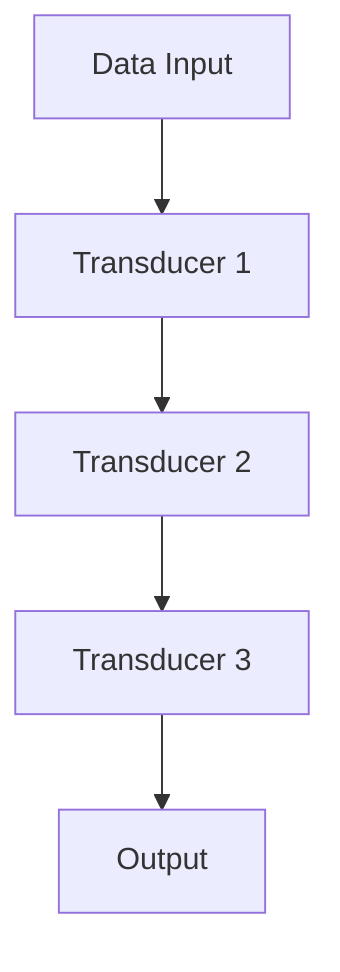
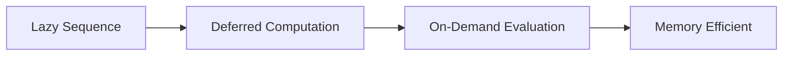

## 6.10.3 Performance Optimization

In this section, we will explore performance optimization techniques in Clojure, focusing on higher-order functions, transducers, and lazy evaluation. As experienced Java developers, you are already familiar with optimizing performance in an imperative context. Here, we'll delve into how Clojure's functional paradigm offers unique opportunities for efficiency, particularly in data processing tasks.

### Understanding Higher-Order Functions

Higher-order functions are a cornerstone of functional programming. They are functions that can take other functions as arguments or return them as results. This capability allows for powerful abstractions and code reuse, but it also requires careful consideration of performance implications.

#### Benefits of Higher-Order Functions

- **Code Reusability**: By abstracting common patterns, higher-order functions reduce code duplication.
- **Modularity**: They enable the composition of small, focused functions into more complex operations.
- **Expressiveness**: Higher-order functions allow for concise and expressive code, often reducing the need for boilerplate.

#### Performance Considerations

While higher-order functions offer many benefits, they can introduce overhead if not used judiciously. Let's explore some strategies to optimize their performance.

### Using Transducers for Efficient Data Processing

Transducers are a powerful feature in Clojure that allow for efficient data processing without intermediate collections. They provide a way to compose transformations that can be applied to various data structures, such as lists, vectors, and channels.

#### What are Transducers?

Transducers are composable algorithmic transformations. They are independent of the context in which they are used, meaning they can be applied to different types of collections or streams.

```clojure
(def xf (comp (map inc) (filter even?)))

(transduce xf conj [] (range 10))
;; => [2 4 6 8 10]
```

In the example above, `xf` is a transducer that increments each number and filters for even numbers. The `transduce` function applies this transformation to a range of numbers, collecting the results in a vector.

#### Advantages of Transducers

- **No Intermediate Collections**: Transducers eliminate the need for intermediate collections, reducing memory usage and improving performance.
- **Composability**: They allow for the composition of multiple transformations into a single, efficient operation.
- **Flexibility**: Transducers can be used with any reducible data structure, making them versatile for various applications.

#### Implementing Transducers

Let's implement a transducer to process a large dataset efficiently.

```clojure
(defn process-data [data]
  (let [xf (comp (map #(* % %)) (filter odd?))]
    (transduce xf + 0 data)))

(process-data (range 1000000))
```

In this example, we square each number and filter for odd numbers, then sum the results. The use of a transducer ensures that we process the data in a single pass, minimizing memory usage.

### Minimizing Allocations by Reusing Functions

Function allocation can be a source of overhead in functional programming. By reusing functions and avoiding unnecessary allocations, we can improve performance.

#### Reusing Functions

In Clojure, functions are first-class citizens and can be reused across different contexts. This reuse reduces the need for repeated allocations and can lead to performance gains.

```clojure
(defn square [x] (* x x))

(defn process-numbers [numbers]
  (map square numbers))

(process-numbers (range 10))
```

By defining a reusable `square` function, we avoid the overhead of defining the same logic multiple times.

#### Avoiding Closure Overhead

Closures capture their environment, which can introduce overhead if not managed carefully. To minimize this, avoid capturing unnecessary variables and prefer pure functions when possible.

### Considering Laziness and Its Effects on Resource Usage

Clojure's lazy sequences are a powerful tool for handling large datasets. They allow for deferred computation, which can lead to significant performance improvements.

#### Understanding Lazy Sequences

Lazy sequences are sequences where elements are computed on demand. This deferred computation can save memory and processing time, especially when dealing with large datasets.

```clojure
(defn lazy-squares []
  (map #(* % %) (range)))

(take 5 (lazy-squares))
;; => (0 1 4 9 16)
```

In this example, `lazy-squares` generates an infinite sequence of squares, but only the first five are computed due to the `take` function.

#### Benefits of Laziness

- **Reduced Memory Usage**: Lazy sequences only compute elements as needed, reducing memory consumption.
- **Improved Performance**: By deferring computation, lazy sequences can improve performance in scenarios where not all data is needed.

#### Potential Pitfalls

While laziness offers many benefits, it can also lead to unexpected behavior if not managed carefully. Be mindful of:

- **Realizing Entire Sequences**: Avoid operations that force the realization of entire lazy sequences, as this can negate their benefits.
- **Infinite Sequences**: Ensure that operations on infinite sequences are bounded to prevent infinite loops.

### Try It Yourself: Experimenting with Performance Optimization

To solidify your understanding of performance optimization in Clojure, try modifying the examples above. Experiment with different transducers, function compositions, and lazy sequences to see how they affect performance.

### Diagrams and Visualizations

To better understand the flow of data through higher-order functions and transducers, let's visualize these concepts with diagrams.



**Diagram 1**: This flowchart illustrates how data is processed through a series of transducers, transforming it step by step until the final output is produced.



**Diagram 2**: This diagram shows the lifecycle of a lazy sequence, highlighting its deferred computation and on-demand evaluation, leading to memory efficiency.

### Further Reading

For more information on performance optimization in Clojure, consider exploring the following resources:

- [Official Clojure Documentation](https://clojure.org/reference)
- [ClojureDocs](https://clojuredocs.org/)
- [GitHub - Clojure Transducers](https://github.com/clojure/transducers)

### Exercises and Practice Problems

1. **Exercise 1**: Implement a transducer that filters out even numbers and doubles the remaining numbers in a list. Test it with a range of 1 to 100.

2. **Exercise 2**: Create a lazy sequence that generates the Fibonacci series. Use it to compute the first 10 Fibonacci numbers.

3. **Exercise 3**: Refactor a Java loop that processes a list of integers to use Clojure's higher-order functions and transducers. Compare the performance of both implementations.

### Key Takeaways

- **Transducers**: Use transducers to process data efficiently without intermediate collections.
- **Function Reuse**: Minimize allocations by reusing functions and avoiding unnecessary closures.
- **Lazy Evaluation**: Leverage lazy sequences for memory-efficient data processing.

By applying these performance optimization techniques, you can harness the full power of Clojure's functional paradigm, leading to efficient and expressive code. Now that we've explored these concepts, let's apply them to optimize your Clojure applications.

## Quiz: Mastering Performance Optimization in Clojure



### What is a key advantage of using transducers in Clojure?

- [x] They eliminate the need for intermediate collections.
- [ ] They automatically parallelize computations.
- [ ] They simplify error handling.
- [ ] They provide built-in logging capabilities.

> **Explanation:** Transducers eliminate the need for intermediate collections, reducing memory usage and improving performance.

### How can you minimize function allocation overhead in Clojure?

- [x] By reusing functions across different contexts.
- [ ] By using global variables.
- [ ] By avoiding recursion.
- [ ] By using macros instead of functions.

> **Explanation:** Reusing functions across different contexts reduces the need for repeated allocations, improving performance.

### What is a potential pitfall of using lazy sequences?

- [x] Realizing entire sequences can negate their benefits.
- [ ] They cannot be used with transducers.
- [ ] They require manual memory management.
- [ ] They are incompatible with higher-order functions.

> **Explanation:** Realizing entire sequences can negate the benefits of laziness, leading to increased memory usage.

### Which of the following is a benefit of lazy sequences?

- [x] Reduced memory usage.
- [ ] Automatic error handling.
- [ ] Built-in concurrency support.
- [ ] Simplified syntax.

> **Explanation:** Lazy sequences only compute elements as needed, reducing memory consumption.

### What is the primary purpose of a transducer?

- [x] To compose transformations that can be applied to various data structures.
- [ ] To manage state in concurrent applications.
- [ ] To provide type safety in Clojure.
- [ ] To simplify exception handling.

> **Explanation:** Transducers compose transformations that can be applied to various data structures, enhancing flexibility and efficiency.

### How does Clojure's lazy evaluation improve performance?

- [x] By deferring computation until results are needed.
- [ ] By automatically parallelizing tasks.
- [ ] By caching all results in memory.
- [ ] By eliminating the need for garbage collection.

> **Explanation:** Lazy evaluation defers computation until results are needed, saving memory and processing time.

### What is a common use case for higher-order functions in Clojure?

- [x] Abstracting common patterns and reducing code duplication.
- [ ] Managing low-level memory operations.
- [ ] Implementing object-oriented design patterns.
- [ ] Handling network communication.

> **Explanation:** Higher-order functions abstract common patterns and reduce code duplication, enhancing code reusability.

### What should you avoid when working with closures in Clojure?

- [x] Capturing unnecessary variables.
- [ ] Using recursion.
- [ ] Defining anonymous functions.
- [ ] Using higher-order functions.

> **Explanation:** Capturing unnecessary variables in closures can introduce overhead, so it's best to avoid it.

### What is the role of the `comp` function in Clojure?

- [x] To compose multiple functions into a single function.
- [ ] To compile Clojure code to Java bytecode.
- [ ] To compare two data structures for equality.
- [ ] To compute the hash code of a function.

> **Explanation:** The `comp` function composes multiple functions into a single function, allowing for concise and expressive code.

### True or False: Transducers can only be used with lists in Clojure.

- [ ] True
- [x] False

> **Explanation:** Transducers can be used with any reducible data structure, not just lists.


