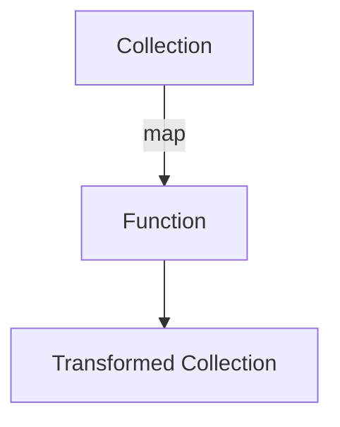

## 6.2.1 Function Arguments in Clojure

As experienced Java developers, you're likely familiar with the concept of passing functions as arguments, especially if you've worked with Java 8's lambda expressions. In Clojure, this concept is taken to the next level with its robust support for higher-order functions. In this section, we'll delve into how Clojure allows you to pass functions as arguments, using built-in functions like `map` and `filter` to perform operations on collections. We'll also compare these practices with Java to highlight the differences and similarities.

### Understanding Higher-Order Functions

Higher-order functions are a cornerstone of functional programming. They are functions that can take other functions as arguments or return them as results. This capability allows for more abstract and flexible code, enabling you to build complex operations from simple, reusable components.

#### Key Characteristics of Higher-Order Functions

- **Abstraction**: They allow you to abstract common patterns of computation.
- **Reusability**: By passing different functions as arguments, you can reuse higher-order functions in various contexts.
- **Composability**: They enable the composition of functions, leading to more modular code.

### Passing Functions as Arguments

In Clojure, functions are first-class citizens, meaning they can be passed around just like any other data type. This feature is crucial for creating higher-order functions.

#### Example: Using `map` with Function Arguments

The `map` function is a classic example of a higher-order function. It applies a given function to each element of a collection and returns a new collection of the results.

```clojure
(defn square [x]
  (* x x))

(def numbers [1 2 3 4 5])

;; Using map to apply the square function to each element
(def squared-numbers (map square numbers))

;; Output: (1 4 9 16 25)
(println squared-numbers)
```

**Explanation**: In this example, the `square` function is passed as an argument to `map`, which applies it to each element of the `numbers` collection. The result is a new collection of squared numbers.

#### Comparison with Java

In Java, a similar operation can be achieved using streams and lambda expressions:

```java
import java.util.Arrays;
import java.util.List;
import java.util.stream.Collectors;

public class SquareExample {
    public static void main(String[] args) {
        List<Integer> numbers = Arrays.asList(1, 2, 3, 4, 5);
        List<Integer> squaredNumbers = numbers.stream()
                                              .map(x -> x * x)
                                              .collect(Collectors.toList());

        System.out.println(squaredNumbers); // Output: [1, 4, 9, 16, 25]
    }
}
```

**Comparison**: While Java's streams provide a similar capability, Clojure's approach is more concise and inherently functional, as functions are naturally passed as arguments without the need for lambda expressions.

### Built-in Higher-Order Functions

Clojure provides several built-in higher-order functions that make it easy to work with collections. Let's explore some of these functions and how they utilize function arguments.

#### The `filter` Function

The `filter` function takes a predicate function and a collection, returning a new collection of elements that satisfy the predicate.

```clojure
(defn even? [x]
  (zero? (mod x 2)))

(def numbers [1 2 3 4 5 6])

;; Using filter to select even numbers
(def even-numbers (filter even? numbers))

;; Output: (2 4 6)
(println even-numbers)
```

**Explanation**: Here, the `even?` function is passed to `filter`, which returns a collection of even numbers from the original list.

#### The `reduce` Function

The `reduce` function is another powerful higher-order function that reduces a collection to a single value using a binary function.

```clojure
(defn sum [a b]
  (+ a b))

(def numbers [1 2 3 4 5])

;; Using reduce to sum all numbers
(def total (reduce sum numbers))

;; Output: 15
(println total)
```

**Explanation**: The `sum` function is passed to `reduce`, which applies it cumulatively to the elements of the collection, resulting in their total sum.

### Creating Custom Higher-Order Functions

Beyond using built-in functions, you can create your own higher-order functions in Clojure. This ability allows you to encapsulate complex logic and reuse it across different parts of your application.

#### Example: Custom Function Applicator

Let's create a function that applies a given function to each element of a collection and returns a new collection of results.

```clojure
(defn apply-to-all [f coll]
  (map f coll))

(defn increment [x]
  (+ x 1))

(def numbers [1 2 3 4 5])

;; Using apply-to-all to increment each number
(def incremented-numbers (apply-to-all increment numbers))

;; Output: (2 3 4 5 6)
(println incremented-numbers)
```

**Explanation**: The `apply-to-all` function is a custom higher-order function that takes another function `f` and a collection `coll`, applying `f` to each element of `coll`.

### Visualizing Function Flow with Diagrams

To better understand how functions flow through higher-order functions, let's visualize the process using a diagram.



**Diagram Explanation**: This diagram illustrates the flow of data through the `map` function. The original collection is transformed by applying a function to each element, resulting in a new collection.

### Encouraging Experimentation

Now that we've explored passing functions as arguments, try modifying the examples to deepen your understanding. For instance, experiment with different functions in `map` or `filter`, or create your own higher-order functions to solve specific problems.

### Further Reading

For more information on higher-order functions and functional programming in Clojure, consider exploring the following resources:

- [Official Clojure Documentation](https://clojure.org/reference)
- [ClojureDocs](https://clojuredocs.org/)
- [Functional Programming in Clojure](https://www.braveclojure.com/)

### Exercises

1. **Exercise 1**: Write a function that takes a collection of strings and returns a new collection with each string capitalized.
2. **Exercise 2**: Create a higher-order function that takes a function and a collection, applying the function to each element and returning the results.
3. **Exercise 3**: Use `reduce` to find the maximum value in a collection of numbers.

### Key Takeaways

- **Higher-order functions** allow you to pass functions as arguments, enabling more abstract and reusable code.
- Clojure's **built-in functions** like `map`, `filter`, and `reduce` demonstrate the power of higher-order functions.
- Creating **custom higher-order functions** can encapsulate complex logic and promote code reuse.
- **Experimentation** with function arguments can deepen your understanding of functional programming in Clojure.

Now that we've explored how to pass functions as arguments in Clojure, let's apply these concepts to build more flexible and reusable code in your applications.

## Quiz: Mastering Function Arguments in Clojure



### What is a higher-order function?

- [x] A function that takes other functions as arguments or returns them as results.
- [ ] A function that only operates on numbers.
- [ ] A function that is defined at the top of a file.
- [ ] A function that cannot be passed as an argument.

> **Explanation:** Higher-order functions can take other functions as arguments or return them, enabling more abstract and flexible code.

### Which Clojure function applies a given function to each element of a collection?

- [x] `map`
- [ ] `filter`
- [ ] `reduce`
- [ ] `apply`

> **Explanation:** The `map` function applies a given function to each element of a collection and returns a new collection of results.

### What does the `filter` function do in Clojure?

- [x] It returns a new collection of elements that satisfy a predicate function.
- [ ] It sums all elements in a collection.
- [ ] It multiplies all elements in a collection.
- [ ] It sorts a collection.

> **Explanation:** The `filter` function takes a predicate function and a collection, returning a new collection of elements that satisfy the predicate.

### How does Clojure's `reduce` function work?

- [x] It reduces a collection to a single value using a binary function.
- [ ] It duplicates each element in a collection.
- [ ] It removes duplicates from a collection.
- [ ] It reverses a collection.

> **Explanation:** The `reduce` function applies a binary function cumulatively to the elements of a collection, reducing them to a single value.

### What is the output of `(map inc [1 2 3])` in Clojure?

- [x] (2 3 4)
- [ ] (1 2 3)
- [ ] (0 1 2)
- [ ] (3 4 5)

> **Explanation:** The `inc` function increments each element of the collection `[1 2 3]`, resulting in `(2 3 4)`.

### Which Java feature is similar to Clojure's higher-order functions?

- [x] Lambda expressions
- [ ] Interfaces
- [ ] Abstract classes
- [ ] Annotations

> **Explanation:** Java's lambda expressions allow functions to be passed as arguments, similar to Clojure's higher-order functions.

### What is a key benefit of higher-order functions?

- [x] They enable code reusability and abstraction.
- [ ] They make code run faster.
- [ ] They reduce memory usage.
- [ ] They are easier to debug.

> **Explanation:** Higher-order functions allow for code reusability and abstraction, making it easier to build complex operations from simple components.

### How can you create a custom higher-order function in Clojure?

- [x] By defining a function that takes another function as an argument.
- [ ] By using a special keyword.
- [ ] By writing a macro.
- [ ] By using a loop.

> **Explanation:** You can create a custom higher-order function by defining a function that takes another function as an argument, allowing for flexible and reusable code.

### What does the `apply-to-all` function do in the provided example?

- [x] It applies a given function to each element of a collection.
- [ ] It removes all elements from a collection.
- [ ] It duplicates each element in a collection.
- [ ] It sorts a collection.

> **Explanation:** The `apply-to-all` function is a custom higher-order function that applies a given function to each element of a collection, returning a new collection of results.

### True or False: In Clojure, functions are first-class citizens.

- [x] True
- [ ] False

> **Explanation:** In Clojure, functions are first-class citizens, meaning they can be passed around just like any other data type.


