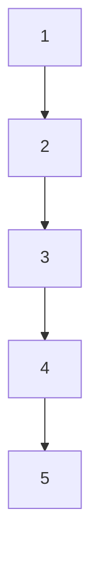

## 6.2.2 Accessing List Elements

In Clojure, lists are a fundamental data structure that embody the essence of functional programming. Understanding how to effectively access and manipulate list elements is crucial for any developer transitioning from Java to Clojure. This section delves into the intricacies of accessing list elements in Clojure, leveraging functions like `first`, `rest`, and `nth`, and explores the underlying concept of linked lists to highlight efficient operations.

### Understanding Clojure Lists

Clojure lists are immutable, singly linked lists. This means that once a list is created, it cannot be changed. Any operation that seems to modify a list actually returns a new list. This immutability is a cornerstone of functional programming, promoting safer and more predictable code.

#### Characteristics of Clojure Lists

- **Immutable**: Lists cannot be changed after creation.
- **Singly Linked**: Each element points to the next, making certain operations efficient.
- **Persistent**: Operations on lists are performed in a way that preserves the original list.

### Accessing Elements in Clojure Lists

Accessing elements in a list is a common operation, and Clojure provides several functions to facilitate this. Let's explore the primary functions used to access list elements: `first`, `rest`, and `nth`.

#### Using `first`

The `first` function returns the first element of a list. It is a fundamental operation that is both intuitive and efficient due to the nature of linked lists.

```clojure
(def my-list '(1 2 3 4 5))
(first my-list)
;; => 1
```

**Explanation**: In the example above, `first` retrieves the initial element of `my-list`, which is `1`.

#### Using `rest`

The `rest` function returns a list of all elements except the first. This operation is efficient because it simply returns a reference to the remainder of the list.

```clojure
(rest my-list)
;; => (2 3 4 5)
```

**Explanation**: `rest` provides a new list starting from the second element, effectively skipping the first element.

#### Using `nth`

The `nth` function allows for accessing an element at a specific index. While `first` and `rest` are constant-time operations, `nth` has a linear time complexity because it must traverse the list to reach the desired index.

```clojure
(nth my-list 2)
;; => 3
```

**Explanation**: `nth` retrieves the element at index `2`, which is `3`.

### Linked Lists and Efficient Operations

Clojure lists are implemented as singly linked lists, which have specific performance characteristics:

- **Efficient Head Access**: Accessing the first element (`first`) or the rest of the list (`rest`) is efficient, with constant time complexity.
- **Sequential Access**: Accessing elements by index (`nth`) requires traversing the list, resulting in linear time complexity.
- **Persistent Data Structures**: Operations like `conj` (which adds an element to the front of a list) are efficient because they reuse the existing list structure.

#### Visualizing Linked Lists

To better understand linked lists, consider the following diagram:



**Explanation**: Each node in the list points to the next, forming a chain. This structure allows for efficient operations at the head of the list.

### Practical Code Examples

Let's explore some practical examples to solidify our understanding of accessing list elements in Clojure.

#### Example 1: Iterating Over a List

Iterating over a list to perform operations on each element is a common task. In Clojure, this can be achieved using recursion or higher-order functions like `map`.

```clojure
(defn print-elements [lst]
  (when (seq lst)
    (println (first lst))
    (recur (rest lst))))

(print-elements my-list)
;; Output:
;; 1
;; 2
;; 3
;; 4
;; 5
```

**Explanation**: The `print-elements` function recursively prints each element of the list using `first` and `rest`.

#### Example 2: Accessing Elements with `nth`

While `nth` is not the most efficient way to access elements in a list, it is sometimes necessary for specific use cases.

```clojure
(defn get-element [lst index]
  (if (>= index (count lst))
    (throw (IndexOutOfBoundsException. "Index out of bounds"))
    (nth lst index)))

(get-element my-list 3)
;; => 4
```

**Explanation**: The `get-element` function safely retrieves an element at a given index, throwing an exception if the index is out of bounds.

### Best Practices for Accessing List Elements

- **Prefer `first` and `rest`**: Use these functions for efficient access to the beginning of a list.
- **Avoid `nth` for Large Lists**: Due to its linear time complexity, `nth` should be used sparingly, especially with large lists.
- **Leverage Higher-Order Functions**: Functions like `map`, `filter`, and `reduce` can often replace the need for direct element access.

### Common Pitfalls

- **Index Out of Bounds**: Always ensure the index is within the bounds of the list when using `nth`.
- **Inefficient Traversal**: Avoid repeatedly traversing a list with `nth`; consider restructuring your code to use more efficient operations.

### Optimization Tips

- **Use Vectors for Random Access**: If frequent random access is needed, consider using vectors instead of lists, as vectors provide constant-time access by index.
- **Combine Operations**: When possible, combine operations to minimize traversal of the list.

### Conclusion

Accessing elements in Clojure lists is a fundamental skill that leverages the power of functional programming. By understanding the characteristics of linked lists and using functions like `first`, `rest`, and `nth`, developers can write efficient and expressive Clojure code. Remember to consider the performance implications of each operation and choose the appropriate data structure for your specific use case.

## Quiz Time!



### Which function is used to retrieve the first element of a list in Clojure?

- [x] first
- [ ] rest
- [ ] nth
- [ ] conj

> **Explanation:** The `first` function is used to retrieve the first element of a list in Clojure.

### What does the `rest` function return when called on a list?

- [ ] The first element of the list
- [x] A list of all elements except the first
- [ ] The last element of the list
- [ ] A list with the first element repeated

> **Explanation:** The `rest` function returns a list of all elements except the first.

### What is the time complexity of accessing an element at a specific index using `nth`?

- [ ] Constant time
- [x] Linear time
- [ ] Logarithmic time
- [ ] Quadratic time

> **Explanation:** The `nth` function has a linear time complexity because it must traverse the list to reach the desired index.

### Which data structure is more efficient for random access, lists or vectors?

- [ ] Lists
- [x] Vectors
- [ ] Both are equally efficient
- [ ] Neither is efficient

> **Explanation:** Vectors are more efficient for random access because they provide constant-time access by index.

### What is a key characteristic of Clojure lists?

- [x] They are immutable
- [ ] They are mutable
- [ ] They are doubly linked
- [ ] They support constant-time random access

> **Explanation:** Clojure lists are immutable, meaning they cannot be changed after creation.

### Which operation is efficient for Clojure lists due to their linked structure?

- [x] Accessing the first element
- [ ] Accessing the last element
- [ ] Random access by index
- [ ] Reversing the list

> **Explanation:** Accessing the first element is efficient due to the linked structure of Clojure lists.

### What should you consider using if you need frequent random access to elements?

- [ ] Lists
- [x] Vectors
- [ ] Maps
- [ ] Sets

> **Explanation:** Vectors should be considered for frequent random access due to their efficient indexing.

### What does the `conj` function do when used with a list?

- [ ] Adds an element to the end of the list
- [x] Adds an element to the front of the list
- [ ] Removes the first element of the list
- [ ] Removes the last element of the list

> **Explanation:** The `conj` function adds an element to the front of a list.

### Which function would you use to iterate over a list and perform an operation on each element?

- [ ] first
- [ ] nth
- [x] map
- [ ] conj

> **Explanation:** The `map` function is used to iterate over a list and perform an operation on each element.

### True or False: Clojure lists are mutable and can be changed after creation.

- [ ] True
- [x] False

> **Explanation:** Clojure lists are immutable and cannot be changed after creation.


