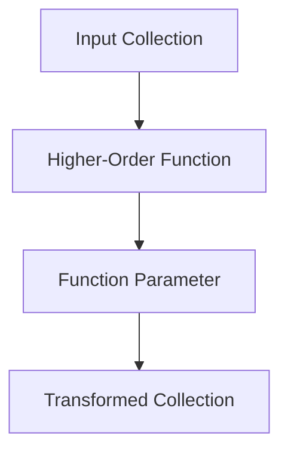

## 6.2.2 Custom Functions Accepting Functions

In this section, we delve into the concept of custom functions that accept other functions as parameters in Clojure. This is a powerful feature of functional programming that enhances code flexibility and reusability. As experienced Java developers, you may be familiar with similar concepts introduced in Java 8 with lambda expressions and functional interfaces. However, Clojure's approach is more seamless and integral to the language's design.

### Understanding Higher-Order Functions

Higher-order functions are functions that can take other functions as arguments or return them as results. This concept is central to functional programming and allows for more abstract and concise code. In Clojure, functions are first-class citizens, meaning they can be passed around just like any other data type.

#### Why Use Higher-Order Functions?

- **Code Reusability**: By abstracting common patterns into higher-order functions, you can reuse code across different parts of your application.
- **Flexibility**: Higher-order functions allow you to change the behavior of your code by passing different functions as arguments.
- **Conciseness**: They enable you to write more concise and expressive code by eliminating boilerplate.

### Writing Custom Functions that Accept Functions

Let's explore how to write custom functions in Clojure that accept other functions as parameters. We'll start with a simple example and gradually build up to more complex scenarios.

#### Example 1: A Simple Function Transformer

Consider a scenario where you want to apply a transformation to each element in a list. In Java, you might use a loop or a stream with a lambda expression. In Clojure, you can achieve this with a higher-order function.

```clojure
(defn transform-list [f coll]
  (map f coll))

;; Usage
(transform-list inc [1 2 3 4])
;; => (2 3 4 5)
```

**Explanation**: 
- `transform-list` is a function that takes two arguments: a function `f` and a collection `coll`.
- It uses the `map` function to apply `f` to each element in `coll`.
- In this example, we pass the `inc` function to increment each number in the list.

#### Comparison with Java

In Java, you might achieve similar functionality using streams:

```java
import java.util.Arrays;
import java.util.List;
import java.util.stream.Collectors;

public class TransformList {
    public static List<Integer> transformList(List<Integer> list) {
        return list.stream().map(x -> x + 1).collect(Collectors.toList());
    }

    public static void main(String[] args) {
        List<Integer> numbers = Arrays.asList(1, 2, 3, 4);
        List<Integer> transformed = transformList(numbers);
        System.out.println(transformed); // [2, 3, 4, 5]
    }
}
```

**Key Differences**:
- **Syntax**: Clojure's syntax is more concise and expressive.
- **Immutability**: Clojure's `map` returns a new collection, preserving immutability.
- **First-Class Functions**: In Clojure, functions like `inc` can be passed directly without wrapping them in a functional interface.

#### Example 2: Filtering with a Custom Predicate

Let's create a function that filters elements from a collection based on a custom predicate function.

```clojure
(defn filter-custom [pred coll]
  (filter pred coll))

;; Usage
(filter-custom odd? [1 2 3 4 5 6])
;; => (1 3 5)
```

**Explanation**:
- `filter-custom` takes a predicate function `pred` and a collection `coll`.
- It uses the `filter` function to retain elements for which `pred` returns true.
- Here, we use `odd?` to filter odd numbers from the list.

#### Diagram: Data Flow in Higher-Order Functions

Below is a diagram illustrating the flow of data through a higher-order function in Clojure:



**Caption**: This diagram shows how an input collection is processed by a higher-order function using a function parameter, resulting in a transformed collection.

### Advanced Examples

#### Example 3: Combining Transformations

Let's create a function that applies multiple transformations to a collection.

```clojure
(defn apply-transformations [transforms coll]
  (reduce (fn [acc f] (map f acc)) coll transforms))

;; Usage
(apply-transformations [inc #(* % 2)] [1 2 3])
;; => (4 6 8)
```

**Explanation**:
- `apply-transformations` takes a list of transformation functions `transforms` and a collection `coll`.
- It uses `reduce` to apply each transformation in sequence.
- In this example, we first increment each number and then double it.

#### Example 4: Custom Sorting

Let's implement a function that sorts a collection based on a custom comparator function.

```clojure
(defn sort-custom [comparator coll]
  (sort comparator coll))

;; Usage
(sort-custom > [3 1 4 1 5 9])
;; => (9 5 4 3 1 1)
```

**Explanation**:
- `sort-custom` takes a comparator function and a collection.
- It uses `sort` to order the elements according to the comparator.
- Here, we use `>` to sort the numbers in descending order.

### Try It Yourself

Experiment with the examples above by modifying the functions passed as arguments. For instance, try using a different transformation or predicate function to see how the output changes.

### Best Practices for Using Higher-Order Functions

- **Keep Functions Pure**: Ensure that the functions you pass as arguments are pure, meaning they don't have side effects.
- **Leverage Immutability**: Take advantage of Clojure's immutable data structures to avoid unintended state changes.
- **Use Descriptive Names**: Name your functions and parameters clearly to convey their purpose.
- **Compose Functions**: Combine simple functions to create more complex behavior.

### Exercises

1. Write a function `apply-discount` that takes a discount function and a list of prices, applying the discount to each price.
2. Create a function `filter-even-squares` that filters even numbers from a list, squares them, and returns the result.
3. Implement a function `transform-and-filter` that takes a transformation function, a predicate, and a collection, applying the transformation and then filtering the results.

### Summary and Key Takeaways

- Higher-order functions are a powerful feature of Clojure that allow you to write flexible and reusable code.
- By passing functions as arguments, you can abstract common patterns and behaviors.
- Clojure's syntax and first-class functions make it easy to work with higher-order functions compared to Java.
- Practice writing and using higher-order functions to become more proficient in functional programming with Clojure.

### Further Reading

For more information on higher-order functions and functional programming in Clojure, consider exploring the following resources:

- [Clojure Official Documentation](https://clojure.org/)
- [ClojureDocs](https://clojuredocs.org/)
- [Functional Programming in Clojure](https://www.braveclojure.com/)

## Quiz: Mastering Custom Functions Accepting Functions in Clojure



### What is a higher-order function?

- [x] A function that takes other functions as arguments or returns them as results.
- [ ] A function that only operates on numbers.
- [ ] A function that is defined at the top of a file.
- [ ] A function that cannot be passed as an argument.

> **Explanation:** Higher-order functions are those that can take other functions as arguments or return them as results, allowing for more abstract and flexible code.

### How does Clojure's `map` function work?

- [x] It applies a given function to each element in a collection.
- [ ] It filters elements from a collection based on a predicate.
- [ ] It sorts a collection based on a comparator.
- [ ] It reduces a collection to a single value.

> **Explanation:** The `map` function in Clojure applies a given function to each element in a collection, returning a new collection of the results.

### What is the benefit of using higher-order functions?

- [x] They enhance code reusability and flexibility.
- [ ] They make code run faster.
- [ ] They are easier to debug.
- [ ] They eliminate the need for variables.

> **Explanation:** Higher-order functions enhance code reusability and flexibility by allowing you to abstract common patterns and behaviors.

### How do you pass a function as an argument in Clojure?

- [x] By directly passing the function name without parentheses.
- [ ] By wrapping the function in a list.
- [ ] By using a special keyword.
- [ ] By defining the function inside another function.

> **Explanation:** In Clojure, you pass a function as an argument by directly using its name without parentheses, as functions are first-class citizens.

### Which Clojure function is used to filter elements from a collection?

- [x] `filter`
- [ ] `map`
- [ ] `reduce`
- [ ] `sort`

> **Explanation:** The `filter` function in Clojure is used to retain elements in a collection for which a given predicate returns true.

### What is the purpose of the `reduce` function?

- [x] To apply a function cumulatively to the elements of a collection, reducing it to a single value.
- [ ] To transform each element in a collection.
- [ ] To sort a collection.
- [ ] To filter elements from a collection.

> **Explanation:** The `reduce` function applies a function cumulatively to the elements of a collection, reducing it to a single value.

### How can you sort a collection in Clojure?

- [x] By using the `sort` function with a comparator.
- [ ] By using the `map` function.
- [ ] By using the `filter` function.
- [ ] By using the `reduce` function.

> **Explanation:** The `sort` function in Clojure is used to order elements in a collection based on a given comparator.

### What is a pure function?

- [x] A function that does not have side effects and always produces the same output for the same input.
- [ ] A function that modifies global state.
- [ ] A function that takes no arguments.
- [ ] A function that returns a random value.

> **Explanation:** A pure function is one that does not have side effects and always produces the same output for the same input, making it predictable and testable.

### How does immutability benefit higher-order functions?

- [x] It ensures that data is not accidentally modified, leading to more predictable code.
- [ ] It makes functions run faster.
- [ ] It allows functions to modify global state.
- [ ] It requires more memory.

> **Explanation:** Immutability ensures that data is not accidentally modified, leading to more predictable and reliable code when using higher-order functions.

### True or False: In Clojure, functions are first-class citizens.

- [x] True
- [ ] False

> **Explanation:** In Clojure, functions are first-class citizens, meaning they can be passed as arguments, returned from other functions, and assigned to variables.


