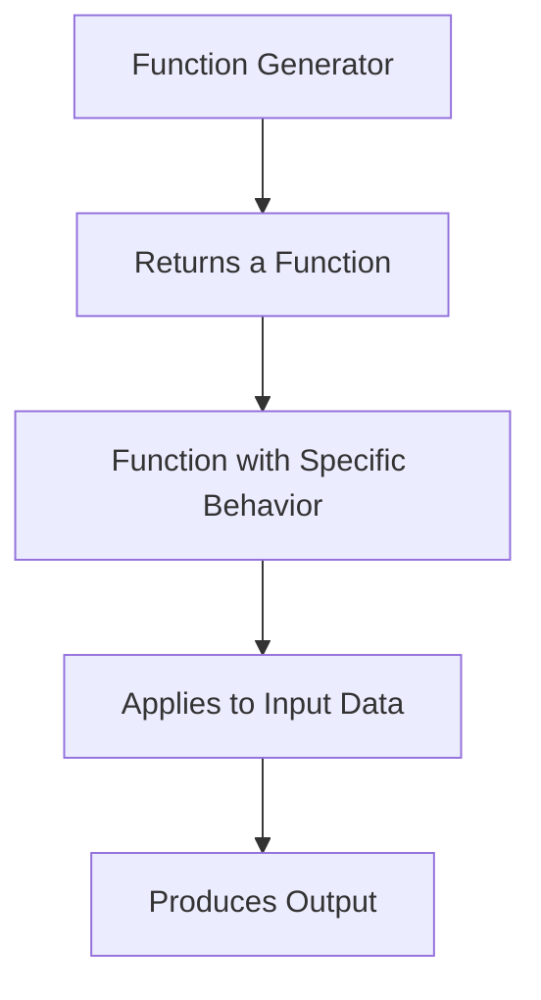

## 6.3.1 Higher-Order Functions Returning Functions

In this section, we delve into the concept of higher-order functions in Clojure that return other functions. This powerful feature of functional programming allows for the creation of flexible and reusable code patterns, such as function generators, curried functions, and encapsulated behaviors. As experienced Java developers, you will find parallels with Java's lambda expressions and functional interfaces, but Clojure offers a more expressive and concise syntax.

### Understanding Higher-Order Functions

Higher-order functions are functions that can take other functions as arguments or return them as results. This concept is central to functional programming and allows for a high level of abstraction and code reuse.

**In Java**, higher-order functions are typically implemented using functional interfaces and lambda expressions. For example, the `Function<T, R>` interface can be used to create functions that take an argument of type `T` and return a result of type `R`.

**In Clojure**, functions are first-class citizens, meaning they can be passed around just like any other data type. This makes it easy to create higher-order functions that return other functions.

### Returning Functions from Functions

Returning functions from functions is a powerful technique that can be used to create function generators, curried functions, and functions that encapsulate certain behaviors.

#### Function Generators

A function generator is a function that returns a new function. This can be useful for creating functions with specific behaviors or configurations.

**Example: Creating a Multiplier Function Generator**

Let's create a function generator that returns a function to multiply a number by a given factor.

```clojure
(defn multiplier-generator
  "Returns a function that multiplies its argument by the given factor."
  [factor]
  (fn [x]
    (* x factor)))

;; Usage
(def double (multiplier-generator 2))
(def triple (multiplier-generator 3))

(println (double 5)) ;; Output: 10
(println (triple 5)) ;; Output: 15
```

In this example, `multiplier-generator` is a higher-order function that returns a new function. The returned function takes a single argument `x` and multiplies it by the `factor` provided to `multiplier-generator`.

#### Curried Functions

Currying is a technique where a function with multiple arguments is transformed into a sequence of functions, each with a single argument. This can be useful for creating partially applied functions.

**Example: Currying a Function**

Let's create a curried function for addition.

```clojure
(defn curried-add
  "Returns a function that adds a to its argument."
  [a]
  (fn [b]
    (+ a b)))

;; Usage
(def add-five (curried-add 5))

(println (add-five 10)) ;; Output: 15
```

In this example, `curried-add` returns a function that adds `a` to its argument `b`. The `add-five` function is a partially applied version of `curried-add` with `a` set to 5.

#### Encapsulating Behaviors

Returning functions can also be used to encapsulate behaviors, allowing for the creation of more modular and reusable code.

**Example: Creating a Logger Function**

Let's create a logger function that returns a function to log messages with a specific prefix.

```clojure
(defn logger
  "Returns a function that logs messages with the given prefix."
  [prefix]
  (fn [message]
    (println (str prefix ": " message))))

;; Usage
(def info-logger (logger "INFO"))
(def error-logger (logger "ERROR"))

(info-logger "This is an informational message.")
(error-logger "This is an error message.")
```

In this example, `logger` returns a function that logs messages with a given `prefix`. The `info-logger` and `error-logger` functions are specific instances of this behavior.

### Comparing with Java

In Java, similar patterns can be achieved using lambda expressions and functional interfaces. However, Clojure's syntax is more concise and expressive.

**Java Example: Creating a Multiplier Function Generator**

```java
import java.util.function.Function;

public class FunctionGenerator {
    public static Function<Integer, Integer> multiplierGenerator(int factor) {
        return (Integer x) -> x * factor;
    }

    public static void main(String[] args) {
        Function<Integer, Integer> doubleFunction = multiplierGenerator(2);
        Function<Integer, Integer> tripleFunction = multiplierGenerator(3);

        System.out.println(doubleFunction.apply(5)); // Output: 10
        System.out.println(tripleFunction.apply(5)); // Output: 15
    }
}
```

In this Java example, we use the `Function` interface to create a multiplier function generator. While the concept is similar, the syntax is more verbose compared to Clojure.

### Visualizing Function Flow

To better understand how functions can return other functions, let's visualize the flow of data through a higher-order function.



**Diagram Explanation**: This diagram illustrates the flow of data through a function generator. The generator returns a function with specific behavior, which is then applied to input data to produce an output.

### Try It Yourself

Experiment with the examples provided by modifying the function generators, curried functions, and encapsulated behaviors. Here are some suggestions:

- Create a function generator that returns a function to divide numbers by a given factor.
- Modify the curried addition function to support subtraction.
- Extend the logger function to include timestamps in the log messages.

### Exercises

1. **Create a Function Generator**: Write a function generator that returns a function to calculate the power of a number.
2. **Implement Currying**: Implement a curried function for multiplication.
3. **Encapsulate Behavior**: Create a function that returns a function to format strings with a given pattern.

### Key Takeaways

- Higher-order functions in Clojure can return other functions, enabling powerful functional programming patterns.
- Function generators, curried functions, and encapsulated behaviors are common use cases for returning functions.
- Clojure's syntax is more concise and expressive compared to Java, making it easier to work with higher-order functions.
- Experimenting with function generators and curried functions can deepen your understanding of functional programming concepts.

### Further Reading

- [Official Clojure Documentation](https://clojure.org/reference/functions)
- [ClojureDocs: Higher-Order Functions](https://clojuredocs.org/quickref#higher-order-functions)
- [Functional Programming in Java: Harnessing the Power of Java 8 Lambda Expressions](https://www.oreilly.com/library/view/functional-programming-in/9781449365516/)

Now that we've explored how higher-order functions can return other functions in Clojure, let's apply these concepts to create more modular and reusable code in your applications.

## Quiz: Mastering Higher-Order Functions Returning Functions



### What is a higher-order function?

- [x] A function that can take other functions as arguments or return them as results.
- [ ] A function that only returns primitive data types.
- [ ] A function that cannot be passed as an argument.
- [ ] A function that only operates on numbers.

> **Explanation:** A higher-order function can take other functions as arguments or return them as results, enabling powerful functional programming patterns.

### What is a function generator?

- [x] A function that returns a new function with specific behavior.
- [ ] A function that generates random numbers.
- [ ] A function that only operates on strings.
- [ ] A function that cannot return other functions.

> **Explanation:** A function generator is a function that returns a new function, often with specific behavior or configuration.

### What is currying?

- [x] Transforming a function with multiple arguments into a sequence of functions, each with a single argument.
- [ ] A technique for optimizing function performance.
- [ ] A method for converting functions to strings.
- [ ] A way to encapsulate side effects in functions.

> **Explanation:** Currying is a technique where a function with multiple arguments is transformed into a sequence of functions, each with a single argument.

### How does Clojure's syntax for higher-order functions compare to Java's?

- [x] Clojure's syntax is more concise and expressive.
- [ ] Java's syntax is more concise and expressive.
- [ ] Both have the same level of verbosity.
- [ ] Clojure cannot implement higher-order functions.

> **Explanation:** Clojure's syntax is more concise and expressive compared to Java, making it easier to work with higher-order functions.

### What is the purpose of encapsulating behaviors in functions?

- [x] To create more modular and reusable code.
- [ ] To increase the complexity of the code.
- [ ] To make functions less readable.
- [ ] To prevent functions from returning values.

> **Explanation:** Encapsulating behaviors in functions allows for the creation of more modular and reusable code.

### What is the output of the following Clojure code?
```clojure
(defn adder [a] (fn [b] (+ a b)))
(def add-ten (adder 10))
(println (add-ten 5))
```

- [x] 15
- [ ] 10
- [ ] 5
- [ ] 0

> **Explanation:** The `adder` function returns a function that adds `a` to its argument `b`. The `add-ten` function adds 10 to its argument, resulting in 15 when called with 5.

### What is the benefit of using higher-order functions?

- [x] They allow for a high level of abstraction and code reuse.
- [ ] They make code execution slower.
- [ ] They limit the use of functions in a program.
- [ ] They prevent the use of variables.

> **Explanation:** Higher-order functions allow for a high level of abstraction and code reuse, making programs more flexible and maintainable.

### Which of the following is a use case for returning functions?

- [x] Creating function generators.
- [ ] Generating random numbers.
- [ ] Sorting arrays.
- [ ] Performing arithmetic operations.

> **Explanation:** Returning functions can be used to create function generators, which are functions that return new functions with specific behaviors.

### What is the output of the following Java code?
```java
Function<Integer, Integer> doubleFunction = x -> x * 2;
System.out.println(doubleFunction.apply(5));
```

- [x] 10
- [ ] 5
- [ ] 2
- [ ] 0

> **Explanation:** The `doubleFunction` multiplies its argument by 2, resulting in 10 when called with 5.

### True or False: In Clojure, functions are first-class citizens.

- [x] True
- [ ] False

> **Explanation:** In Clojure, functions are first-class citizens, meaning they can be passed around just like any other data type.


