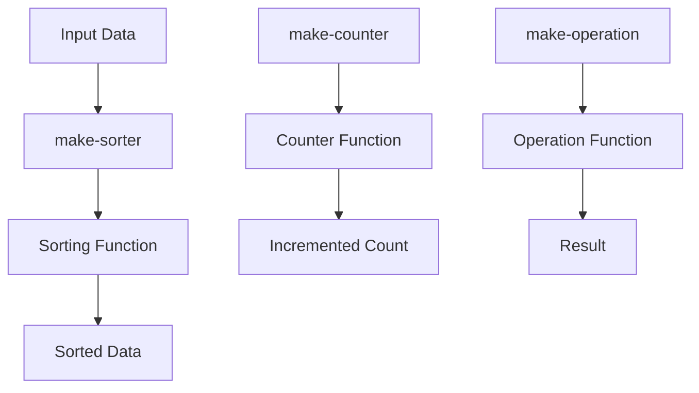

## 6.3.2 Practical Use Cases of Returning Functions in Clojure

In this section, we delve into the practical applications of returning functions from other functions in Clojure. This concept, while seemingly abstract, offers powerful tools for creating customizable behavior, capturing context through closures, and implementing function factories. As experienced Java developers, you may find parallels in Java's anonymous classes and lambda expressions, but Clojure's approach provides a more flexible and expressive paradigm.

### Customizable Behavior

Returning functions allows us to create highly customizable behavior in our programs. This is particularly useful in scenarios where we want to define a general behavior but allow specific details to be determined later.

#### Example: Configurable Sorting

Consider a scenario where we need a sorting function that can be customized based on different criteria. In Java, you might use a `Comparator` interface to achieve this. In Clojure, we can return a function that encapsulates the sorting logic.

```clojure
(defn make-sorter
  "Creates a sorting function based on the provided comparison function."
  [compare-fn]
  (fn [coll]
    (sort compare-fn coll)))

;; Usage
(def ascending-sorter (make-sorter <))
(def descending-sorter (make-sorter >))

(ascending-sorter [3 1 4 1 5 9]) ;; => (1 1 3 4 5 9)
(descending-sorter [3 1 4 1 5 9]) ;; => (9 5 4 3 1 1)
```

In this example, `make-sorter` returns a sorting function that can be customized with any comparison function. This approach is more flexible than Java's `Comparator` because it allows us to define sorting behavior at runtime.

### Closure Over Context

Closures are a powerful feature in Clojure that allow functions to capture and retain access to variables from their defining scope. This is particularly useful for maintaining state or configuration across multiple invocations of a function.

#### Example: Stateful Counter

Let's create a counter function that maintains its state across calls. In Java, you might use a class with a field to achieve this. In Clojure, we can use closures.

```clojure
(defn make-counter
  "Creates a counter function that maintains its state."
  []
  (let [count (atom 0)]
    (fn []
      (swap! count inc))))

;; Usage
(def counter (make-counter))
(counter) ;; => 1
(counter) ;; => 2
(counter) ;; => 3
```

Here, `make-counter` returns a function that increments and returns a count. The `count` variable is captured by the closure, allowing it to maintain state across invocations.

### Implementing Function Factories

Function factories are functions that produce other functions, often parameterized by some configuration. This pattern is useful for creating reusable and composable components.

#### Example: Function Factory for Mathematical Operations

Suppose we want to create a series of mathematical operations that can be applied to numbers. We can use a function factory to generate these operations.

```clojure
(defn make-operation
  "Creates a mathematical operation function based on the provided operator."
  [operator]
  (fn [x y]
    (operator x y)))

;; Usage
(def add (make-operation +))
(def subtract (make-operation -))
(def multiply (make-operation *))
(def divide (make-operation /))

(add 10 5) ;; => 15
(subtract 10 5) ;; => 5
(multiply 10 5) ;; => 50
(divide 10 5) ;; => 2
```

In this example, `make-operation` returns a function that performs a mathematical operation. This approach allows us to easily create new operations by simply passing a different operator.

### Try It Yourself

To deepen your understanding, try modifying the examples above:

- **Sorting Example**: Extend the `make-sorter` function to accept a secondary comparison function for tie-breaking.
- **Counter Example**: Modify the `make-counter` function to accept an initial value and a step increment.
- **Operation Example**: Create a new operation that calculates the modulus of two numbers.

### Visualizing Function Flow

To better understand how functions are returned and used, let's visualize the flow of data through these higher-order functions.



**Diagram Description**: This flowchart illustrates how input data is processed through higher-order functions like `make-sorter`, `make-counter`, and `make-operation`, resulting in sorted data, incremented counts, and mathematical results, respectively.

### Comparing with Java

In Java, achieving similar functionality often involves more boilerplate code. For instance, implementing a stateful counter would require a class with a field and methods to manipulate that field. Clojure's closures provide a more concise and expressive way to achieve the same result.

#### Java Example: Stateful Counter

```java
public class Counter {
    private int count = 0;

    public int increment() {
        return ++count;
    }
}

// Usage
Counter counter = new Counter();
counter.increment(); // => 1
counter.increment(); // => 2
counter.increment(); // => 3
```

While Java's approach is straightforward, it lacks the elegance and simplicity of Clojure's closures. Clojure's functional paradigm allows us to focus on the behavior rather than the implementation details.

### Exercises

1. **Create a Custom Filter**: Implement a function factory that returns a filtering function based on a predicate.
2. **Stateful Logger**: Develop a logger function that maintains a history of messages.
3. **Dynamic Configuration**: Build a configuration function that returns different behaviors based on environment variables.

### Key Takeaways

- **Returning functions** in Clojure allows for customizable behavior, closure over context, and function factories.
- **Closures** enable functions to maintain state across invocations without the need for mutable fields.
- **Function factories** provide a flexible way to create reusable and composable components.
- **Clojure's approach** to higher-order functions offers a more expressive and concise alternative to Java's object-oriented patterns.

By mastering these concepts, you'll be well-equipped to leverage Clojure's functional programming paradigm to create powerful and flexible applications. Now that we've explored practical use cases for returning functions, let's apply these concepts to build more dynamic and adaptable systems.

For further reading, consider exploring the [Official Clojure Documentation](https://clojure.org/reference) and [ClojureDocs](https://clojuredocs.org/).

---

## Quiz: Mastering Practical Use Cases of Returning Functions in Clojure



### What is a practical use case of returning functions in Clojure?

- [x] Creating customizable behavior
- [ ] Implementing inheritance
- [ ] Using reflection
- [ ] Managing memory allocation

> **Explanation:** Returning functions allows for creating customizable behavior by encapsulating logic that can be configured at runtime.


### How does Clojure's closure feature help in maintaining state?

- [x] By capturing and retaining access to variables from the defining scope
- [ ] By using global variables
- [ ] By implementing interfaces
- [ ] By using static fields

> **Explanation:** Closures in Clojure capture variables from their defining scope, allowing functions to maintain state across invocations.


### What is a function factory in Clojure?

- [x] A function that produces other functions, often parameterized by configuration
- [ ] A class that implements multiple interfaces
- [ ] A method that returns a single value
- [ ] A static utility class

> **Explanation:** A function factory in Clojure is a function that returns other functions, allowing for flexible and reusable code.


### How can you create a stateful counter in Clojure?

- [x] By using a closure that captures an atom for state
- [ ] By using a static field
- [ ] By implementing a class with a field
- [ ] By using a global variable

> **Explanation:** A closure that captures an atom allows for maintaining state in a functional way, without mutable fields.


### Which of the following is a benefit of using closures in Clojure?

- [x] Simplified state management
- [ ] Increased boilerplate code
- [ ] Complex inheritance hierarchies
- [ ] Global state management

> **Explanation:** Closures simplify state management by encapsulating state within a function, reducing the need for complex structures.


### What does the `make-sorter` function in the example do?

- [x] Returns a sorting function based on a comparison function
- [ ] Sorts a list in place
- [ ] Implements a sorting algorithm
- [ ] Uses reflection to sort data

> **Explanation:** The `make-sorter` function returns a sorting function that can be customized with different comparison functions.


### How does Clojure's approach to higher-order functions compare to Java's?

- [x] It is more expressive and concise
- [ ] It requires more boilerplate code
- [ ] It is less flexible
- [ ] It relies on inheritance

> **Explanation:** Clojure's higher-order functions are more expressive and concise compared to Java's object-oriented patterns.


### What is a closure in Clojure?

- [x] A function that captures variables from its defining scope
- [ ] A static method
- [ ] A class with fields
- [ ] A global variable

> **Explanation:** A closure is a function that captures and retains access to variables from its defining scope, allowing for stateful behavior.


### How can you modify the `make-counter` function to accept an initial value?

- [x] By adding a parameter for the initial value and using it to initialize the atom
- [ ] By using a static field
- [ ] By implementing a class with a constructor
- [ ] By using a global variable

> **Explanation:** Adding a parameter for the initial value allows the `make-counter` function to initialize the atom with a custom starting point.


### True or False: Function factories in Clojure can only produce mathematical operations.

- [ ] True
- [x] False

> **Explanation:** Function factories in Clojure can produce any type of function, not just mathematical operations.



---
