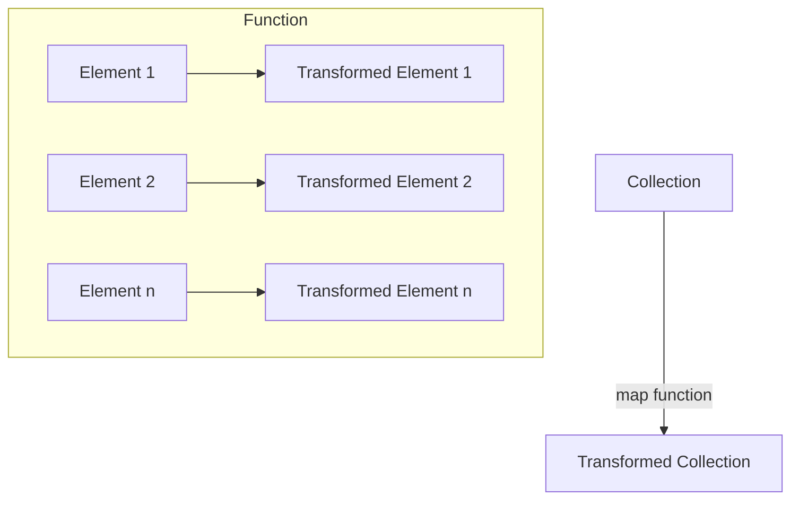

## 6.4.1 Using `map` for Transformation

In this section, we delve into one of Clojure's most powerful higher-order functions: `map`. As experienced Java developers, you are likely familiar with the concept of iterating over collections to apply transformations. Clojure's `map` function elevates this concept by providing a concise, expressive, and functional approach to transforming data. Let's explore how `map` works, its advantages, and how it compares to Java's iteration mechanisms.

### Understanding `map` in Clojure

The `map` function in Clojure is a higher-order function that applies a given function to each element of a collection, returning a new collection of the results. This operation is fundamental in functional programming, allowing for clean and efficient data transformations.

#### Basic Syntax

```clojure
(map function collection)
```

- **function**: A function that takes one argument and returns a value.
- **collection**: A collection (list, vector, set, etc.) whose elements will be transformed.

#### Example: Simple Transformation

Let's start with a simple example where we double each number in a list:

```clojure
(def numbers [1 2 3 4 5])

(defn double [n]
  (* 2 n))

(def doubled-numbers (map double numbers))
;; doubled-numbers => (2 4 6 8 10)
```

In this example, the `double` function is applied to each element of the `numbers` list, resulting in a new list of doubled values.

### Comparing `map` with Java's Iteration

In Java, transforming a collection typically involves using loops or streams. Let's compare the Clojure example with its Java equivalent using streams:

#### Java Example: Using Streams

```java
import java.util.Arrays;
import java.util.List;
import java.util.stream.Collectors;

public class MapExample {
    public static void main(String[] args) {
        List<Integer> numbers = Arrays.asList(1, 2, 3, 4, 5);
        List<Integer> doubledNumbers = numbers.stream()
                                              .map(n -> n * 2)
                                              .collect(Collectors.toList());
        System.out.println(doubledNumbers); // [2, 4, 6, 8, 10]
    }
}
```

**Comparison**:
- **Conciseness**: Clojure's `map` is more concise, avoiding the need for boilerplate code.
- **Immutability**: Clojure's collections are immutable, ensuring that the original data remains unchanged.
- **Functional Paradigm**: Clojure embraces functional programming, making `map` a natural fit.

### Advanced Transformations with `map`

Clojure's `map` can handle more complex transformations, including working with multiple collections and nested data structures.

#### Transforming Multiple Collections

`map` can take multiple collections and apply a function that accepts multiple arguments. The function is applied to corresponding elements from each collection.

```clojure
(def numbers1 [1 2 3])
(def numbers2 [4 5 6])

(defn add [a b]
  (+ a b))

(def summed-numbers (map add numbers1 numbers2))
;; summed-numbers => (5 7 9)
```

In this example, `add` is applied to pairs of elements from `numbers1` and `numbers2`.

#### Transforming Nested Data Structures

Consider a scenario where you have a list of maps representing people, and you want to extract their names:

```clojure
(def people [{:name "Alice" :age 30}
             {:name "Bob" :age 25}
             {:name "Charlie" :age 35}])

(def names (map :name people))
;; names => ("Alice" "Bob" "Charlie")
```

Here, we use a keyword as a function to extract the `:name` value from each map.

### Visualizing `map` with Diagrams

To better understand how `map` processes collections, let's visualize the flow of data through a `map` operation:



**Diagram Explanation**: This flowchart illustrates how each element of the input collection is passed through the transformation function, resulting in a new collection of transformed elements.

### Practical Applications of `map`

The `map` function is versatile and can be used in various scenarios, such as:

- **Data Cleaning**: Transforming raw data into a more usable format.
- **Data Aggregation**: Applying calculations across datasets.
- **Feature Extraction**: Extracting specific attributes from complex data structures.

#### Example: Data Cleaning

Suppose you have a list of strings representing numbers, and you want to convert them to integers:

```clojure
(def string-numbers ["1" "2" "3" "4" "5"])

(defn parse-int [s]
  (Integer/parseInt s))

(def int-numbers (map parse-int string-numbers))
;; int-numbers => (1 2 3 4 5)
```

### Try It Yourself

Experiment with the following modifications to deepen your understanding of `map`:

1. **Modify the Transformation Function**: Change the `double` function to triple the numbers instead.
2. **Combine with Other Functions**: Use `map` in conjunction with `filter` to transform and filter a collection in one go.
3. **Nested Transformations**: Apply `map` to a nested collection, such as a list of lists.

### Exercises

1. **Exercise 1**: Write a Clojure function that uses `map` to convert a list of temperatures from Celsius to Fahrenheit.
2. **Exercise 2**: Given a list of maps representing products with `:price` and `:quantity`, use `map` to calculate the total cost for each product.

### Key Takeaways

- **Functional Transformation**: `map` is a powerful tool for applying transformations to collections in a functional manner.
- **Immutability**: Clojure's immutable collections ensure that transformations do not alter the original data.
- **Conciseness and Clarity**: `map` allows for concise and clear data processing, reducing boilerplate code.

### Further Reading

- [Official Clojure Documentation on `map`](https://clojure.org/reference/sequences#map)
- [ClojureDocs: `map`](https://clojuredocs.org/clojure.core/map)

Now that we've explored how `map` can transform collections in Clojure, let's apply these concepts to enhance your data processing capabilities in functional programming.

## Quiz: Mastering Clojure's `map` Function for Data Transformation



### What is the primary purpose of the `map` function in Clojure?

- [x] To apply a function to each element of a collection and return a new collection of results.
- [ ] To filter elements from a collection based on a predicate.
- [ ] To reduce a collection to a single value.
- [ ] To sort elements in a collection.

> **Explanation:** The `map` function applies a given function to each element of a collection, returning a new collection with the transformed results.

### How does Clojure's `map` function differ from Java's traditional iteration?

- [x] Clojure's `map` is more concise and leverages immutability.
- [ ] Java's iteration is more concise and leverages immutability.
- [ ] Clojure's `map` modifies the original collection.
- [ ] Java's iteration modifies the original collection.

> **Explanation:** Clojure's `map` is concise and operates on immutable collections, whereas Java's traditional iteration often involves mutable collections and more boilerplate code.

### Which of the following is a valid use of `map` in Clojure?

- [x] Applying a function to transform each element of a list.
- [ ] Filtering elements from a list based on a condition.
- [ ] Aggregating elements of a list into a single value.
- [ ] Sorting a list in ascending order.

> **Explanation:** `map` is used to apply a transformation function to each element of a collection, resulting in a new collection of transformed elements.

### What happens if you use `map` with multiple collections?

- [x] The function is applied to corresponding elements from each collection.
- [ ] The function is applied to each element of the first collection only.
- [ ] The function is applied to each element of the last collection only.
- [ ] The function is applied to all elements of all collections simultaneously.

> **Explanation:** When `map` is used with multiple collections, it applies the function to corresponding elements from each collection.

### Which keyword can be used as a function in Clojure to extract values from maps?

- [x] Keywords themselves (e.g., `:name`).
- [ ] `extract`
- [ ] `get`
- [ ] `fetch`

> **Explanation:** In Clojure, keywords can be used as functions to extract values from maps, providing a concise way to access data.

### What is the result of `(map inc [1 2 3])` in Clojure?

- [x] (2 3 4)
- [ ] (1 2 3)
- [ ] (0 1 2)
- [ ] (3 4 5)

> **Explanation:** The `inc` function increments each element of the list `[1 2 3]`, resulting in `(2 3 4)`.

### How can you combine `map` with `filter` in Clojure?

- [x] By using `map` to transform elements and `filter` to remove unwanted elements.
- [ ] By using `map` to remove unwanted elements and `filter` to transform elements.
- [ ] By using `map` to sort elements and `filter` to aggregate elements.
- [ ] By using `map` to aggregate elements and `filter` to sort elements.

> **Explanation:** You can use `map` to transform elements and `filter` to remove unwanted elements, combining both functions for powerful data processing.

### What is a key advantage of using `map` in Clojure?

- [x] It promotes immutability and functional programming practices.
- [ ] It allows for direct modification of the original collection.
- [ ] It is faster than all other collection operations.
- [ ] It automatically sorts the collection.

> **Explanation:** `map` promotes immutability and functional programming practices, providing a clean and efficient way to transform data.

### Which of the following is NOT a characteristic of Clojure's `map` function?

- [x] It modifies the original collection.
- [ ] It returns a new collection.
- [ ] It applies a function to each element.
- [ ] It can work with multiple collections.

> **Explanation:** Clojure's `map` function does not modify the original collection; it returns a new collection with the transformed results.

### True or False: Clojure's `map` function can only be used with lists.

- [ ] True
- [x] False

> **Explanation:** False. Clojure's `map` function can be used with various types of collections, including lists, vectors, and sets.


