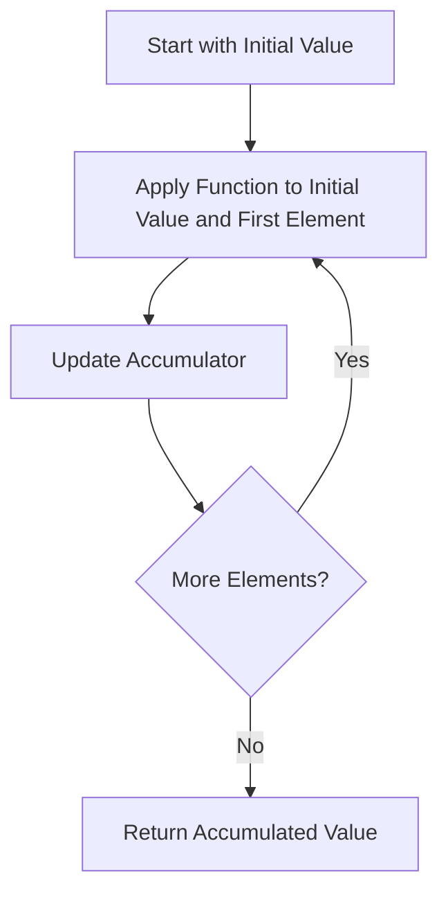

## 6.4.2 Aggregating Data with `reduce`

In this section, we delve into the powerful `reduce` function in Clojure, a cornerstone of functional programming that allows for elegant and efficient data aggregation. As experienced Java developers, you may be familiar with similar concepts in Java 8's Stream API, but Clojure's `reduce` offers a more flexible and expressive approach. Let's explore how `reduce` processes collections to produce a single accumulated value, with examples like summing numbers, concatenating strings, or building data structures.

### Understanding `reduce`

The `reduce` function in Clojure is a higher-order function that takes a function and a collection as arguments. It applies the function to the elements of the collection, accumulating a single result. The function passed to `reduce` must take two arguments: an accumulator and the current element of the collection.

#### Basic Syntax

```clojure
(reduce f coll)
(reduce f init coll)
```

- **`f`**: A function that takes two arguments: the accumulator and the current element.
- **`coll`**: The collection to be reduced.
- **`init`**: An optional initial value for the accumulator.

### Comparing `reduce` in Clojure and Java

In Java, the `reduce` operation is part of the Stream API introduced in Java 8. It serves a similar purpose but with some differences in syntax and flexibility.

#### Java Example

```java
import java.util.Arrays;
import java.util.List;

public class ReduceExample {
    public static void main(String[] args) {
        List<Integer> numbers = Arrays.asList(1, 2, 3, 4, 5);
        int sum = numbers.stream().reduce(0, Integer::sum);
        System.out.println("Sum: " + sum);
    }
}
```

#### Clojure Example

```clojure
(def numbers [1 2 3 4 5])
(def sum (reduce + 0 numbers))
(println "Sum:" sum)
```

**Key Differences:**

- **Syntax**: Clojure's syntax is more concise and expressive, leveraging its functional nature.
- **Flexibility**: Clojure's `reduce` can work with any collection type, while Java's Stream API is limited to streams.
- **Immutability**: Clojure's collections are immutable, ensuring thread safety and consistency.

### Practical Examples of `reduce`

Let's explore some practical examples to understand how `reduce` can be used for various data aggregation tasks.

#### Summing Numbers

One of the simplest uses of `reduce` is to sum a collection of numbers.

```clojure
(def numbers [1 2 3 4 5])
(def sum (reduce + numbers))
(println "Sum:" sum) ; Output: Sum: 15
```

Here, `+` is a function that takes two arguments and returns their sum. `reduce` applies this function across the collection, accumulating the total sum.

#### Concatenating Strings

`reduce` can also be used to concatenate strings.

```clojure
(def words ["Hello" "world" "from" "Clojure"])
(def sentence (reduce str words))
(println sentence) ; Output: HelloworldfromClojure
```

To add spaces between words, we can modify the function:

```clojure
(def sentence-with-spaces (reduce (fn [acc word] (str acc " " word)) words))
(println sentence-with-spaces) ; Output: Hello world from Clojure
```

#### Building Data Structures

`reduce` can be used to build complex data structures, such as maps or sets.

```clojure
(def pairs [[:a 1] [:b 2] [:c 3]])
(def map (reduce (fn [acc [k v]] (assoc acc k v)) {} pairs))
(println map) ; Output: {:a 1, :b 2, :c 3}
```

In this example, `reduce` transforms a collection of key-value pairs into a map.

### Visualizing `reduce` with Diagrams

To better understand how `reduce` works, let's visualize the process using a flowchart.



**Diagram Explanation**: This flowchart illustrates the iterative process of `reduce`, where the function is applied to each element of the collection, updating the accumulator until all elements are processed.

### Advanced Usage of `reduce`

#### Custom Aggregation Functions

You can define custom aggregation functions to perform more complex operations.

```clojure
(defn custom-agg [acc x]
  (if (even? x)
    (+ acc x)
    acc))

(def even-sum (reduce custom-agg 0 numbers))
(println "Sum of even numbers:" even-sum) ; Output: Sum of even numbers: 6
```

In this example, `custom-agg` only adds even numbers to the accumulator.

#### Using `reduce` with Transducers

Transducers are a powerful feature in Clojure that allow for composable and efficient data transformations. They can be used with `reduce` to optimize performance.

```clojure
(def xf (comp (filter even?) (map #(* % %))))
(def even-squares-sum (transduce xf + 0 numbers))
(println "Sum of squares of even numbers:" even-squares-sum) ; Output: Sum of squares of even numbers: 20
```

**Transducers**: Transducers allow you to compose multiple transformations into a single pass over the data, improving performance by reducing intermediate collections.

### Try It Yourself

Experiment with the following exercises to deepen your understanding of `reduce`:

1. **Modify the String Concatenation Example**: Add a comma between each word instead of a space.
2. **Create a Custom Aggregation Function**: Write a function that calculates the product of all odd numbers in a collection.
3. **Use `reduce` to Flatten a Nested Collection**: Given a collection of collections, use `reduce` to flatten it into a single collection.

### Exercises and Practice Problems

1. **Sum of Squares**: Use `reduce` to calculate the sum of squares of a list of numbers.
2. **Count Occurrences**: Write a function using `reduce` that counts the occurrences of each element in a collection.
3. **Reverse a Collection**: Implement a function that reverses a collection using `reduce`.

### Key Takeaways

- **`reduce` is a versatile tool** for aggregating data in Clojure, offering flexibility and expressiveness.
- **Immutability and thread safety** are inherent in Clojure's `reduce`, making it suitable for concurrent applications.
- **Transducers enhance performance** by allowing composable transformations without intermediate collections.

By mastering `reduce`, you can leverage Clojure's functional programming paradigm to write concise, efficient, and expressive code. Now that we've explored how `reduce` works, let's apply these concepts to manage data aggregation effectively in your applications.

### Further Reading

- [Official Clojure Documentation on `reduce`](https://clojure.org/reference/reducers)
- [ClojureDocs: `reduce`](https://clojuredocs.org/clojure.core/reduce)
- [Java Stream API Documentation](https://docs.oracle.com/javase/8/docs/api/java/util/stream/package-summary.html)

## Quiz: Mastering Data Aggregation with Clojure's `reduce`



### What is the primary purpose of the `reduce` function in Clojure?

- [x] To process a collection and produce a single accumulated value
- [ ] To filter elements from a collection
- [ ] To map a function over each element in a collection
- [ ] To sort a collection

> **Explanation:** The `reduce` function is used to process a collection and produce a single accumulated value by applying a function to each element.

### How does Clojure's `reduce` differ from Java's Stream API `reduce`?

- [x] Clojure's `reduce` can work with any collection type, while Java's Stream API is limited to streams
- [ ] Clojure's `reduce` is only for numeric operations
- [ ] Java's Stream API `reduce` is more flexible
- [ ] Clojure's `reduce` requires mutable collections

> **Explanation:** Clojure's `reduce` can work with any collection type, providing more flexibility compared to Java's Stream API, which is limited to streams.

### Which of the following is a correct use of `reduce` to sum a list of numbers in Clojure?

- [x] `(reduce + [1 2 3 4 5])`
- [ ] `(reduce * [1 2 3 4 5])`
- [ ] `(reduce - [1 2 3 4 5])`
- [ ] `(reduce / [1 2 3 4 5])`

> **Explanation:** The correct use of `reduce` to sum a list of numbers is `(reduce + [1 2 3 4 5])`, where `+` is the function applied to accumulate the sum.

### What is the role of the accumulator in the `reduce` function?

- [x] It holds the current accumulated value as `reduce` processes each element
- [ ] It stores the original collection
- [ ] It is used to filter elements
- [ ] It determines the order of elements

> **Explanation:** The accumulator holds the current accumulated value as `reduce` processes each element, updating with each application of the function.

### Which of the following examples demonstrates using `reduce` to build a map from a collection of key-value pairs?

- [x] `(reduce (fn [acc [k v]] (assoc acc k v)) {} [[:a 1] [:b 2] [:c 3]])`
- [ ] `(reduce (fn [acc [k v]] (dissoc acc k v)) {} [[:a 1] [:b 2] [:c 3]])`
- [ ] `(reduce (fn [acc [k v]] (conj acc k v)) {} [[:a 1] [:b 2] [:c 3]])`
- [ ] `(reduce (fn [acc [k v]] (merge acc k v)) {} [[:a 1] [:b 2] [:c 3]])`

> **Explanation:** The example `(reduce (fn [acc [k v]] (assoc acc k v)) {} [[:a 1] [:b 2] [:c 3]])` demonstrates using `reduce` to build a map from a collection of key-value pairs.

### True or False: Transducers can be used with `reduce` to optimize performance by reducing intermediate collections.

- [x] True
- [ ] False

> **Explanation:** True. Transducers can be used with `reduce` to optimize performance by allowing composable transformations without creating intermediate collections.

### What is the output of the following Clojure code? `(reduce str ["Hello" " " "world"])`

- [x] "Hello world"
- [ ] "Helloworld"
- [ ] "Hello"
- [ ] "world"

> **Explanation:** The output is "Hello world" because `reduce` concatenates the strings with the `str` function, preserving spaces.

### Which of the following best describes the use of `reduce` with an initial value?

- [x] It allows specifying a starting value for the accumulator
- [ ] It is required for all `reduce` operations
- [ ] It limits `reduce` to numeric operations
- [ ] It is used to sort the collection

> **Explanation:** Specifying an initial value for the accumulator allows `reduce` to start with a predefined value, which is especially useful for operations like summing with a non-zero start.

### How can `reduce` be used to reverse a collection?

- [x] By using a function that prepends each element to the accumulator
- [ ] By using a function that appends each element to the accumulator
- [ ] By using a function that multiplies each element
- [ ] By using a function that filters elements

> **Explanation:** `reduce` can reverse a collection by using a function that prepends each element to the accumulator, effectively reversing the order.

### True or False: Clojure's `reduce` function is inherently thread-safe due to its use of immutable data structures.

- [x] True
- [ ] False

> **Explanation:** True. Clojure's `reduce` function is inherently thread-safe because it operates on immutable data structures, ensuring consistency and safety in concurrent environments.


