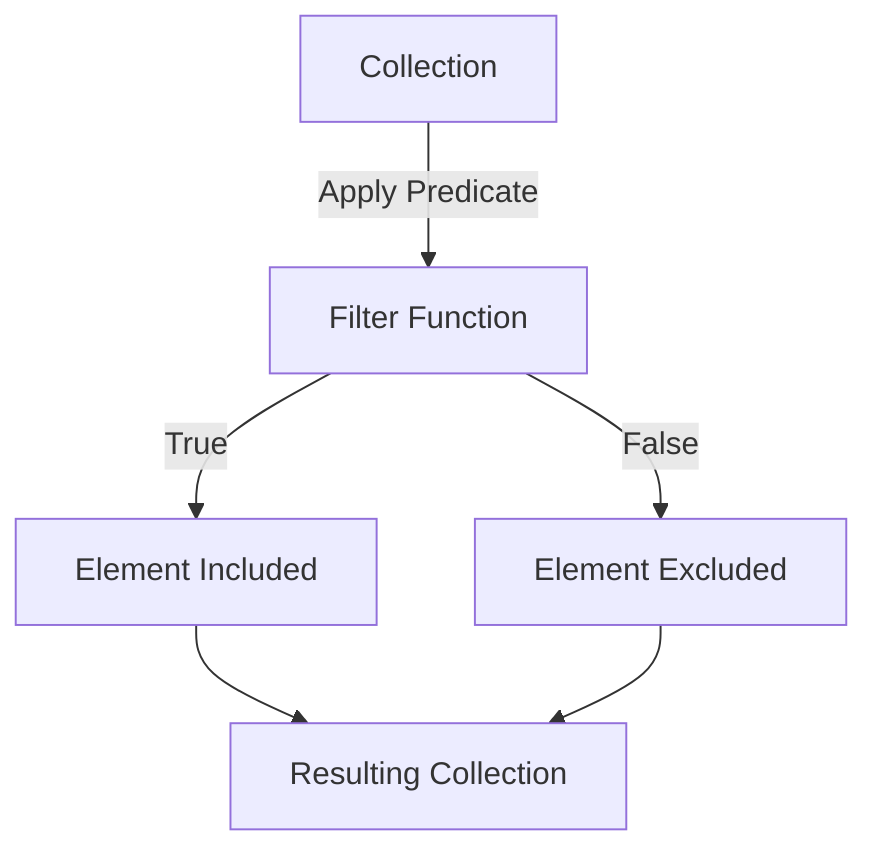

## 6.4.3 Filtering Collections with `filter`

In this section, we delve into the `filter` function in Clojure, a powerful tool for selecting elements from a collection that satisfy a given predicate function. As experienced Java developers, you are likely familiar with filtering collections using loops or streams. Clojure's `filter` offers a more concise and expressive way to achieve similar results, leveraging the power of functional programming.

### Understanding the `filter` Function

The `filter` function in Clojure is a higher-order function that takes two arguments: a predicate function and a collection. It returns a lazy sequence of elements from the collection for which the predicate returns true. This approach aligns with Clojure's emphasis on immutability and functional programming, allowing for efficient and expressive data processing.

**Syntax:**

```clojure
(filter predicate-fn collection)
```

- **predicate-fn**: A function that takes an element from the collection and returns a boolean value.
- **collection**: The collection to be filtered.

### Filtering Collections: A Java Perspective

In Java, filtering elements from a collection often involves using loops or the Stream API. Let's consider an example where we filter even numbers from a list.

**Java Example: Filtering Even Numbers**

```java
import java.util.Arrays;
import java.util.List;
import java.util.stream.Collectors;

public class FilterExample {
    public static void main(String[] args) {
        List<Integer> numbers = Arrays.asList(1, 2, 3, 4, 5, 6);
        List<Integer> evenNumbers = numbers.stream()
                                           .filter(n -> n % 2 == 0)
                                           .collect(Collectors.toList());
        System.out.println(evenNumbers); // Output: [2, 4, 6]
    }
}
```

In this example, we use Java's Stream API to filter even numbers. The `filter` method takes a lambda expression as a predicate, and `collect` gathers the results into a list.

### Filtering Collections: The Clojure Way

Clojure's `filter` function provides a similar capability but with a more concise and expressive syntax. Let's see how we can achieve the same result in Clojure.

**Clojure Example: Filtering Even Numbers**

```clojure
(def numbers [1 2 3 4 5 6])

(defn even? [n]
  (zero? (mod n 2)))

(def even-numbers (filter even? numbers))

(println even-numbers) ; Output: (2 4 6)
```

In this Clojure example, we define a predicate function `even?` that checks if a number is even. We then use `filter` to apply this predicate to the `numbers` collection, resulting in a lazy sequence of even numbers.

### Lazy Evaluation and Efficiency

One of the key advantages of Clojure's `filter` function is its lazy evaluation. Unlike Java's eager evaluation, where the entire collection is processed immediately, Clojure processes elements only as needed. This can lead to significant performance improvements, especially with large datasets.

**Lazy Evaluation Example**

```clojure
(defn expensive-computation [n]
  (println "Computing for" n)
  (zero? (mod n 2)))

(def lazy-even-numbers (filter expensive-computation numbers))

; Only prints computations for the first two elements
(println (take 2 lazy-even-numbers)) ; Output: (2 4)
```

In this example, the `expensive-computation` function simulates a costly operation. Notice how only the necessary computations are performed when we use `take` to retrieve the first two elements.

### Predicate Functions: Flexibility and Power

The power of `filter` lies in its ability to work with any predicate function. This flexibility allows you to define complex filtering logic tailored to your specific needs.

**Example: Filtering Strings by Length**

```clojure
(def strings ["apple" "banana" "cherry" "date"])

(defn long-string? [s]
  (> (count s) 5))

(def long-strings (filter long-string? strings))

(println long-strings) ; Output: ("banana" "cherry")
```

Here, we define a predicate `long-string?` that checks if a string's length exceeds five characters. The `filter` function then selects strings that satisfy this condition.

### Combining Filters for Complex Queries

Clojure's functional nature allows you to compose multiple filters to perform complex queries. This is akin to chaining operations in Java's Stream API.

**Example: Filtering with Multiple Conditions**

```clojure
(defn vowel-start? [s]
  (contains? #{\a \e \i \o \u} (first s)))

(def vowel-start-strings (filter vowel-start? strings))

(println vowel-start-strings) ; Output: ("apple")
```

In this example, we define a predicate `vowel-start?` to filter strings starting with a vowel. By combining this with other predicates, you can create sophisticated filtering logic.

### Visualizing the Flow of Data

To better understand how data flows through the `filter` function, let's visualize the process using a flowchart.



**Diagram Description**: This flowchart illustrates how each element in a collection is processed by the `filter` function. Elements that satisfy the predicate are included in the resulting collection, while others are excluded.

### Try It Yourself: Experimenting with `filter`

Now that we've explored the basics of `filter`, let's encourage you to experiment with it. Try modifying the examples above to filter different types of collections or use custom predicates.

**Challenge**: Create a predicate function that filters out numbers greater than a specified threshold. Use `filter` to apply this predicate to a collection of numbers.

### Comparing Clojure's `filter` with Java's Stream API

While both Clojure's `filter` and Java's Stream API provide powerful filtering capabilities, there are notable differences in their approach and syntax.

- **Conciseness**: Clojure's syntax is often more concise, reducing boilerplate code.
- **Lazy Evaluation**: Clojure's lazy sequences can lead to performance benefits.
- **Functional Paradigm**: Clojure embraces immutability and pure functions, promoting a different programming style.

### Exercises: Practicing with `filter`

To reinforce your understanding, try solving these exercises:

1. **Filter Odd Numbers**: Write a Clojure function that filters out odd numbers from a collection.
2. **Filter by Substring**: Create a predicate that filters strings containing a specific substring.
3. **Filter Nested Collections**: Use `filter` to process nested collections, such as lists of lists.

### Key Takeaways

- **`filter` Function**: A powerful tool for selecting elements from a collection based on a predicate.
- **Lazy Evaluation**: Enhances performance by processing elements only as needed.
- **Predicate Flexibility**: Allows for complex filtering logic tailored to specific needs.
- **Comparison with Java**: Highlights differences in syntax, evaluation, and programming paradigms.

By mastering the `filter` function, you can efficiently process collections in Clojure, leveraging the power of functional programming to write clean and expressive code.

### Further Reading

For more information on Clojure's `filter` function and related topics, consider exploring the following resources:

- [Official Clojure Documentation](https://clojure.org/reference/sequences)
- [ClojureDocs: filter](https://clojuredocs.org/clojure.core/filter)
- [Functional Programming in Clojure](https://www.braveclojure.com/)

---

## Quiz: Mastering Clojure's `filter` Function



### What does the `filter` function in Clojure do?

- [x] Selects elements from a collection that satisfy a predicate function
- [ ] Sorts elements in a collection
- [ ] Maps elements to new values
- [ ] Reduces a collection to a single value

> **Explanation:** The `filter` function selects elements from a collection that satisfy a given predicate function.

### How does Clojure's `filter` function differ from Java's Stream API?

- [x] Clojure's `filter` is lazy, while Java's Stream API is eager
- [ ] Clojure's `filter` is eager, while Java's Stream API is lazy
- [ ] Both are lazy
- [ ] Both are eager

> **Explanation:** Clojure's `filter` function is lazy, meaning it processes elements only as needed, unlike Java's Stream API, which is eager.

### What is a predicate function in the context of `filter`?

- [x] A function that returns a boolean value
- [ ] A function that modifies elements
- [ ] A function that aggregates data
- [ ] A function that sorts elements

> **Explanation:** A predicate function is one that returns a boolean value, used to determine if an element should be included in the filtered collection.

### What is the output of `(filter even? [1 2 3 4 5 6])` in Clojure?

- [x] (2 4 6)
- [ ] (1 3 5)
- [ ] (1 2 3 4 5 6)
- [ ] ()

> **Explanation:** The `filter` function selects even numbers from the collection, resulting in (2 4 6).

### Which of the following is a benefit of lazy evaluation in Clojure?

- [x] Improved performance with large datasets
- [ ] Immediate processing of all elements
- [ ] Increased memory usage
- [ ] Simplified code syntax

> **Explanation:** Lazy evaluation processes elements only as needed, improving performance with large datasets.

### How can you combine multiple predicates in Clojure?

- [x] Using logical operators like `and` and `or`
- [ ] Using the `map` function
- [ ] Using the `reduce` function
- [ ] Using the `sort` function

> **Explanation:** You can combine multiple predicates using logical operators like `and` and `or` to create complex filtering logic.

### What is the result of `(filter #(> % 3) [1 2 3 4 5])`?

- [x] (4 5)
- [ ] (1 2 3)
- [ ] (3 4 5)
- [ ] (1 2 3 4 5)

> **Explanation:** The `filter` function selects numbers greater than 3, resulting in (4 5).

### What is a key difference between Clojure's `filter` and Java's `filter` method in streams?

- [x] Clojure's `filter` returns a lazy sequence
- [ ] Java's `filter` returns a lazy sequence
- [ ] Both return eager sequences
- [ ] Both return lazy sequences

> **Explanation:** Clojure's `filter` returns a lazy sequence, while Java's `filter` in streams returns an eager sequence.

### How can you filter strings by length in Clojure?

- [x] Use a predicate function that checks the string length
- [ ] Use the `map` function
- [ ] Use the `reduce` function
- [ ] Use the `sort` function

> **Explanation:** You can filter strings by length using a predicate function that checks the string length.

### True or False: Clojure's `filter` function can be used with any collection type.

- [x] True
- [ ] False

> **Explanation:** Clojure's `filter` function can be used with any collection type, including lists, vectors, and sets.


