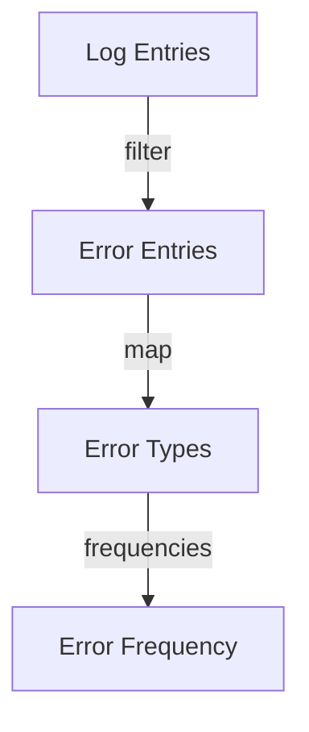

## 6.6 Practical Examples in Data Processing

In this section, we will explore how higher-order functions in Clojure can be leveraged to simplify and enhance data processing tasks. As experienced Java developers, you may be familiar with the concept of higher-order functions introduced in Java 8 with lambda expressions and the Stream API. Clojure, being a functional language, takes these concepts further, offering a rich set of tools for data transformation and manipulation. We will delve into practical examples such as processing logs, transforming datasets, and implementing business rules, demonstrating how Clojure's functional paradigm can streamline these tasks.

### Understanding Higher-Order Functions

Higher-order functions are functions that can take other functions as arguments or return them as results. This concept is central to functional programming and allows for more abstract and flexible code. In Java, higher-order functions are often used with the `Function` interface and lambda expressions. In Clojure, they are a natural part of the language, enabling concise and expressive data processing.

### Processing Logs with Higher-Order Functions

Let's start with a common task: processing log files. Log files are often large and need to be parsed, filtered, and analyzed. Clojure's higher-order functions make this task straightforward.

#### Example: Filtering and Analyzing Log Entries

Suppose we have a log file where each line represents a log entry. We want to filter out entries that contain errors and then analyze the frequency of different error types.

```clojure
(def log-entries
  ["INFO: User logged in"
   "ERROR: Null pointer exception"
   "WARN: Deprecated API usage"
   "ERROR: Array index out of bounds"
   "INFO: User logged out"])

(defn is-error? [entry]
  (.contains entry "ERROR"))

(defn extract-error-type [entry]
  (second (clojure.string/split entry #": ")))

(def error-entries (filter is-error? log-entries))

(def error-types (map extract-error-type error-entries))

(def error-frequency (frequencies error-types))

(println "Error Frequency:" error-frequency)
```

**Explanation:**

- **`filter`**: A higher-order function that takes a predicate function (`is-error?`) and a collection (`log-entries`), returning only those elements for which the predicate returns true.
- **`map`**: Applies the `extract-error-type` function to each element of the `error-entries` collection.
- **`frequencies`**: A Clojure function that counts the occurrences of each unique element in a collection.

**Try It Yourself**: Modify the `is-error?` function to filter for warnings instead of errors and observe the changes in the output.

### Transforming Datasets with Higher-Order Functions

Data transformation is a common requirement in many applications. Clojure's higher-order functions provide a powerful way to transform datasets efficiently.

#### Example: Transforming a CSV Dataset

Consider a CSV file representing a dataset of users with fields such as name, age, and email. We want to transform this dataset to include only users above a certain age and format their information.

```clojure
(def users
  [{:name "Alice" :age 30 :email "alice@example.com"}
   {:name "Bob" :age 25 :email "bob@example.com"}
   {:name "Charlie" :age 35 :email "charlie@example.com"}])

(defn adult? [user]
  (>= (:age user) 30))

(defn format-user [user]
  (str (:name user) " (" (:age user) ") - " (:email user)))

(def adult-users (filter adult? users))

(def formatted-users (map format-user adult-users))

(println "Formatted Users:" formatted-users)
```

**Explanation:**

- **`filter`**: Filters the `users` collection to include only those users who are adults (age 30 or above).
- **`map`**: Transforms each user in the `adult-users` collection into a formatted string.

**Try It Yourself**: Change the age threshold in the `adult?` function to 25 and see how the output changes.

### Implementing Business Rules with Higher-Order Functions

Business rules often involve complex logic that can be elegantly expressed using higher-order functions. Let's consider an example where we need to apply a series of business rules to a dataset.

#### Example: Applying Business Rules to Transactions

Suppose we have a list of transactions, and we need to apply discounts based on certain conditions.

```clojure
(def transactions
  [{:id 1 :amount 100 :type "purchase"}
   {:id 2 :amount 200 :type "refund"}
   {:id 3 :amount 150 :type "purchase"}])

(defn apply-discount [transaction]
  (if (= (:type transaction) "purchase")
    (update transaction :amount #(* % 0.9))
    transaction))

(def discounted-transactions (map apply-discount transactions))

(println "Discounted Transactions:" discounted-transactions)
```

**Explanation:**

- **`map`**: Applies the `apply-discount` function to each transaction, reducing the amount by 10% for purchases.

**Try It Yourself**: Add a new business rule to apply a different discount for transactions over a certain amount.

### Comparing with Java

In Java, similar tasks would require more boilerplate code, especially before Java 8. With the introduction of lambda expressions and the Stream API, Java has become more functional, but Clojure's syntax remains more concise and expressive.

#### Java Example: Filtering and Transforming a List

```java
import java.util.*;
import java.util.stream.*;

public class LogProcessor {
    public static void main(String[] args) {
        List<String> logEntries = Arrays.asList(
            "INFO: User logged in",
            "ERROR: Null pointer exception",
            "WARN: Deprecated API usage",
            "ERROR: Array index out of bounds",
            "INFO: User logged out"
        );

        Map<String, Long> errorFrequency = logEntries.stream()
            .filter(entry -> entry.contains("ERROR"))
            .map(entry -> entry.split(": ")[1])
            .collect(Collectors.groupingBy(e -> e, Collectors.counting()));

        System.out.println("Error Frequency: " + errorFrequency);
    }
}
```

**Comparison:**

- **Boilerplate**: Java requires more setup and boilerplate code compared to Clojure's concise syntax.
- **Expressiveness**: Clojure's use of higher-order functions like `filter` and `map` directly on collections makes the code more readable and expressive.

### Visualizing Data Flow with Higher-Order Functions

To better understand how data flows through higher-order functions, let's visualize the process using a diagram.



**Diagram Explanation**: This flowchart illustrates how log entries are processed through a series of higher-order functions to produce an error frequency map.

### Exercises and Practice Problems

1. **Log Processing Challenge**: Extend the log processing example to categorize logs into different severity levels (INFO, WARN, ERROR) and count the occurrences of each level.

2. **Dataset Transformation Task**: Given a dataset of products with fields such as name, price, and category, filter out products below a certain price and format the remaining products into a summary string.

3. **Business Rule Implementation**: Implement a series of business rules for a list of orders, such as applying discounts based on order value and customer loyalty status.

### Key Takeaways

- **Higher-Order Functions**: Clojure's higher-order functions like `filter`, `map`, and `reduce` provide powerful tools for data processing, enabling concise and expressive code.
- **Functional Paradigm**: Embracing the functional paradigm allows for more abstract and flexible code, reducing boilerplate and enhancing readability.
- **Comparison with Java**: While Java has adopted functional programming features, Clojure's syntax and capabilities offer a more seamless experience for data processing tasks.

By applying these concepts, you can harness the full potential of Clojure's functional programming paradigm to streamline data processing in your applications. Now that we've explored practical examples of higher-order functions in data processing, let's continue to build on these skills as we delve deeper into Clojure's capabilities.

## Quiz: Mastering Higher-Order Functions in Clojure



### What is a higher-order function?

- [x] A function that takes other functions as arguments or returns them as results
- [ ] A function that only operates on numbers
- [ ] A function that is always recursive
- [ ] A function that cannot be nested

> **Explanation:** Higher-order functions are those that can take other functions as arguments or return them as results, enabling more abstract and flexible code.

### Which Clojure function is used to apply a function to each element of a collection?

- [ ] filter
- [x] map
- [ ] reduce
- [ ] apply

> **Explanation:** The `map` function in Clojure is used to apply a given function to each element of a collection, returning a new collection of results.

### In the log processing example, what does the `filter` function do?

- [x] It filters the log entries to include only those that contain "ERROR"
- [ ] It transforms each log entry into a different format
- [ ] It counts the number of log entries
- [ ] It sorts the log entries

> **Explanation:** The `filter` function is used to include only those log entries that contain the string "ERROR".

### How does Clojure's `frequencies` function work?

- [x] It counts the occurrences of each unique element in a collection
- [ ] It sorts the elements of a collection
- [ ] It removes duplicates from a collection
- [ ] It concatenates all elements of a collection

> **Explanation:** The `frequencies` function in Clojure counts the occurrences of each unique element in a collection, returning a map of elements to their counts.

### What is the main advantage of using higher-order functions in data processing?

- [x] They enable concise and expressive code
- [ ] They make code run faster
- [ ] They eliminate all bugs
- [ ] They are easier to debug

> **Explanation:** Higher-order functions enable concise and expressive code, allowing for more abstract and flexible data processing.

### Which Java feature introduced higher-order functions?

- [ ] Java 7
- [x] Java 8
- [ ] Java 9
- [ ] Java 10

> **Explanation:** Java 8 introduced higher-order functions with lambda expressions and the Stream API.

### What is the purpose of the `map` function in the dataset transformation example?

- [x] To transform each user into a formatted string
- [ ] To filter out users below a certain age
- [ ] To sort the users by age
- [ ] To count the number of users

> **Explanation:** The `map` function is used to transform each user in the collection into a formatted string.

### How does Clojure's syntax compare to Java's for similar tasks?

- [x] Clojure's syntax is more concise and expressive
- [ ] Java's syntax is more concise and expressive
- [ ] Both are equally concise
- [ ] Clojure requires more boilerplate

> **Explanation:** Clojure's syntax is more concise and expressive, especially for functional programming tasks, compared to Java.

### What is a common use case for higher-order functions in business rule implementation?

- [x] Applying discounts based on conditions
- [ ] Sorting data alphabetically
- [ ] Counting elements in a list
- [ ] Formatting strings

> **Explanation:** Higher-order functions are commonly used to apply business rules, such as discounts, based on specific conditions.

### True or False: Higher-order functions can only be used with numeric data.

- [ ] True
- [x] False

> **Explanation:** Higher-order functions can be used with any type of data, not just numeric data.


