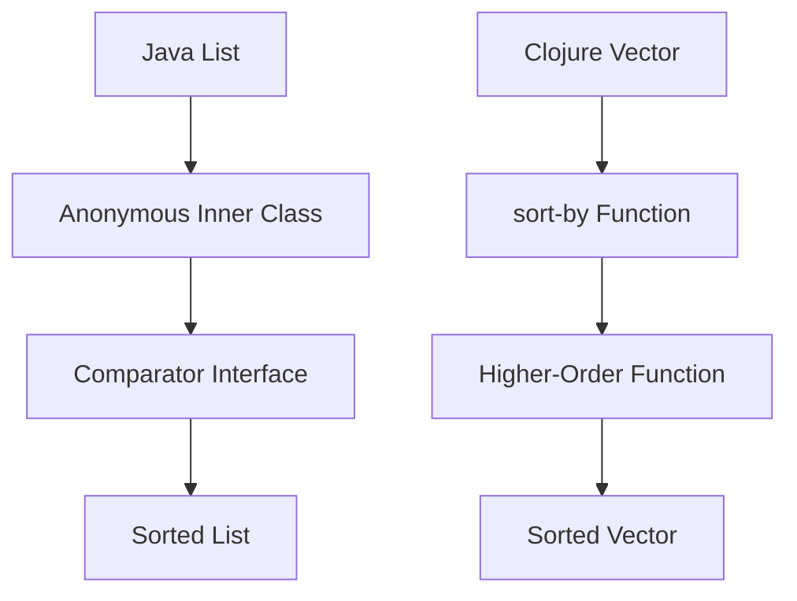

## 6.7.1 Java Before Java 8

In this section, we delve into the world of Java before version 8, a time when the language was predominantly imperative and object-oriented. Java developers faced significant challenges when attempting to implement functional programming paradigms due to the lack of native support for higher-order functions and lambda expressions. We'll explore these limitations, discuss the workarounds employed, and compare them with the functional programming capabilities of Clojure.

### The Limitations of Java Before Version 8

Java, before its 8th iteration, was designed with a strong emphasis on object-oriented programming (OOP). This design choice made it difficult to adopt functional programming concepts, which are central to languages like Clojure. Let's examine some of the key limitations:

1. **Lack of First-Class Functions**: Java did not treat functions as first-class citizens. This means functions could not be passed as arguments, returned from other functions, or assigned to variables. Instead, Java relied heavily on objects and classes to encapsulate behavior.

2. **Verbose Syntax**: The absence of lambda expressions meant that developers had to use anonymous inner classes to simulate function-like behavior. This approach was often verbose and cumbersome, leading to less readable and maintainable code.

3. **Limited Functional Interfaces**: Although Java had interfaces like `Runnable` and `Comparator`, these were not designed with functional programming in mind. Implementing these interfaces required creating full-fledged classes or anonymous inner classes, adding to the verbosity.

4. **No Stream API**: Java lacked a built-in Stream API for processing sequences of elements in a functional style. This made it challenging to perform operations like map, filter, and reduce, which are common in functional programming.

### Anonymous Inner Classes: A Workaround

To overcome the limitations of not having first-class functions, Java developers often resorted to using anonymous inner classes. These classes allowed for the creation of one-off implementations of interfaces, enabling a form of functional programming, albeit in a verbose manner.

#### Example: Sorting with Anonymous Inner Classes

Consider the task of sorting a list of strings by their length. In Java before version 8, this would typically be done using an anonymous inner class:

```java
import java.util.*;

public class SortExample {
    public static void main(String[] args) {
        List<String> names = Arrays.asList("Alice", "Bob", "Charlie", "David");

        // Sort using an anonymous inner class
        Collections.sort(names, new Comparator<String>() {
            @Override
            public int compare(String s1, String s2) {
                return Integer.compare(s1.length(), s2.length());
            }
        });

        System.out.println(names);
    }
}
```

**Explanation**: Here, we define an anonymous inner class that implements the `Comparator` interface. The `compare` method is overridden to sort the strings by their length. While this achieves the desired result, the syntax is verbose and detracts from the clarity of the code.

### Clojure's Approach to Higher-Order Functions

Clojure, in contrast, embraces functional programming with its support for higher-order functions, immutability, and concise syntax. Let's look at how the same sorting task can be accomplished in Clojure:

```clojure
(def names ["Alice" "Bob" "Charlie" "David"])

;; Sort using a higher-order function
(def sorted-names (sort-by count names))

(println sorted-names)
```

**Explanation**: In Clojure, the `sort-by` function is used to sort the list of names by their length. The `count` function is passed as an argument, demonstrating Clojure's support for higher-order functions. The syntax is concise and expressive, highlighting the power of functional programming.

### Diagram: Java vs. Clojure Sorting

Below is a diagram illustrating the flow of data through the sorting process in both Java and Clojure:



**Caption**: This diagram compares the sorting process in Java using an anonymous inner class with Clojure's higher-order function approach.

### Challenges with Anonymous Inner Classes

While anonymous inner classes provided a workaround for the lack of first-class functions, they introduced several challenges:

- **Readability**: The verbosity of anonymous inner classes often obscured the intent of the code, making it harder to read and understand.
- **Maintainability**: The boilerplate code required for anonymous inner classes increased the risk of errors and made maintenance more difficult.
- **Performance**: The creation of additional class files for each anonymous inner class could lead to increased memory usage and slower performance.

### Try It Yourself: Refactor Java Code

To better understand the limitations of Java before version 8, try refactoring the following Java code to use anonymous inner classes:

```java
import java.util.*;

public class FilterExample {
    public static void main(String[] args) {
        List<String> names = Arrays.asList("Alice", "Bob", "Charlie", "David");

        // Filter names longer than 3 characters
        List<String> longNames = new ArrayList<>();
        for (String name : names) {
            if (name.length() > 3) {
                longNames.add(name);
            }
        }

        System.out.println(longNames);
    }
}
```

**Challenge**: Use an anonymous inner class to filter the list of names. Consider the readability and maintainability of your solution.

### Exercises: Implementing Functional Concepts in Java

1. **Exercise 1**: Implement a `Runnable` using an anonymous inner class to print numbers from 1 to 10. Discuss the verbosity and potential improvements with Java 8.

2. **Exercise 2**: Create a custom `Comparator` using an anonymous inner class to sort a list of integers in descending order. Compare this approach with Clojure's `sort` function.

3. **Exercise 3**: Use an anonymous inner class to implement a simple event listener for a button click in a Java Swing application. Reflect on the complexity and how lambda expressions could simplify the code.

### Key Takeaways

- **Java's Limitations**: Before version 8, Java lacked native support for functional programming, making it challenging to implement higher-order functions and concise code.
- **Anonymous Inner Classes**: These provided a workaround for the absence of first-class functions but introduced verbosity and complexity.
- **Clojure's Advantages**: Clojure's support for higher-order functions and concise syntax offers a more expressive and maintainable approach to functional programming.

By understanding the limitations of Java before version 8 and exploring the workarounds used, we can appreciate the advancements introduced in later versions and the benefits of adopting Clojure's functional programming paradigm.

### Further Reading

- [Official Clojure Documentation](https://clojure.org/)
- [ClojureDocs](https://clojuredocs.org/)
- [Java 8 Features](https://docs.oracle.com/javase/8/docs/)

## Quiz Time!



### What was a major limitation of Java before version 8?

- [x] Lack of first-class functions
- [ ] Lack of object-oriented programming
- [ ] Lack of a garbage collector
- [ ] Lack of a type system

> **Explanation:** Java before version 8 did not support first-class functions, which limited its functional programming capabilities.


### How did Java developers simulate function-like behavior before Java 8?

- [x] Using anonymous inner classes
- [ ] Using lambda expressions
- [ ] Using higher-order functions
- [ ] Using macros

> **Explanation:** Java developers used anonymous inner classes to simulate function-like behavior due to the lack of first-class functions.


### What is a drawback of using anonymous inner classes in Java?

- [x] Verbose syntax
- [ ] Lack of type safety
- [ ] Lack of encapsulation
- [ ] Lack of inheritance

> **Explanation:** Anonymous inner classes in Java are verbose, making the code less readable and maintainable.


### Which of the following is NOT a limitation of Java before version 8?

- [ ] Lack of first-class functions
- [ ] Verbose syntax
- [x] Lack of object-oriented support
- [ ] No Stream API

> **Explanation:** Java has always been an object-oriented language, even before version 8.


### How does Clojure handle sorting compared to Java before version 8?

- [x] Using higher-order functions
- [ ] Using anonymous inner classes
- [ ] Using inheritance
- [ ] Using interfaces

> **Explanation:** Clojure uses higher-order functions like `sort-by` to handle sorting, which is more concise than Java's approach before version 8.


### What is a benefit of Clojure's approach to higher-order functions?

- [x] Concise and expressive syntax
- [ ] Requires more boilerplate code
- [ ] Relies on inheritance
- [ ] Uses anonymous inner classes

> **Explanation:** Clojure's higher-order functions provide a concise and expressive syntax for functional programming.


### Which Java feature introduced in version 8 addresses the limitations discussed?

- [x] Lambda expressions
- [ ] Anonymous inner classes
- [ ] Abstract classes
- [ ] Interfaces

> **Explanation:** Lambda expressions introduced in Java 8 addressed the limitations by allowing functions to be treated as first-class citizens.


### What is a common use case for anonymous inner classes in Java?

- [x] Implementing event listeners
- [ ] Defining data structures
- [ ] Managing memory
- [ ] Handling exceptions

> **Explanation:** Anonymous inner classes are commonly used to implement event listeners in Java applications.


### How does Clojure's `sort-by` function improve code readability?

- [x] By using a concise syntax
- [ ] By using anonymous inner classes
- [ ] By requiring more lines of code
- [ ] By using inheritance

> **Explanation:** Clojure's `sort-by` function uses a concise syntax that improves code readability compared to Java's verbose approach.


### True or False: Java before version 8 supported higher-order functions natively.

- [ ] True
- [x] False

> **Explanation:** Java before version 8 did not support higher-order functions natively, which limited its functional programming capabilities.


