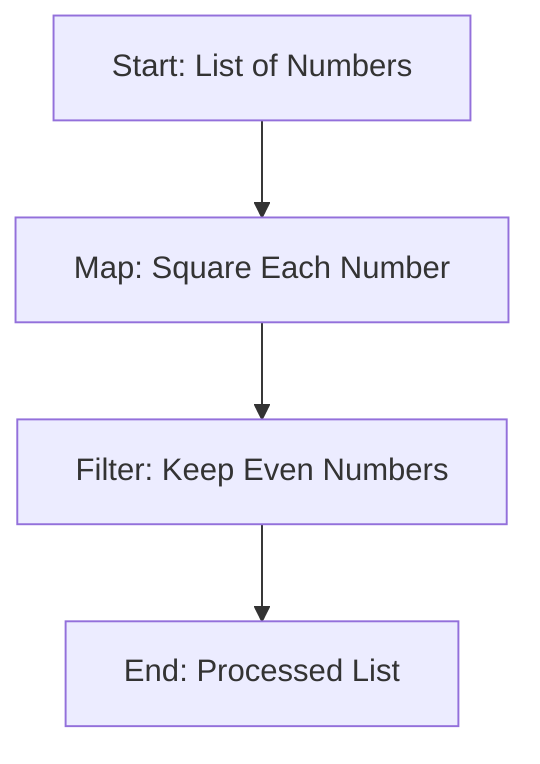

## 6.7.2 Lambda Expressions in Java 8 and Beyond

Java 8 marked a significant evolution in the Java programming language by introducing lambda expressions, which brought functional programming capabilities to Java. This section will delve into how lambda expressions work in Java, their syntax, and how they compare to Clojure's approach to functional programming. By understanding these concepts, experienced Java developers can better appreciate the functional paradigm and leverage Clojure's strengths.

### Understanding Lambda Expressions in Java

Lambda expressions in Java are a way to represent a function as an object. They enable you to treat functionality as a method argument or code as data. This is a fundamental shift from the object-oriented paradigm, allowing Java to support higher-order functions, which are functions that can take other functions as arguments or return them as results.

#### Syntax of Lambda Expressions

The syntax of a lambda expression in Java is concise and consists of three parts:

1. **Parameter List**: Enclosed in parentheses, similar to method parameters.
2. **Arrow Token**: `->` separates the parameter list from the body.
3. **Body**: Contains expressions or statements. If the body is a single expression, the curly braces are optional.

**Example:**

```java
// A simple lambda expression that takes two integers and returns their sum
(int a, int b) -> a + b
```

In this example, `(int a, int b)` is the parameter list, `->` is the arrow token, and `a + b` is the body of the lambda expression.

#### Functional Interfaces

Lambda expressions in Java rely on functional interfaces. A functional interface is an interface with a single abstract method (SAM). Java 8 introduced several built-in functional interfaces in the `java.util.function` package, such as `Function`, `Predicate`, `Consumer`, and `Supplier`.

**Example of a Functional Interface:**

```java
@FunctionalInterface
interface MyFunctionalInterface {
    void execute();
}
```

A lambda expression can be assigned to an instance of a functional interface:

```java
MyFunctionalInterface myFunction = () -> System.out.println("Hello, Lambda!");
myFunction.execute(); // Outputs: Hello, Lambda!
```

### Comparing Java Lambda Expressions to Clojure

Clojure, being a functional programming language, inherently supports functions as first-class citizens. This means functions can be passed around as arguments, returned from other functions, and assigned to variables without the need for special syntax or constructs like functional interfaces.

#### Clojure's Approach to Functions

In Clojure, functions are defined using the `fn` keyword or the shorthand `#()` syntax for anonymous functions. Clojure's syntax is concise and expressive, allowing developers to focus on the logic rather than boilerplate code.

**Example in Clojure:**

```clojure
;; A simple function that takes two numbers and returns their sum
(defn add [a b]
  (+ a b))

;; Anonymous function equivalent
(fn [a b] (+ a b))

;; Using shorthand syntax
#(+ %1 %2)
```

#### Higher-Order Functions in Clojure

Clojure's support for higher-order functions is seamless. Functions like `map`, `reduce`, and `filter` are built-in and can be used to process collections efficiently.

**Example of `map` in Clojure:**

```clojure
;; Using map to increment each element in a list
(map #(+ % 1) [1 2 3 4]) ; => (2 3 4 5)
```

### Key Differences Between Java and Clojure

1. **Syntax and Conciseness**: Clojure's syntax is more concise compared to Java's lambda expressions, which require functional interfaces.
2. **First-Class Functions**: In Clojure, functions are first-class citizens, whereas Java requires functional interfaces to achieve similar functionality.
3. **Immutability**: Clojure emphasizes immutability, making it easier to reason about code and avoid side effects.
4. **Concurrency**: Clojure provides powerful concurrency primitives, such as atoms and refs, which are not directly related to lambda expressions but enhance functional programming.

### Practical Examples and Exercises

Let's explore some practical examples to solidify our understanding of lambda expressions in Java and compare them with Clojure's approach.

#### Example 1: Filtering a List

**Java 8:**

```java
import java.util.Arrays;
import java.util.List;
import java.util.stream.Collectors;

public class LambdaExample {
    public static void main(String[] args) {
        List<String> names = Arrays.asList("Alice", "Bob", "Charlie");
        List<String> filteredNames = names.stream()
                                          .filter(name -> name.startsWith("A"))
                                          .collect(Collectors.toList());
        System.out.println(filteredNames); // Outputs: [Alice]
    }
}
```

**Clojure:**

```clojure
;; Filtering a list using filter
(def names ["Alice" "Bob" "Charlie"])
(def filtered-names (filter #(clojure.string/starts-with? % "A") names))
(println filtered-names) ; Outputs: (Alice)
```

#### Example 2: Mapping a List

**Java 8:**

```java
import java.util.Arrays;
import java.util.List;
import java.util.stream.Collectors;

public class LambdaExample {
    public static void main(String[] args) {
        List<Integer> numbers = Arrays.asList(1, 2, 3, 4);
        List<Integer> squaredNumbers = numbers.stream()
                                              .map(n -> n * n)
                                              .collect(Collectors.toList());
        System.out.println(squaredNumbers); // Outputs: [1, 4, 9, 16]
    }
}
```

**Clojure:**

```clojure
;; Mapping a list using map
(def numbers [1 2 3 4])
(def squared-numbers (map #(* % %) numbers))
(println squared-numbers) ; Outputs: (1 4 9 16)
```

### Try It Yourself

Experiment with the code examples above by modifying the lambda expressions and functions. For instance, try filtering names that end with a specific letter or mapping numbers to their cubes.

### Diagrams and Visualizations

To further illustrate the flow of data through higher-order functions, let's use a Mermaid.js diagram to visualize the process of mapping and filtering a collection.



**Diagram Caption**: This diagram illustrates the flow of data through a sequence of higher-order functions: mapping to square each number and filtering to keep only even numbers.

### Exercises

1. **Exercise 1**: Write a Java program using lambda expressions to filter a list of integers, keeping only the even numbers.
2. **Exercise 2**: Convert the Java program from Exercise 1 into a Clojure function using `filter`.
3. **Exercise 3**: Create a Clojure function that takes a list of strings and returns a list of their lengths using `map`.

### Summary and Key Takeaways

- **Lambda Expressions**: Java 8 introduced lambda expressions, enabling functional programming capabilities similar to Clojure.
- **Functional Interfaces**: Java relies on functional interfaces to support lambda expressions, while Clojure treats functions as first-class citizens.
- **Higher-Order Functions**: Both Java and Clojure support higher-order functions, but Clojure's syntax is more concise and expressive.
- **Immutability and Concurrency**: Clojure's emphasis on immutability and concurrency primitives enhances functional programming.

By understanding these concepts, Java developers can transition to Clojure more smoothly and leverage its functional programming strengths.

## Quiz: Test Your Knowledge on Java 8 Lambda Expressions and Clojure



### What is a lambda expression in Java?

- [x] A way to represent a function as an object
- [ ] A method that returns a lambda
- [ ] A class that implements a functional interface
- [ ] A new data type introduced in Java 8

> **Explanation:** Lambda expressions in Java are a way to represent a function as an object, enabling functional programming capabilities.

### What is a functional interface in Java?

- [x] An interface with a single abstract method
- [ ] An interface with multiple abstract methods
- [ ] A class that implements a lambda expression
- [ ] A new type of class introduced in Java 8

> **Explanation:** A functional interface is an interface with a single abstract method, which can be implemented using a lambda expression.

### How does Clojure treat functions compared to Java?

- [x] As first-class citizens
- [ ] As second-class citizens
- [ ] As objects only
- [ ] As methods only

> **Explanation:** In Clojure, functions are first-class citizens, meaning they can be passed around as arguments, returned from other functions, and assigned to variables.

### What is the syntax for a lambda expression in Java?

- [x] (parameters) -> expression
- [ ] {parameters} -> expression
- [ ] [parameters] -> expression
- [ ] <parameters> -> expression

> **Explanation:** The syntax for a lambda expression in Java is (parameters) -> expression.

### Which of the following is a built-in functional interface in Java?

- [x] Function
- [ ] List
- [ ] Map
- [ ] Set

> **Explanation:** `Function` is a built-in functional interface in Java, part of the `java.util.function` package.

### How do you define an anonymous function in Clojure?

- [x] Using the `fn` keyword or `#()` syntax
- [ ] Using the `lambda` keyword
- [ ] Using the `function` keyword
- [ ] Using the `def` keyword

> **Explanation:** In Clojure, anonymous functions can be defined using the `fn` keyword or the shorthand `#()` syntax.

### What is the purpose of the `map` function in Clojure?

- [x] To apply a function to each element in a collection
- [ ] To filter elements in a collection
- [ ] To reduce a collection to a single value
- [ ] To sort elements in a collection

> **Explanation:** The `map` function in Clojure applies a given function to each element in a collection, returning a new collection of results.

### What is the main advantage of using lambda expressions in Java?

- [x] They enable functional programming capabilities
- [ ] They simplify object-oriented programming
- [ ] They replace all methods in Java
- [ ] They introduce new data types

> **Explanation:** Lambda expressions in Java enable functional programming capabilities, allowing for more concise and expressive code.

### How does Clojure handle immutability compared to Java?

- [x] Clojure emphasizes immutability by default
- [ ] Clojure does not support immutability
- [ ] Java emphasizes immutability by default
- [ ] Java and Clojure handle immutability the same way

> **Explanation:** Clojure emphasizes immutability by default, making it easier to reason about code and avoid side effects.

### True or False: Java 8 lambda expressions require functional interfaces.

- [x] True
- [ ] False

> **Explanation:** True. Java 8 lambda expressions require functional interfaces to provide a target type for the lambda expression.


