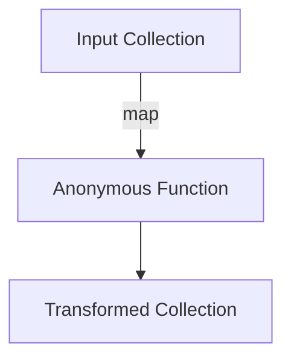

## 6.8.1 Syntax and Usage

In this section, we delve into the syntax and usage of lambda expressions in Java and anonymous functions in Clojure. As experienced Java developers, you are likely familiar with the introduction of lambda expressions in Java 8, which brought functional programming capabilities to the language. Clojure, being a functional-first language, has always embraced the use of anonymous functions. We will explore how these constructs differ in syntax, readability, conciseness, and expressiveness.

### Understanding Lambda Expressions in Java

Java introduced lambda expressions in version 8 to enable functional programming paradigms. A lambda expression in Java is essentially a concise way to represent an instance of a functional interface. It allows you to pass behavior as a parameter, making your code more flexible and concise.

#### Java Lambda Syntax

The basic syntax of a lambda expression in Java is:

```java
(parameters) -> expression
```

Or, if the body contains multiple statements:

```java
(parameters) -> {
    // multiple statements
}
```

**Example:**

```java
// A simple lambda expression that takes two integers and returns their sum
BinaryOperator<Integer> sum = (a, b) -> a + b;

// Lambda with multiple statements
Consumer<String> printUpperCase = (s) -> {
    String upper = s.toUpperCase();
    System.out.println(upper);
};
```

In the above examples, `BinaryOperator<Integer>` and `Consumer<String>` are functional interfaces. The lambda expressions provide implementations for the single abstract method defined in these interfaces.

### Anonymous Functions in Clojure

Clojure, being a Lisp dialect, treats functions as first-class citizens. Anonymous functions, also known as lambda functions, are a core part of the language. They allow you to define functions without naming them, which is particularly useful for short-lived operations.

#### Clojure Anonymous Function Syntax

The syntax for anonymous functions in Clojure is straightforward:

```clojure
(fn [parameters] expression)
```

Or using the shorthand `#()` syntax:

```clojure
#(expression %1 %2 ...)
```

**Example:**

```clojure
;; A simple anonymous function that takes two numbers and returns their sum
(def sum (fn [a b] (+ a b)))

;; Using the shorthand syntax
(def sum-short #( + %1 %2))

;; Anonymous function with multiple expressions
(def print-uppercase
  (fn [s]
    (let [upper (.toUpperCase s)]
      (println upper))))
```

In these examples, `fn` is used to define an anonymous function, and `#()` provides a more concise way to write simple functions.

### Comparing Syntax and Readability

#### Java vs. Clojure

Java's lambda expressions are a welcome addition to the language, but they still carry some verbosity due to the need to specify types and functional interfaces. Clojure's syntax, on the other hand, is more concise and expressive, reflecting its functional programming roots.

**Java Example:**

```java
List<String> names = Arrays.asList("Alice", "Bob", "Charlie");
names.forEach(name -> System.out.println(name.toUpperCase()));
```

**Clojure Example:**

```clojure
(def names ["Alice" "Bob" "Charlie"])
(doseq [name names]
  (println (.toUpperCase name)))
```

In the Clojure example, the use of `doseq` and the direct method call on `name` makes the code more concise and expressive. Clojure's syntax eliminates the boilerplate code often required in Java.

### Conciseness and Expressiveness

Clojure's anonymous functions are inherently more concise due to the language's dynamic typing and the absence of boilerplate code. The use of `#()` syntax further enhances this conciseness for simple functions.

**Java Example with Multiple Statements:**

```java
Consumer<String> printUpperCase = (s) -> {
    String upper = s.toUpperCase();
    System.out.println(upper);
};
```

**Clojure Equivalent:**

```clojure
(def print-uppercase
  (fn [s]
    (let [upper (.toUpperCase s)]
      (println upper))))
```

In Clojure, the use of `let` for local bindings and the ability to directly call methods on objects make the code more readable and expressive.

### Try It Yourself

To better understand the differences, try modifying the examples:

1. **Java**: Create a lambda expression that filters a list of integers, keeping only even numbers.
2. **Clojure**: Use an anonymous function to achieve the same result with a vector of integers.

### Diagrams and Visuals

Let's visualize the flow of data through a higher-order function in Clojure using a `map` operation:



**Diagram Description:** This diagram illustrates how a collection of data flows through an anonymous function using the `map` operation in Clojure, resulting in a transformed collection.

### Key Takeaways

- **Lambda Expressions in Java**: Introduced in Java 8, they provide a way to implement functional interfaces concisely.
- **Anonymous Functions in Clojure**: Core to the language, offering a more concise and expressive syntax.
- **Syntax Differences**: Clojure's syntax is more concise and expressive, while Java requires more boilerplate.
- **Expressiveness**: Clojure's dynamic typing and functional nature make its anonymous functions more expressive.

### Exercises

1. **Java Exercise**: Write a lambda expression that takes a list of strings and returns a list of their lengths.
2. **Clojure Exercise**: Implement a similar function using Clojure's `map` and anonymous functions.

### Further Reading

- [Official Clojure Documentation](https://clojure.org/reference)
- [ClojureDocs](https://clojuredocs.org/)
- [Java Lambda Expressions](https://docs.oracle.com/javase/tutorial/java/javaOO/lambdaexpressions.html)

By understanding the syntax and usage of lambda expressions in Java and Clojure, you can leverage the strengths of both languages to write more concise and expressive code. Now that we've explored these concepts, let's apply them to enhance the readability and maintainability of your applications.

## Quiz: Mastering Lambda Expressions in Java and Clojure



### What is the primary purpose of lambda expressions in Java?

- [x] To provide a concise way to represent instances of functional interfaces
- [ ] To replace all object-oriented programming constructs
- [ ] To introduce dynamic typing in Java
- [ ] To eliminate the need for interfaces

> **Explanation:** Lambda expressions in Java are designed to provide a concise way to represent instances of functional interfaces, enabling functional programming paradigms.

### How do you define an anonymous function in Clojure using the shorthand syntax?

- [x] #(expression %1 %2 ...)
- [ ] (fn [parameters] expression)
- [ ] (lambda [parameters] expression)
- [ ] (defn [parameters] expression)

> **Explanation:** The shorthand syntax for defining anonymous functions in Clojure is `#(expression %1 %2 ...)`.

### Which of the following is a key advantage of Clojure's anonymous functions over Java's lambda expressions?

- [x] Conciseness and expressiveness
- [ ] Strong typing
- [ ] Compatibility with older Java versions
- [ ] Built-in support for object-oriented programming

> **Explanation:** Clojure's anonymous functions are more concise and expressive due to the language's dynamic typing and functional nature.

### In Java, what is required to use lambda expressions?

- [x] A functional interface
- [ ] A class with a main method
- [ ] A static method
- [ ] A constructor

> **Explanation:** Lambda expressions in Java require a functional interface, which is an interface with a single abstract method.

### What is the equivalent of Java's lambda expression `(a, b) -> a + b` in Clojure using the shorthand syntax?

- [x] #( + %1 %2)
- [ ] (fn [a b] (+ a b))
- [ ] (lambda [a b] (+ a b))
- [ ] (defn [a b] (+ a b))

> **Explanation:** The equivalent Clojure expression using the shorthand syntax is `#( + %1 %2)`.

### Which Java version introduced lambda expressions?

- [x] Java 8
- [ ] Java 7
- [ ] Java 6
- [ ] Java 5

> **Explanation:** Lambda expressions were introduced in Java 8 to support functional programming.

### How does Clojure handle method calls on objects within anonymous functions?

- [x] Directly using the `.` operator
- [ ] Through reflection
- [ ] By defining a new class
- [ ] Using a special syntax

> **Explanation:** Clojure handles method calls on objects directly using the `.` operator within anonymous functions.

### What is a functional interface in Java?

- [x] An interface with a single abstract method
- [ ] An interface with multiple abstract methods
- [ ] A class that implements multiple interfaces
- [ ] A class with a static method

> **Explanation:** A functional interface in Java is an interface with a single abstract method, which can be implemented using a lambda expression.

### Which of the following is a benefit of using lambda expressions in Java?

- [x] Improved code readability and flexibility
- [ ] Elimination of all boilerplate code
- [ ] Automatic type inference for all variables
- [ ] Built-in support for concurrency

> **Explanation:** Lambda expressions improve code readability and flexibility by allowing behavior to be passed as parameters.

### True or False: Clojure's anonymous functions require explicit type declarations.

- [ ] True
- [x] False

> **Explanation:** Clojure's anonymous functions do not require explicit type declarations due to the language's dynamic typing.


