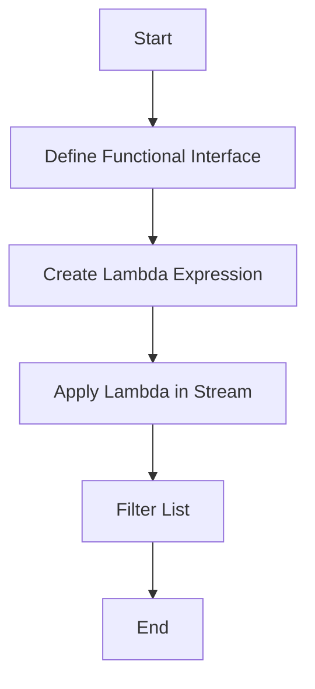
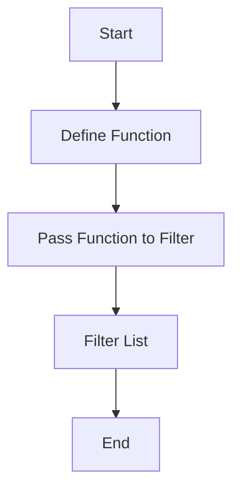

## 6.8.2 Functional Interfaces vs. Direct Function Passing

As experienced Java developers, you are likely familiar with the concept of functional interfaces, which serve as the target for lambda expressions in Java. In contrast, Clojure, a functional programming language, allows for direct function passing without the need for such interfaces. This section will delve into the differences between these two approaches, their implications for code design, and how they reflect the paradigms of their respective languages.

### Understanding Functional Interfaces in Java

In Java, a functional interface is an interface that contains exactly one abstract method. This design allows the interface to be implemented using a lambda expression or method reference. The introduction of functional interfaces in Java 8 was a significant step towards embracing functional programming concepts.

#### Key Characteristics of Functional Interfaces

- **Single Abstract Method (SAM):** A functional interface must have exactly one abstract method. This method is the target for lambda expressions.
- **Default and Static Methods:** Functional interfaces can have default and static methods, but these do not count towards the single abstract method requirement.
- **Common Examples:** Some common functional interfaces in Java include `Runnable`, `Callable`, `Comparator`, and the interfaces in the `java.util.function` package like `Function`, `Predicate`, and `Consumer`.

#### Example of a Functional Interface in Java

```java
@FunctionalInterface
public interface MyFunctionalInterface {
    void execute();
}

// Using a lambda expression
MyFunctionalInterface myFunction = () -> System.out.println("Executing function!");
myFunction.execute();
```

In this example, `MyFunctionalInterface` is a functional interface with a single abstract method `execute`. The lambda expression provides an implementation for this method.

### Direct Function Passing in Clojure

Clojure, being a Lisp dialect, treats functions as first-class citizens. This means functions can be passed as arguments, returned from other functions, and assigned to variables without any special constructs like functional interfaces.

#### Key Characteristics of Direct Function Passing

- **First-Class Functions:** Functions in Clojure are first-class, meaning they can be used like any other data type.
- **No Need for Interfaces:** Unlike Java, Clojure does not require an interface to define a function. Functions can be defined and passed around directly.
- **Higher-Order Functions:** Clojure's support for higher-order functions allows for concise and expressive code.

#### Example of Direct Function Passing in Clojure

```clojure
(defn greet [name]
  (println "Hello," name))

(defn execute-function [f arg]
  (f arg))

(execute-function greet "Clojure Developer")
```

In this example, `greet` is a function that takes a name and prints a greeting. The `execute-function` function takes another function `f` and an argument `arg`, and applies `f` to `arg`. This demonstrates how functions can be passed directly in Clojure.

### Implications for Code Design

The differences between Java's functional interfaces and Clojure's direct function passing have significant implications for code design and architecture.

#### Java's Approach: Structured and Explicit

- **Type Safety:** Java's functional interfaces provide a level of type safety, ensuring that the lambda expression matches the expected method signature.
- **Explicit Contracts:** The use of interfaces in Java makes the contract of the function explicit, which can aid in understanding and maintaining code.
- **Boilerplate Code:** The need for interfaces can lead to additional boilerplate code, especially when defining custom functional interfaces.

#### Clojure's Approach: Flexible and Concise

- **Conciseness:** Clojure's ability to pass functions directly leads to more concise and expressive code.
- **Flexibility:** The lack of a need for interfaces allows for greater flexibility in function composition and reuse.
- **Dynamic Typing:** Clojure's dynamic typing can lead to more flexible code but may require more careful testing to ensure correctness.

### Comparing Java and Clojure: Code Examples

Let's compare how a simple operation, such as filtering a list, can be implemented in both Java and Clojure.

#### Java Example: Using Functional Interfaces

```java
import java.util.Arrays;
import java.util.List;
import java.util.function.Predicate;
import java.util.stream.Collectors;

public class FilterExample {
    public static void main(String[] args) {
        List<Integer> numbers = Arrays.asList(1, 2, 3, 4, 5, 6);
        Predicate<Integer> isEven = n -> n % 2 == 0;
        List<Integer> evenNumbers = numbers.stream()
                                           .filter(isEven)
                                           .collect(Collectors.toList());
        System.out.println(evenNumbers);
    }
}
```

In this Java example, we use a `Predicate` functional interface to define a lambda expression that checks if a number is even. The `filter` method of the stream API uses this predicate to filter the list.

#### Clojure Example: Direct Function Passing

```clojure
(def numbers [1 2 3 4 5 6])

(defn is-even [n]
  (zero? (mod n 2)))

(def even-numbers (filter is-even numbers))

(println even-numbers)
```

In the Clojure example, we define a function `is-even` and pass it directly to the `filter` function. This approach is more concise and leverages Clojure's support for first-class functions.

### Diagrams and Visualizations

To better understand the flow of data and function application in both languages, let's visualize the process using diagrams.

#### Java Functional Interface Flow



*Diagram 1: The flow of using a functional interface in Java to filter a list.*

#### Clojure Direct Function Passing Flow



*Diagram 2: The flow of direct function passing in Clojure to filter a list.*

### Try It Yourself

To deepen your understanding, try modifying the code examples:

- **Java:** Change the `Predicate` to filter odd numbers instead.
- **Clojure:** Modify the `is-even` function to check for numbers greater than 3.

### Further Reading

For more information on functional interfaces and lambda expressions in Java, refer to the [Java Documentation](https://docs.oracle.com/javase/tutorial/java/javaOO/lambdaexpressions.html). To explore Clojure's approach to functions, visit the [Official Clojure Documentation](https://clojure.org/reference/functions).

### Exercises

1. **Java Exercise:** Implement a custom functional interface to perform a mathematical operation and use it with a lambda expression.
2. **Clojure Exercise:** Write a higher-order function that takes a function and a collection, applies the function to each element, and returns a new collection.

### Key Takeaways

- **Functional Interfaces in Java** provide a structured way to use lambda expressions but require additional boilerplate.
- **Direct Function Passing in Clojure** offers flexibility and conciseness, allowing functions to be used like any other data type.
- **Code Design Implications** vary between the two approaches, with Java favoring explicit contracts and Clojure emphasizing flexibility and expressiveness.

By understanding these differences, you can leverage the strengths of each language to write more effective and maintainable code.

## Quiz: Understanding Functional Interfaces and Direct Function Passing



### What is a functional interface in Java?

- [x] An interface with exactly one abstract method
- [ ] An interface with multiple abstract methods
- [ ] A class with one abstract method
- [ ] A class with multiple abstract methods

> **Explanation:** A functional interface in Java is defined as having exactly one abstract method, which allows it to be used as the target for lambda expressions.

### How does Clojure handle functions compared to Java?

- [x] Clojure treats functions as first-class citizens
- [ ] Clojure requires interfaces for functions
- [ ] Clojure uses classes for functions
- [ ] Clojure does not support functions

> **Explanation:** Clojure treats functions as first-class citizens, meaning they can be passed around and used like any other data type, without the need for interfaces.

### What is a key advantage of Clojure's direct function passing?

- [x] Flexibility and conciseness
- [ ] Type safety
- [ ] Explicit contracts
- [ ] Requires more boilerplate

> **Explanation:** Clojure's direct function passing allows for more flexible and concise code, as functions can be used directly without additional constructs.

### Which Java package contains common functional interfaces?

- [x] java.util.function
- [ ] java.lang
- [ ] java.util.stream
- [ ] java.io

> **Explanation:** The `java.util.function` package contains common functional interfaces like `Function`, `Predicate`, and `Consumer`.

### What is a common use case for functional interfaces in Java?

- [x] Targeting lambda expressions
- [ ] Defining classes
- [ ] Creating objects
- [ ] Managing memory

> **Explanation:** Functional interfaces are commonly used as targets for lambda expressions in Java, allowing for functional programming constructs.

### What is a higher-order function?

- [x] A function that takes other functions as arguments or returns a function
- [ ] A function that only takes primitive types as arguments
- [ ] A function that cannot be passed as an argument
- [ ] A function that is always recursive

> **Explanation:** A higher-order function is one that can take other functions as arguments or return a function, enabling more abstract and flexible code design.

### How does Java ensure type safety with lambda expressions?

- [x] By using functional interfaces
- [ ] By using classes
- [ ] By using annotations
- [ ] By using exceptions

> **Explanation:** Java uses functional interfaces to ensure type safety with lambda expressions, as the interface defines the expected method signature.

### What is a benefit of using functional interfaces in Java?

- [x] Type safety and explicit contracts
- [ ] More concise code
- [ ] Less boilerplate
- [ ] Dynamic typing

> **Explanation:** Functional interfaces provide type safety and explicit contracts, making the code easier to understand and maintain.

### What is a challenge of using direct function passing in Clojure?

- [x] Requires careful testing due to dynamic typing
- [ ] Requires interfaces
- [ ] Requires more boilerplate
- [ ] Less flexible

> **Explanation:** While direct function passing in Clojure is flexible, it requires careful testing to ensure correctness due to the language's dynamic typing.

### True or False: Clojure requires functional interfaces for lambda expressions.

- [ ] True
- [x] False

> **Explanation:** False. Clojure does not require functional interfaces for lambda expressions, as it allows direct function passing.


