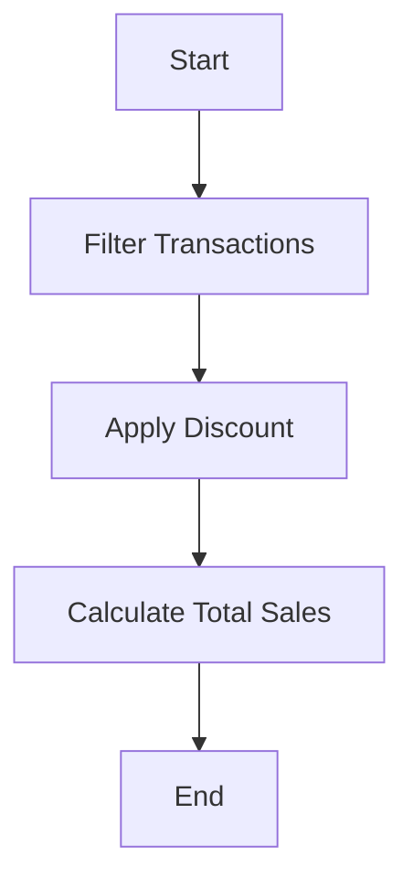

## 6.9 Exercises: Implementing Complex Data Flows

In this section, we will dive into exercises that challenge you to harness the power of Clojure's higher-order functions to solve complex data flow problems. These exercises are designed to help you transition from Java's imperative style to Clojure's functional paradigm, enhancing your ability to write concise, efficient, and expressive code.

### Understanding Higher-Order Functions

Higher-order functions are a cornerstone of functional programming. They are functions that can take other functions as arguments or return them as results. This capability allows for more abstract and flexible code, enabling powerful patterns like map-reduce, function composition, and more.

#### Key Concepts:

- **First-Class Functions**: In Clojure, functions are first-class citizens, meaning they can be passed around just like any other data type.
- **Function Composition**: Combining simple functions to build more complex ones.
- **Immutability**: Ensuring data structures remain unchanged, promoting safer concurrent programming.

### Exercise 1: Building a Data Pipeline

Let's start with a classic functional programming task: building a data pipeline. Imagine you have a collection of data representing sales transactions, and you need to process this data to extract insights.

**Objective**: Create a data pipeline that filters, transforms, and aggregates sales data.

#### Step-by-Step Guide:

1. **Define the Data Structure**: Start with a vector of maps, each representing a transaction.

```clojure
(def transactions
  [{:id 1 :amount 100 :category "electronics"}
   {:id 2 :amount 200 :category "clothing"}
   {:id 3 :amount 150 :category "electronics"}
   {:id 4 :amount 300 :category "furniture"}
   {:id 5 :amount 250 :category "clothing"}])
```

2. **Filter Transactions**: Use `filter` to select only transactions in the "electronics" category.

```clojure
(defn electronics-only [transactions]
  (filter #(= (:category %) "electronics") transactions))
```

3. **Transform Data**: Use `map` to apply a discount to each transaction.

```clojure
(defn apply-discount [transactions discount]
  (map #(update % :amount #(* % (- 1 discount))) transactions))
```

4. **Aggregate Data**: Use `reduce` to calculate the total sales amount.

```clojure
(defn total-sales [transactions]
  (reduce + (map :amount transactions)))
```

5. **Combine Functions**: Compose these functions to create the pipeline.

```clojure
(defn process-transactions [transactions discount]
  (-> transactions
      electronics-only
      (apply-discount discount)
      total-sales))
```

**Try It Yourself**: Modify the pipeline to include transactions from multiple categories or apply different transformations.

### Exercise 2: Function Generation

In this exercise, we'll explore how to write functions that generate other functions based on input parameters. This is a powerful technique for creating reusable and configurable code.

**Objective**: Write a function that generates a discount function based on a given percentage.

#### Step-by-Step Guide:

1. **Define the Function Generator**: Create a function that returns another function.

```clojure
(defn discount-generator [percentage]
  (fn [amount]
    (* amount (- 1 percentage))))
```

2. **Use the Generated Function**: Apply the generated function to a collection of amounts.

```clojure
(def apply-discount (discount-generator 0.1))

(map apply-discount [100 200 300]) ; => (90 180 270)
```

**Try It Yourself**: Create a function generator for tax calculations or other financial operations.

### Exercise 3: Custom Iteration

Clojure's `map`, `filter`, and `reduce` cover many use cases, but sometimes you need custom iteration logic. In this exercise, we'll implement a custom iteration over a data structure.

**Objective**: Write a function that iterates over a nested data structure and applies a transformation.

#### Step-by-Step Guide:

1. **Define the Nested Data Structure**: Use a vector of vectors to represent a matrix.

```clojure
(def matrix
  [[1 2 3]
   [4 5 6]
   [7 8 9]])
```

2. **Implement Custom Iteration**: Use `map` and `map-indexed` to iterate over the matrix.

```clojure
(defn transform-matrix [matrix]
  (map-indexed (fn [i row]
                 (map-indexed (fn [j val]
                                (* val (+ i j))) row)) matrix))
```

3. **Apply the Transformation**: Use the function to transform the matrix.

```clojure
(transform-matrix matrix)
; => ((0 2 6) (4 10 18) (14 24 36))
```

**Try It Yourself**: Modify the transformation logic to apply different operations based on the indices.

### Visualizing Data Flow

To better understand how data flows through these higher-order functions, let's visualize the process using a flowchart.



*Caption*: This flowchart represents the data pipeline process, showing the sequence of operations from filtering transactions to calculating total sales.

### Comparing with Java

In Java, achieving similar functionality often involves more boilerplate code and less flexibility. Let's compare the Clojure approach with a Java equivalent.

**Java Example**:

```java
import java.util.*;
import java.util.stream.*;

public class DataPipeline {
    public static void main(String[] args) {
        List<Map<String, Object>> transactions = Arrays.asList(
            Map.of("id", 1, "amount", 100, "category", "electronics"),
            Map.of("id", 2, "amount", 200, "category", "clothing"),
            Map.of("id", 3, "amount", 150, "category", "electronics"),
            Map.of("id", 4, "amount", 300, "category", "furniture"),
            Map.of("id", 5, "amount", 250, "category", "clothing")
        );

        double totalSales = transactions.stream()
            .filter(t -> "electronics".equals(t.get("category")))
            .mapToDouble(t -> (double) t.get("amount") * 0.9)
            .sum();

        System.out.println("Total Sales: " + totalSales);
    }
}
```

**Comparison**:
- **Conciseness**: Clojure's functional style allows for more concise and expressive code.
- **Flexibility**: Higher-order functions in Clojure provide greater flexibility in composing operations.
- **Immutability**: Clojure's immutable data structures enhance safety in concurrent environments.

### Exercises and Practice Problems

To reinforce your understanding, try solving the following problems:

1. **Data Transformation**: Create a pipeline that processes a list of customer orders, applying discounts and calculating totals based on customer loyalty levels.

2. **Function Composition**: Write a function that composes multiple mathematical operations (e.g., addition, multiplication) and applies them to a list of numbers.

3. **Custom Iteration**: Implement a function that traverses a tree-like data structure, applying a transformation to each node.

4. **Dynamic Function Generation**: Create a function that generates other functions for different mathematical operations (e.g., addition, subtraction) based on input parameters.

5. **Advanced Data Pipeline**: Build a pipeline that processes log data, filtering, transforming, and aggregating information to generate insights.

### Key Takeaways

- **Higher-Order Functions**: These functions enable powerful abstractions and flexible code composition.
- **Data Pipelines**: Clojure's functional style simplifies the creation of data processing pipelines.
- **Function Generation**: Dynamic function generation allows for reusable and configurable operations.
- **Custom Iteration**: Clojure's functional tools provide the flexibility to implement custom iteration logic.

By mastering these exercises, you'll be well-equipped to tackle complex data flow challenges in Clojure, leveraging its functional programming strengths to write efficient and expressive code.

### Further Reading

- [Official Clojure Documentation](https://clojure.org/reference/documentation)
- [ClojureDocs](https://clojuredocs.org/)
- [Functional Programming in Clojure](https://www.braveclojure.com/)

Now that we've explored how to implement complex data flows using higher-order functions in Clojure, let's apply these concepts to solve real-world problems and enhance your functional programming skills.

## Quiz: Mastering Higher-Order Functions in Clojure



### What is a higher-order function?

- [x] A function that takes other functions as arguments or returns them as results
- [ ] A function that performs mathematical operations
- [ ] A function that only processes data structures
- [ ] A function that is used for error handling

> **Explanation:** Higher-order functions are those that can take other functions as arguments or return them as results, allowing for flexible and abstract code composition.


### How does Clojure's `map` function differ from Java's `map` method?

- [x] Clojure's `map` is a higher-order function that applies a function to each element of a collection
- [ ] Java's `map` method is used for error handling
- [ ] Clojure's `map` function modifies the original collection
- [ ] Java's `map` method is a part of the `List` interface

> **Explanation:** Clojure's `map` function is a higher-order function that applies a given function to each element of a collection, returning a new collection with the results.


### What is the purpose of the `reduce` function in Clojure?

- [x] To aggregate data by applying a function cumulatively to the elements of a collection
- [ ] To filter elements from a collection
- [ ] To transform each element of a collection
- [ ] To sort a collection

> **Explanation:** The `reduce` function in Clojure is used to aggregate data by applying a function cumulatively to the elements of a collection, reducing them to a single value.


### Which of the following is a benefit of using higher-order functions?

- [x] They enable code reuse and abstraction
- [ ] They increase code verbosity
- [ ] They are only useful for mathematical operations
- [ ] They are specific to Clojure

> **Explanation:** Higher-order functions enable code reuse and abstraction by allowing functions to be passed as arguments or returned as results, making code more flexible and concise.


### In Clojure, what does the `->` macro do?

- [x] It threads an expression through a series of functions
- [ ] It creates a new thread for concurrent execution
- [ ] It sorts a collection
- [ ] It filters elements from a collection

> **Explanation:** The `->` macro in Clojure threads an expression through a series of functions, making it easier to read and write chains of function calls.


### How can you create a function that generates other functions in Clojure?

- [x] By writing a function that returns another function
- [ ] By using the `def` keyword
- [ ] By using the `let` keyword
- [ ] By using the `if` statement

> **Explanation:** In Clojure, you can create a function that generates other functions by writing a function that returns another function, allowing for dynamic and reusable code.


### What is the result of applying the `filter` function in Clojure?

- [x] A new collection containing only the elements that satisfy a predicate
- [ ] A modified version of the original collection
- [ ] A sorted collection
- [ ] A collection with transformed elements

> **Explanation:** The `filter` function in Clojure returns a new collection containing only the elements that satisfy a given predicate, without modifying the original collection.


### What is a key advantage of Clojure's immutable data structures?

- [x] They prevent accidental data modification and enhance concurrency
- [ ] They are faster than mutable data structures
- [ ] They require less memory
- [ ] They are specific to Clojure

> **Explanation:** Clojure's immutable data structures prevent accidental data modification and enhance concurrency by ensuring that data cannot be changed once created.


### How does Clojure's approach to function composition differ from Java's?

- [x] Clojure uses higher-order functions and macros for composition
- [ ] Java uses higher-order functions for composition
- [ ] Clojure does not support function composition
- [ ] Java uses macros for composition

> **Explanation:** Clojure uses higher-order functions and macros to facilitate function composition, allowing for more flexible and concise code compared to Java.


### True or False: In Clojure, functions are first-class citizens.

- [x] True
- [ ] False

> **Explanation:** In Clojure, functions are first-class citizens, meaning they can be passed as arguments, returned from other functions, and assigned to variables, just like any other data type.


