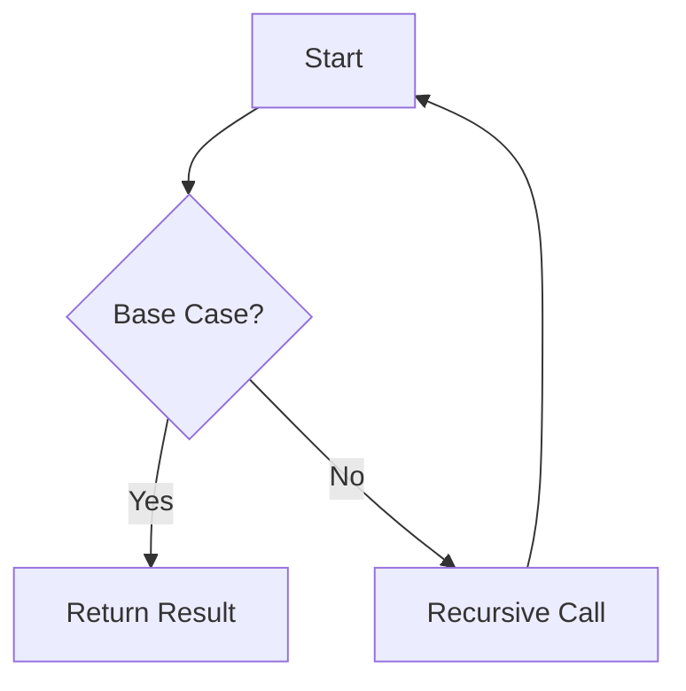
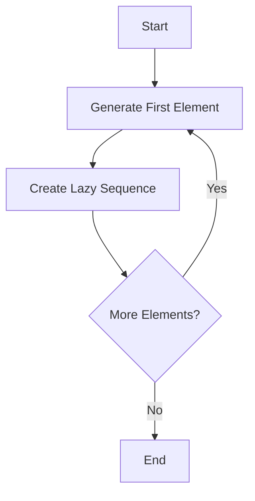

## 7.10 Exercises and Challenges

In this section, we will delve into exercises and challenges that will solidify your understanding of recursion and looping in Clojure. These exercises are designed to help you transition from Java's iterative constructs to Clojure's recursive paradigms, optimize recursive functions using `recur`, and explore the power of lazy sequences in real-world applications.

### Understanding Recursion in Clojure

Before we dive into the exercises, let's briefly recap the concept of recursion in Clojure. Recursion is a fundamental concept in functional programming where a function calls itself to solve smaller instances of the same problem. Unlike Java, which often uses loops for iteration, Clojure leverages recursion for iterative processes.

#### Key Concepts

- **Base Case**: The condition under which the recursive function stops calling itself.
- **Recursive Case**: The part of the function where the recursion occurs.
- **Tail Recursion**: A special form of recursion where the recursive call is the last operation in the function, allowing for optimization.

### Exercise 1: Implementing Recursive Functions

**Objective**: Implement a recursive function to calculate the factorial of a number.

In Java, you might write a factorial function using a loop:

```java
public static int factorial(int n) {
    int result = 1;
    for (int i = 1; i <= n; i++) {
        result *= i;
    }
    return result;
}
```

In Clojure, we can implement this using recursion:

```clojure
(defn factorial [n]
  (if (<= n 1)
    1
    (* n (factorial (dec n)))))
```

**Try It Yourself**: Modify the `factorial` function to handle large numbers using Clojure's `bigint`.

### Exercise 2: Converting Iterative Java Code to Recursive Clojure Code

**Objective**: Convert a Java loop that sums an array of integers into a recursive Clojure function.

Java code:

```java
public static int sumArray(int[] numbers) {
    int sum = 0;
    for (int number : numbers) {
        sum += number;
    }
    return sum;
}
```

Clojure code:

```clojure
(defn sum-array [numbers]
  (if (empty? numbers)
    0
    (+ (first numbers) (sum-array (rest numbers)))))
```

**Try It Yourself**: Rewrite the `sum-array` function using `reduce`, a higher-order function in Clojure.

### Exercise 3: Optimizing Recursive Functions with `recur`

**Objective**: Optimize a recursive function using `recur` to avoid stack overflow.

Consider the Fibonacci sequence, which is often implemented recursively:

```clojure
(defn fibonacci [n]
  (if (<= n 1)
    n
    (+ (fibonacci (- n 1)) (fibonacci (- n 2)))))
```

This implementation is not tail-recursive and can lead to stack overflow for large `n`. Let's optimize it using `recur`:

```clojure
(defn fibonacci [n]
  (loop [a 0 b 1 i n]
    (if (zero? i)
      a
      (recur b (+ a b) (dec i)))))
```

**Try It Yourself**: Implement a tail-recursive version of the factorial function using `recur`.

### Exercise 4: Exploring Lazy Sequences

**Objective**: Use lazy sequences to generate an infinite sequence of Fibonacci numbers.

Lazy sequences in Clojure allow us to work with potentially infinite data structures without evaluating them entirely.

```clojure
(defn lazy-fibonacci
  ([] (lazy-fibonacci 0 1))
  ([a b] (cons a (lazy-seq (lazy-fibonacci b (+ a b))))))
```

**Try It Yourself**: Use the `take` function to retrieve the first 10 Fibonacci numbers from the `lazy-fibonacci` sequence.

### Exercise 5: Real-World Application of Lazy Sequences

**Objective**: Use lazy sequences to process a large dataset efficiently.

Imagine you have a large log file, and you want to filter out only the error messages. Using lazy sequences, you can process the file line-by-line without loading the entire file into memory.

```clojure
(defn process-log-file [file-path]
  (with-open [rdr (clojure.java.io/reader file-path)]
    (->> (line-seq rdr)
         (filter #(re-find #"ERROR" %))
         (doall))))
```

**Try It Yourself**: Modify the `process-log-file` function to count the number of error messages.

### Diagrams and Visualizations

To better understand the flow of data through recursive functions and lazy sequences, let's visualize these concepts using Mermaid.js diagrams.

#### Recursive Function Flow



*Diagram 1: Flowchart illustrating the recursive function flow, highlighting the base case and recursive call.*

#### Lazy Sequence Generation



*Diagram 2: Flowchart showing the generation of a lazy sequence, emphasizing the deferred computation of elements.*

### Exercises and Practice Problems

1. **Recursive Sum**: Implement a recursive function to sum the elements of a list. Compare its performance with the iterative version in Java.
2. **Tail-Recursive Factorial**: Rewrite the factorial function using `recur` and compare its performance with the non-tail-recursive version.
3. **Lazy Prime Numbers**: Create a lazy sequence that generates prime numbers. Use it to find the first 100 prime numbers.
4. **File Processing**: Use lazy sequences to process a large CSV file, extracting and processing only the rows that meet certain criteria.
5. **Recursive Data Structures**: Implement a recursive function to traverse a nested data structure (e.g., a tree) and collect all leaf nodes.

### Key Takeaways

- **Recursion** is a powerful tool in Clojure, allowing us to express iterative processes functionally.
- **Tail Recursion** and `recur` are essential for optimizing recursive functions and preventing stack overflow.
- **Lazy Sequences** enable efficient processing of large or infinite datasets by deferring computation until necessary.
- **Practice** is crucial for mastering recursion and lazy sequences, so take the time to work through the exercises and challenges.

By engaging with these exercises and challenges, you'll gain a deeper understanding of recursion and looping in Clojure, equipping you with the skills to write efficient, functional code. As you continue your journey, remember to leverage the power of Clojure's unique features to enhance your applications.

---

## Quiz: Mastering Recursion and Looping in Clojure



### What is the primary advantage of using recursion over iteration in Clojure?

- [x] Recursion aligns with functional programming principles and avoids mutable state.
- [ ] Recursion is faster than iteration in all cases.
- [ ] Recursion is easier to implement than iteration.
- [ ] Recursion uses less memory than iteration.

> **Explanation:** Recursion aligns with functional programming principles by avoiding mutable state, which is a core tenet of Clojure.

### How does the `recur` keyword optimize recursive functions in Clojure?

- [x] It allows for tail-call optimization, preventing stack overflow.
- [ ] It makes recursive functions run faster.
- [ ] It automatically parallelizes recursive calls.
- [ ] It reduces the memory footprint of recursive functions.

> **Explanation:** `recur` enables tail-call optimization, which prevents stack overflow by reusing the current function's stack frame.

### Which of the following is a characteristic of lazy sequences in Clojure?

- [x] They defer computation until the elements are needed.
- [ ] They are always finite.
- [ ] They consume more memory than eager sequences.
- [ ] They are faster to compute than eager sequences.

> **Explanation:** Lazy sequences defer computation, allowing for efficient processing of potentially infinite data structures.

### What is the base case in a recursive function?

- [x] The condition under which the recursion stops.
- [ ] The first recursive call made by the function.
- [ ] The last operation performed in the function.
- [ ] The initial value passed to the function.

> **Explanation:** The base case is the condition that stops the recursion, preventing infinite loops.

### How can you create an infinite sequence of numbers in Clojure?

- [x] By using lazy sequences.
- [ ] By using a loop construct.
- [ ] By using a `for` loop.
- [ ] By using a `while` loop.

> **Explanation:** Lazy sequences allow for the creation of infinite sequences by deferring computation.

### What is the purpose of the `loop` construct in Clojure?

- [x] To create a local recursion point for `recur`.
- [ ] To iterate over collections.
- [ ] To define a new function.
- [ ] To declare variables.

> **Explanation:** The `loop` construct creates a local recursion point that can be used with `recur` for tail recursion.

### Which function can be used to sum elements of a collection in Clojure?

- [x] `reduce`
- [ ] `map`
- [ ] `filter`
- [ ] `for`

> **Explanation:** `reduce` is used to accumulate values from a collection, such as summing elements.

### How does Clojure handle large numbers in recursive functions?

- [x] By using `bigint` for arbitrary precision arithmetic.
- [ ] By optimizing memory usage.
- [ ] By using floating-point arithmetic.
- [ ] By truncating numbers to fit within integer limits.

> **Explanation:** Clojure uses `bigint` for arbitrary precision arithmetic, allowing it to handle large numbers in recursive functions.

### What is a common use case for lazy sequences in real-world applications?

- [x] Processing large datasets efficiently.
- [ ] Performing real-time computations.
- [ ] Optimizing memory usage in small applications.
- [ ] Simplifying complex algorithms.

> **Explanation:** Lazy sequences are commonly used to process large datasets efficiently by deferring computation.

### True or False: Tail recursion is always more efficient than non-tail recursion.

- [x] True
- [ ] False

> **Explanation:** Tail recursion is more efficient because it allows for tail-call optimization, which reuses the current function's stack frame.


